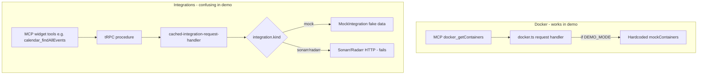

# Revert Demo MCP Accommodations

## Why Docker works but integrations do not

Demo mode has **two different mock mechanisms**:



- **Docker**:
  [`packages/request-handler/src/docker.ts`](packages/request-handler/src/docker.ts)
  checks `DEMO_MODE` directly and returns inline fake containers. No integration
  record needed.
- **Everything else**: Demo seed creates **one** integration with `kind: "mock"`
  ([`packages/db/migrations/seed.ts`](packages/db/migrations/seed.ts)), not
  Sonarr/Radarr/Overseerr.
  [`MockIntegration`](packages/integrations/src/mock/mock-integration.ts) can
  serve calendar, downloads, health, DNS, media server, etc. **if** callers pass
  that integration ID.
- **Why it felt broken**: MCP tool descriptions tell AI clients to look for
  "Overseerr/Sonarr IDs". Demo has none. Tools like
  `integration_searchMediaRequests` hard-filter to `mediaSearch` kinds
  (`overseerr`, `jellyseerr`, `seerr`) — `mock` is excluded from that category
  in
  [`packages/definitions/src/integration.ts`](packages/definitions/src/integration.ts).

Fixing this properly means extending the mock integration system (new
`searchAsync`, category changes, middleware relaxations, instruction rewrites)
for a feature almost nobody will use on the public demo.

## Option comparison

|                      | **Revert (chosen)**         | **Minimal fix**                                | **Full fix**                                        |
| -------------------- | --------------------------- | ---------------------------------------------- | --------------------------------------------------- |
| **Effort**           | ~1 hour, ~100 lines removed | ~2 hours                                       | 1-2 days                                            |
| **Files touched**    | 8 MCP/demo-specific files   | 8 + route instructions                         | 15+ across integrations, definitions, seed, routers |
| **Risk**             | Low                         | Low-medium                                     | Medium (mock/search semantics)                      |
| **Demo MCP outcome** | Clearly unsupported         | Partial (widget reads only, no search/request) | Near-full read coverage                             |
| **Maintenance**      | None ongoing                | Instructions drift with tool changes           | Mock parity with real integrations                  |

**Recommendation: Revert.** The demo accommodation code added special-case
plumbing (`demoSafePermissionRequiredProcedure`, dual mutation guards, hardcoded
UI strings) for a workflow that still cannot deliver a convincing "homelab AI"
experience without substantial integration-layer work.

## What to revert (demo MCP accommodations only)

These changes were added specifically for demo + MCP. **Do not revert** the core
MCP server, OAuth, Scalar docs, tool descriptions, or `normalizeSchema`.

### Backend (3 files)

1. [`packages/api/src/trpc.ts`](packages/api/src/trpc.ts)
   - Remove `demoSafePermissionRequiredProcedure` export (~12 lines)
   - Keep existing `enforceDemoModeReadOnly` (pre-dates MCP; used by whole app)

2. [`packages/api/src/router/apiKeys.ts`](packages/api/src/router/apiKeys.ts)
   - Change `create` back to `permissionRequiredProcedure` (mutations blocked in
     demo again)
   - Remove `isDemoMode` guard on `delete` (global demo middleware already
     blocks delete mutations)
   - Remove `TRPCError` / `isDemoMode` imports if unused

3. [`packages/api/src/mcp.ts`](packages/api/src/mcp.ts)
   - Stop exporting `isDemoMode`; keep only `createTRPCContext` and `mcpRouter`

### MCP route (1 file)

4. [`apps/nextjs/src/app/api/mcp/[transport]/route.ts`](apps/nextjs/src/app/api/mcp/[transport]/route.ts)
   - Remove `isDemoMode` import and all demo branches:
     - `ListToolsRequestSchema` mutation filter
     - `CallToolRequestSchema` mutation rejection
     - `SERVER_INSTRUCTIONS` demo section
   - Keep `getToolType` / `buildToolTypeMap` only if still needed elsewhere;
     otherwise remove dead code from demo-only filtering

### UI (4 files)

5. [`apps/nextjs/src/app/[locale]/manage/tools/api/page.tsx`](apps/nextjs/src/app/[locale]/manage/tools/api/page.tsx)
   - Remove `isDemoMode` import from `@homarr/api/mcp`
   - Stop passing `isDemoMode` to child components

6. [`apps/nextjs/src/app/[locale]/manage/tools/api/components/api-page-tabs.tsx`](apps/nextjs/src/app/[locale]/manage/tools/api/components/api-page-tabs.tsx)
   - Remove `isDemoMode` prop from interface and `McpInstructions` call

7. [`apps/nextjs/src/app/[locale]/manage/tools/api/components/mcp-instructions.tsx`](apps/nextjs/src/app/[locale]/manage/tools/api/components/mcp-instructions.tsx)
   - Remove `isDemoMode` prop
   - Replace current demo banner with a single **Alert**: MCP requires a
     self-hosted instance; demo mode does not support MCP (API key creation and
     write tools are disabled)
   - Use `clientApi.info.isDemoMode.useQuery()` or pass `isDemoMode` from server
     via existing `api.info.isDemoMode()` tRPC query (already exists in
     [`packages/api/src/router/info.ts`](packages/api/src/router/info.ts)) —
     avoids re-exporting from `@homarr/api/mcp`

8. [`apps/nextjs/src/app/[locale]/manage/tools/api/components/api-keys.tsx`](apps/nextjs/src/app/[locale]/manage/tools/api/components/api-keys.tsx)
   - Remove `isDemoMode` prop and conditional delete-column spread
   - Delete button hidden automatically in demo because `apiKeys.delete`
     mutation is blocked by global `enforceDemoModeReadOnly`

## What to add instead

- **MCP tab**: When `info.isDemoMode` is true, show a prominent notice at the
  top of
  [`mcp-instructions.tsx`](apps/nextjs/src/app/[locale]/manage/tools/api/components/mcp-instructions.tsx)
  explaining MCP is for self-hosted instances only.
- **Optional**: Disable/hide the "Create API Key" button on the MCP tab in demo
  (mutations will fail anyway).
- **No changes** to integrations, definitions, seed, or mock services.

## Files NOT impacted by revert

Core MCP feature stays as-is:

- [`apps/nextjs/src/app/api/mcp/[transport]/route.ts`](apps/nextjs/src/app/api/mcp/[transport]/route.ts)
  — auth, rate limiting, `normalizeSchema`, `SERVER_INSTRUCTIONS` (minus demo
  section)
- OAuth routes under `apps/nextjs/src/app/api/mcp/oauth/`
- All MCP-enabled routers in `packages/api/src/router/`
- [`packages/api/src/mcp.ts`](packages/api/src/mcp.ts) — eager router (minus
  `isDemoMode` export)
- Scalar UI, dynamic tools table,
  [`.cursor/rules/mcp-integration.mdc`](.cursor/rules/mcp-integration.mdc)

Pre-existing demo infrastructure (unchanged):

- [`packages/request-handler/src/docker.ts`](packages/request-handler/src/docker.ts)
  — Docker mock containers
- [`packages/db/migrations/seed.ts`](packages/db/migrations/seed.ts) — mock
  integration + demo board
- [`packages/integrations/src/mock/`](packages/integrations/src/mock/) — mock
  services for widgets on demo board UI

## Verification

1. `pnpm lint` and `pnpm typecheck` pass
2. Demo mode (`DEMO_MODE=true`):
   - MCP tab shows "not supported" notice
   - API key create fails with existing "Mutations are disabled in demo mode"
   - `docker_getContainers` still works on demo board UI (unchanged; separate
     code path)
3. Non-demo mode: MCP unchanged (all tools listed, mutations work with
   permissions)

## Commit strategy

Single focused commit on `feat/add-mcp-server`:

```
revert(mcp): drop demo-mode accommodations for MCP

MCP is intended for self-hosted instances. Remove demo-specific API key
bypass, read-only tool filtering, and demo UI plumbing. Show a clear
notice on the MCP tab when demo mode is active.
```

Then push to the existing PR (no force-push needed unless you want another
squash).
