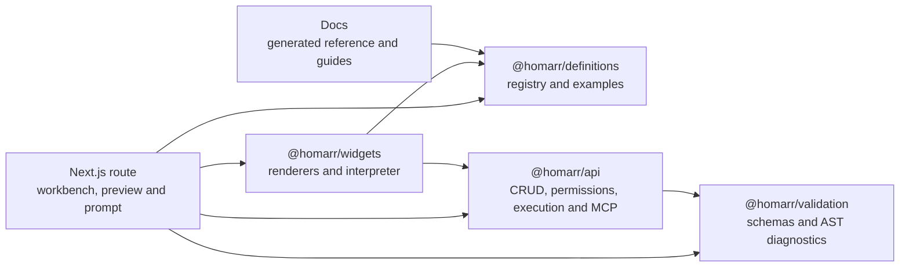
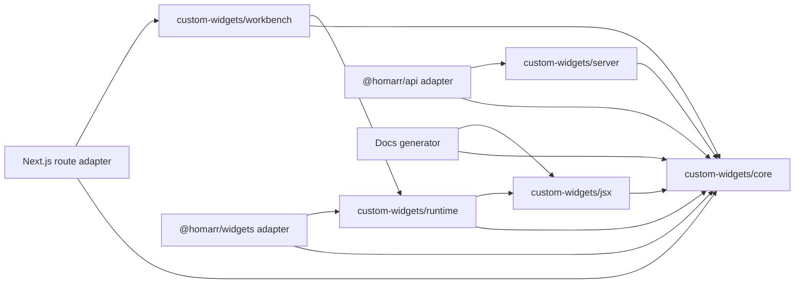

# Custom Widgets Architecture Audit and North Star

> Status: implemented in the current working tree; baseline retained below for traceability
> Evidence snapshot: `c5703e7e5` on PR #6304
> Scope: built-in custom-widget displays, Custom JSX, network execution, authoring, preview, import/export, AI prompts, and MCP tools

## Implementation outcome

The migration described by this audit is implemented. `@homarr/custom-widgets` now owns the domain through explicit `core`, `jsx`, `runtime`, `server`, and `workbench` exports. API, Widgets, and Next.js retain only authorization, persistence, transport, board registration, navigation, and localized adapter concerns.

Key outcomes:

- One typed configuration and display-descriptor model drives schemas, defaults, form hydration, serialization, import/export, preview, examples, diagnostics, generated references, and AI prompts.
- Display-data extraction moved out of API and Widgets into the domain package; the former API-to-Widgets re-export chain no longer exists.
- The interpreter, shared security policy, registry, wrappers, named-request runtime, hardened executor, preview sessions, rate limits, and workbench UI have focused package-owned modules and tests.
- Runtime and workbench network behavior is injected through typed ports. The domain package has no dependency on API, Widgets, Next.js routes, notification infrastructure, or modal infrastructure.
- Public tRPC and MCP procedures are characterized, v2 and v3 import envelopes remain accepted, display-only v1 remains covered, and MCP offers iterative schema, validation, template read/write/patch, create/import/update, preview query, simulation, and journal tools.
- The AI prompt uses a multiline two-block authoring bundle, documents the `SubFetch` render-child contract, and is generated from the canonical registry and tested examples.
- Architecture enforcement currently scans 110 production modules for dependency direction, cycles, file budgets, dynamic loading, and untranslated JSX literals. Generated-reference drift and every Mantine export classification are test-enforced.
- The latest production build measured the largest Custom JSX route payload at 99,852 gzip bytes across two chunks, below the 768 KiB budget.

Focused verification is green: 278 package tests, 35 API/MCP tests, 52 Widgets renderer tests, 7 E2E tests, affected typecheck, affected lint, docs build, production Next.js build, architecture checks, generated drift, and the bundle budget. The root `pnpm test` command is presently blocked on this workstation by unrelated Docker-backed integration suites timing out while the shared Docker daemon is under external load; no Custom Widget test failed in those runs.

## Executive summary

The feature has a strong security direction and a capable authoring experience, but its implementation has outgrown its current ownership model. PR #6304 changes 56 files with 13,206 additions. The primary feature directories contain 10,437 lines, spread across `@homarr/widgets`, `@homarr/api`, `@homarr/definitions`, `@homarr/validation`, and the Next.js management route.

The main problem is not the absolute line count. It is that domain policy, transport, persistence, rendering, form state, compatibility, and documentation generation are interleaved across package boundaries. A change to one display type can require synchronized edits in schemas, form defaults, import conversion, preview extraction, runtime rendering, documentation, and AI instructions. Several of those paths use untyped records, duplicated conversion logic, or direct API dependencies.

The north star is a single `@homarr/custom-widgets` domain package with explicit `core`, `jsx`, `runtime`, `server`, and `workbench` entry points. Existing applications and packages become thin adapters. The extraction must preserve public APIs, import formats, permission behavior, and the current UI while improving internal cohesion.

This audit does not authorize a big-bang rewrite. The migration should be a sequence of behavior-preserving PRs, beginning with characterization tests and ending with enforced dependency and complexity budgets.

## Measured baseline

### Change footprint

| Measure                         | Current value |
| ------------------------------- | ------------: |
| PR files changed                |            56 |
| PR additions                    |        13,206 |
| PR deletions                    |         1,385 |
| Primary feature-directory lines |        10,437 |

Generated component-reference JSON accounts for 2,491 added lines and is not treated as source complexity.

### Largest production files

| File                                                                            | Lines | Responsibilities currently combined                                                                                                                                                   |
| ------------------------------------------------------------------------------- | ----: | ------------------------------------------------------------------------------------------------------------------------------------------------------------------------------------- |
| `apps/nextjs/src/app/[locale]/manage/custom-widgets/_custom-widget-form.tsx`    | 1,911 | Schema refinement, defaults, server-error mapping, form conversion, submission, preview state, focus management, display picker, connection fields, and every display-specific editor |
| `packages/api/src/router/custom-widget/custom-widget-router.ts`                 |   978 | CRUD, import/export, template patching, MCP descriptions, preview sessions, preview execution, journals, and action simulation/execution                                              |
| `packages/widgets/src/custom-api/safe-jsx-interpreter.tsx`                      |   944 | AST model, parsing, environments, budgets, sanitization, expression evaluation, safe methods, callbacks, and React rendering                                                          |
| `apps/nextjs/src/app/[locale]/manage/custom-widgets/_custom-widget-preview.tsx` |   834 | Preview orchestration, error boundary, tabs, response tree, diagnostics, request journal, sample data, and renderer selection                                                         |
| `packages/widgets/src/custom-api/jsx-whitelist.ts`                              |   775 | Mantine imports, wrappers, icon mapping, runtime component map, registry filtering, data sanitization, and safe bindings                                                              |
| `packages/widgets/src/custom-api/jsx-sub-fetch.tsx`                             |   599 | Query rendering, render props, path display, action execution, buttons, toggles, refresh, notifications, and confirmations                                                            |

These files exceed the proposed 300-line production-module target. The interpreter is a reasonable candidate for a documented 400-line exception after its independent policies, evaluators, and renderer are extracted.

### Current ownership



The `@homarr/widgets → @homarr/api` edge is particularly costly. Runtime request components call the generated tRPC client directly, so moving the domain into a package that is also consumed by the API would create a dependency cycle unless request execution is inverted behind a typed port.

## What is working well

- Custom JSX v2 replaces raw runtime URLs and methods with named, typed requests.
- Board permissions, network scope, DNS validation, redirect policy, response limits, caching, concurrency, and action rules are server-enforced.
- The safe interpreter no longer treats an upstream JSX parser as a sandbox.
- Component metadata drives runtime classification, editor completion, docs generation, and part of the AI prompt.
- The workbench supports multiline JSX, diagnostics, real preview sizes, response inspection, request journals, import review, undo/redo, and paste-to-import.
- MCP exposes schema, validation, preview, journal, template read/write/patch, import, and update workflows without exposing stored secrets.
- Shared examples cover simple metrics, nested queries, charts, actions, and richer interactive layouts.

The migration must preserve these capabilities. Package extraction is not a reason to weaken the security boundary or remove authoring features.

## Findings

### P1 — Domain ownership is fragmented

Custom-widget behavior is implemented in five packages/applications. None of them is the clear source of truth for the complete lifecycle. `@homarr/definitions` owns component metadata and examples, `@homarr/validation` owns schemas and template diagnostics, `@homarr/widgets` owns runtime evaluation, `@homarr/api` owns network and persistence flows, and Next.js owns authoring transformations.

Impact:

- Maintainers must search unrelated packages to understand one behavior.
- Changes have a large synchronization surface and can drift silently.
- The domain cannot be tested or reused as a coherent unit.
- Package names describe infrastructure location rather than feature ownership.

### P1 — Giant modules mix unrelated reasons to change

The largest files are not merely long; they combine policy, orchestration, state, and presentation. The form contains all display editors. The router contains every management and preview procedure. The interpreter contains parsing through React emission. The request component file contains both query and mutation interaction models.

Impact:

- Reviews are broad and regression-prone.
- Unit-test seams are difficult to identify.
- Merge conflicts concentrate in a small number of files.
- Small feature changes require understanding thousands of lines of adjacent behavior.

### P1 — Runtime code depends directly on the API client

`packages/widgets/src/custom-api/component.tsx` and `jsx-sub-fetch.tsx` import `@homarr/api/client`. They also directly invoke notifications and confirmation modals.

Impact:

- The renderer cannot be used or tested without application infrastructure.
- A future `@homarr/custom-widgets` package would cycle with `@homarr/api` if both retained these imports.
- Preview and board runtime cannot share the same renderer through different request implementations without branching inside the components.

Required direction: a runtime provider must receive typed query, action, confirmation, notification, and invalidation ports. The board and preview layers supply adapters.

### P1 — Configuration transformations are duplicated

Create defaults and builders live in the form, edit hydration lives in the edit page, and import hydration lives in `_custom-widget-import-utils.ts`. These paths independently translate between stored display configs and form values. They rely on display-type switches, record casts, and JSON text fields such as the request manifest.

Impact:

- Create, edit, paste replacement, import, export, and MCP can disagree.
- Adding a field requires updating multiple transforms.
- Round trips are difficult to prove lossless.

Required direction: each display type supplies one typed descriptor containing schema, defaults, `toForm`, `fromForm`, preview projection, and migration behavior.

### P1 — Type safety degrades at domain boundaries

`Record<string, unknown>`, `as never`, and `as unknown as` are frequent in form conversion, display extraction, preview state, imports, registry wrappers, and API parsing. Some casts are necessary at the interpreter/React boundary, but most domain-level casts indicate missing discriminated unions or validated adapters.

Impact:

- Invalid combinations survive until runtime.
- Refactors do not receive complete compiler guidance.
- Server and client transformations can diverge while continuing to compile.

Required direction: parse unknown values once at ingress and use typed domain objects afterward. Unsafe casts must be isolated to named boundary modules and justified by tests.

### P1 — Security policy is represented more than once

The template validator and interpreter both parse JSX and maintain concepts such as blocked properties, blocked props, AST depth, and operation limits. Runtime component filtering adds another policy layer.

The analyzer and interpreter have different jobs, so they should not be collapsed into one evaluator. They must, however, consume one immutable policy definition and shared AST normalization utilities.

Impact:

- A property can be rejected by one layer and missed by another.
- Security changes require parallel edits and duplicate tests.
- Diagnostics can describe behavior that differs from runtime enforcement.

### P1 — The API router combines transport and application behavior

The router owns tRPC metadata, Zod inputs, database writes, encryption, import/export, template revisions, preview execution, rate-limit acquisition, journal recording, and MCP documentation.

Impact:

- Domain logic is only testable through tRPC context setup.
- MCP and browser endpoints can accidentally implement different workflows.
- Framework-specific `TRPCError` values leak into lower-level executor and manifest code.

Required direction: tRPC procedures authorize, load persistence models, call a domain service, and map domain errors. They do not implement request rendering, template patching, preview execution, or import conversion inline.

### P2 — Metadata generation is only partially centralized

The component registry and examples are shared, but runtime maps, wrappers, safe bindings, display-type metadata, AI prompt prose, form choices, and some docs remain separately assembled. The AI prompt is built inside a client button component.

Impact:

- Agent instructions can drift from validation and runtime behavior.
- Prompt generation requires UI and network context.
- Display types lack the same single-registry guarantee as JSX components.

Required direction: prompt generation is a pure function in `core`, using the schema, display descriptors, component registry, and tested fixtures. The UI only fetches context and copies the result.

### P2 — Compatibility behavior is mixed into primary flows

V1 detection, migration warnings, legacy network diagnostics, v2 imports, v3 exports, and fallback display parsing are embedded beside current authoring/runtime logic.

Impact:

- Happy paths are harder to read.
- Legacy behavior can accidentally influence v2 code.
- Compatibility retirement has no obvious deletion boundary.

Required direction: version detection and migrations live under `core/migrations`. Runtime and workbench receive a normalized current model plus explicit review state.

### P2 — Test topology does not mirror the architecture

Interpreter coverage is substantial, and request-executor/router tests exist, but tests are colocated under their current infrastructure owners instead of a feature package. A focused renderer run passed 52 tests during review, while the selected API suites failed before collecting tests because the root Vitest client environment rejected server-only environment access.

Impact:

- The complete feature cannot be verified with one package command.
- Server test failures can be configuration failures rather than behavioral failures.
- Form conversion and workbench orchestration have limited direct characterization coverage relative to their size.

Required direction: the package owns focused test projects or environment-specific configs for core, DOM runtime/workbench, and Node server tests. API adapter tests remain in `@homarr/api`.

### P2 — A small amount of user-facing copy bypasses translation

Examples found during the snapshot include the raw-response tooltip and a default empty template message. Dynamic translation keys also require repeated `as never` casts, reducing translation-key safety.

Impact:

- Locale completeness gates are unreliable.
- Refactoring copy is harder than changing typed translation keys.

Required direction: all package UI receives a typed message catalog or uses typed scoped translations. No visible fallback literals are allowed in production components.

## North-star package

```text
packages/custom-widgets/
├── src/core/
│   ├── config/          # discriminated display configurations and form models
│   ├── displays/        # typed display descriptors and built-in display metadata
│   ├── import/          # v2/v3 parsing, export, review, and authoring bundles
│   ├── migrations/      # v1 detection, normalization, and review requirements
│   ├── prompts/         # pure AI prompt generation
│   └── examples/        # typed fixtures shared by tests, docs, editor, and prompts
├── src/jsx/
│   ├── ast/             # parser adapter, AST types, traversal, and normalization
│   ├── policy/          # blocked properties, props, URLs, and budgets
│   ├── analyzer/        # authoring diagnostics
│   ├── interpreter/     # expression and collection evaluation
│   ├── registry/        # component descriptors, wrappers, and export classification
│   └── bindings/        # branded safe helpers and sanitized data
├── src/runtime/
│   ├── displays/        # built-in renderers
│   ├── jsx/             # Custom JSX renderer and error containment
│   ├── requests/        # SubFetch, actions, toggles, refresh, and state handling
│   └── provider/        # injected runtime capabilities
├── src/server/
│   ├── network/         # hardened executor and destination policy
│   ├── requests/        # manifest resolution and parameter substitution
│   ├── limits/          # rate and concurrency limits
│   └── preview/         # sessions, simulation, and journals
└── src/workbench/
    ├── form/            # shared state and connection/display sections
    ├── editor/          # CodeMirror and registry-driven diagnostics
    ├── preview/         # widget, response, journal, and diagnostic views
    └── import/          # clipboard parsing and review UI
```

Public exports are explicit:

```json
{
  "exports": {
    "./core": "./src/core/index.ts",
    "./jsx": "./src/jsx/index.ts",
    "./runtime": "./src/runtime/index.ts",
    "./server": "./src/server/index.ts",
    "./workbench": "./src/workbench/index.ts"
  }
}
```

There is no broad root barrel. Internal folders cannot be imported by consumers.

### Dependency rules



Hard rules:

1. `@homarr/custom-widgets` never imports `@homarr/api`, `@homarr/widgets`, or Next.js route modules.
2. `core` has no React, Mantine, tRPC, database, Redis, or browser dependency.
3. `jsx` has no API, persistence, Redis, notification, or modal dependency.
4. `runtime` performs no direct tRPC calls. It consumes `CustomWidgetRuntimePort`.
5. `workbench` performs no direct tRPC calls. It consumes `CustomWidgetWorkbenchPort` callbacks.
6. `server` has no tRPC or database-query dependency. API adapters load authorized records and map errors.
7. Cross-entry imports follow the arrows above; reverse imports fail CI.

### Runtime ports

The exact transport remains owned by adapters. The domain contract should cover behavior rather than tRPC details:

```ts
interface CustomWidgetRuntimePort {
  getData(input: { itemId: string; signal?: AbortSignal }): Promise<CustomWidgetRequestResult>;
  query(input: NamedRequestInvocation & { signal?: AbortSignal }): Promise<CustomWidgetRequestResult>;
  action(input: NamedRequestInvocation & { confirmed?: boolean }): Promise<CustomWidgetRequestResult>;
  confirm(input: ActionConfirmation): Promise<boolean>;
  notify(input: RuntimeNotification): void;
  invalidate(input: RuntimeInvalidation): Promise<void>;
}
```

Board runtime and preview runtime implement the same port. Preview simulation is an adapter capability, not a conditional tRPC import inside `ActionButton`.

### Display descriptors

Every display type is represented once:

```ts
interface CustomWidgetDisplayDescriptor<TConfig, TForm> {
  type: CustomWidgetDisplayType;
  configSchema: ZodType<TConfig>;
  formSchema: ZodType<TForm>;
  createDefault(): TConfig;
  toForm(config: TConfig): TForm;
  fromForm(form: TForm): TConfig;
  migrate(input: unknown): DisplayMigrationResult<TConfig>;
  extract(response: unknown, config: TConfig): DisplayModel;
  capabilities(config: TConfig): CustomWidgetCapability[];
}
```

UI fields and renderer components may be registered in runtime/workbench companion maps keyed by the same typed display identifier. Domain descriptors remain serializable and framework-independent.

## Developer-experience north star

### Maintainers

- Start at `packages/custom-widgets` for every feature behavior.
- Find one module per concept and one descriptor per display type.
- Add a display type without editing central switches in multiple packages.
- Run one package command for core, DOM, and server tests.
- Receive compile-time failures when a configuration field is not handled by forms, preview, migration, or export.
- Review PRs that move one domain boundary at a time.

### Administrators and template authors

- Preserve the current continuous form and live workbench.
- Keep preview usable before a live response exists through schema-valid defaults and editable sample data.
- Keep diagnostics actionable, localized, clickable, and consistent with runtime policy.
- Keep imports reviewable and secrets excluded.
- Keep query and action capabilities visible without noisy permanent warnings.

### AI agents

- Obtain schema, registry, limits, examples, and prompt rules from the same typed sources.
- Use readable multiline templates through authoring bundles and line-based template tools.
- Validate, preview, inspect journals, patch, and revalidate without rewriting unrelated configuration.
- Receive stable machine-actionable issue codes in addition to localized or human-readable messages.
- Never need to infer runtime behavior from UI-only prompt strings.

## Fragmentation rules

- Production modules target at most 300 lines, excluding generated files, fixtures, and type-only declarations.
- Algorithmic modules can reach 400 lines only with a file-level rationale and focused tests.
- A module has one primary reason to change; moving lines without separating policy from orchestration does not satisfy the target.
- React components do not contain schema definitions or persistence transforms.
- Routers do not contain reusable domain algorithms.
- Domain functions do not throw framework-specific errors.
- Unknown input is validated once. Parsed values are not carried as `Record<string, unknown>` through internal layers.
- Compatibility code lives in versioned migration modules and has explicit removal criteria.
- Generated artifacts are reproducible and checked for drift, but excluded from line budgets.

## Migration roadmap

### PR 1 — Characterize contracts

- Add round-trip tests for every display descriptor: default → form → config, stored config → form → config, and import → export.
- Add fixtures for v1 display-only, v1 network-review-required, v2 import, and v3 export.
- Add prompt snapshots sourced from the component registry and examples.
- Split Node and DOM Vitest projects so server suites collect and run reliably.
- Record bundle and render baselines before moving modules.

Gate: all existing behavior is represented by tests, with no production moves yet.

### PR 2 — Establish `core`

- Create `@homarr/custom-widgets` and explicit exports.
- Move custom-widget schemas, typed configs, display descriptors, examples, import/export, migration, capability analysis, and prompt generation into `core`.
- Replace form/edit/import conversion duplication with descriptor calls.
- Temporarily re-export legacy imports from definitions and validation to keep consumers stable.

Gate: create, edit, import, export, MCP validation, and AI prompt generation use the same domain contracts.

### PR 3 — Extract JSX policy and interpreter

- Move AST types, parser adapter, shared security policy, analyzer, evaluator, budgets, bindings, and registry into `jsx`.
- Separate evaluator modules by expression family and React emission.
- Generate diagnostics and runtime enforcement from the same policy constants.
- Keep the Mantine export-classification CI check.

Gate: the security suite passes unchanged, analyzer/runtime policy drift tests pass, and no consumer imports JSX internals.

### PR 4 — Extract runtime

- Move built-in renderers, Custom JSX display, SubFetch, actions, toggles, refresh, and error containment into `runtime`.
- Introduce the runtime port and adapters for board and preview contexts.
- Remove direct imports of the API client, modals, and notifications from domain components.
- Split request components into query, action, toggle, refresh, feedback, and shared-state modules.

Gate: board rendering and workbench preview use the same runtime components through different adapters; actions retain confirmation, rollback, invalidation, and permission behavior.

### PR 5 — Extract server services

- Move executor, manifests, network policy, limits, caching/single-flight, and preview-session logic into `server`.
- Replace `TRPCError` below the adapter with typed domain errors.
- Split API procedures into management, templates, preview, and runtime routers that delegate to package services.
- Keep authorization, database lookup, encryption, and tRPC/MCP metadata in `@homarr/api`.

Gate: browser and MCP flows call the same services; request security tests run as Node package tests; public procedure names and inputs remain compatible.

### PR 6 — Extract and fragment workbench

- Move reusable editor, preview, response tree, import review, connection section, display picker, and display-specific fields into `workbench`.
- Introduce a workbench port for validate, preview, query, simulate action, journal, and save callbacks.
- Keep Next.js pages responsible only for routing, loading initial data, and constructing adapters.
- Replace the monolithic form with small sections and descriptor-driven display fields while preserving the continuous form, two-pane scrolling, autofocus, and mobile modes.

Gate: no workbench source file exceeds the agreed budget, and create/edit/paste replacement share one state model.

### PR 7 — Remove scaffolding and enforce boundaries

- Remove compatibility re-exports and old implementations after all consumers move.
- Add CI checks for forbidden imports, dependency cycles, source-size budgets, untranslated literals, generated-artifact drift, component classification, and custom-JSX chunk size.
- Update contributor and architecture documentation with package entry points and extension recipes.

Gate: old ownership paths contain only thin adapters or are deleted.

## Verification strategy

### Core

- Every display descriptor accepts valid data and rejects mismatched configuration.
- All create/edit/import/export transformations are lossless where expected.
- V1/v2/v3 compatibility and review states are deterministic.
- Prompt output, authoring bundles, fixtures, docs data, and completion data are generated from shared sources.

### JSX

- Computed and Unicode-obfuscated reflective access remains blocked.
- Analyzer and interpreter share property, prop, URL, and budget policy.
- Own-property resolution, branded calls, callback accounting, and node/operation limits remain enforced.
- Every upstream Mantine export is classified and every enabled runtime component resolves.

### Runtime and workbench

- Query cancellation, stale results, retries, render children, action locks, DELETE confirmation, toggle rollback, and invalidation behave identically in preview and boards.
- Error boundaries isolate template and display failures.
- Empty, sample, stale, loading, failure, and success states are localized and accessible.
- Keyboard, focus, responsive, reduced-motion, and narrow-widget behavior remain covered.

### Server and adapters

- Board IDOR, permission levels, anonymous actions, named-request kinds, substitutions, DNS classes, redirects, headers, response limits, caching, and rate limits remain covered.
- Server tests run under an explicit Node environment rather than failing during client-environment initialization.
- MCP schemas and descriptions remain discoverable, stable, and absent from unsafe runtime procedures.

### Required commands

At the end of the migration, the package and repository must pass:

```sh
pnpm --filter @homarr/custom-widgets test
pnpm test
pnpm test:e2e
pnpm turbo typecheck --affected
pnpm turbo lint --affected
pnpm turbo build --filter=@homarr/docs
pnpm check:custom-widget-bundle # after the Next.js production build
```

CI additionally checks dependency direction, cycles, file budgets, generated references, translations, and client bundle size.

## Completion criteria

- `@homarr/custom-widgets` owns every reusable custom-widget domain behavior.
- No circular dependencies exist.
- The package does not import `@homarr/api`, `@homarr/widgets`, or Next.js route modules.
- Runtime and workbench networking uses injected typed ports.
- One typed descriptor is the source of truth for each display type.
- One shared JSX policy drives authoring diagnostics and runtime enforcement.
- Create, edit, import, export, preview, MCP, and board runtime use the same typed transformations.
- Public tRPC/MCP names, import formats, stored configuration, and permission behavior remain compatible.
- V1 display-only migration and network-review states remain tested.
- Production modules satisfy the 300/400-line budgets.
- No untranslated user-facing strings remain.
- Core, JSX, runtime, server, workbench, integration, E2E, accessibility, docs, and bundle checks pass.
- A maintainer can locate a custom-widget behavior from the package structure without searching unrelated packages.

## Explicit non-goals

- Replacing Mantine or Homarr's visual language.
- Allowing arbitrary cross-origin requests.
- Replacing named requests with general JavaScript execution.
- Changing stored secrets or exposing them through export or MCP.
- Redesigning the current management UX during the package extraction.
- Removing compatibility formats before migration and review flows are proven.

## Decision record

- The package owns all Custom Widget behavior, not only Custom JSX.
- Security and correctness are hard constraints.
- Maintainer simplicity is the primary tie-breaker after those constraints.
- Current user and agent workflows are preserved during extraction.
- Generated artifacts do not count toward source-size budgets.
- Migration occurs through reviewable, behavior-preserving PRs rather than a single rewrite.
