# Homarr UI Surfaces & Widgets Visual Catalog

This document provides a comprehensive visual reference of all dashboard surfaces, management modules, and individual widget interfaces captured from [Homarr Demo](https://demo.homarr.dev/).

---

## 1. Core Dashboard & Navigation Surfaces

| Surface | Relative Import | Preview | Description |
| :--- | :--- | :--- | :--- |
| **Main Dashboard Board** | `./.screenshots/surface_dashboard_main_board.png` | 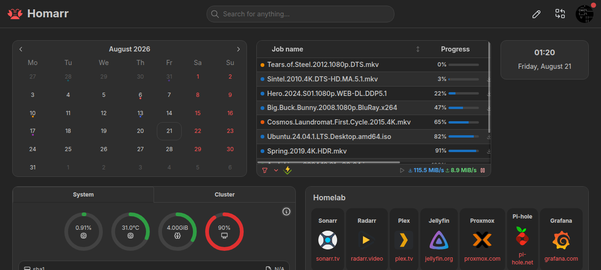 | The primary user dashboard containing active widgets, downloads monitor, streaming sessions, calendar, and categorized app links. |
| **User Account & Navigation Menu** | `./.screenshots/surface_user_menu_dropdown.png` | 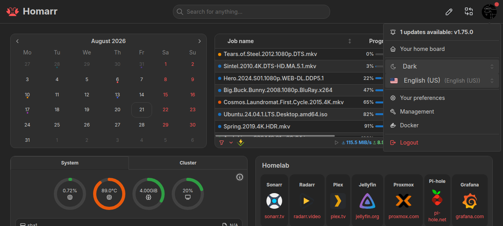 | Profile dropdown providing access to home board settings, theme switcher (Dark/Light), language selection, user preferences, and management console. |
| **Board Edit Mode** | `./.screenshots/surface_board_edit_mode.png` | 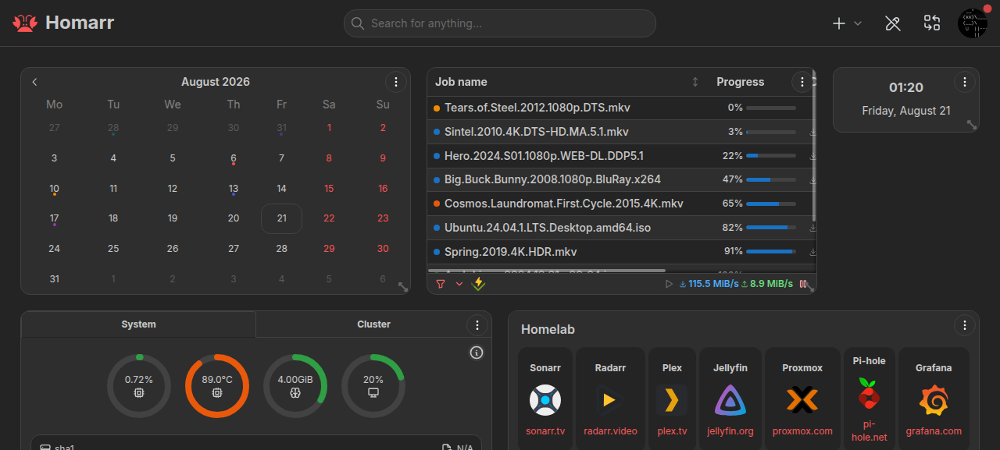 | Active grid edit mode displaying widget configuration handles, dragging grips, section reordering, and item modification triggers. |
| **Board Add Menu** | `./.screenshots/surface_board_add_menu.png` | 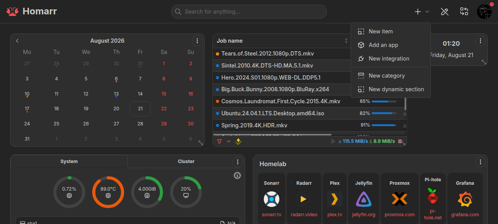 | Dropdown menu allowing addition of new widgets, application tiles, integrations, categories, or dynamic sections to the active board. |
| **Widget Catalog Modal** | `./.screenshots/surface_widget_catalog_modal.png` | 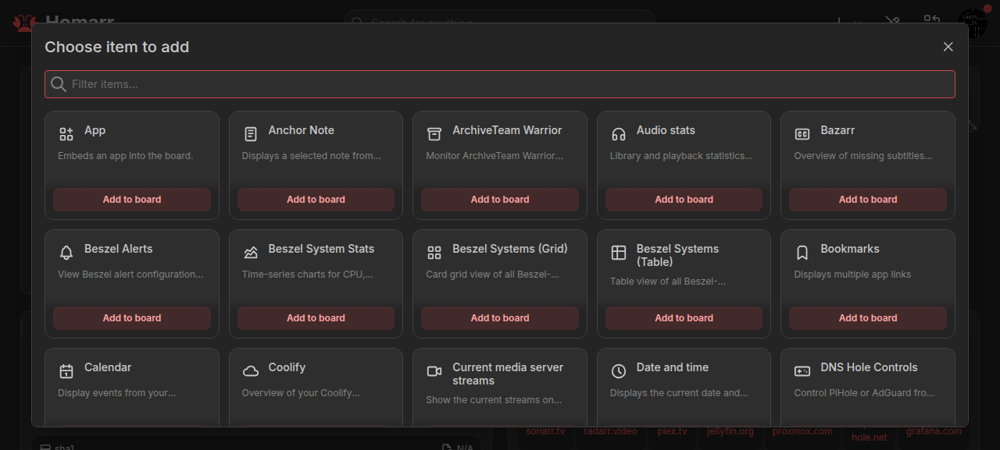 | Searchable widget picker listing all 55+ available widget kinds with description, category, and single-click addition to dashboard. |
| **Spotlight Command Palette** | `./.screenshots/surface_spotlight_search_modal.png` | 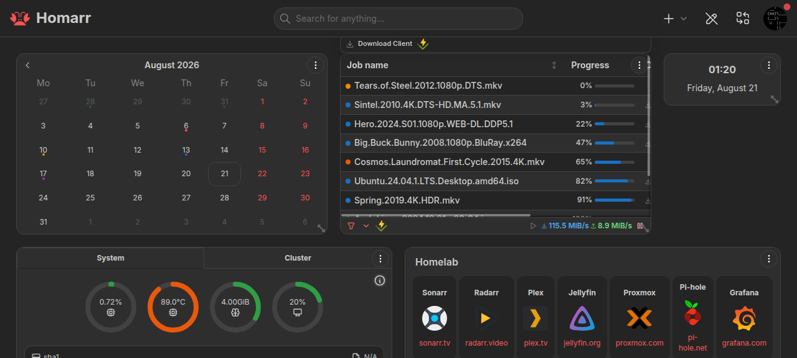 | Global search bar accessible via hotkey or header button for querying indexed applications, web bookmarks, and search engines. |
| **Authentication & Login** | `./.screenshots/surface_auth_login_page.png` | 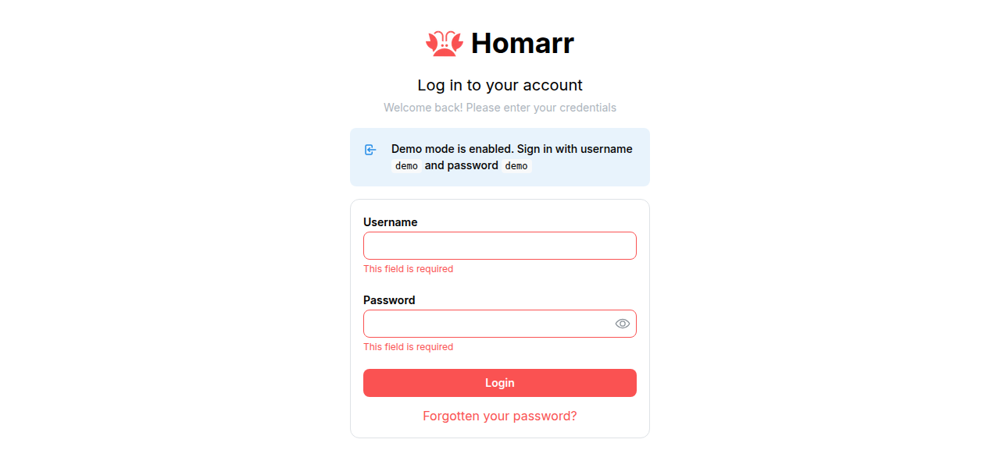 | Login page featuring credential fields, demo banner, password visibility toggle, and password reset instructions. |

---

## 2. Management & Administration Surfaces

| Surface | Relative Import | Preview | Description |
| :--- | :--- | :--- | :--- |
| **Management Overview** | `./.screenshots/surface_manage_overview.png` | 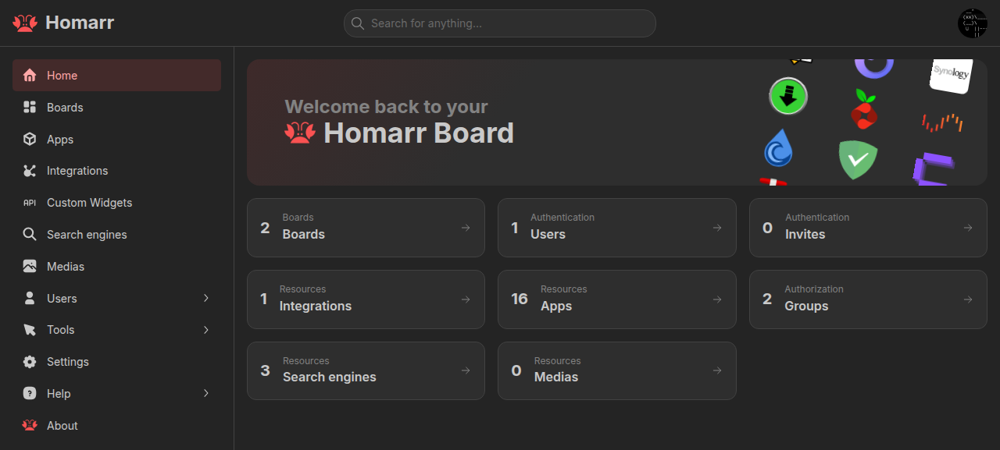 | Central administrative hub providing direct navigation to apps, integrations, tools, users, settings, and documentation. |
| **Application Management** | `./.screenshots/surface_manage_apps_list.png` | 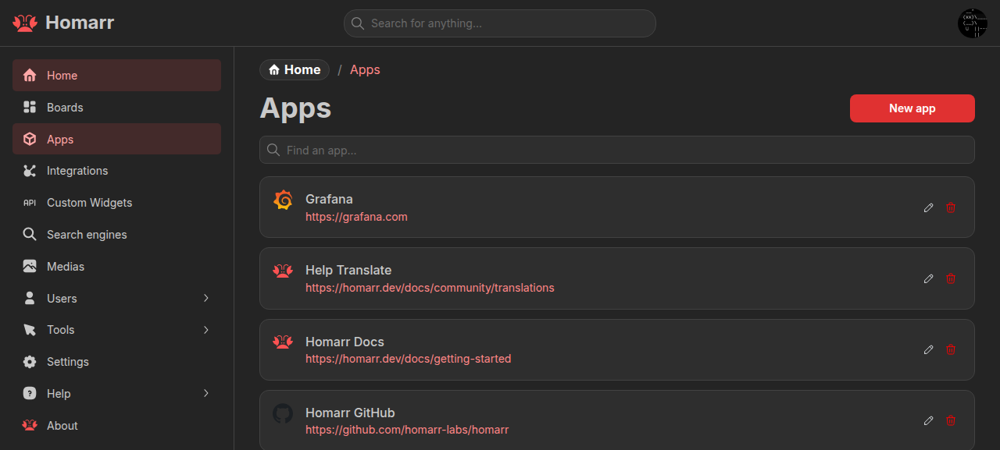 | Administrative list of configured applications with metadata, icon previews, external URLs, and ping reachability states. |
| **New Application Form** | `./.screenshots/surface_manage_apps_create.png` |  | Form interface for adding new applications with custom icon picker, URL definitions, ping check configuration, and permission scopes. |
| **Integrations Management** | `./.screenshots/surface_manage_integrations_list.png` | 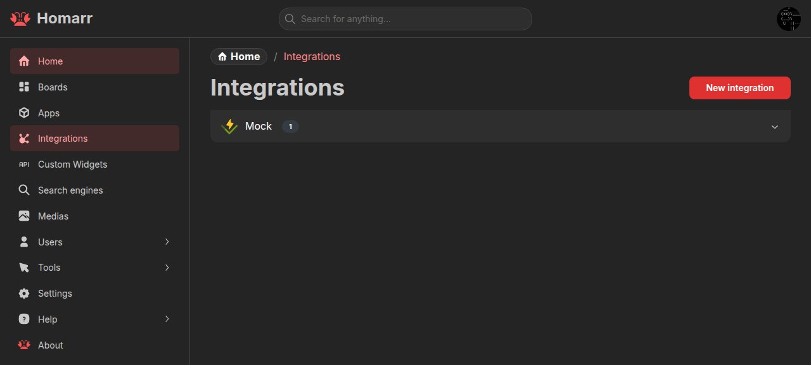 | Central management surface for third-party services (Plex, Sonarr, Radarr, Pi-hole, Docker, Home Assistant, etc.). |
| **New Integration Setup** | `./.screenshots/surface_manage_integrations_create.png` |  | Setup wizard for connecting new external service integrations with authentication credentials and endpoint URLs. |
| **Custom Widgets Management** | `./.screenshots/surface_manage_custom_widgets_list.png` | 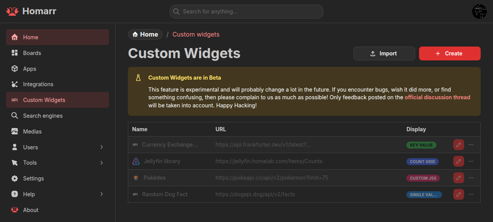 | Repository of user-defined custom API widgets and dynamic dashboard components. |
| **New Custom Widget Creator** | `./.screenshots/surface_manage_custom_widgets_create.png` | 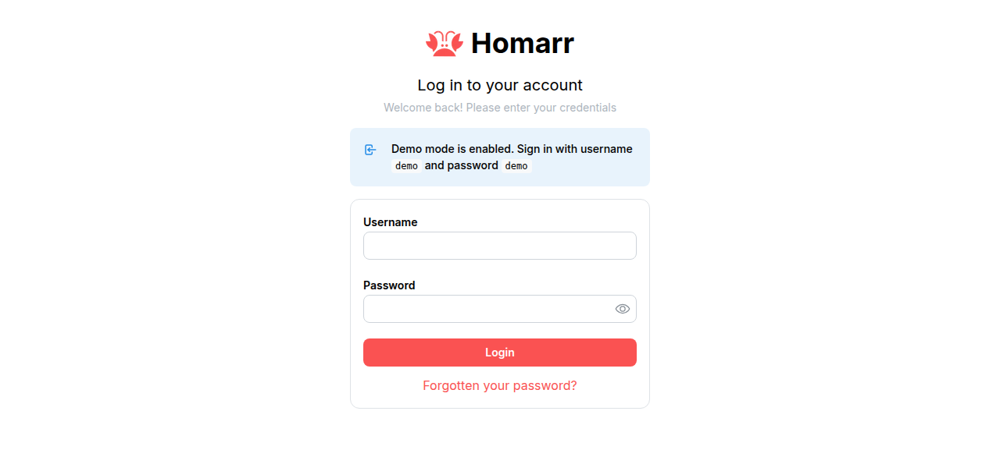 | Form for authoring new custom widgets with JSON schema validation, HTTP request configurations, and rendering templates. |
| **Media & Icon Library** | `./.screenshots/surface_manage_medias_library.png` | 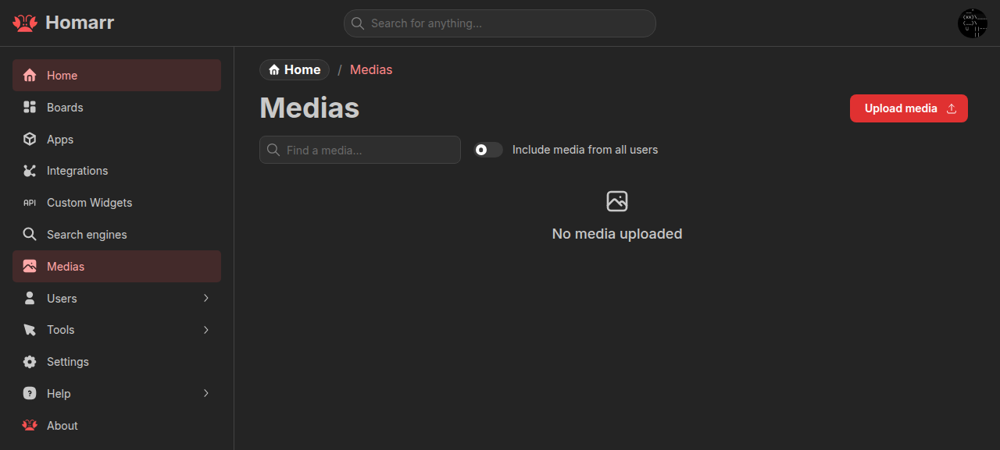 | Uploaded media and asset repository for icons, background wallpapers, and dashboard imagery. |
| **Search Engines Management** | `./.screenshots/surface_manage_search_engines_list.png` | 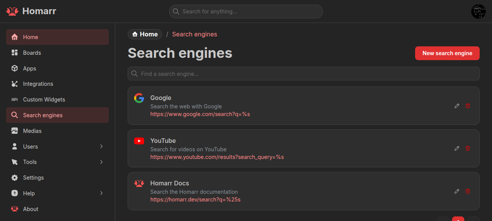 | Configuration table for integrated search providers (DuckDuckGo, Google, GitHub, etc.) utilized in the spotlight search. |
| **New Search Engine Form** | `./.screenshots/surface_manage_search_engines_create.png` |  | Interface for defining custom search providers with query URL templates and custom icons. |
| **Docker Management** | `./.screenshots/surface_manage_tools_docker.png` | 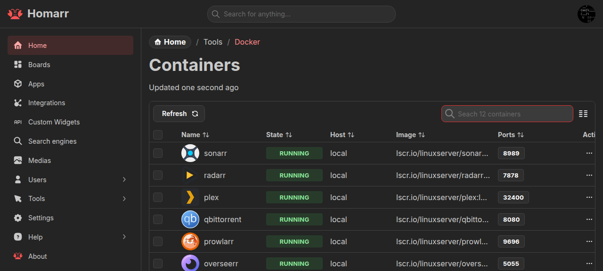 | Container monitor displaying container lifecycle status, CPU/Memory telemetry, image names, and container action triggers. |
| **Kubernetes Tools** | `./.screenshots/surface_manage_tools_kubernetes.png` |  | Cluster monitoring surface for Kubernetes nodes, namespaces, pods, services, and ingress controllers. |
| **Cron & Background Tasks** | `./.screenshots/surface_manage_tools_tasks_cron.png` | 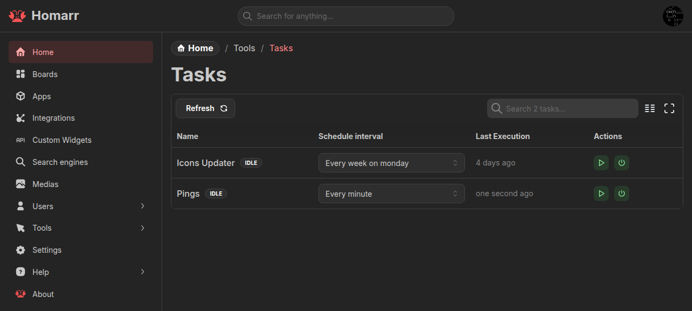 | Background task scheduler interface showing 25+ cron workers, execution schedules, last run status, and manual execution triggers. |
| **System & Application Logs** | `./.screenshots/surface_manage_tools_logs.png` | 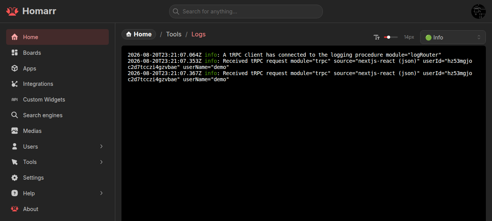 | Real-time log stream reader with level filtering (INFO, WARN, ERROR) and search capabilities. |
| **Backup & Disaster Recovery** | `./.screenshots/surface_manage_tools_backup.png` | 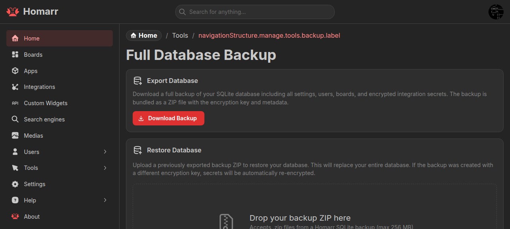 | Snapshot and database backup generator with export/import tools for full server state restoration. |
| **Certificates Management** | `./.screenshots/surface_manage_tools_certificates.png` |  | SSL/TLS certificate viewer and hostname monitoring dashboard. |
| **OpenAPI & Swagger Documentation** | `./.screenshots/surface_manage_tools_api_swagger.png` | 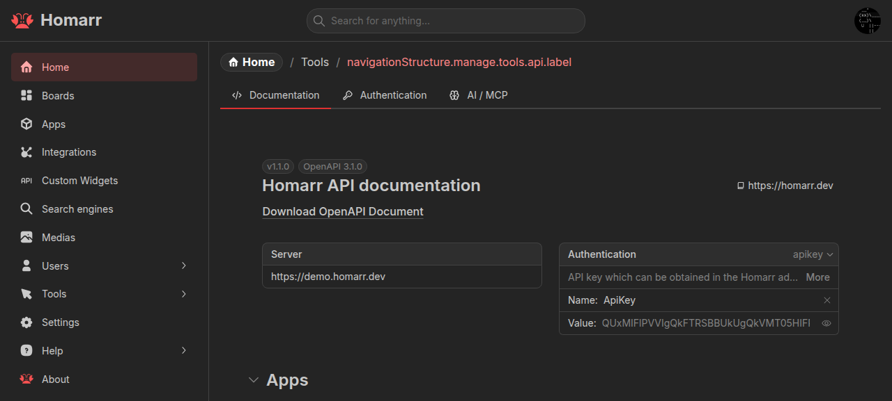 | Interactive Swagger / OpenAPI documentation explorer for Homarr's REST and tRPC endpoints. |
| **User & Access Management** | `./.screenshots/surface_manage_users_list.png` | 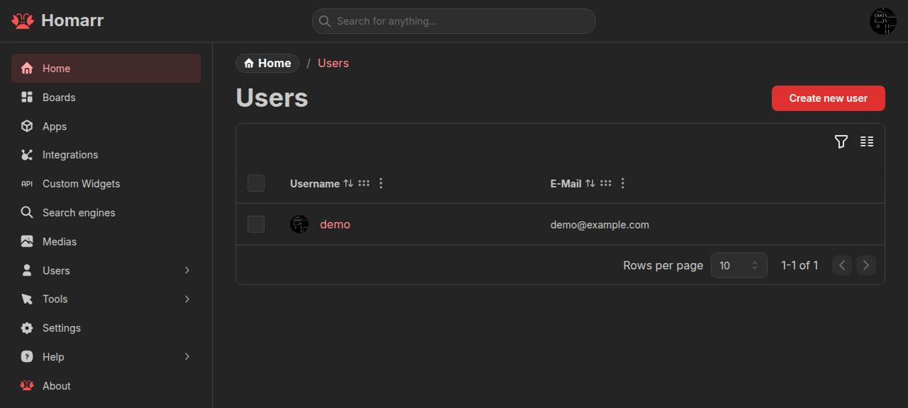 | User administration directory for managing accounts, roles, permission assignments, and invites. |
| **User Creation Interface** | `./.screenshots/surface_manage_users_create.png` |  | New user creation form with password assignment, default board assignment, and group inheritance. |
| **User Groups & Permissions** | `./.screenshots/surface_manage_user_groups.png` | 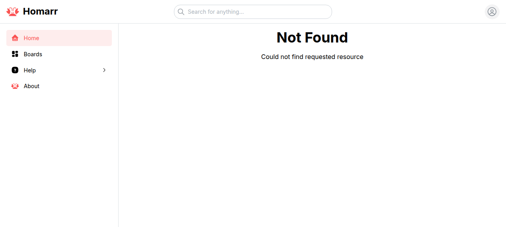 | Role-based access control (RBAC) group definitions and granular permission matrices. |
| **Server Settings** | `./.screenshots/surface_manage_server_settings.png` | 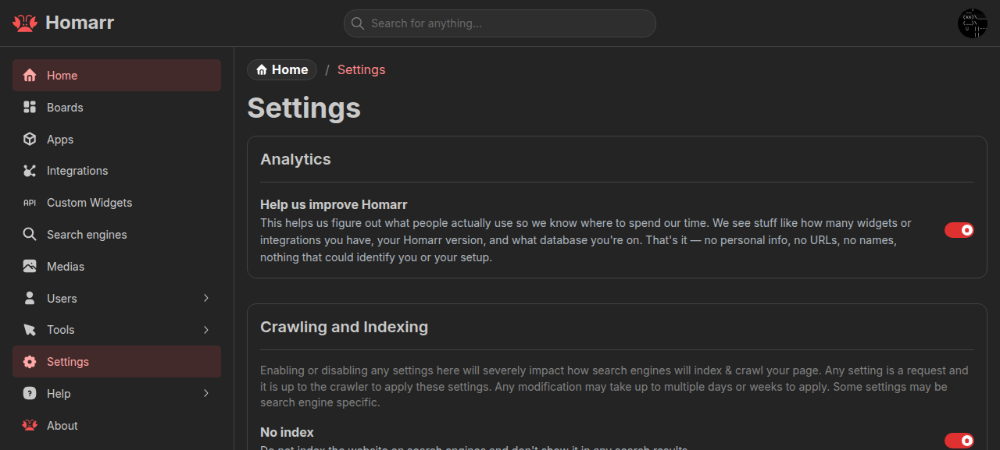 | Instance-wide settings for telemetry, localization defaults, security policies, and proxy configurations. |
| **About & Contributors** | `./.screenshots/surface_manage_about.png` | 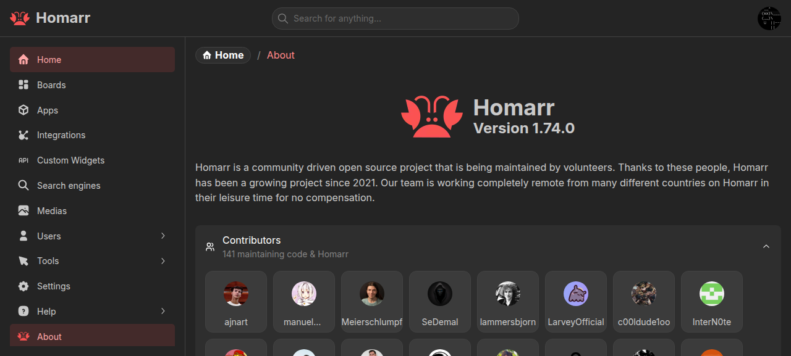 | System info, version identifier (v1.74.0), license details, and interactive contributor acknowledgment grid. |

---

## 3. All 55 Widget Interfaces & Modals

Each widget in Homarr includes dedicated surfaces for **Default Preview**, **Edit Mode**, **Settings Modal**, **Advanced Settings**, and **Dimensions Configuration**.

---

### 1. Clock (`clock`)
*Displays local or world time with customizable formats, timezones, date formatting, and optional embedded weather indicators.*

| Surface | Screenshot | Relative Path |
| :--- | :--- | :--- |
| **Default Preview** | 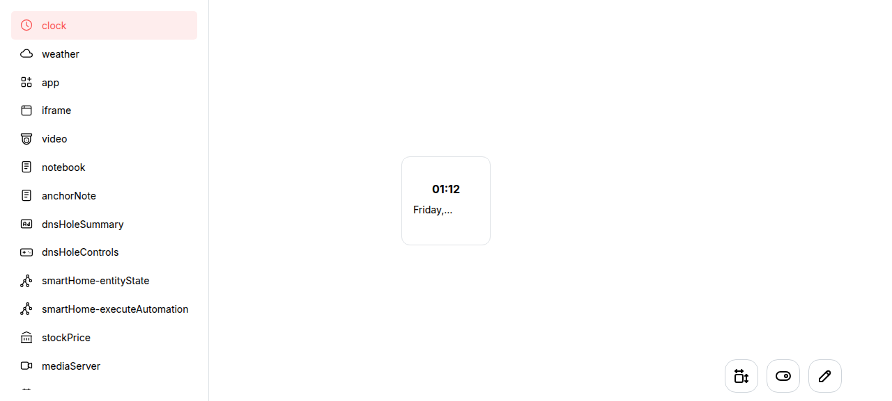 | `./.screenshots/widget_clock_preview.png` |
| **Edit Mode** | 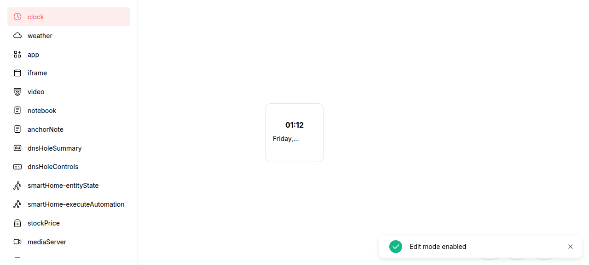 | `./.screenshots/widget_clock_edit_mode.png` |
| **Settings Modal** | 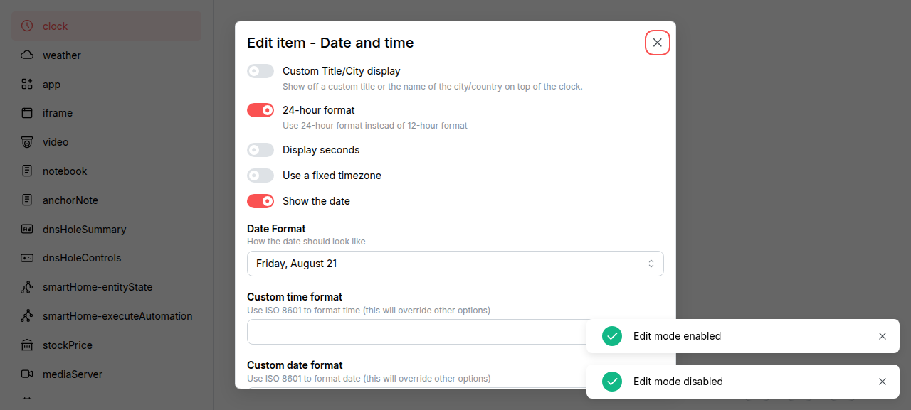 | `./.screenshots/widget_clock_settings_modal.png` |
| **Advanced Settings** |  | `./.screenshots/widget_clock_advanced_settings_modal.png` |
| **Dimensions Modal** |  | `./.screenshots/widget_clock_dimensions_modal.png` |

---

### 2. Weather (`weather`)
*Real-time meteorological conditions and temperature forecast for configured coordinates or city names.*

| Surface | Screenshot | Relative Path |
| :--- | :--- | :--- |
| **Default Preview** | 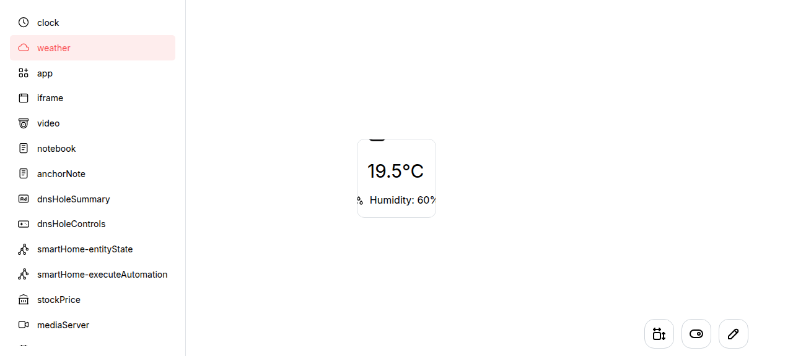 | `./.screenshots/widget_weather_preview.png` |
| **Edit Mode** | 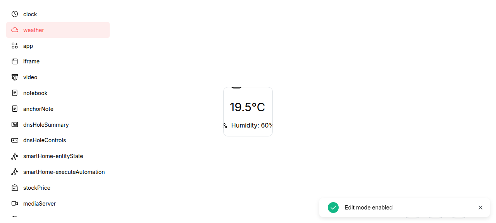 | `./.screenshots/widget_weather_edit_mode.png` |
| **Settings Modal** | 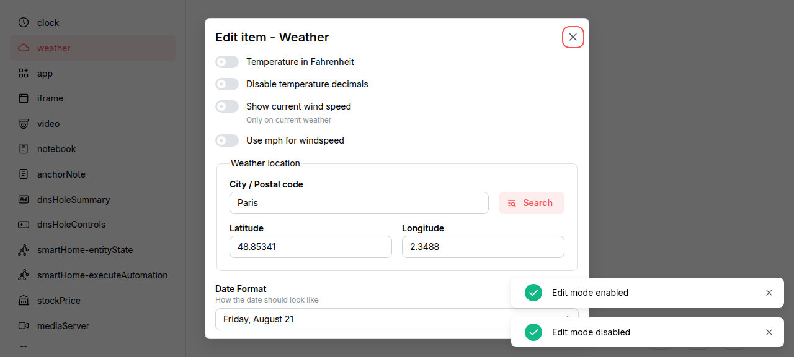 | `./.screenshots/widget_weather_settings_modal.png` |
| **Advanced Settings** |  | `./.screenshots/widget_weather_advanced_settings_modal.png` |
| **Dimensions Modal** |  | `./.screenshots/widget_weather_dimensions_modal.png` |

---

### 3. App (`app`)
*Interactive application tile with status indicator, custom icon, ping health check, and direct navigation links.*

| Surface | Screenshot | Relative Path |
| :--- | :--- | :--- |
| **Default Preview** | 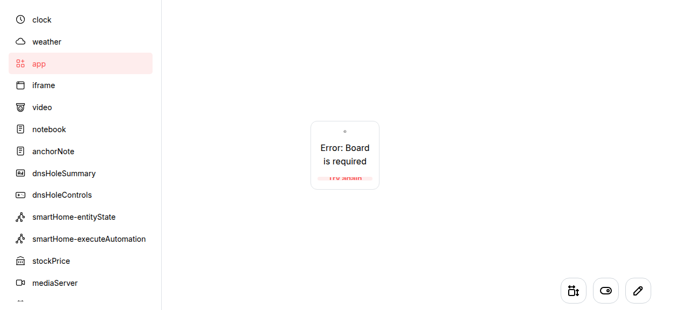 | `./.screenshots/widget_app_preview.png` |
| **Edit Mode** | 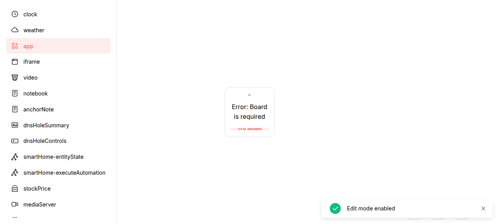 | `./.screenshots/widget_app_edit_mode.png` |
| **Settings Modal** | 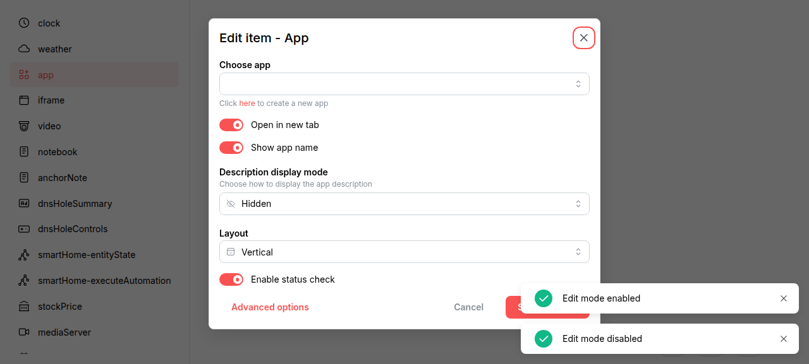 | `./.screenshots/widget_app_settings_modal.png` |
| **Advanced Settings** |  | `./.screenshots/widget_app_advanced_settings_modal.png` |
| **Dimensions Modal** |  | `./.screenshots/widget_app_dimensions_modal.png` |

---

### 4. iFrame (`iframe`)
*Embedded external web content, dashboards, and pages with sandbox security toggles and fullscreen options.*

| Surface | Screenshot | Relative Path |
| :--- | :--- | :--- |
| **Default Preview** | 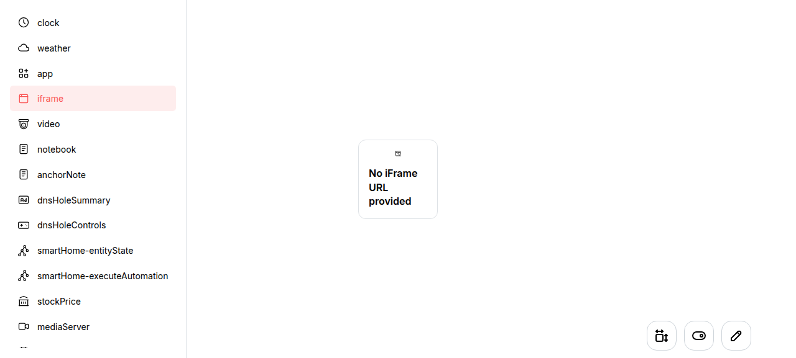 | `./.screenshots/widget_iframe_preview.png` |
| **Edit Mode** | 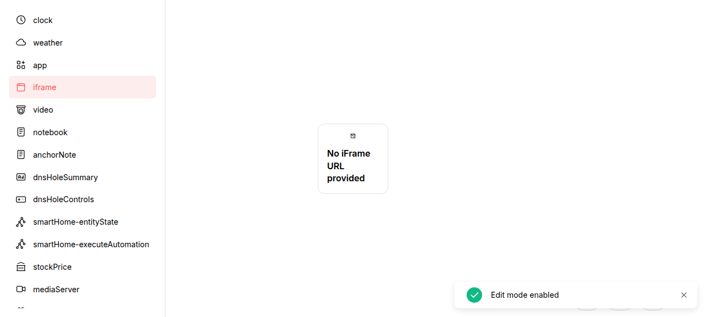 | `./.screenshots/widget_iframe_edit_mode.png` |
| **Settings Modal** | 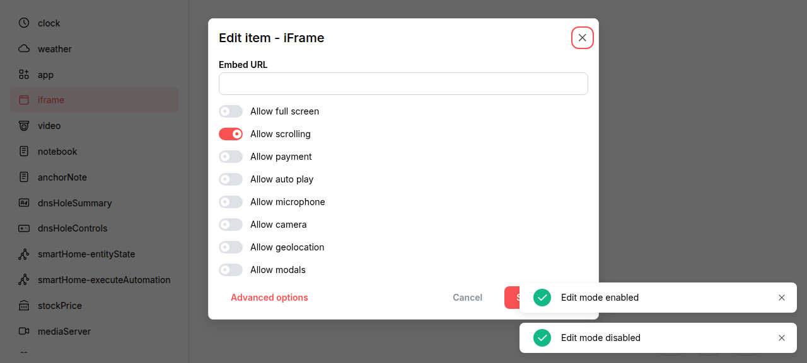 | `./.screenshots/widget_iframe_settings_modal.png` |
| **Advanced Settings** |  | `./.screenshots/widget_iframe_advanced_settings_modal.png` |
| **Dimensions Modal** |  | `./.screenshots/widget_iframe_dimensions_modal.png` |

---

### 5. Video Stream (`video`)
*Direct live stream or video player integration for camera feeds, RTSP/HLS transcodes, and local video assets.*

| Surface | Screenshot | Relative Path |
| :--- | :--- | :--- |
| **Default Preview** | 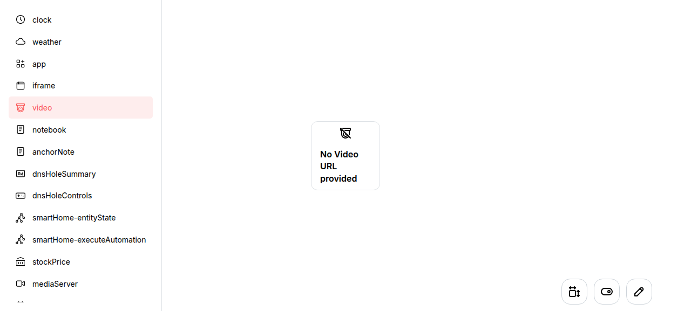 | `./.screenshots/widget_video_preview.png` |
| **Edit Mode** | 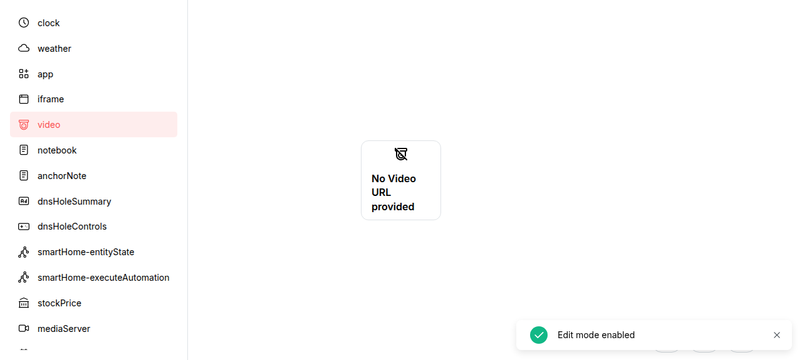 | `./.screenshots/widget_video_edit_mode.png` |
| **Settings Modal** | 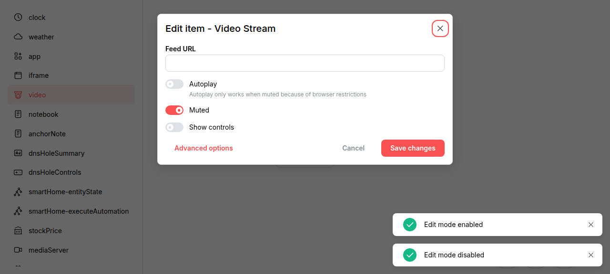 | `./.screenshots/widget_video_settings_modal.png` |
| **Advanced Settings** |  | `./.screenshots/widget_video_advanced_settings_modal.png` |
| **Dimensions Modal** | 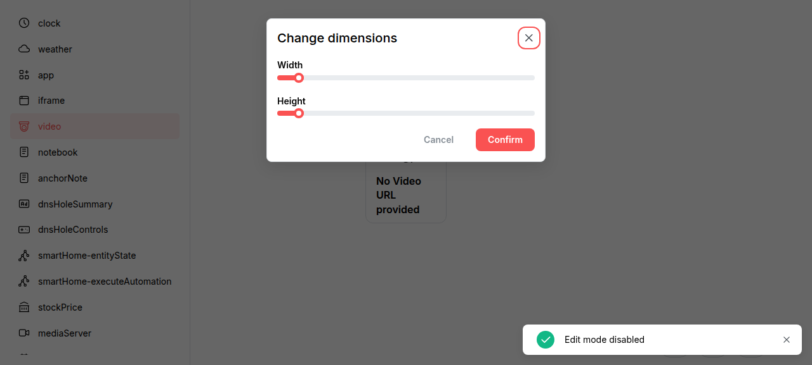 | `./.screenshots/widget_video_dimensions_modal.png` |

---

### 6. Notebook (`notebook`)
*Rich-text Markdown and checklist note-taking canvas powered by Tiptap with formatting tools, tables, and task lists.*

| Surface | Screenshot | Relative Path |
| :--- | :--- | :--- |
| **Default Preview** | 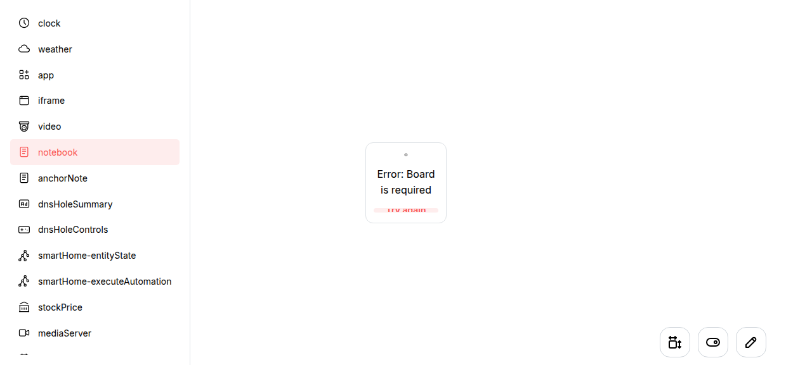 | `./.screenshots/widget_notebook_preview.png` |
| **Edit Mode** | 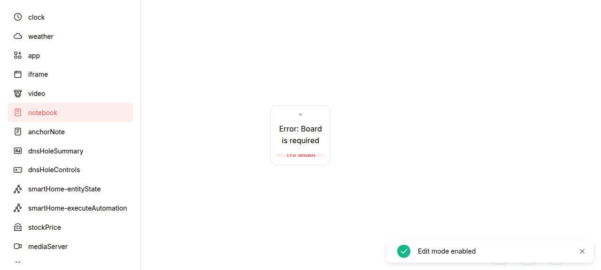 | `./.screenshots/widget_notebook_edit_mode.png` |
| **Settings Modal** | 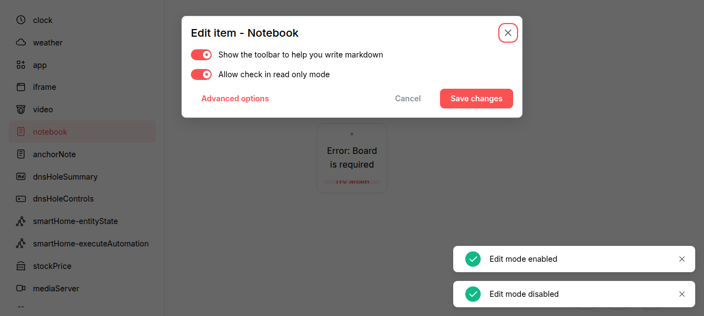 | `./.screenshots/widget_notebook_settings_modal.png` |
| **Advanced Settings** |  | `./.screenshots/widget_notebook_advanced_settings_modal.png` |
| **Dimensions Modal** | 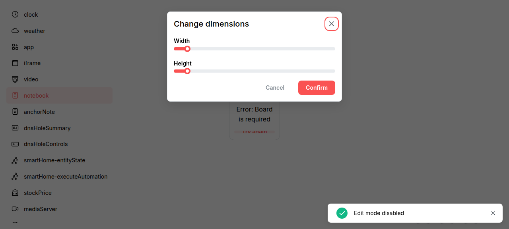 | `./.screenshots/widget_notebook_dimensions_modal.png` |

---

### 7. Anchor Note (`anchorNote`)
*Fixed-position note widget pinned to specific board regions for reminders, homelab documentation, and guides.*

| Surface | Screenshot | Relative Path |
| :--- | :--- | :--- |
| **Default Preview** | 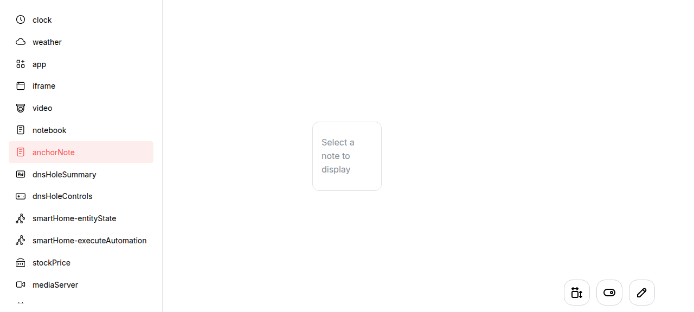 | `./.screenshots/widget_anchorNote_preview.png` |
| **Edit Mode** | 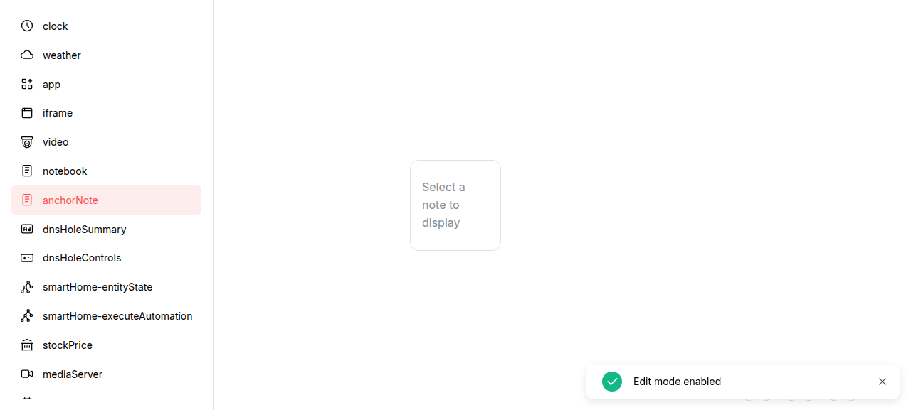 | `./.screenshots/widget_anchorNote_edit_mode.png` |
| **Settings Modal** |  | `./.screenshots/widget_anchorNote_settings_modal.png` |
| **Advanced Settings** | 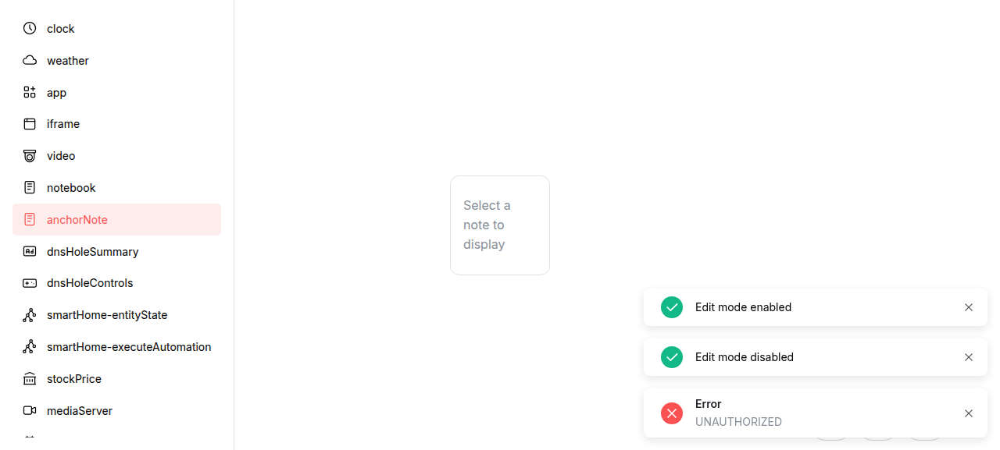 | `./.screenshots/widget_anchorNote_advanced_settings_modal.png` |
| **Dimensions Modal** | 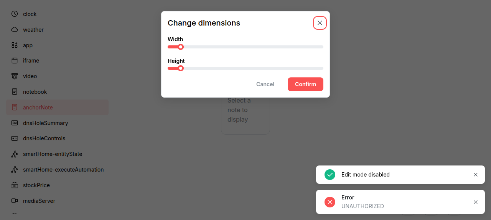 | `./.screenshots/widget_anchorNote_dimensions_modal.png` |

---

### 8. DNS Hole Summary (`dnsHoleSummary`)
*Pi-hole / AdGuard Home statistics displaying queries blocked, blocklist percentage, and total DNS lookups.*

| Surface | Screenshot | Relative Path |
| :--- | :--- | :--- |
| **Default Preview** | 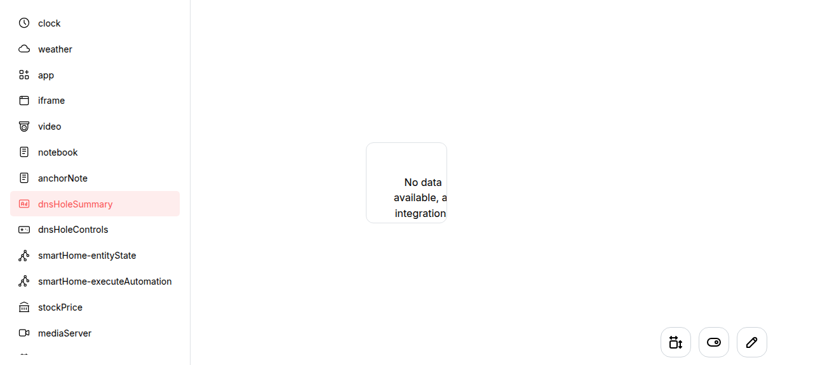 | `./.screenshots/widget_dnsHoleSummary_preview.png` |
| **Edit Mode** | 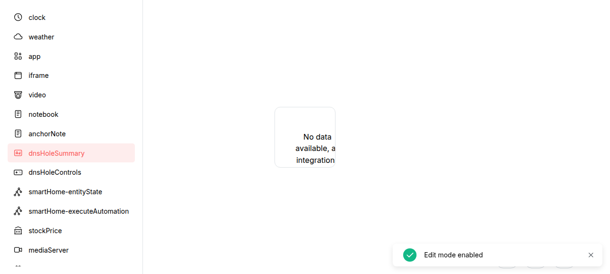 | `./.screenshots/widget_dnsHoleSummary_edit_mode.png` |
| **Settings Modal** | 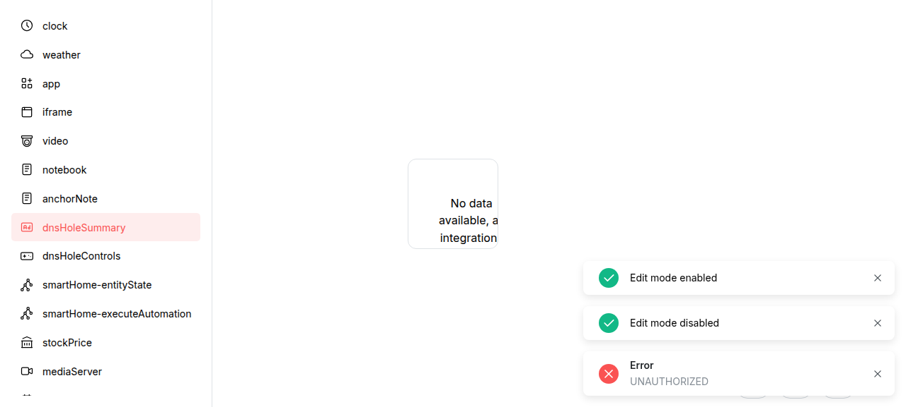 | `./.screenshots/widget_dnsHoleSummary_settings_modal.png` |
| **Advanced Settings** |  | `./.screenshots/widget_dnsHoleSummary_advanced_settings_modal.png` |
| **Dimensions Modal** | 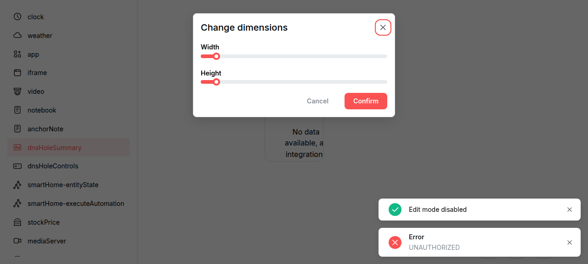 | `./.screenshots/widget_dnsHoleSummary_dimensions_modal.png` |

---

### 9. DNS Hole Controls (`dnsHoleControls`)
*Interactive toggle controls for enabling and disabling DNS filtering across Pi-hole and AdGuard Home instances.*

| Surface | Screenshot | Relative Path |
| :--- | :--- | :--- |
| **Default Preview** | 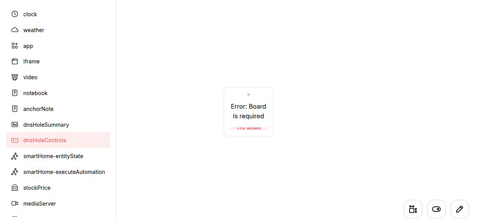 | `./.screenshots/widget_dnsHoleControls_preview.png` |
| **Edit Mode** | 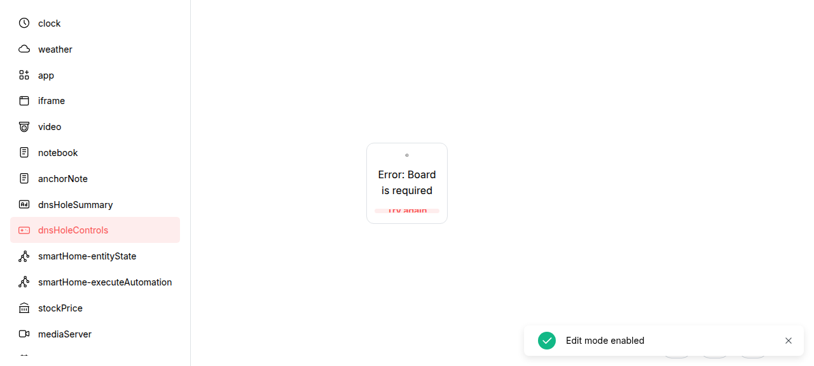 | `./.screenshots/widget_dnsHoleControls_edit_mode.png` |
| **Settings Modal** |  | `./.screenshots/widget_dnsHoleControls_settings_modal.png` |
| **Advanced Settings** | 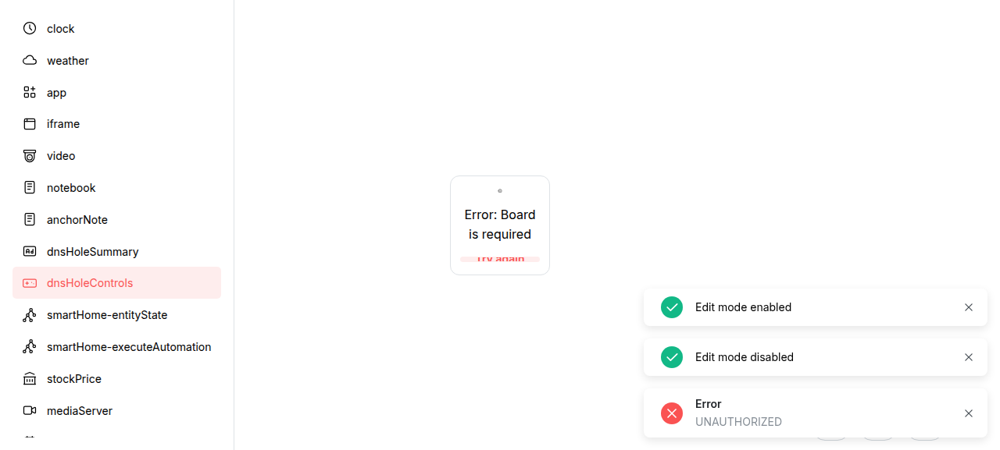 | `./.screenshots/widget_dnsHoleControls_advanced_settings_modal.png` |
| **Dimensions Modal** | 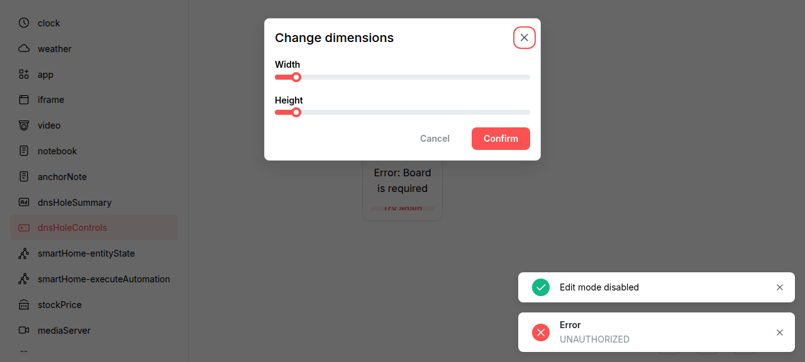 | `./.screenshots/widget_dnsHoleControls_dimensions_modal.png` |

---

### 10. Smart Home Entity State (`smartHome-entityState`)
*Displays real-time sensor values, switch states, and climate attributes from Home Assistant entities.*

| Surface | Screenshot | Relative Path |
| :--- | :--- | :--- |
| **Default Preview** | 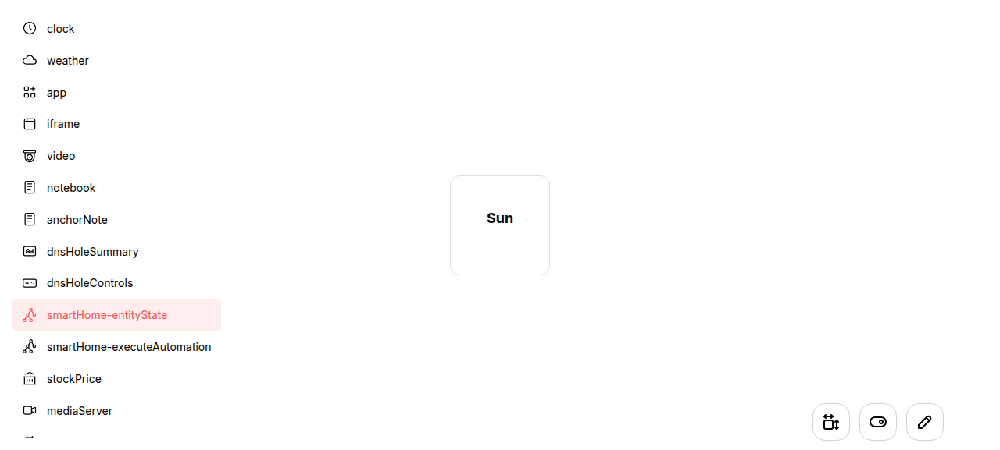 | `./.screenshots/widget_smartHome-entityState_preview.png` |
| **Edit Mode** | 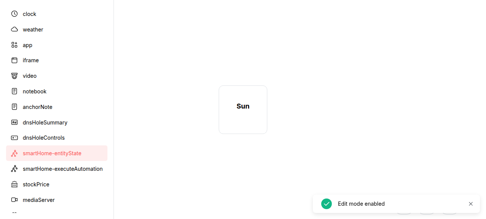 | `./.screenshots/widget_smartHome-entityState_edit_mode.png` |
| **Settings Modal** |  | `./.screenshots/widget_smartHome-entityState_settings_modal.png` |
| **Advanced Settings** | 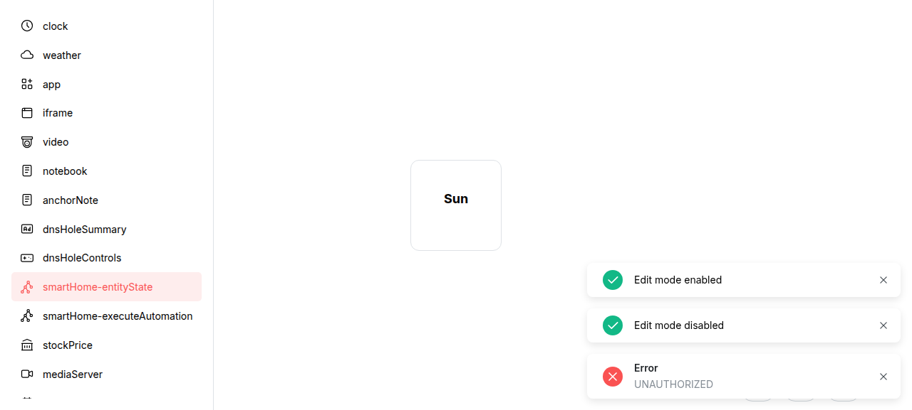 | `./.screenshots/widget_smartHome-entityState_advanced_settings_modal.png` |
| **Dimensions Modal** |  | `./.screenshots/widget_smartHome-entityState_dimensions_modal.png` |

---

### 11. Smart Home Execute Automation (`smartHome-executeAutomation`)
*Quick-trigger button to execute Home Assistant automations, scenes, and script routines.*

| Surface | Screenshot | Relative Path |
| :--- | :--- | :--- |
| **Default Preview** | 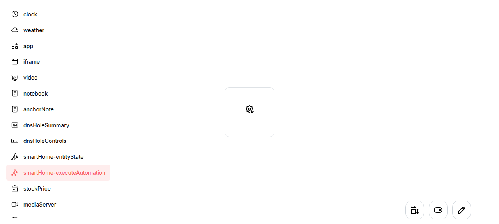 | `./.screenshots/widget_smartHome-executeAutomation_preview.png` |
| **Edit Mode** | 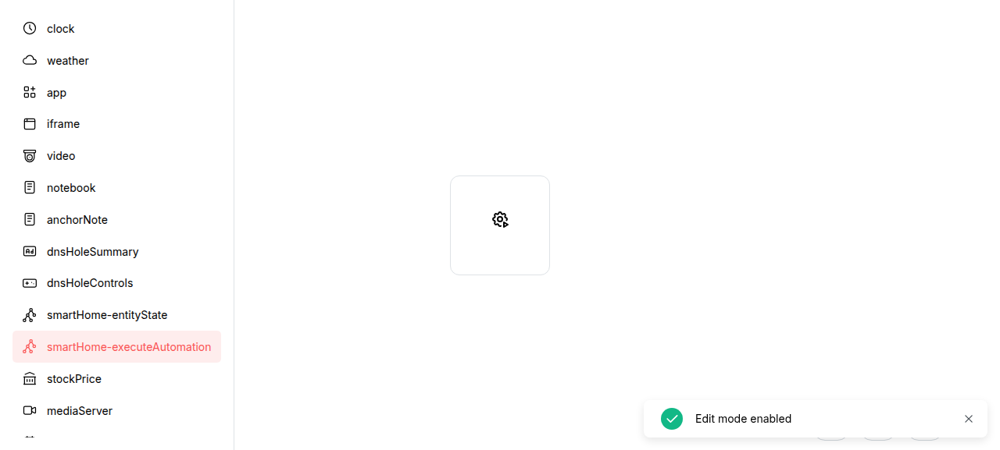 | `./.screenshots/widget_smartHome-executeAutomation_edit_mode.png` |
| **Settings Modal** |  | `./.screenshots/widget_smartHome-executeAutomation_settings_modal.png` |
| **Advanced Settings** | 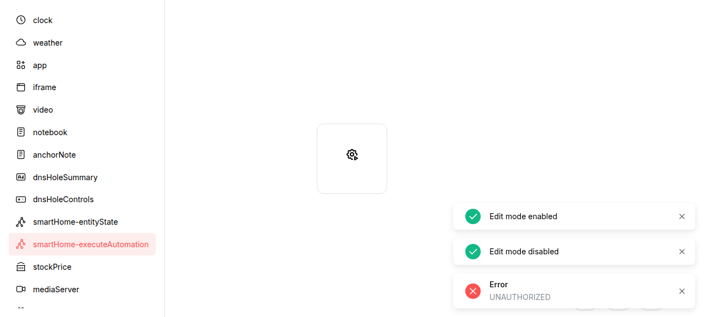 | `./.screenshots/widget_smartHome-executeAutomation_advanced_settings_modal.png` |
| **Dimensions Modal** | 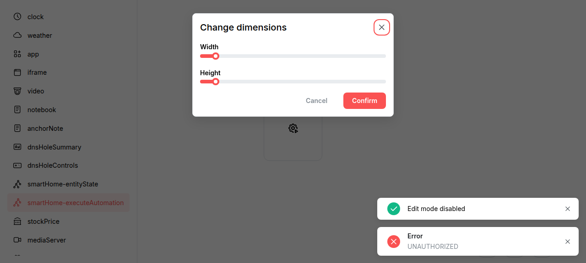 | `./.screenshots/widget_smartHome-executeAutomation_dimensions_modal.png` |

---

### 12. Stock Price (`stockPrice`)
*Live market price chart and equity tracking widget with customizable time ranges and interval candles.*

| Surface | Screenshot | Relative Path |
| :--- | :--- | :--- |
| **Default Preview** | 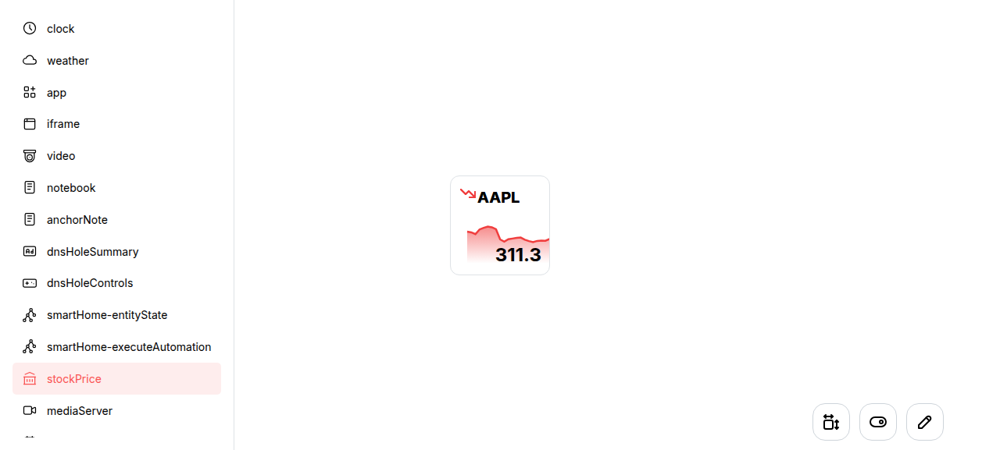 | `./.screenshots/widget_stockPrice_preview.png` |
| **Edit Mode** | 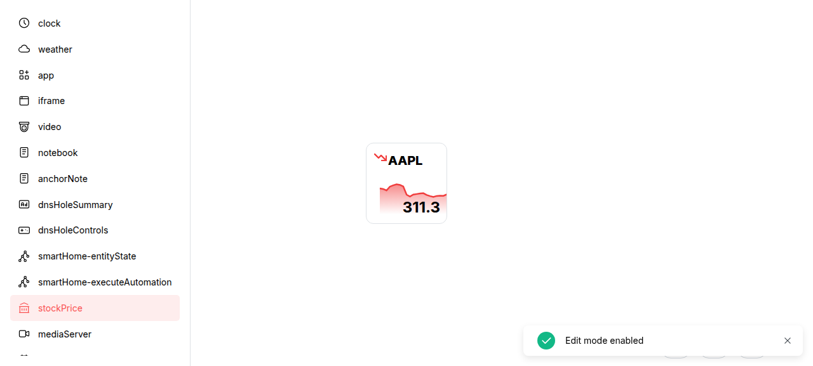 | `./.screenshots/widget_stockPrice_edit_mode.png` |
| **Settings Modal** | 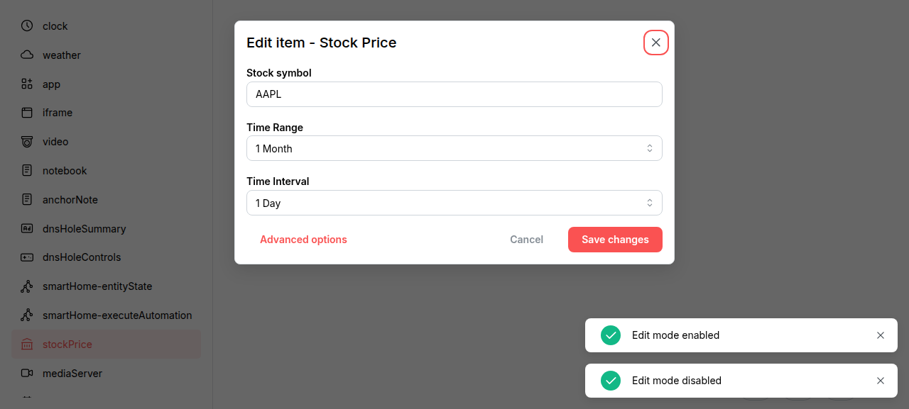 | `./.screenshots/widget_stockPrice_settings_modal.png` |
| **Advanced Settings** |  | `./.screenshots/widget_stockPrice_advanced_settings_modal.png` |
| **Dimensions Modal** | 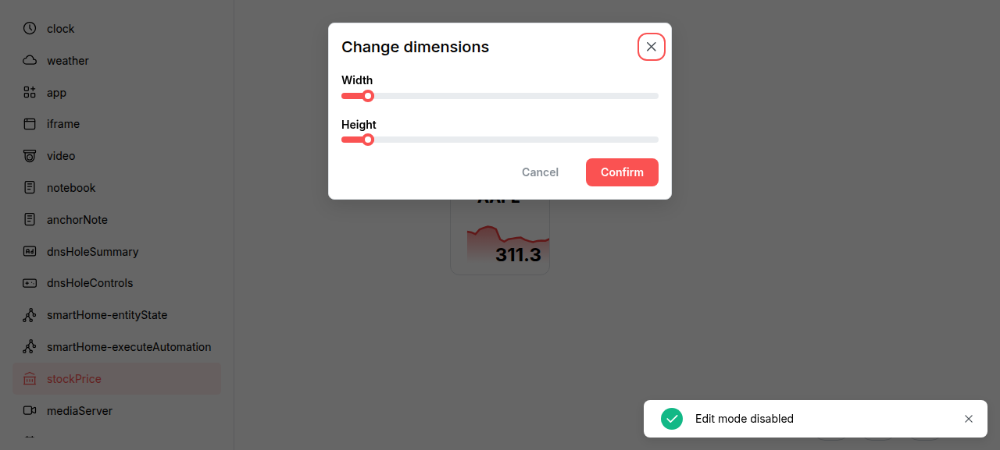 | `./.screenshots/widget_stockPrice_dimensions_modal.png` |

---

### 13. Media Server (`mediaServer`)
*Real-time active streams viewer for Plex and Jellyfin media servers with user details and playback bitrate.*

| Surface | Screenshot | Relative Path |
| :--- | :--- | :--- |
| **Default Preview** | 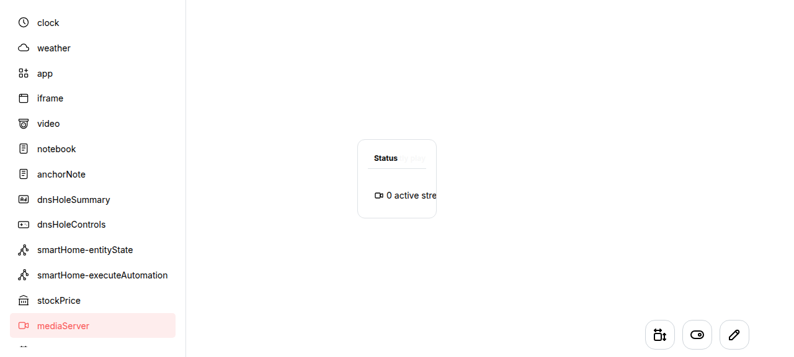 | `./.screenshots/widget_mediaServer_preview.png` |
| **Edit Mode** | 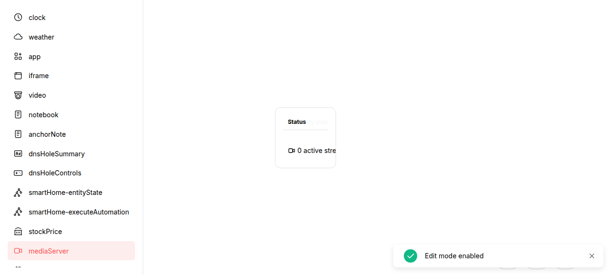 | `./.screenshots/widget_mediaServer_edit_mode.png` |
| **Settings Modal** | 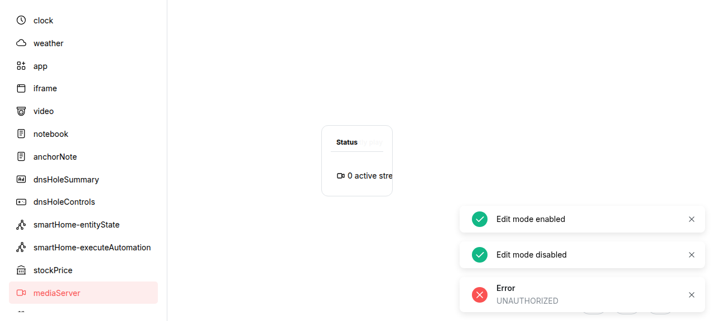 | `./.screenshots/widget_mediaServer_settings_modal.png` |
| **Advanced Settings** |  | `./.screenshots/widget_mediaServer_advanced_settings_modal.png` |
| **Dimensions Modal** | 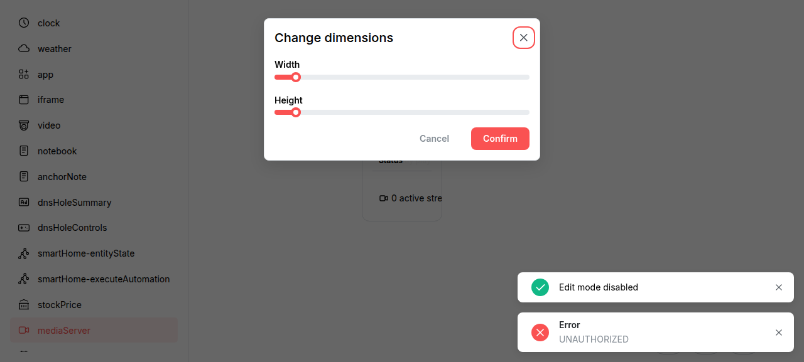 | `./.screenshots/widget_mediaServer_dimensions_modal.png` |

---

### 14. Calendar (`calendar`)
*Unified release calendar aggregating upcoming movies, TV episodes, and custom CalDAV/iCal schedules.*

| Surface | Screenshot | Relative Path |
| :--- | :--- | :--- |
| **Default Preview** | 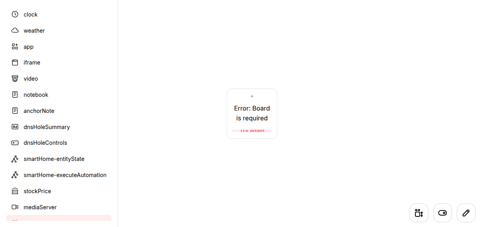 | `./.screenshots/widget_calendar_preview.png` |
| **Edit Mode** | 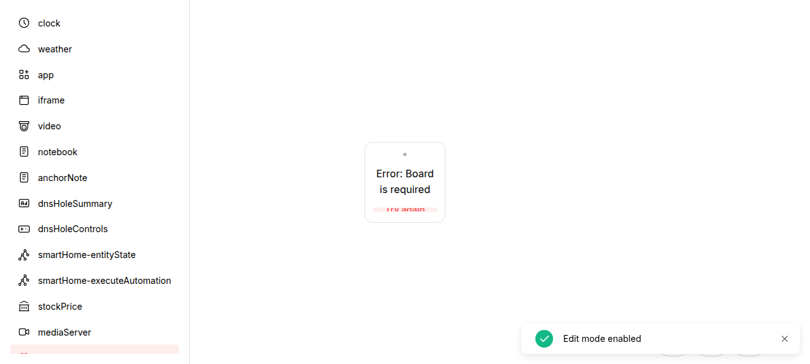 | `./.screenshots/widget_calendar_edit_mode.png` |
| **Settings Modal** | 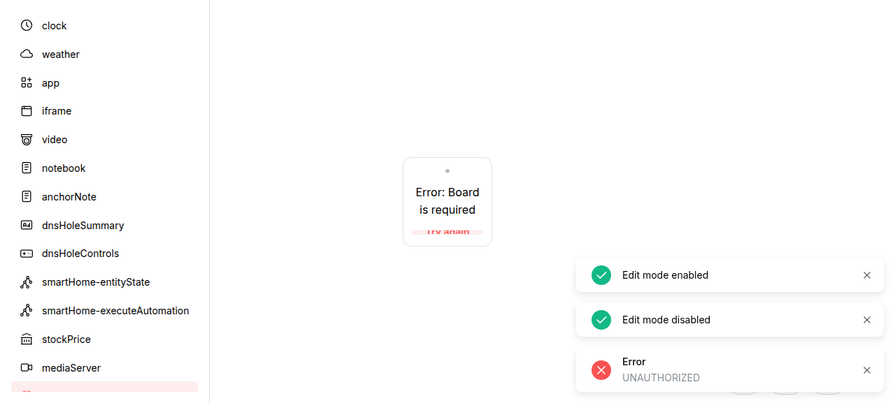 | `./.screenshots/widget_calendar_settings_modal.png` |
| **Advanced Settings** |  | `./.screenshots/widget_calendar_advanced_settings_modal.png` |
| **Dimensions Modal** |  | `./.screenshots/widget_calendar_dimensions_modal.png` |

---

### 15. Downloads (`downloads`)
*Download client manager integrating qBittorrent, Transmission, Deluge, SABnzbd, and NZBGet with speed graphs.*

| Surface | Screenshot | Relative Path |
| :--- | :--- | :--- |
| **Default Preview** | 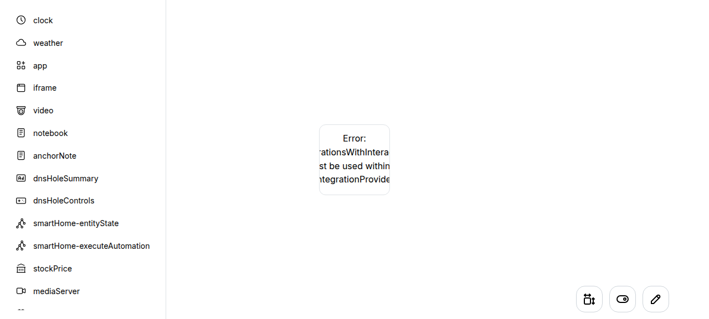 | `./.screenshots/widget_downloads_preview.png` |
| **Edit Mode** | 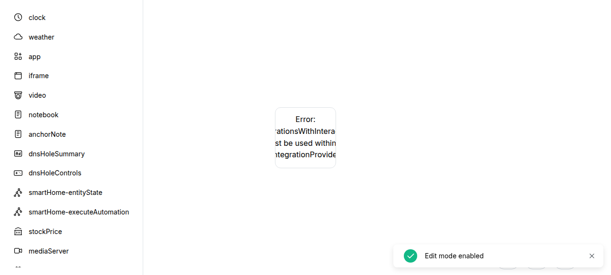 | `./.screenshots/widget_downloads_edit_mode.png` |
| **Settings Modal** | 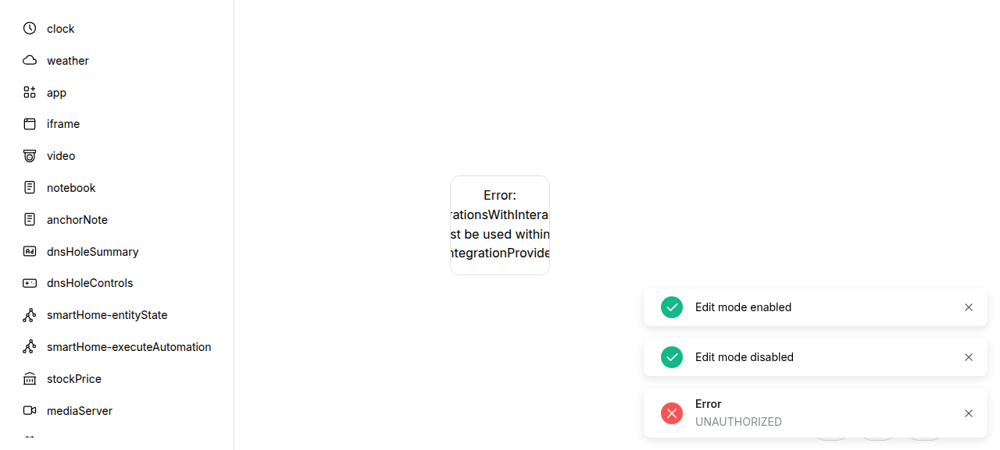 | `./.screenshots/widget_downloads_settings_modal.png` |
| **Advanced Settings** |  | `./.screenshots/widget_downloads_advanced_settings_modal.png` |
| **Dimensions Modal** | 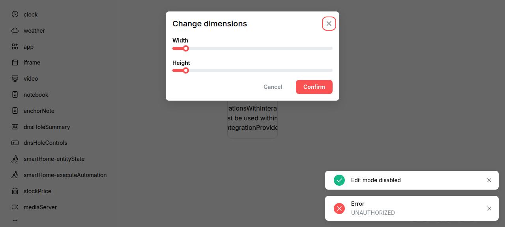 | `./.screenshots/widget_downloads_dimensions_modal.png` |

---

### 16. Media Requests List (`mediaRequests-requestList`)
*Overseerr and Jellyseerr request queue displaying pending, approved, and processing media requests.*

| Surface | Screenshot | Relative Path |
| :--- | :--- | :--- |
| **Default Preview** |  | `./.screenshots/widget_mediaRequests-requestList_preview.png` |
| **Edit Mode** |  | `./.screenshots/widget_mediaRequests-requestList_edit_mode.png` |
| **Settings Modal** |  | `./.screenshots/widget_mediaRequests-requestList_settings_modal.png` |
| **Advanced Settings** | 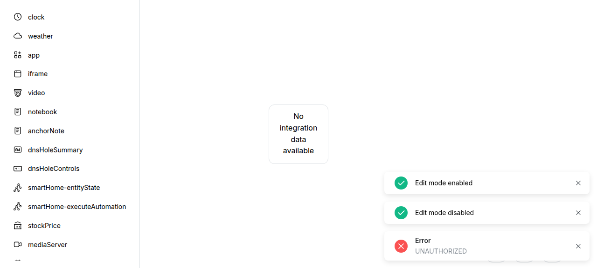 | `./.screenshots/widget_mediaRequests-requestList_advanced_settings_modal.png` |
| **Dimensions Modal** |  | `./.screenshots/widget_mediaRequests-requestList_dimensions_modal.png` |

---

### 17. Media Requests Stats (`mediaRequests-requestStats`)
*Analytical overview charts for Overseerr/Jellyseerr requests categorized by status and media type.*

| Surface | Screenshot | Relative Path |
| :--- | :--- | :--- |
| **Default Preview** |  | `./.screenshots/widget_mediaRequests-requestStats_preview.png` |
| **Edit Mode** |  | `./.screenshots/widget_mediaRequests-requestStats_edit_mode.png` |
| **Settings Modal** |  | `./.screenshots/widget_mediaRequests-requestStats_settings_modal.png` |
| **Advanced Settings** |  | `./.screenshots/widget_mediaRequests-requestStats_advanced_settings_modal.png` |
| **Dimensions Modal** |  | `./.screenshots/widget_mediaRequests-requestStats_dimensions_modal.png` |

---

### 18. Media Transcoding (`mediaTranscoding`)
*Tdarr and Unmanic transcoding monitor displaying active worker tasks, queue length, and space savings.*

| Surface | Screenshot | Relative Path |
| :--- | :--- | :--- |
| **Default Preview** | 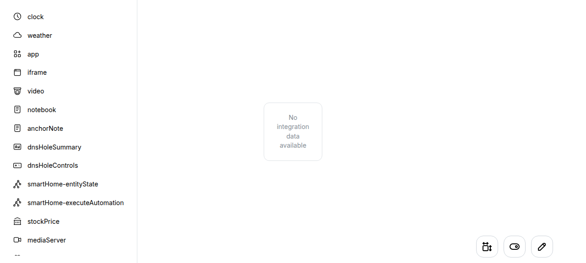 | `./.screenshots/widget_mediaTranscoding_preview.png` |
| **Edit Mode** |  | `./.screenshots/widget_mediaTranscoding_edit_mode.png` |
| **Settings Modal** |  | `./.screenshots/widget_mediaTranscoding_settings_modal.png` |
| **Advanced Settings** |  | `./.screenshots/widget_mediaTranscoding_advanced_settings_modal.png` |
| **Dimensions Modal** | 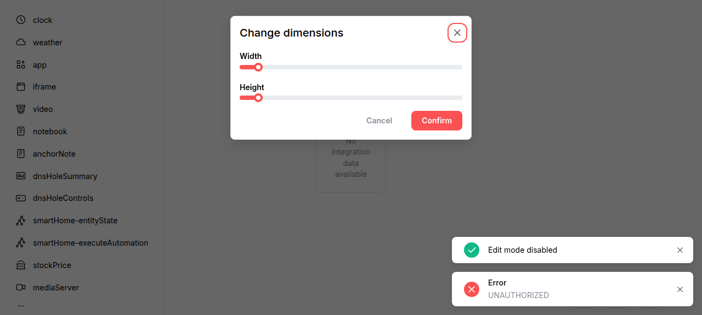 | `./.screenshots/widget_mediaTranscoding_dimensions_modal.png` |

---

### 19. Media Missing (`mediaMissing`)
*Lists missing items across Sonarr and Radarr with automatic search and backfill triggers.*

| Surface | Screenshot | Relative Path |
| :--- | :--- | :--- |
| **Default Preview** |  | `./.screenshots/widget_mediaMissing_preview.png` |
| **Edit Mode** |  | `./.screenshots/widget_mediaMissing_edit_mode.png` |
| **Settings Modal** |  | `./.screenshots/widget_mediaMissing_settings_modal.png` |
| **Advanced Settings** |  | `./.screenshots/widget_mediaMissing_advanced_settings_modal.png` |
| **Dimensions Modal** |  | `./.screenshots/widget_mediaMissing_dimensions_modal.png` |

---

### 20. Minecraft Server Status (`minecraftServerStatus`)
*Live player counts, online status, server ping latency, and version information for Java & Bedrock Minecraft servers.*

| Surface | Screenshot | Relative Path |
| :--- | :--- | :--- |
| **Default Preview** | 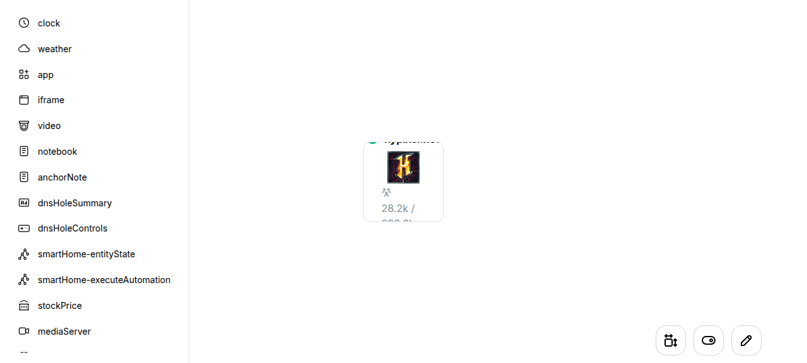 | `./.screenshots/widget_minecraftServerStatus_preview.png` |
| **Edit Mode** | 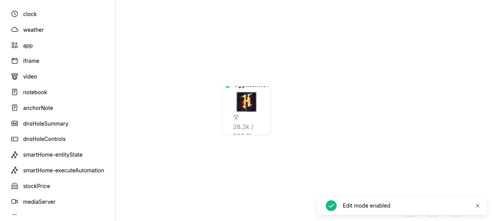 | `./.screenshots/widget_minecraftServerStatus_edit_mode.png` |
| **Settings Modal** | 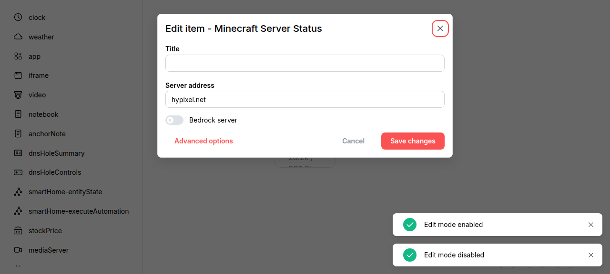 | `./.screenshots/widget_minecraftServerStatus_settings_modal.png` |
| **Advanced Settings** |  | `./.screenshots/widget_minecraftServerStatus_advanced_settings_modal.png` |
| **Dimensions Modal** | 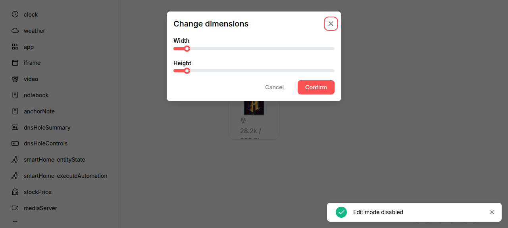 | `./.screenshots/widget_minecraftServerStatus_dimensions_modal.png` |

---

### 21. Network Controller Summary (`networkControllerSummary`)
*UniFi Network Controller summary showing WAN status, WWW latency, Wi-Fi health, and VPN tunnels.*

| Surface | Screenshot | Relative Path |
| :--- | :--- | :--- |
| **Default Preview** | 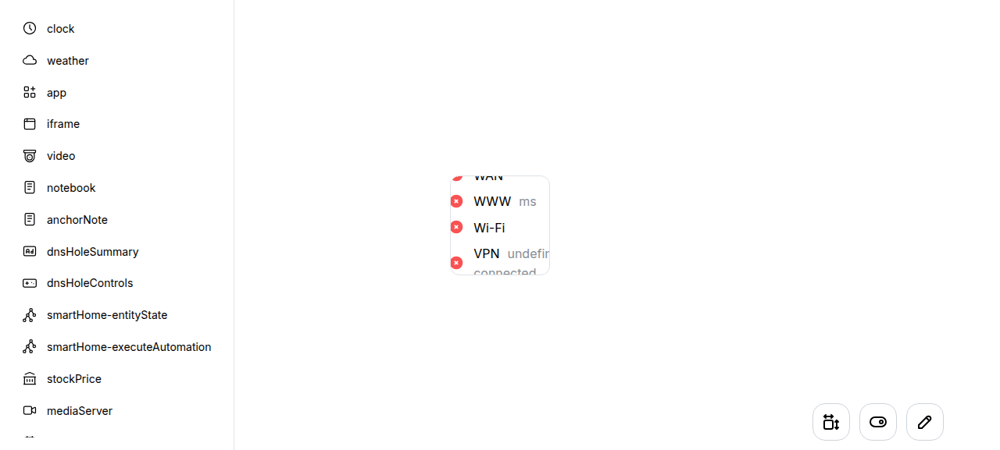 | `./.screenshots/widget_networkControllerSummary_preview.png` |
| **Edit Mode** | 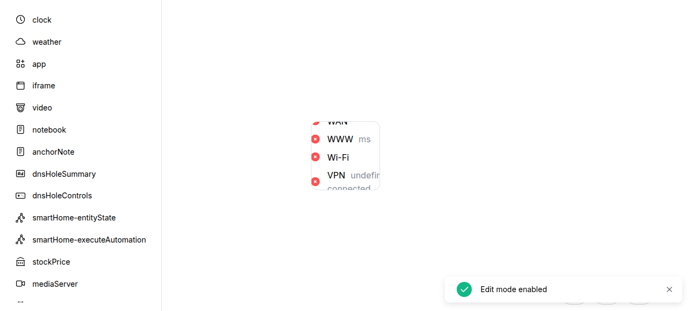 | `./.screenshots/widget_networkControllerSummary_edit_mode.png` |
| **Settings Modal** | 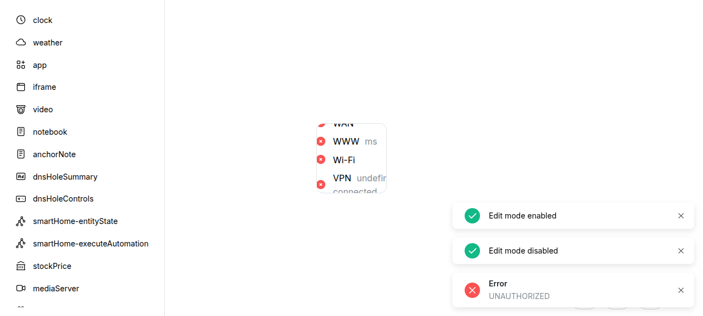 | `./.screenshots/widget_networkControllerSummary_settings_modal.png` |
| **Advanced Settings** |  | `./.screenshots/widget_networkControllerSummary_advanced_settings_modal.png` |
| **Dimensions Modal** |  | `./.screenshots/widget_networkControllerSummary_dimensions_modal.png` |

---

### 22. Network Controller Status (`networkControllerStatus`)
*Wired vs Wi-Fi network controller client overview and active connection counts.*

| Surface | Screenshot | Relative Path |
| :--- | :--- | :--- |
| **Default Preview** |  | `./.screenshots/widget_networkControllerStatus_preview.png` |
| **Edit Mode** | 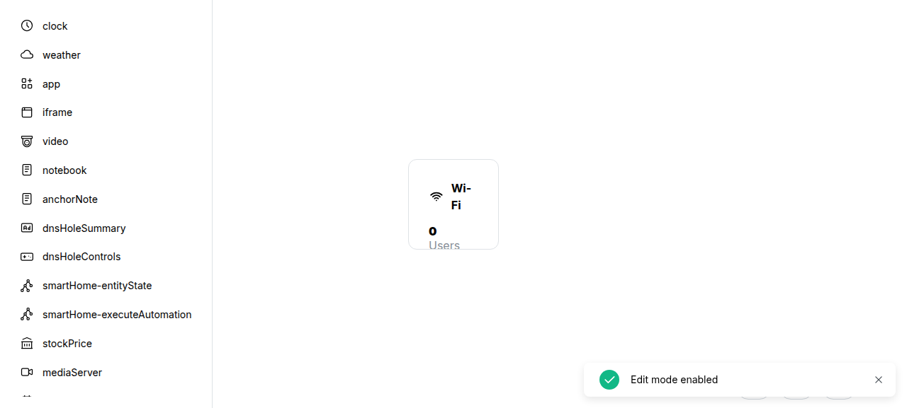 | `./.screenshots/widget_networkControllerStatus_edit_mode.png` |
| **Settings Modal** |  | `./.screenshots/widget_networkControllerStatus_settings_modal.png` |
| **Advanced Settings** |  | `./.screenshots/widget_networkControllerStatus_advanced_settings_modal.png` |
| **Dimensions Modal** |  | `./.screenshots/widget_networkControllerStatus_dimensions_modal.png` |

---

### 23. RSS Feed (`rssFeed`)
*Multi-feed RSS/Atom reader with article poster cards, description clamping, and custom refresh cadences.*

| Surface | Screenshot | Relative Path |
| :--- | :--- | :--- |
| **Default Preview** |  | `./.screenshots/widget_rssFeed_preview.png` |
| **Edit Mode** |  | `./.screenshots/widget_rssFeed_edit_mode.png` |
| **Settings Modal** | 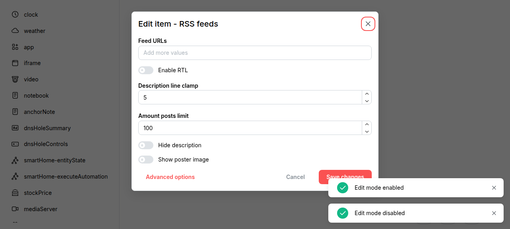 | `./.screenshots/widget_rssFeed_settings_modal.png` |
| **Advanced Settings** |  | `./.screenshots/widget_rssFeed_advanced_settings_modal.png` |
| **Dimensions Modal** |  | `./.screenshots/widget_rssFeed_dimensions_modal.png` |

---

### 24. Bookmarks (`bookmarks`)
*Custom link collections and quick bookmarks grid with favicon resolution and categorization.*

| Surface | Screenshot | Relative Path |
| :--- | :--- | :--- |
| **Default Preview** |  | `./.screenshots/widget_bookmarks_preview.png` |
| **Edit Mode** |  | `./.screenshots/widget_bookmarks_edit_mode.png` |
| **Settings Modal** | 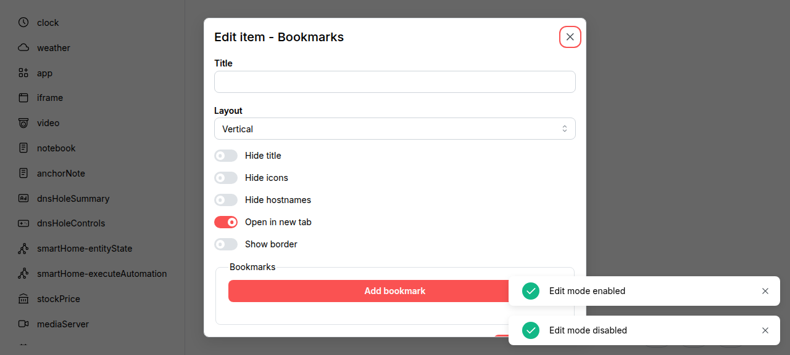 | `./.screenshots/widget_bookmarks_settings_modal.png` |
| **Advanced Settings** | 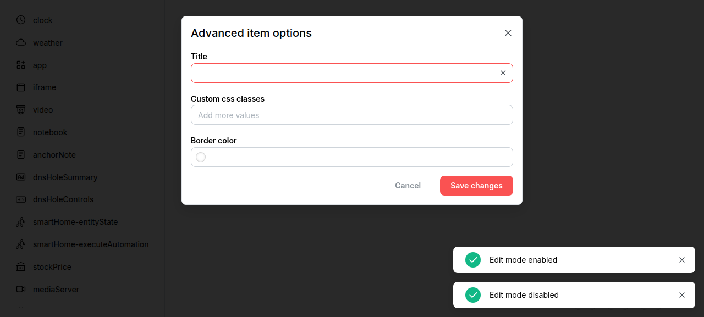 | `./.screenshots/widget_bookmarks_advanced_settings_modal.png` |
| **Dimensions Modal** |  | `./.screenshots/widget_bookmarks_dimensions_modal.png` |

---

### 25. Indexer Manager (`indexerManager`)
*Prowlarr and Jackett indexer health monitor with mass connectivity testing controls.*

| Surface | Screenshot | Relative Path |
| :--- | :--- | :--- |
| **Default Preview** |  | `./.screenshots/widget_indexerManager_preview.png` |
| **Edit Mode** |  | `./.screenshots/widget_indexerManager_edit_mode.png` |
| **Settings Modal** |  | `./.screenshots/widget_indexerManager_settings_modal.png` |
| **Advanced Settings** |  | `./.screenshots/widget_indexerManager_advanced_settings_modal.png` |
| **Dimensions Modal** |  | `./.screenshots/widget_indexerManager_dimensions_modal.png` |

---

### 26. Health Monitoring (`healthMonitoring`)
*Monitors homelab integration health and surfaces downtime notifications and reachability alerts.*

| Surface | Screenshot | Relative Path |
| :--- | :--- | :--- |
| **Default Preview** |  | `./.screenshots/widget_healthMonitoring_preview.png` |
| **Edit Mode** | 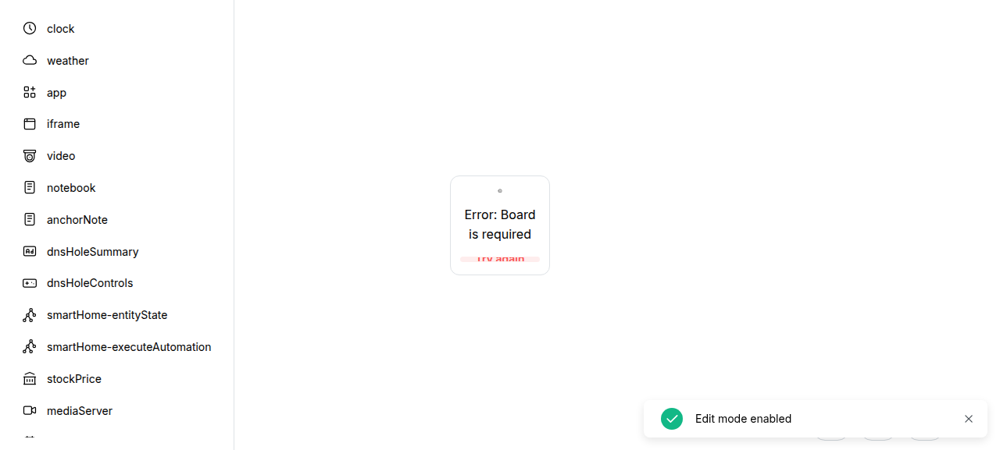 | `./.screenshots/widget_healthMonitoring_edit_mode.png` |
| **Settings Modal** |  | `./.screenshots/widget_healthMonitoring_settings_modal.png` |
| **Advanced Settings** | 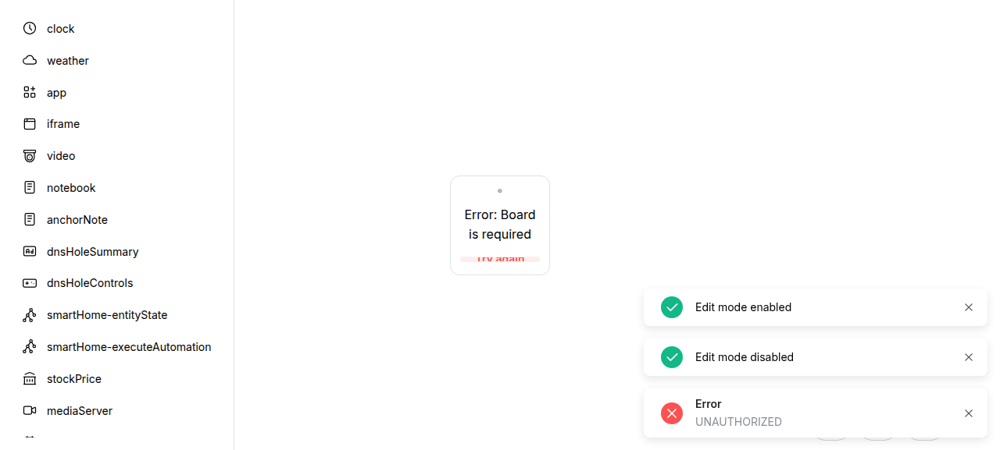 | `./.screenshots/widget_healthMonitoring_advanced_settings_modal.png` |
| **Dimensions Modal** |  | `./.screenshots/widget_healthMonitoring_dimensions_modal.png` |

---

### 27. Software Releases (`releases`)
*GitHub and GitLab repository release tracker notifying when updates are published for starred repos.*

| Surface | Screenshot | Relative Path |
| :--- | :--- | :--- |
| **Default Preview** |  | `./.screenshots/widget_releases_preview.png` |
| **Edit Mode** |  | `./.screenshots/widget_releases_edit_mode.png` |
| **Settings Modal** | 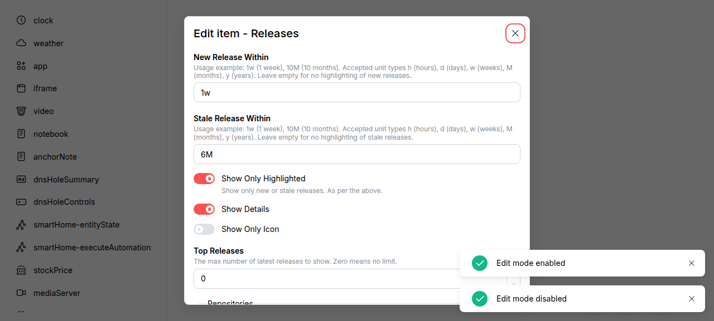 | `./.screenshots/widget_releases_settings_modal.png` |
| **Advanced Settings** |  | `./.screenshots/widget_releases_advanced_settings_modal.png` |
| **Dimensions Modal** |  | `./.screenshots/widget_releases_dimensions_modal.png` |

---

### 28. Media Releases (`mediaReleases`)
*Showcases recently added and incoming movie and TV releases from Sonarr and Radarr.*

| Surface | Screenshot | Relative Path |
| :--- | :--- | :--- |
| **Default Preview** |  | `./.screenshots/widget_mediaReleases_preview.png` |
| **Edit Mode** | 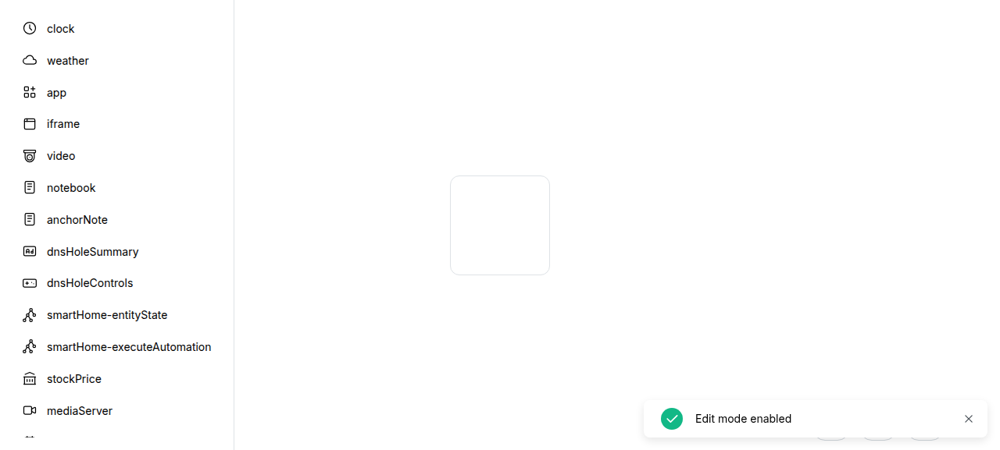 | `./.screenshots/widget_mediaReleases_edit_mode.png` |
| **Settings Modal** |  | `./.screenshots/widget_mediaReleases_settings_modal.png` |
| **Advanced Settings** |  | `./.screenshots/widget_mediaReleases_advanced_settings_modal.png` |
| **Dimensions Modal** |  | `./.screenshots/widget_mediaReleases_dimensions_modal.png` |

---

### 29. Docker Containers (`dockerContainers`)
*Interactive Docker container management widget displaying container state, resource usage, and lifecycle triggers.*

| Surface | Screenshot | Relative Path |
| :--- | :--- | :--- |
| **Default Preview** | 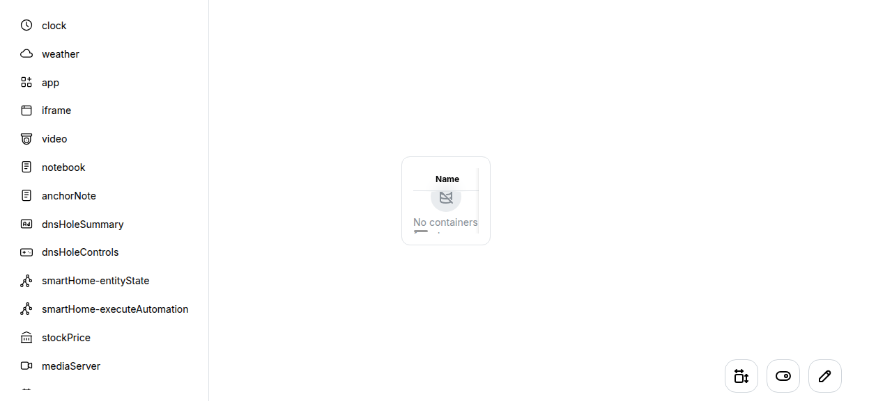 | `./.screenshots/widget_dockerContainers_preview.png` |
| **Edit Mode** | 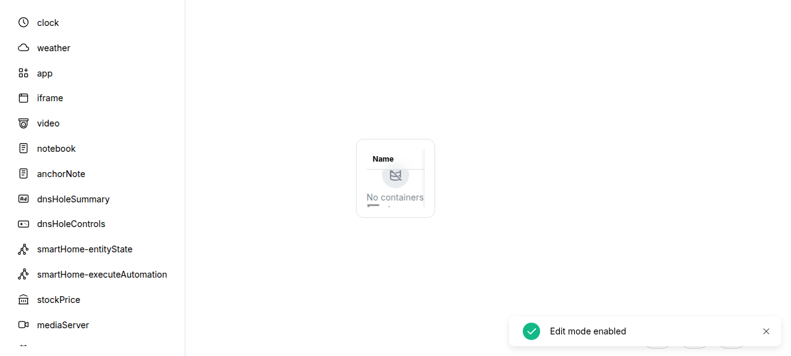 | `./.screenshots/widget_dockerContainers_edit_mode.png` |
| **Settings Modal** | 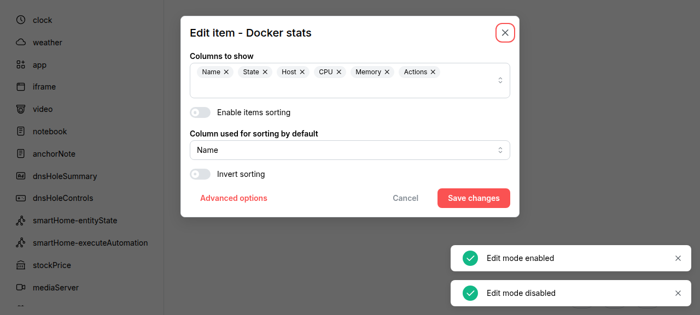 | `./.screenshots/widget_dockerContainers_settings_modal.png` |
| **Advanced Settings** |  | `./.screenshots/widget_dockerContainers_advanced_settings_modal.png` |
| **Dimensions Modal** | 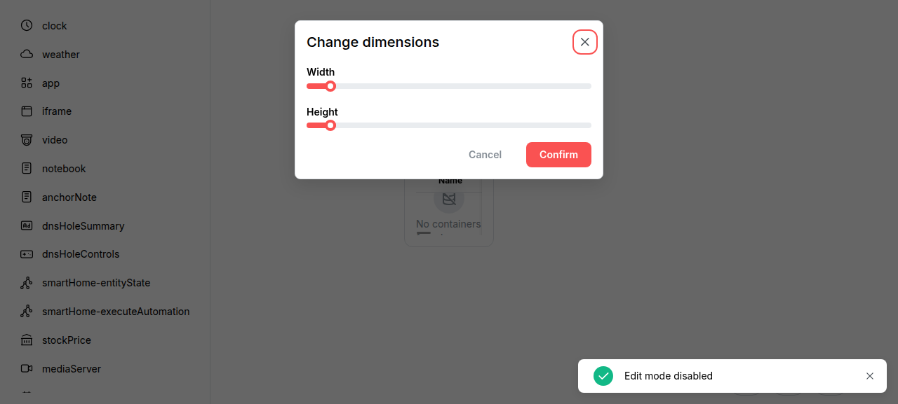 | `./.screenshots/widget_dockerContainers_dimensions_modal.png` |

---

### 30. Firewall (`firewall`)
*OPNsense and pfSense firewall statistics viewer detailing interface bandwidth and security rules.*

| Surface | Screenshot | Relative Path |
| :--- | :--- | :--- |
| **Default Preview** |  | `./.screenshots/widget_firewall_preview.png` |
| **Edit Mode** |  | `./.screenshots/widget_firewall_edit_mode.png` |
| **Settings Modal** |  | `./.screenshots/widget_firewall_settings_modal.png` |
| **Advanced Settings** | 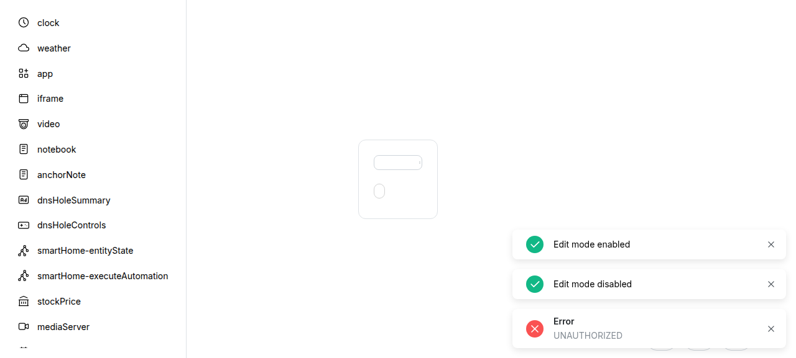 | `./.screenshots/widget_firewall_advanced_settings_modal.png` |
| **Dimensions Modal** |  | `./.screenshots/widget_firewall_dimensions_modal.png` |

---

### 31. Notifications (`notifications`)
*Aggregated alert feed for Homarr board events, integration updates, and system messages.*

| Surface | Screenshot | Relative Path |
| :--- | :--- | :--- |
| **Default Preview** |  | `./.screenshots/widget_notifications_preview.png` |
| **Edit Mode** |  | `./.screenshots/widget_notifications_edit_mode.png` |
| **Settings Modal** |  | `./.screenshots/widget_notifications_settings_modal.png` |
| **Advanced Settings** |  | `./.screenshots/widget_notifications_advanced_settings_modal.png` |
| **Dimensions Modal** | 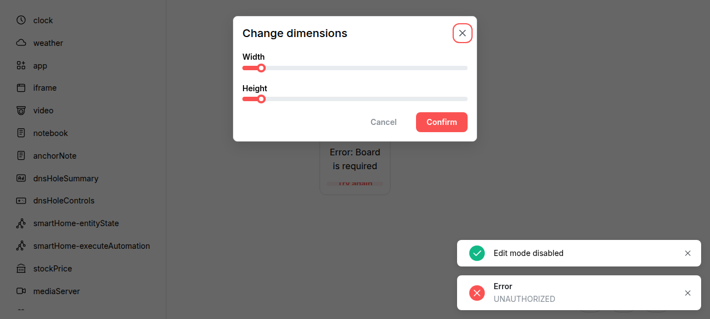 | `./.screenshots/widget_notifications_dimensions_modal.png` |

---

### 32. System Resources (`systemResources`)
*Hardware telemetry charts displaying CPU utilization, RAM consumption, and network throughput.*

| Surface | Screenshot | Relative Path |
| :--- | :--- | :--- |
| **Default Preview** | 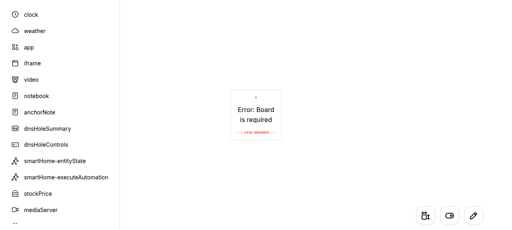 | `./.screenshots/widget_systemResources_preview.png` |
| **Edit Mode** |  | `./.screenshots/widget_systemResources_edit_mode.png` |
| **Settings Modal** |  | `./.screenshots/widget_systemResources_settings_modal.png` |
| **Advanced Settings** |  | `./.screenshots/widget_systemResources_advanced_settings_modal.png` |
| **Dimensions Modal** |  | `./.screenshots/widget_systemResources_dimensions_modal.png` |

---

### 33. Coolify (`coolify`)
*Self-hosted PaaS project monitor displaying application deployment statuses and resource health.*

| Surface | Screenshot | Relative Path |
| :--- | :--- | :--- |
| **Default Preview** | 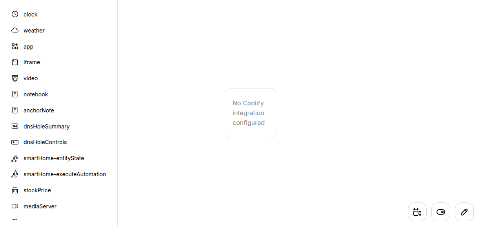 | `./.screenshots/widget_coolify_preview.png` |
| **Edit Mode** | 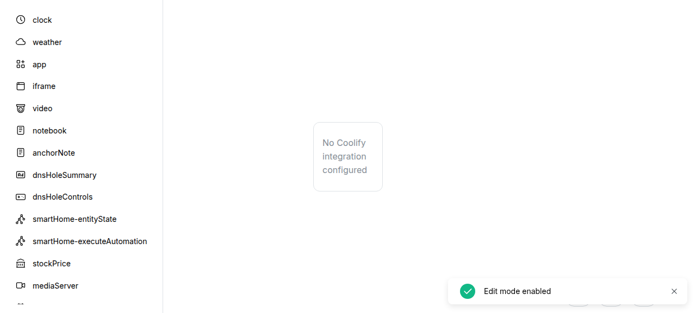 | `./.screenshots/widget_coolify_edit_mode.png` |
| **Settings Modal** |  | `./.screenshots/widget_coolify_settings_modal.png` |
| **Advanced Settings** |  | `./.screenshots/widget_coolify_advanced_settings_modal.png` |
| **Dimensions Modal** | 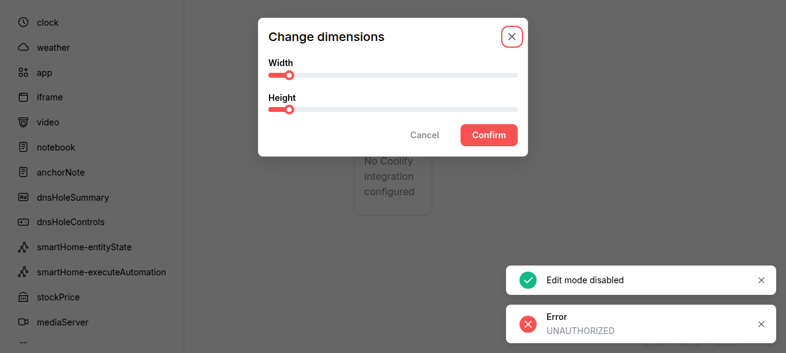 | `./.screenshots/widget_coolify_dimensions_modal.png` |

---

### 34. System Disks (`systemDisks`)
*Storage volume usage breakdown with free vs consumed capacity graphs and filesystem warnings.*

| Surface | Screenshot | Relative Path |
| :--- | :--- | :--- |
| **Default Preview** |  | `./.screenshots/widget_systemDisks_preview.png` |
| **Edit Mode** | 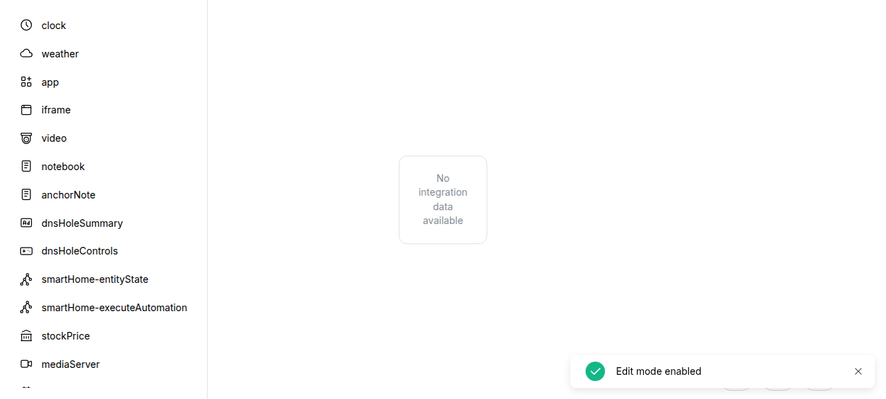 | `./.screenshots/widget_systemDisks_edit_mode.png` |
| **Settings Modal** |  | `./.screenshots/widget_systemDisks_settings_modal.png` |
| **Advanced Settings** |  | `./.screenshots/widget_systemDisks_advanced_settings_modal.png` |
| **Dimensions Modal** |  | `./.screenshots/widget_systemDisks_dimensions_modal.png` |

---

### 35. Timetable (`timetable`)
*Public transportation departure monitor tracking upcoming trains, buses, and transit schedules.*

| Surface | Screenshot | Relative Path |
| :--- | :--- | :--- |
| **Default Preview** | 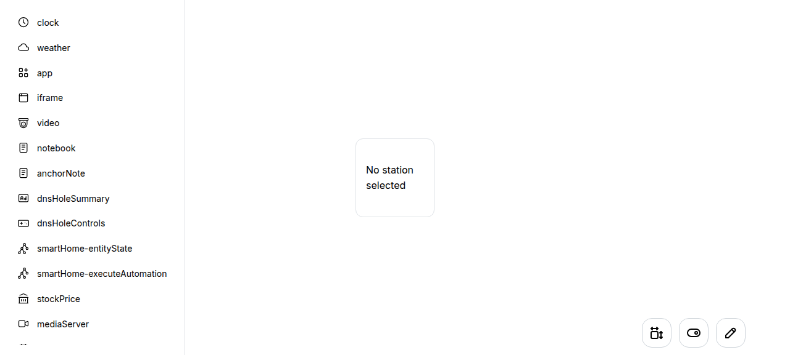 | `./.screenshots/widget_timetable_preview.png` |
| **Edit Mode** |  | `./.screenshots/widget_timetable_edit_mode.png` |
| **Settings Modal** | 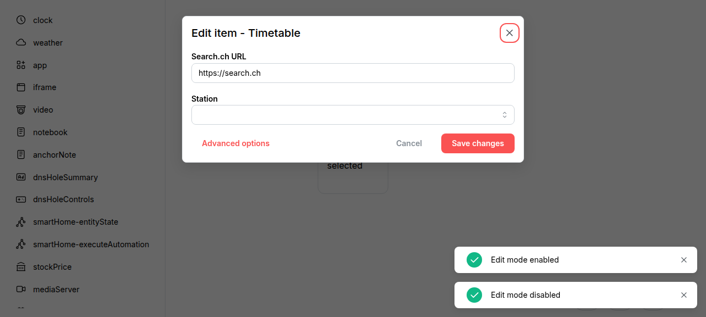 | `./.screenshots/widget_timetable_settings_modal.png` |
| **Advanced Settings** |  | `./.screenshots/widget_timetable_advanced_settings_modal.png` |
| **Dimensions Modal** |  | `./.screenshots/widget_timetable_dimensions_modal.png` |

---

### 36. Immich Server Stats (`immich-serverStats`)
*Immich self-hosted photo library statistics: total photos, videos, storage footprint, and user metrics.*

| Surface | Screenshot | Relative Path |
| :--- | :--- | :--- |
| **Default Preview** |  | `./.screenshots/widget_immich-serverStats_preview.png` |
| **Edit Mode** |  | `./.screenshots/widget_immich-serverStats_edit_mode.png` |
| **Settings Modal** | 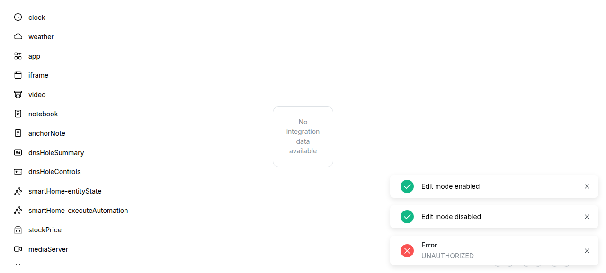 | `./.screenshots/widget_immich-serverStats_settings_modal.png` |
| **Advanced Settings** |  | `./.screenshots/widget_immich-serverStats_advanced_settings_modal.png` |
| **Dimensions Modal** |  | `./.screenshots/widget_immich-serverStats_dimensions_modal.png` |

---

### 37. Immich Album Carousel (`immich-albumCarousel`)
*Dynamic photo slideshow carousel presenting memories and images from Immich albums.*

| Surface | Screenshot | Relative Path |
| :--- | :--- | :--- |
| **Default Preview** |  | `./.screenshots/widget_immich-albumCarousel_preview.png` |
| **Edit Mode** |  | `./.screenshots/widget_immich-albumCarousel_edit_mode.png` |
| **Settings Modal** |  | `./.screenshots/widget_immich-albumCarousel_settings_modal.png` |
| **Advanced Settings** |  | `./.screenshots/widget_immich-albumCarousel_advanced_settings_modal.png` |
| **Dimensions Modal** |  | `./.screenshots/widget_immich-albumCarousel_dimensions_modal.png` |

---

### 38. Paperless-ngx (`paperlessNgx`)
*Document management overview detailing inbox queues, total archived documents, and tag counts.*

| Surface | Screenshot | Relative Path |
| :--- | :--- | :--- |
| **Default Preview** |  | `./.screenshots/widget_paperlessNgx_preview.png` |
| **Edit Mode** |  | `./.screenshots/widget_paperlessNgx_edit_mode.png` |
| **Settings Modal** |  | `./.screenshots/widget_paperlessNgx_settings_modal.png` |
| **Advanced Settings** |  | `./.screenshots/widget_paperlessNgx_advanced_settings_modal.png` |
| **Dimensions Modal** |  | `./.screenshots/widget_paperlessNgx_dimensions_modal.png` |

---

### 39. Patchmon (`patchmon`)
*System patch and security update monitor for homelab servers and Linux packages.*

| Surface | Screenshot | Relative Path |
| :--- | :--- | :--- |
| **Default Preview** |  | `./.screenshots/widget_patchmon_preview.png` |
| **Edit Mode** |  | `./.screenshots/widget_patchmon_edit_mode.png` |
| **Settings Modal** |  | `./.screenshots/widget_patchmon_settings_modal.png` |
| **Advanced Settings** |  | `./.screenshots/widget_patchmon_advanced_settings_modal.png` |
| **Dimensions Modal** |  | `./.screenshots/widget_patchmon_dimensions_modal.png` |

---

### 40. Bazarr (`bazarr`)
*Subtitle downloader monitor detailing missing subtitles, provider health, and completed download stats.*

| Surface | Screenshot | Relative Path |
| :--- | :--- | :--- |
| **Default Preview** |  | `./.screenshots/widget_bazarr_preview.png` |
| **Edit Mode** |  | `./.screenshots/widget_bazarr_edit_mode.png` |
| **Settings Modal** |  | `./.screenshots/widget_bazarr_settings_modal.png` |
| **Advanced Settings** |  | `./.screenshots/widget_bazarr_advanced_settings_modal.png` |
| **Dimensions Modal** |  | `./.screenshots/widget_bazarr_dimensions_modal.png` |

---

### 41. Tracearr (`tracearr`)
*Media streaming quality assurance and stream compliance inspector.*

| Surface | Screenshot | Relative Path |
| :--- | :--- | :--- |
| **Default Preview** |  | `./.screenshots/widget_tracearr_preview.png` |
| **Edit Mode** |  | `./.screenshots/widget_tracearr_edit_mode.png` |
| **Settings Modal** |  | `./.screenshots/widget_tracearr_settings_modal.png` |
| **Advanced Settings** |  | `./.screenshots/widget_tracearr_advanced_settings_modal.png` |
| **Dimensions Modal** |  | `./.screenshots/widget_tracearr_dimensions_modal.png` |

---

### 42. Speedtest Tracker (`speedtestTracker`)
*Internet speed benchmark tracker with historical ping, upload, and download speed analytics.*

| Surface | Screenshot | Relative Path |
| :--- | :--- | :--- |
| **Default Preview** |  | `./.screenshots/widget_speedtestTracker_preview.png` |
| **Edit Mode** |  | `./.screenshots/widget_speedtestTracker_edit_mode.png` |
| **Settings Modal** |  | `./.screenshots/widget_speedtestTracker_settings_modal.png` |
| **Advanced Settings** |  | `./.screenshots/widget_speedtestTracker_advanced_settings_modal.png` |
| **Dimensions Modal** |  | `./.screenshots/widget_speedtestTracker_dimensions_modal.png` |

---

### 43. Uptime Kuma (`uptimeKuma`)
*Real-time uptime monitor and SLA tracker displaying status of all configured HTTP/TCP probes.*

| Surface | Screenshot | Relative Path |
| :--- | :--- | :--- |
| **Default Preview** |  | `./.screenshots/widget_uptimeKuma_preview.png` |
| **Edit Mode** |  | `./.screenshots/widget_uptimeKuma_edit_mode.png` |
| **Settings Modal** |  | `./.screenshots/widget_uptimeKuma_settings_modal.png` |
| **Advanced Settings** |  | `./.screenshots/widget_uptimeKuma_advanced_settings_modal.png` |
| **Dimensions Modal** |  | `./.screenshots/widget_uptimeKuma_dimensions_modal.png` |

---

### 44. Audio Stats (`audioStats`)
*Music and audio server analytics displaying active playback sessions and historical listening habits.*

| Surface | Screenshot | Relative Path |
| :--- | :--- | :--- |
| **Default Preview** |  | `./.screenshots/widget_audioStats_preview.png` |
| **Edit Mode** |  | `./.screenshots/widget_audioStats_edit_mode.png` |
| **Settings Modal** |  | `./.screenshots/widget_audioStats_settings_modal.png` |
| **Advanced Settings** |  | `./.screenshots/widget_audioStats_advanced_settings_modal.png` |
| **Dimensions Modal** |  | `./.screenshots/widget_audioStats_dimensions_modal.png` |

---

### 45. Umami Analytics (`umami`)
*Self-hosted web analytics viewer displaying real-time visitors, page views, and traffic trends.*

| Surface | Screenshot | Relative Path |
| :--- | :--- | :--- |
| **Default Preview** | 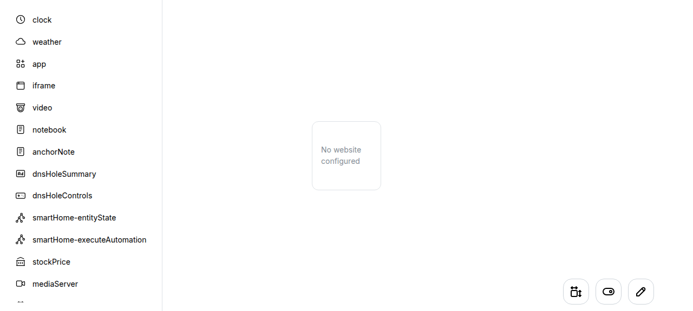 | `./.screenshots/widget_umami_preview.png` |
| **Edit Mode** | 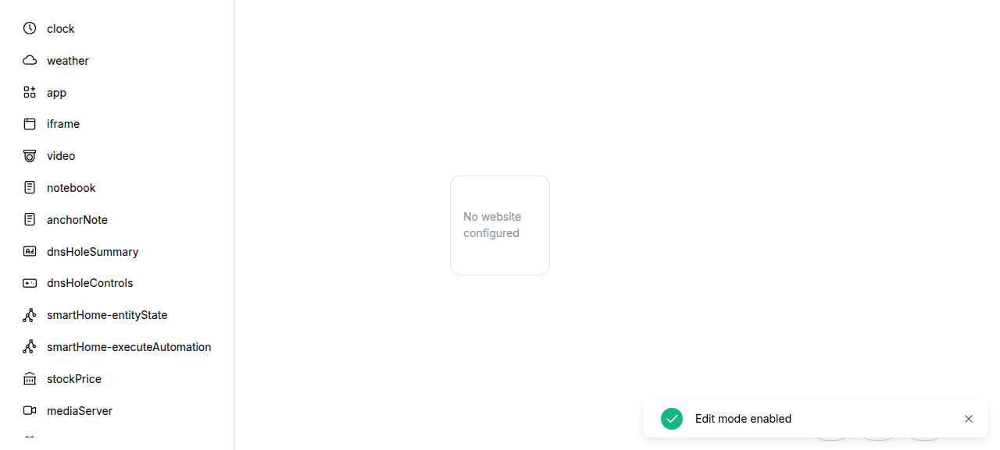 | `./.screenshots/widget_umami_edit_mode.png` |
| **Settings Modal** |  | `./.screenshots/widget_umami_settings_modal.png` |
| **Advanced Settings** |  | `./.screenshots/widget_umami_advanced_settings_modal.png` |
| **Dimensions Modal** |  | `./.screenshots/widget_umami_dimensions_modal.png` |

---

### 46. VPN Status (`vpn`)
*WireGuard / OpenVPN tunnel status monitor tracking active tunnels, client count, and bandwidth usage.*

| Surface | Screenshot | Relative Path |
| :--- | :--- | :--- |
| **Default Preview** |  | `./.screenshots/widget_vpn_preview.png` |
| **Edit Mode** |  | `./.screenshots/widget_vpn_edit_mode.png` |
| **Settings Modal** |  | `./.screenshots/widget_vpn_settings_modal.png` |
| **Advanced Settings** |  | `./.screenshots/widget_vpn_advanced_settings_modal.png` |
| **Dimensions Modal** | 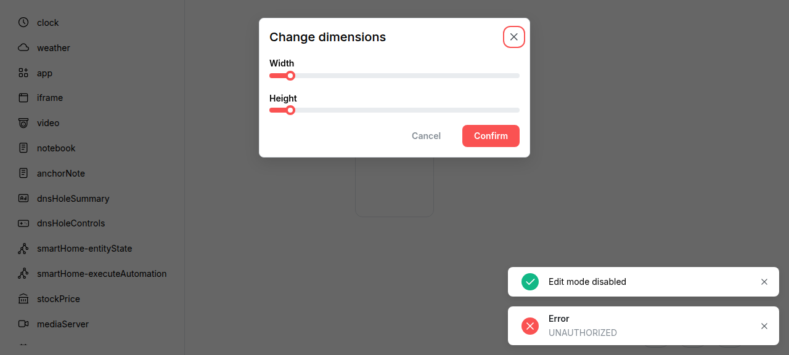 | `./.screenshots/widget_vpn_dimensions_modal.png` |

---

### 47. ArchiveTeam Warrior (`archiveTeamWarrior`)
*Distributed web archiving warrior monitor detailing preserved items, project statistics, and upload bandwidth.*

| Surface | Screenshot | Relative Path |
| :--- | :--- | :--- |
| **Default Preview** |  | `./.screenshots/widget_archiveTeamWarrior_preview.png` |
| **Edit Mode** |  | `./.screenshots/widget_archiveTeamWarrior_edit_mode.png` |
| **Settings Modal** | 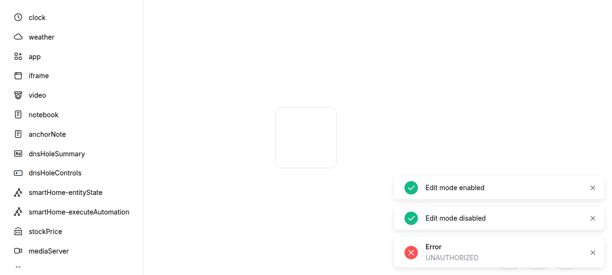 | `./.screenshots/widget_archiveTeamWarrior_settings_modal.png` |
| **Advanced Settings** |  | `./.screenshots/widget_archiveTeamWarrior_advanced_settings_modal.png` |
| **Dimensions Modal** |  | `./.screenshots/widget_archiveTeamWarrior_dimensions_modal.png` |

---

### 48. UPS / Battery Backup (`ups`)
*Network UPS Tools (NUT) monitor displaying battery charge percentage, runtime remaining, load, and voltage.*

| Surface | Screenshot | Relative Path |
| :--- | :--- | :--- |
| **Default Preview** | 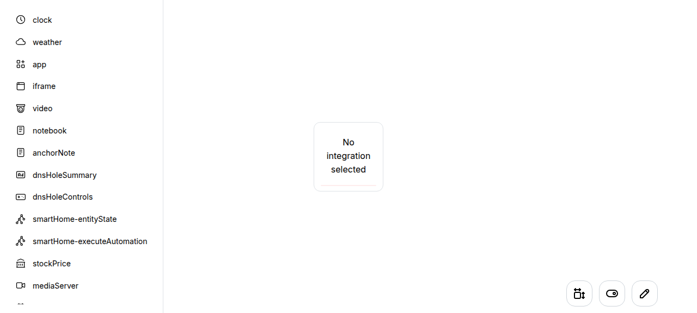 | `./.screenshots/widget_ups_preview.png` |
| **Edit Mode** | 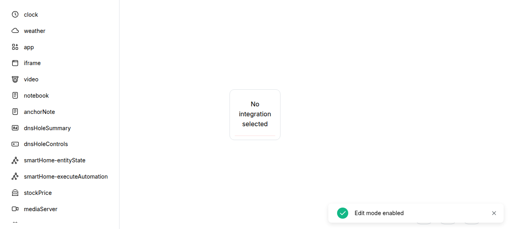 | `./.screenshots/widget_ups_edit_mode.png` |
| **Settings Modal** |  | `./.screenshots/widget_ups_settings_modal.png` |
| **Advanced Settings** |  | `./.screenshots/widget_ups_advanced_settings_modal.png` |
| **Dimensions Modal** |  | `./.screenshots/widget_ups_dimensions_modal.png` |

---

### 49. Beszel System Table (`beszelSystemTable`)
*Beszel multi-system tabular overview detailing CPU, memory, disk, temperature, and uptime metrics across homelab nodes.*

| Surface | Screenshot | Relative Path |
| :--- | :--- | :--- |
| **Default Preview** | 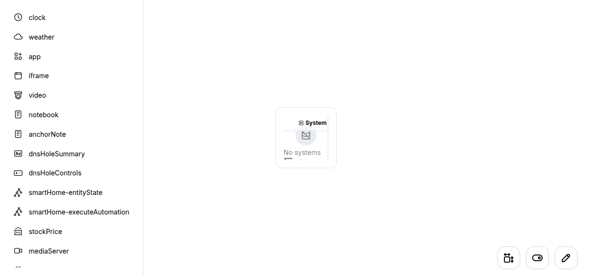 | `./.screenshots/widget_beszelSystemTable_preview.png` |
| **Edit Mode** | 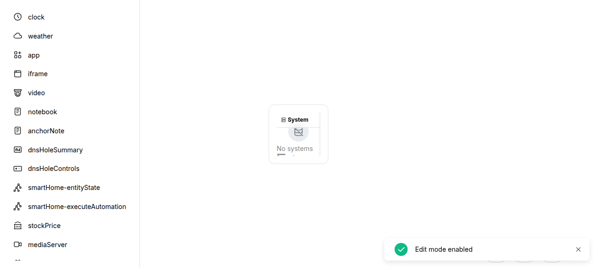 | `./.screenshots/widget_beszelSystemTable_edit_mode.png` |
| **Settings Modal** |  | `./.screenshots/widget_beszelSystemTable_settings_modal.png` |
| **Advanced Settings** | 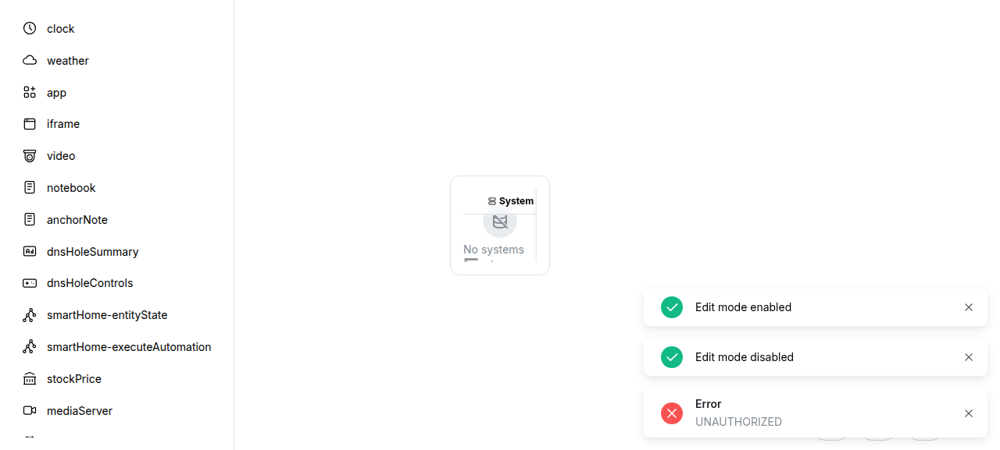 | `./.screenshots/widget_beszelSystemTable_advanced_settings_modal.png` |
| **Dimensions Modal** |  | `./.screenshots/widget_beszelSystemTable_dimensions_modal.png` |

---

### 50. Beszel System Grid (`beszelSystemGrid`)
*Grid card layout of monitored systems showing real-time health sparklines from Beszel agents.*

| Surface | Screenshot | Relative Path |
| :--- | :--- | :--- |
| **Default Preview** |  | `./.screenshots/widget_beszelSystemGrid_preview.png` |
| **Edit Mode** |  | `./.screenshots/widget_beszelSystemGrid_edit_mode.png` |
| **Settings Modal** |  | `./.screenshots/widget_beszelSystemGrid_settings_modal.png` |
| **Advanced Settings** |  | `./.screenshots/widget_beszelSystemGrid_advanced_settings_modal.png` |
| **Dimensions Modal** |  | `./.screenshots/widget_beszelSystemGrid_dimensions_modal.png` |

---

### 51. Beszel Alerts (`beszelAlerts`)
*Active infrastructure alerts and threshold warning notifications from Beszel monitoring.*

| Surface | Screenshot | Relative Path |
| :--- | :--- | :--- |
| **Default Preview** | 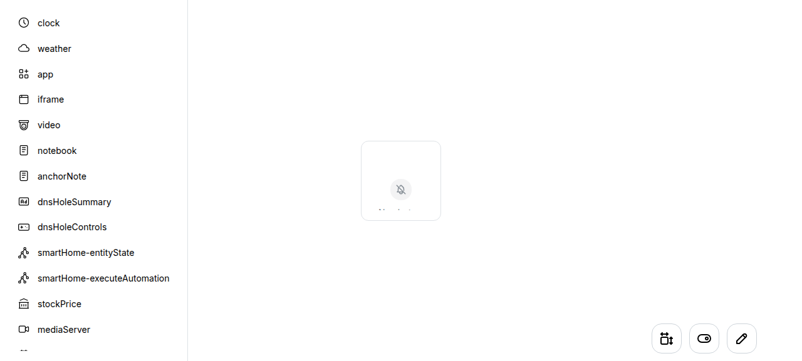 | `./.screenshots/widget_beszelAlerts_preview.png` |
| **Edit Mode** | 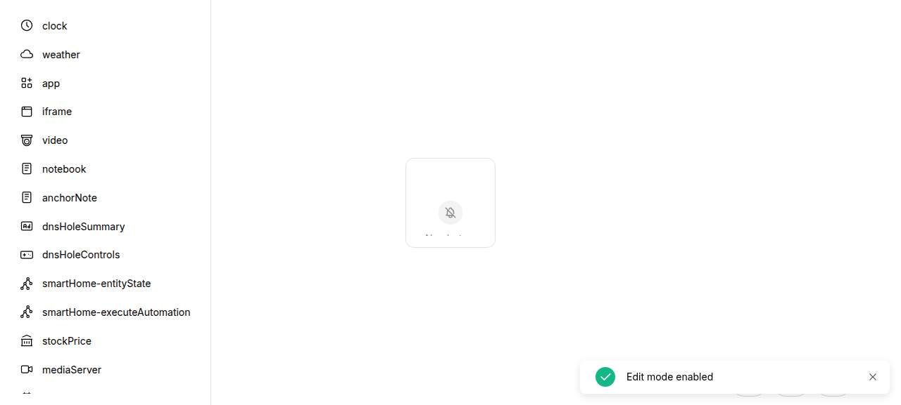 | `./.screenshots/widget_beszelAlerts_edit_mode.png` |
| **Settings Modal** | 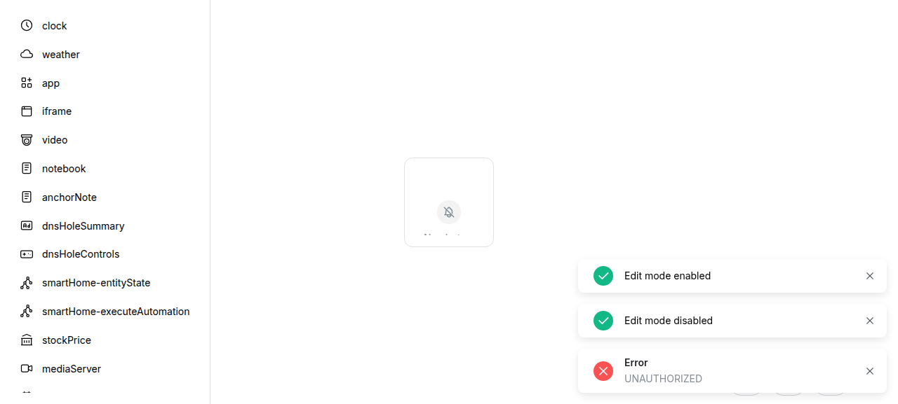 | `./.screenshots/widget_beszelAlerts_settings_modal.png` |
| **Advanced Settings** |  | `./.screenshots/widget_beszelAlerts_advanced_settings_modal.png` |
| **Dimensions Modal** |  | `./.screenshots/widget_beszelAlerts_dimensions_modal.png` |

---

### 52. Beszel System Stats (`beszelSystemStats`)
*Focused system metrics card displaying detailed memory, swap, and disk I/O metrics for a single node.*

| Surface | Screenshot | Relative Path |
| :--- | :--- | :--- |
| **Default Preview** | 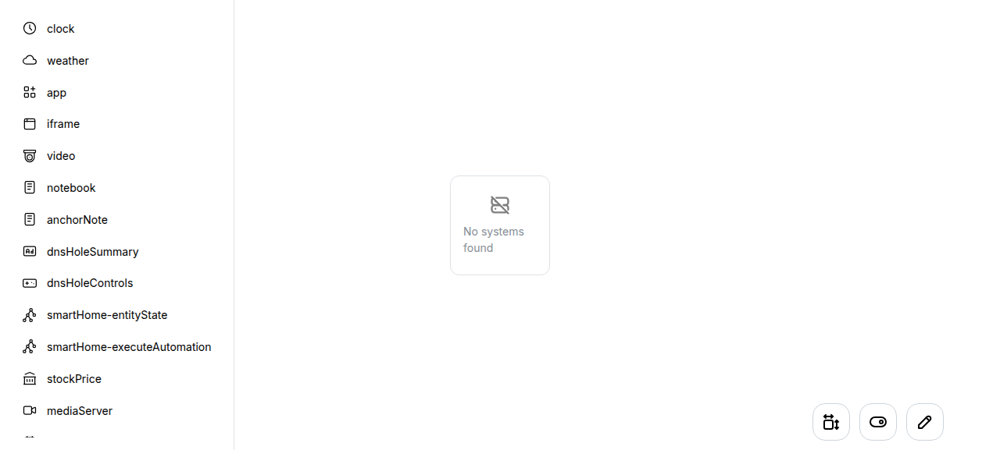 | `./.screenshots/widget_beszelSystemStats_preview.png` |
| **Edit Mode** | 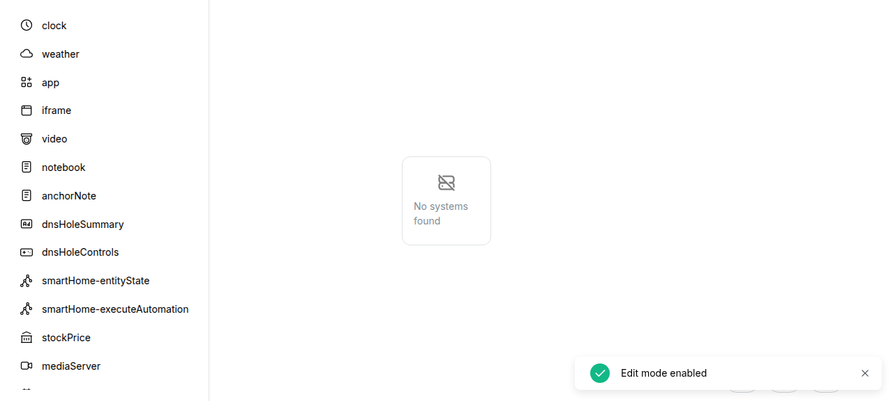 | `./.screenshots/widget_beszelSystemStats_edit_mode.png` |
| **Settings Modal** |  | `./.screenshots/widget_beszelSystemStats_settings_modal.png` |
| **Advanced Settings** |  | `./.screenshots/widget_beszelSystemStats_advanced_settings_modal.png` |
| **Dimensions Modal** |  | `./.screenshots/widget_beszelSystemStats_dimensions_modal.png` |

---

### 53. Traefik (`traefik`)
*Reverse proxy routing overview detailing active HTTP routers, backend services, and middleware.*

| Surface | Screenshot | Relative Path |
| :--- | :--- | :--- |
| **Default Preview** | 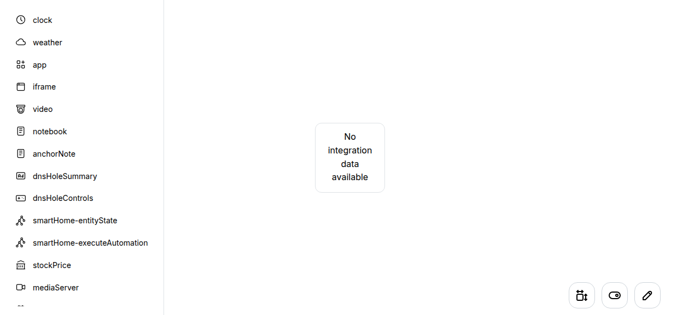 | `./.screenshots/widget_traefik_preview.png` |
| **Edit Mode** | 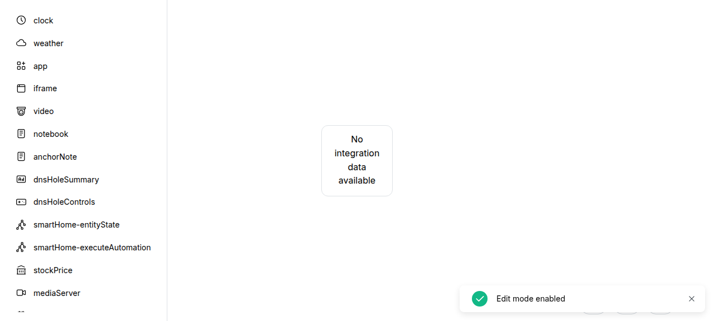 | `./.screenshots/widget_traefik_edit_mode.png` |
| **Settings Modal** |  | `./.screenshots/widget_traefik_settings_modal.png` |
| **Advanced Settings** |  | `./.screenshots/widget_traefik_advanced_settings_modal.png` |
| **Dimensions Modal** |  | `./.screenshots/widget_traefik_dimensions_modal.png` |

---

### 54. Custom API (`customApi`)
*Dynamic API client widget querying custom REST endpoints with configurable JSON path extractors and refresh cadences.*

| Surface | Screenshot | Relative Path |
| :--- | :--- | :--- |
| **Default Preview** | 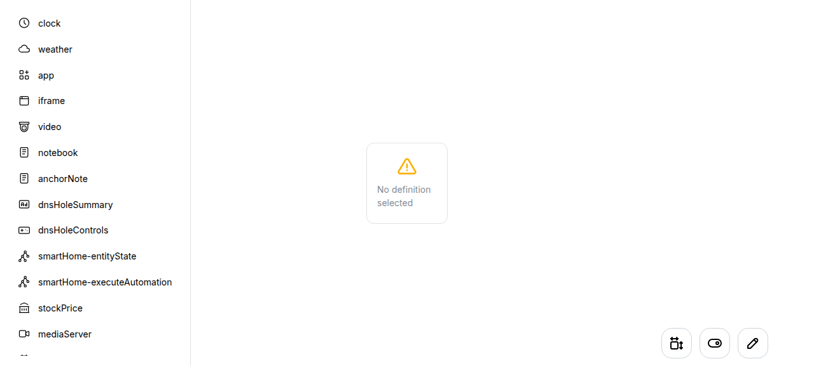 | `./.screenshots/widget_customApi_preview.png` |
| **Edit Mode** | 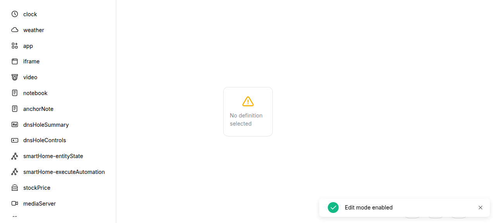 | `./.screenshots/widget_customApi_edit_mode.png` |
| **Settings Modal** | 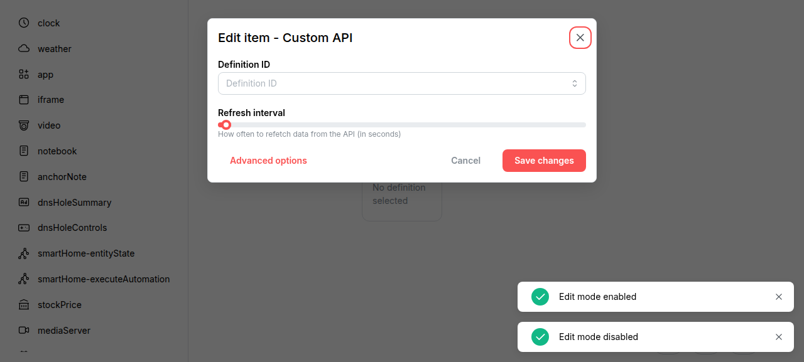 | `./.screenshots/widget_customApi_settings_modal.png` |
| **Advanced Settings** |  | `./.screenshots/widget_customApi_advanced_settings_modal.png` |
| **Dimensions Modal** |  | `./.screenshots/widget_customApi_dimensions_modal.png` |

---

### 55. What's Up Docker / WUD (`wud`)
*Docker image update notification monitor highlighting available upstream tag updates for containers.*

| Surface | Screenshot | Relative Path |
| :--- | :--- | :--- |
| **Default Preview** |  | `./.screenshots/widget_wud_preview.png` |
| **Edit Mode** |  | `./.screenshots/widget_wud_edit_mode.png` |
| **Settings Modal** |  | `./.screenshots/widget_wud_settings_modal.png` |
| **Advanced Settings** |  | `./.screenshots/widget_wud_advanced_settings_modal.png` |
| **Dimensions Modal** |  | `./.screenshots/widget_wud_dimensions_modal.png` |

---
