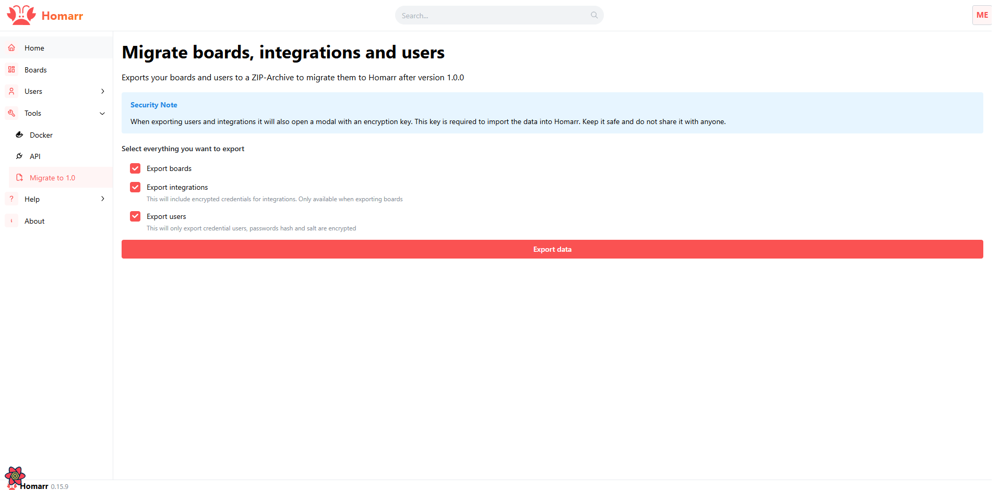

---
authors:
  - meierschlumpf
---

# Migrate from 0.15.10+ to 1.0.0

In this guide, we will show you how to migrate from Homarr 0.15.10+ to 1.0.0.
If you are still on a version before 0.15.10, please update to 0.15.10 where we introduced the migration export page.

<!-- truncate -->

## Export your data

As 1.0 is a complete rewrite of Homarr and therefor not compatible with the old docker mounts, we need to export your data first.
For this you can navigate to the `Migrate to 1.0` page which you can find under `Management` > `Tools` > `Migrate to 1.0`.
Here you can select which things you want to export and download the zip file.
It will also show you a secret key which you will need to import the secret data like user password hashes, salts and integration secrets.

## Create a parallel installation

We highly recommend to create a parallel installation of Homarr 1.0.0.
So if something with for example the import does not quite work, the data in the old installation is still available.
To do this you can follow the appropriate [installation guide](https://homarr.dev/docs/category/installation-1) for your system.
Please note that if you are using docker you need to specify a diffrent external port for the new installation as the old one had the same port.
So in your compose file the ports would be `7576:7575` instead of `7575:7575`.

## Import your data

:::warning Legacy guide

The pre-1.0 ZIP importer described by this historical migration guide is no longer included in current Homarr releases. Keep the old installation and export available while you recreate the required apps and boards in a supported release. SQLite database backups from current Homarr releases can still be restored from the onboarding welcome screen.

:::

## Remove the old installation

After you are happy with the new installation and everything is working as expected you can remove the old installation.
Please make sure to backup the data before you remove the old installation.
Also once the port 7575 is free again you can change the port mapping of the new installation to `7575:7575` if you want to.
