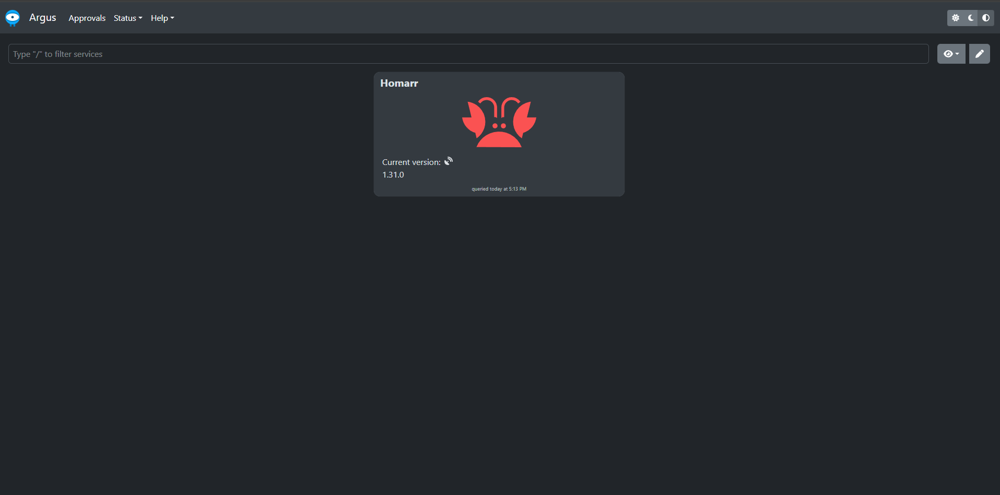
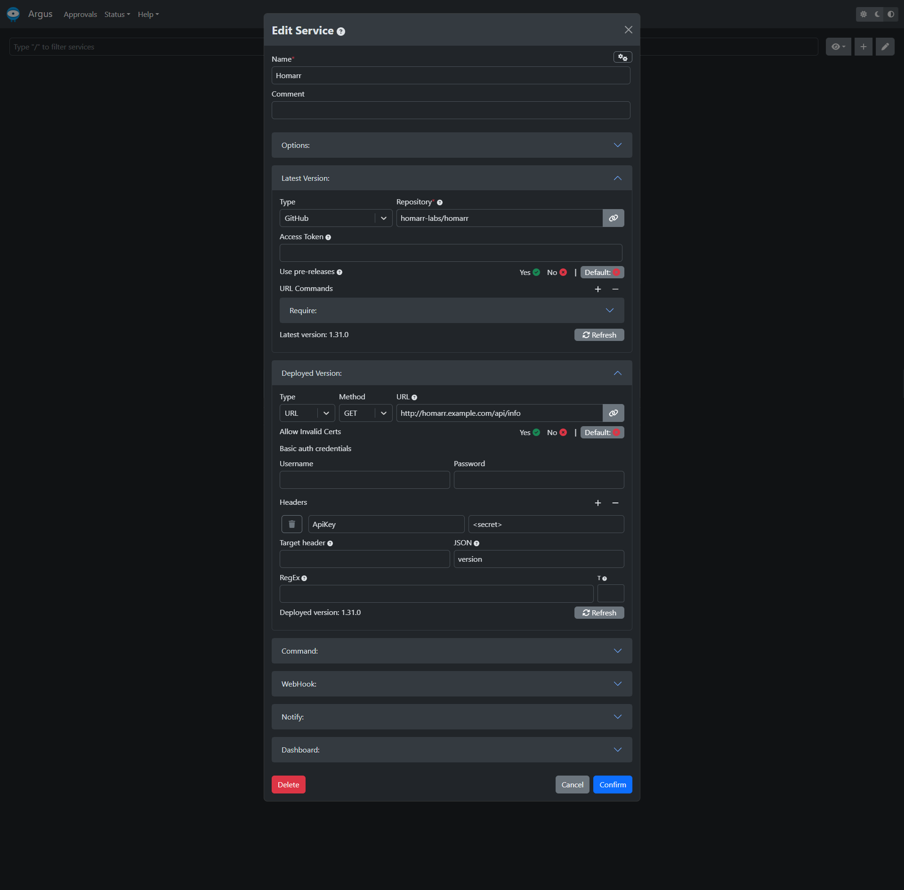

---
authors:
  - meierschlumpf
---

# How to use Argus with Homarr

In `v1.32.0` we added the endpoint `/api/info` which returns the current version of Homarr and can therefore be used in Argus to watch for updates.
This guide will show you how to set up a user with apiKey to access the endpoint without providing admin access through it.

<!-- truncate -->

Currently an apiKey has the same permissions as the user who created it, however you can only create an apiKey with admin permissions.
This means we have to do some extra steps to create a user with only the permissions we need for Argus.

## Create a group

In a first step we have to create a group which will allow us to restrict the permissions of the user we will create later.

1. Go to `Management` > `Users` > `Groups`
2. Click on `Create group`
3. Enter a name for the group, e.g. `Argus`
4. Click on `Create group`
5. Click on the newly created group to edit it
6. In the `Permissions` tab, select the admin permission and save the changes

## Create a user

Now we can create a user which will be used by Argus to access the `/api/info` endpoint.

1. Go to `Management` > `Users` > `Manage`
2. Click on `Create new user`
3. Enter a username, e.g. `argus`, click next
4. Enter a password for the user, click next
5. Add previously created group `Argus` to the user, click next
6. Click on next to confirm the user creation

## Create an apiKey

Now we want to create therefore we have to log in with the user we just created.

1. Log out of Homarr
2. Log in with the user we just created
3. Go to `Management` > `Tools` > `API Keys`
4. Click on `Create API Key`
5. Copy the generated API key and save it somewhere, you will not be able to see it again
6. Logout of Homarr

## Reduce permissions of the user

Now we can reduce the permissions of the user to only allow access to general authenticated, but not permission restricted endpoints.

1. Log in with your admin user
2. Go to `Management` > `Users` > `Groups`
3. Click on the `Argus` group
4. In the `Permissions` tab, remove all permissions
5. Save the changes

## Configure Argus

Now you can configure Argus to use the user and apiKey we created.

Replace the `<secret>` with the apiKey you created and the deployed version url with the url of your Homarr instance.