Homarr 2.0 is an upgrade, not a different app. Your boards, apps, services, and quick status checks are still the point.

It is, however, our biggest upgrade so far. We reworked board editing, added Assistant and MCP tools, rebuilt Custom Widgets, improved setup and Docker discovery, and cleaned up a lot of work behind the scenes.

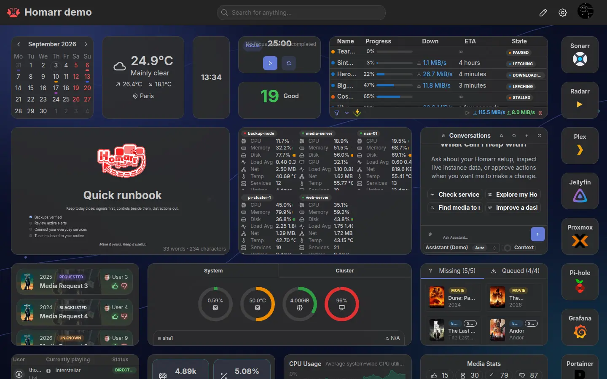

## The short version

- Boards are easier to edit on desktop and mobile.
- The Assistant and MCP can use Homarr tools without bypassing permissions.
- Custom Widgets can load data, run actions, and be shared through Workshop.
- Setup, sign-in, Docker discovery, permissions, and branding received large updates.
- Widgets show more detail when you ask for it, while normal tiles stay compact.
- Homarr avoids more duplicate requests and loads heavy screens only when needed.

<!-- truncate -->

:::warning Back up before upgrading

Create a [Homarr backup](/docs/management/backup) and keep a separate copy of your application data. Do not test a prerelease image on the only copy of your production volume. Backups are boring. Restores are worse.

Check the final release notes for the correct image tag and any last migration notes.

:::

## Find things faster

Press <kbd>Cmd</kbd>/<kbd>Ctrl</kbd> + <kbd>K</kbd> to search apps, integrations, boards, pages, settings, people, groups, and commands. It can also search through configured Assistant, media, and web providers. Homarr results come first, and create actions only appear when you have permission to use them.

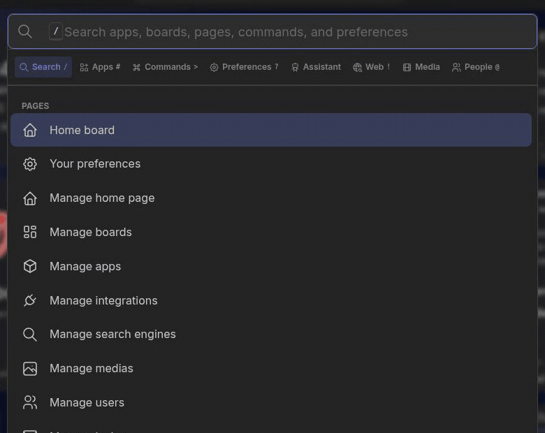

The [keyboard shortcuts guide](/docs/advanced/keyboard-shortcuts) lists the other shortcuts.

## Assistant and MCP

The Assistant is available from a board, the command menu, and the user menu. It can inspect Homarr data, explain what it finds, and suggest or run actions. Sensitive changes still ask for approval, and every tool follows the signed-in user's permissions.

You can choose a provider and model, store credentials encrypted, attach files, mention items, read Markdown answers, check sources and usage, and keep private conversation history. Workshop also offers a community-funded provider with daily quotas if you do not want to configure another provider.

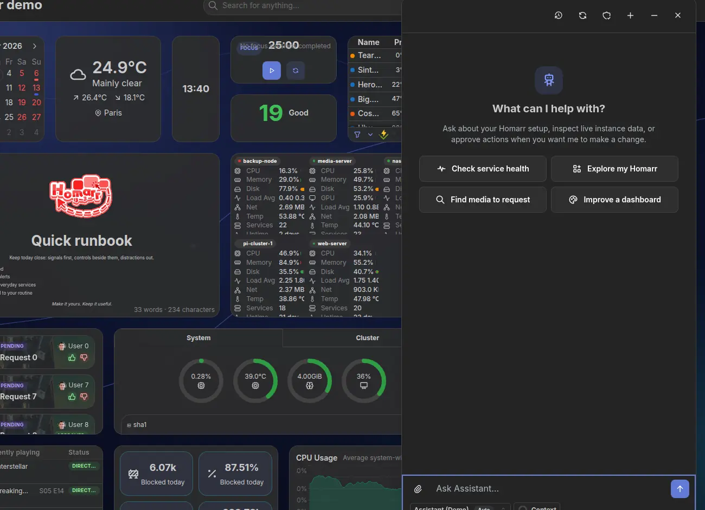

MCP clients can use the same Homarr tools. In the current release branch, the reviewed list has 124 tools: 73 queries, 37 regular changes, and 14 sensitive changes. The management page includes the endpoint, API-key and OAuth help, client configuration, a connection check, and the tool list.

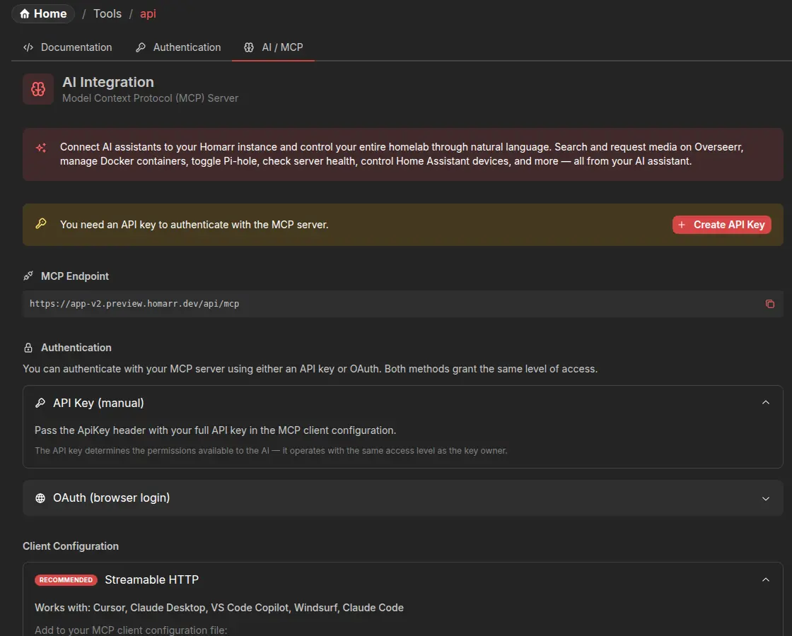

This is not a secret admin shortcut. Authentication, permissions, endpoint limits, and confirmations still apply. Read [Assistant setup](/docs/management/assistant) and the [MCP guide](/docs/management/mcp) before connecting a client.

## Board editing was rebuilt

Dragging and resizing now use a preview before Homarr saves the change. If an item cannot fit, the move rolls back instead of playing dashboard Tetris with the rest of your layout. The same system works on the main grid, inside containers, and in desktop rails. Pointer, touch, and keyboard input are supported.

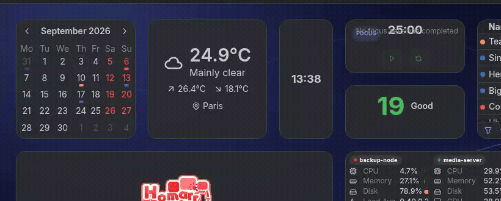

### Move several items together

Hold <kbd>Ctrl</kbd> on Windows or Linux, or <kbd>Command</kbd> on macOS, while selecting apps and widgets. You can copy, paste, delete, or move the group. A batch move is saved only when every selected item fits.

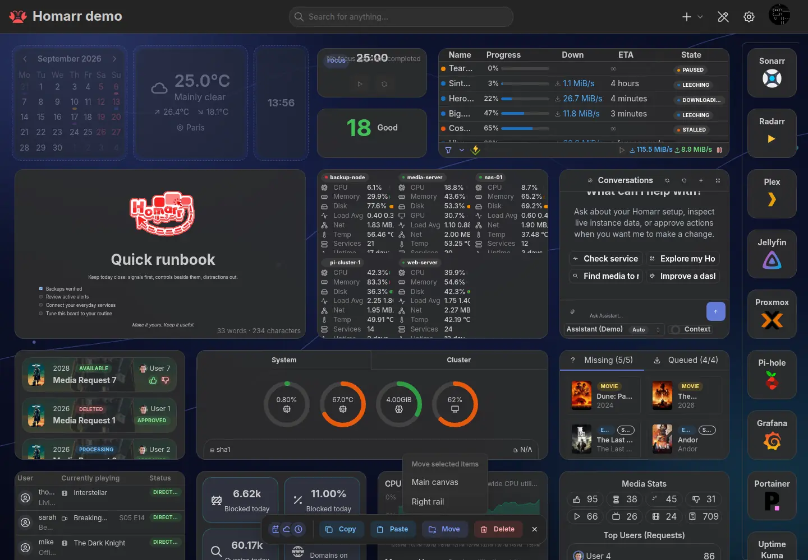

### One board on every screen

Each board has protected Base and Mobile layouts, plus optional layouts between them. They belong to the same board; Homarr does not create a second mobile board that slowly goes out of date.

Use **Reset from Base** for a useful mobile starting point, then adjust it if needed. Left and right rails are available on desktop. On mobile, their items move into the main flow. One board, less drift, fewer surprises.

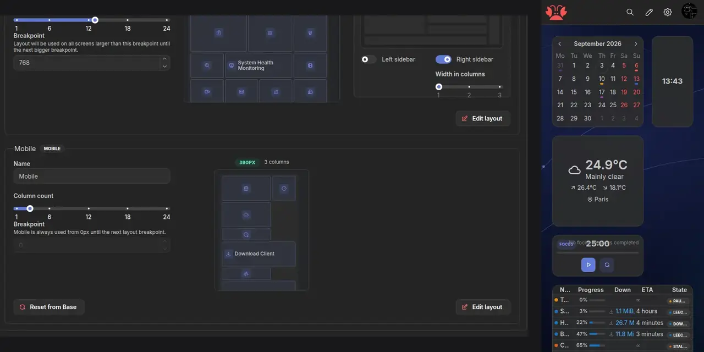

### A better board switcher and header

The board switcher is now a searchable gallery with keyboard navigation. Open it from the header or press <kbd>Shift</kbd> + <kbd>C</kbd>.

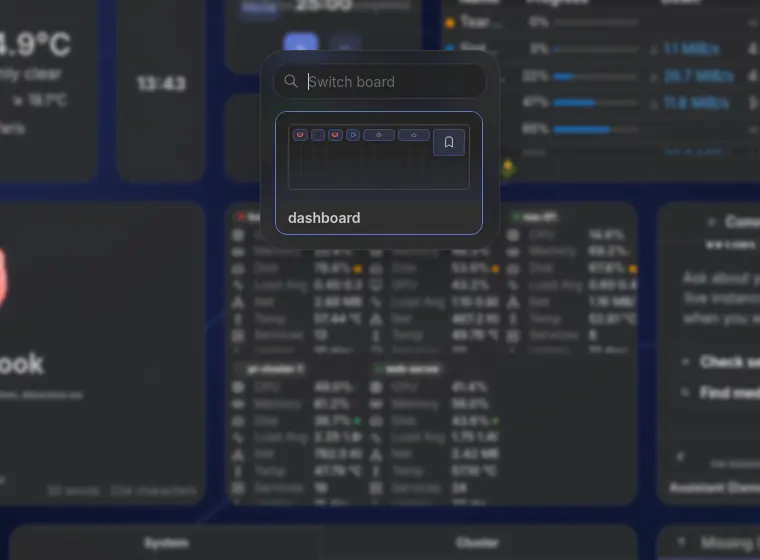

In the Header studio, you can choose built-in controls and arrange them in left, centre, and right areas. This includes the logo, search, Home, board switcher, Assistant, Docker, editing, settings, theme, and account controls. A recovery control stays available if the usual header is hidden.

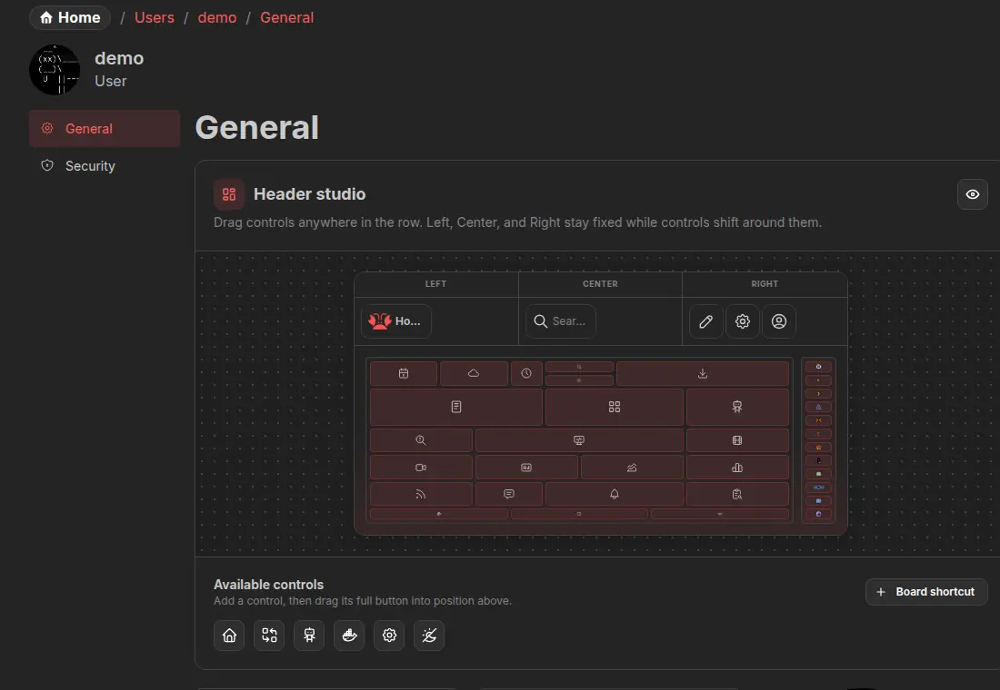

The [board guide](/docs/management/boards) explains layouts, rails, containers, and editing in more detail.

## Custom Widgets v2

Custom Widgets are still part of Homarr, but their editor and runtime received a full rework. The workbench puts general settings, API sources, requests, options, JSX, and preview in one place. You decide when to generate a preview and can check compact, standard, and wide sizes in Live, Loading, Empty, and Error states.

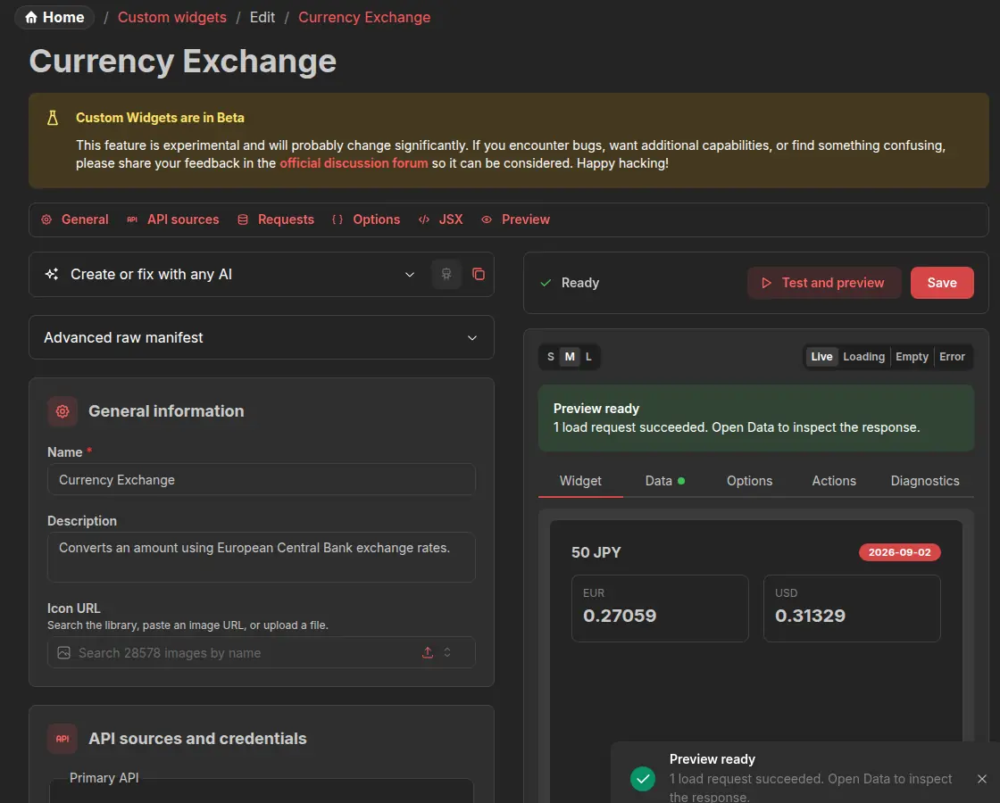

A widget can use several fixed-origin API sources and encrypted credentials. Load requests can be cached or refreshed. Actions support GET, POST, PUT, PATCH, and DELETE, and can run from an `ActionButton` or `ToggleSwitch`. They can ask for confirmation, show feedback, undo a failed toggle, and refresh related data after success.

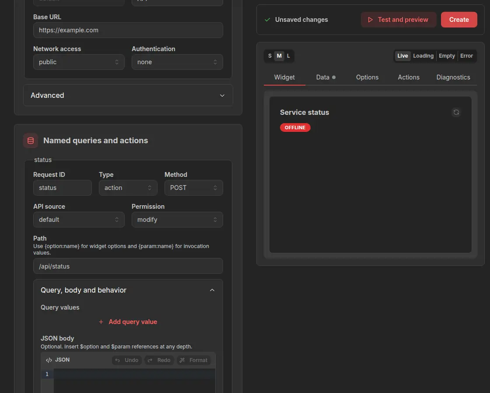

There are 15 built-in option controls, from text and numbers to selects, dates, colours, icons, URLs, durations, time zones, and JSON. Option values can be used in paths, queries, and request bodies.

Network rules, redirect checks, request limits, timeouts, response limits, permissions, rate limits, and confirmations keep widgets inside clear boundaries. Custom Widgets are still marked **Beta** in 2.0, so please read an imported definition before installing it. Sensible advice for any code copied from the internet, really.

Workshop is where you can browse, install, update, publish, rate, report, and share Custom Widgets and CSS.

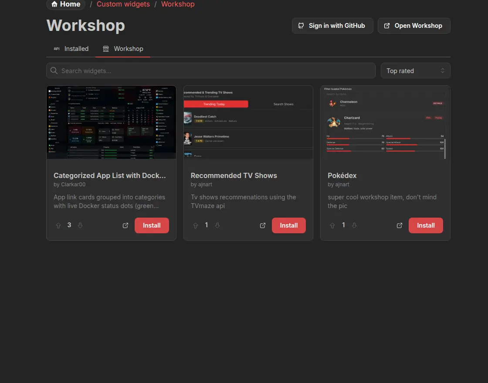

Start with the [Custom Widgets guide](/docs/management/custom-widgets). The [requests and security page](/docs/management/custom-widgets/requests-and-security) covers actions and credentials.

## More detail when you need it

Forty widgets in the current release branch support an advanced view. Open it by Shift-hover, keyboard, or the context menu, then preview it or pin it. The rest of the board becomes inactive while you work in the larger view.

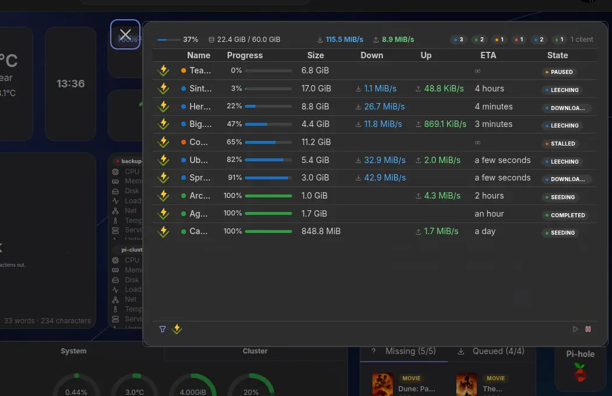

Compact tiles remain the default, and ten widgets explicitly do not use advanced mode. The larger view is useful for downloads, calendars, weather, media, Docker, system resources, monitoring, and smart-home controls—but it is not forced everywhere.

Widget settings also use one workspace with live preview, grouped options, and app or integration editing. Weather and Clock were redesigned. Air Quality, Countdown, and Timer were added. Media, Calendar, Beszel, Docker, System Resources, Bookmarks, and many other widgets received smaller layout and readability fixes.

## Setup and sign-in

The setup flow is now one responsive studio with six stages: Essentials, Discover, Connect, Board, Extend, and Review. It can find reachable Docker-compatible services, prepare apps and integrations for review, and create the first board as one transaction.

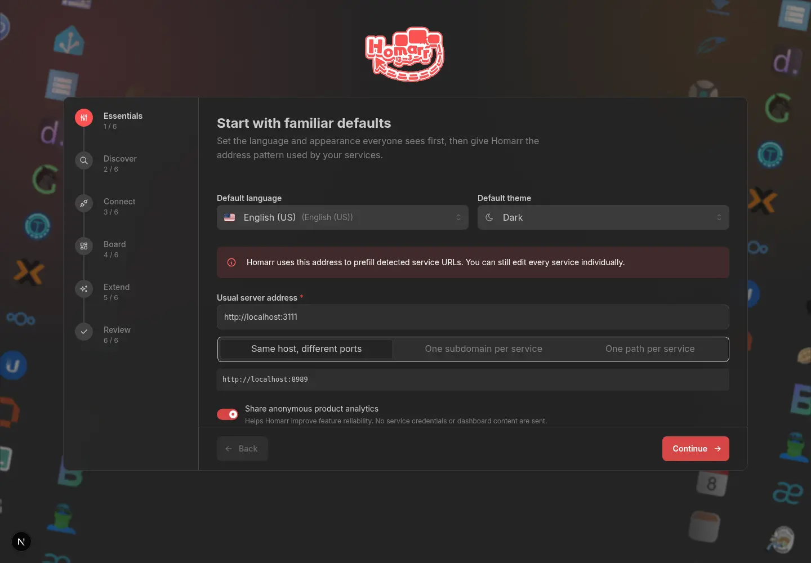

The login pages use the same instance style. Your name, logo, background, overlay, greeting, colours, corner style, and visibility choices can carry over from setup.

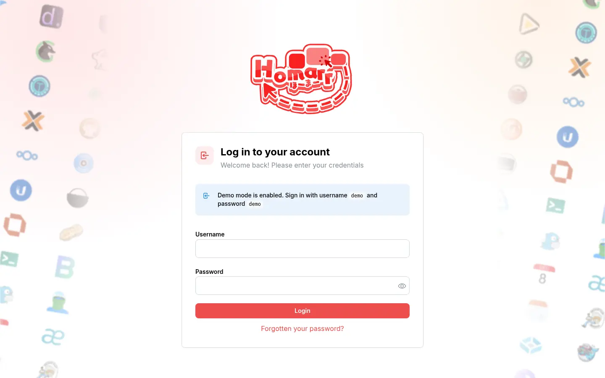

LDAP can create a matching Homarr user after the first successful sign-in. OIDC can store accounts through its configured adapter, link a verified email to an existing credentials account when enabled, and sync external group membership into existing Homarr groups. Exact behaviour still depends on the provider.

## Docker and Podman

Homarr can work with several Docker or Podman endpoints. If one host is offline, useful results from the others can still be shown.

Assisted setup scans the inventory, finds services that may match an integration, suggests app entries, and builds likely URLs from the server pattern you choose.

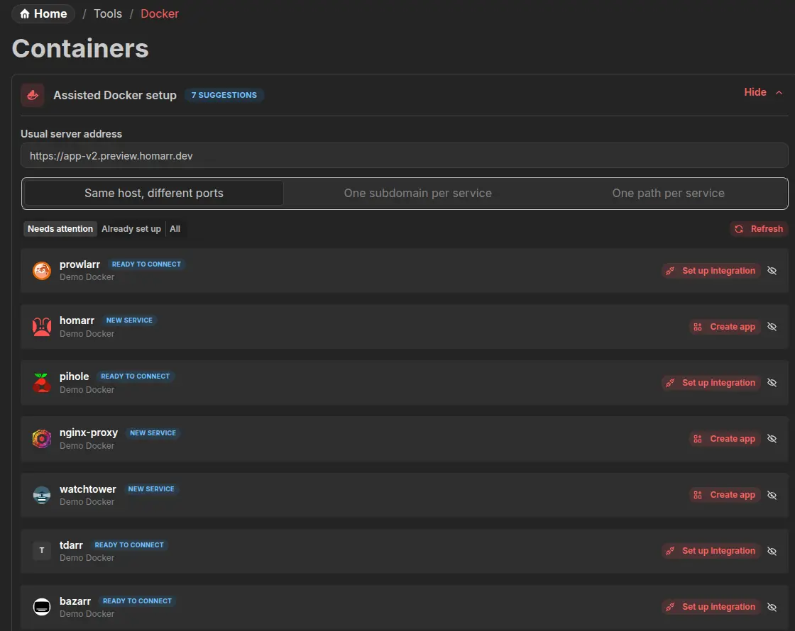

The `homarr.*` labels can describe names, URLs, groups, icons, descriptions, ping targets, IDs, destination boards, integrations, and widgets. When `homarr.name` is missing, Homarr can use selected `homepage.*` labels as a fallback. The exact fields are in the [Docker label guide](/docs/integrations/docker-labels).

Adding content also takes fewer trips through management pages. The board menu can create a widget, app, integration, or container. Compatible integrations appear in the same flow, apps have Quick Add, and Workshop sits beside Custom Widgets.

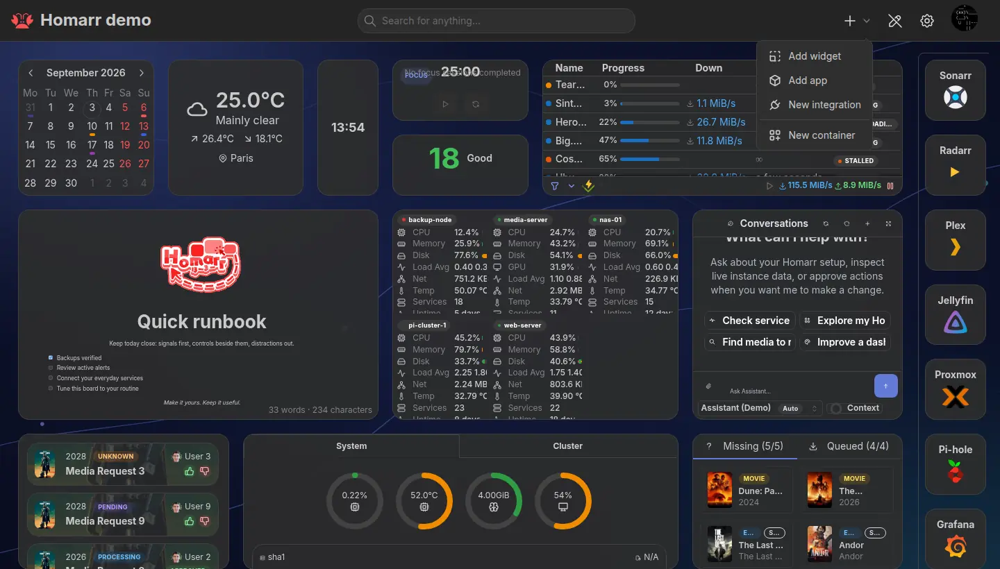

Small destructive actions may use a second click for confirmation. Escape, blur, an outside click, or a timeout cancels it. Riskier actions still use a full dialog. Nobody wants to delete a board because their mouse sneezed.

## Clearer permissions

Group permissions now use a matrix with Viewer, Editor, and Admin presets. Access levels and create permissions are separate, inherited permissions can be previewed, and repeated results are removed.

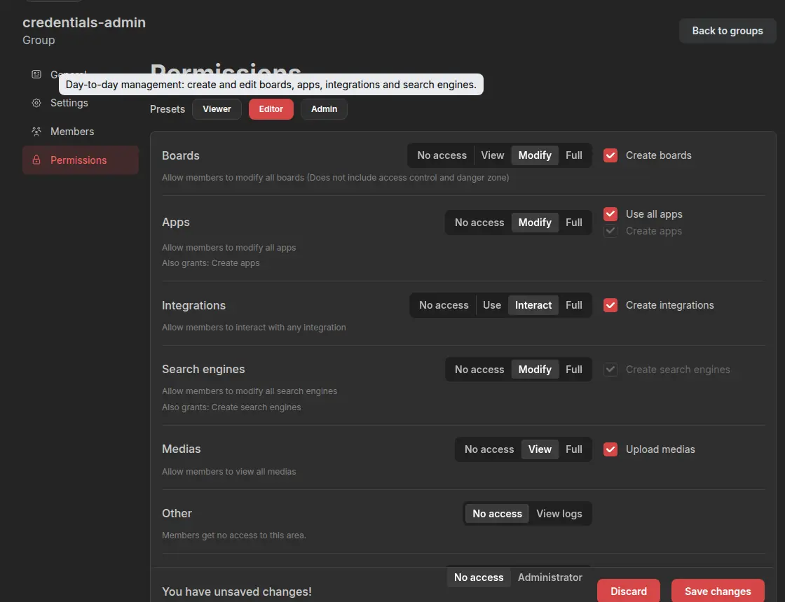

App, integration, and home-stat data are filtered on the server. Management navigation follows the same permission model used by the API and Assistant tools. This makes it easier to understand why a person can—or cannot—see or change something.

## Branding and CSS

Instance branding covers the application name, logo, favicon, main colours, board accent behaviour, and five corner styles from Tight to Soft.

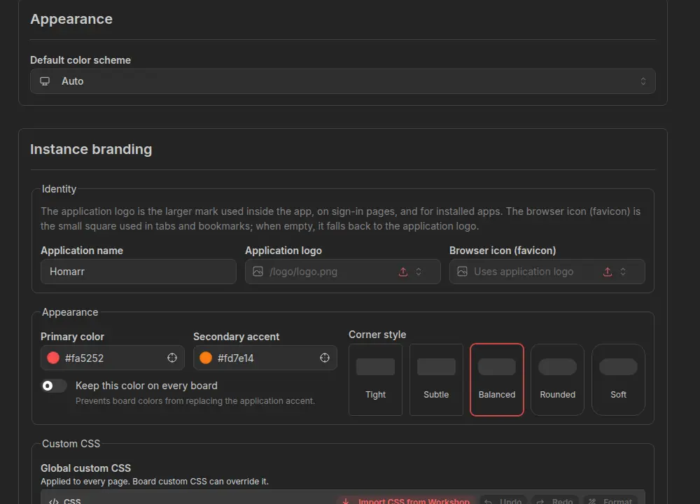

Authentication pages add a greeting, background image, overlay strength, and controls for showing the name, logo, and greeting. Global CSS applies across the instance. Board CSS is more specific and takes priority later in the cascade.

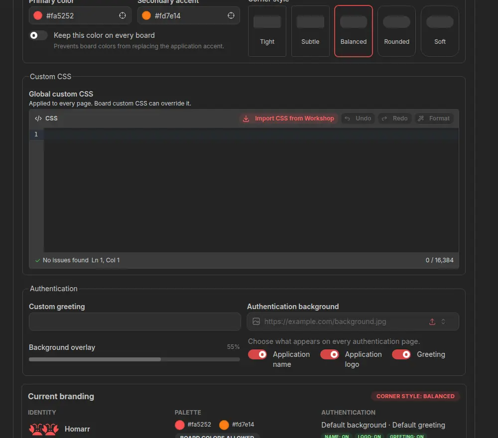

Global CSS is powerful, yes. A security boundary, no. Only trusted administrators should control it. See the [styling guide](/docs/advanced/styling) and [instance settings](/docs/management/settings) for details.

## Less repeated work

Several v2 changes are about doing less work, not showing another button:

- independent board, session, layout, and widget work can start together;
- identical integration requests can share one request already in progress;
- a small in-process cache avoids immediate repeats, with optional Redis coordination across processes;
- useful cached data can stay visible during a short upstream failure;
- some public widget data can survive a page reload while it refreshes;
- Spotlight, editors, media, and other heavy screens load only when opened;
- drag previews and Custom Widget analysis update without refreshing the whole page.

:::note About the “30%” memory result

An early test used a restored backup with four browser tabs. Memory went from 366.5 MiB to 258.2 MiB, about 30% lower. Other phases measured between 22% and 52% lower, but CPU use was 18% higher in the same test.

That was one exploratory workload, not a benchmark of the final release. Only a smaller, safer part of that work remains in the current v2 branch, and it does not prove faster page loads. We also found no repeatable test behind the claim that Custom Widgets use 80% less memory, so we are not making that claim.

:::

The goal is plain: fewer duplicate requests, less unused work, and fewer parts waiting on each other.

## Before you upgrade

- **Make a backup.** Keep a Homarr backup and a separate copy of the data volume.
- **Custom JSX v1 is not silently removed.** Old definitions enter a migration state, keep their encrypted credentials and an archived copy, and are replaced only after the v2 definition passes validation.
- **Mobile rails are folded into the main layout.** They are not shown as rails on narrow screens.
- **Advanced widget views are optional.** Compact tiles stay the normal view.
- **Assistant and MCP follow permissions.** They do not bypass user, API-key, integration, or Docker endpoint access.
- **Use the final release notes.** This draft describes the current `release/v2` branch. Check the final tag, image, and migration notes before using it in production.

## Have a look

- Try the [Homarr 2.0 preview](https://app-v2.preview.homarr.dev).
- Follow the [v2 release pull request](https://github.com/homarr-labs/homarr/pull/6545) and [public beta thread](https://github.com/homarr-labs/homarr/issues/6600).
- Compare [v1.76.2 with the release/v2 branch](https://github.com/homarr-labs/homarr/compare/v1.76.2...release/v2).
- Read the guides for [boards](/docs/management/boards), [Custom Widgets](/docs/management/custom-widgets), [Assistant](/docs/management/assistant), [MCP](/docs/management/mcp), and [Docker labels](/docs/integrations/docker-labels).

That is Homarr 2.0: the Homarr you already use, with a lot of its rough edges removed and many parts pushed further. Bigger upgrade. Same home.

{/* Editorial release gate: set draft to false, update the dated path if needed, replace the branch comparison with the v2.0.0 tag, and verify the production image and migration notes before publishing. */}
