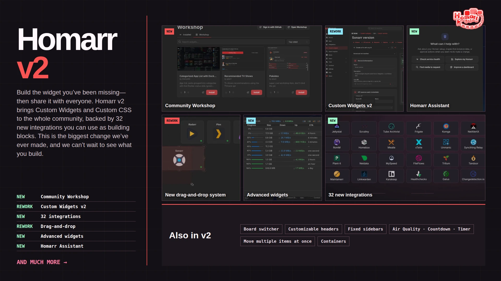
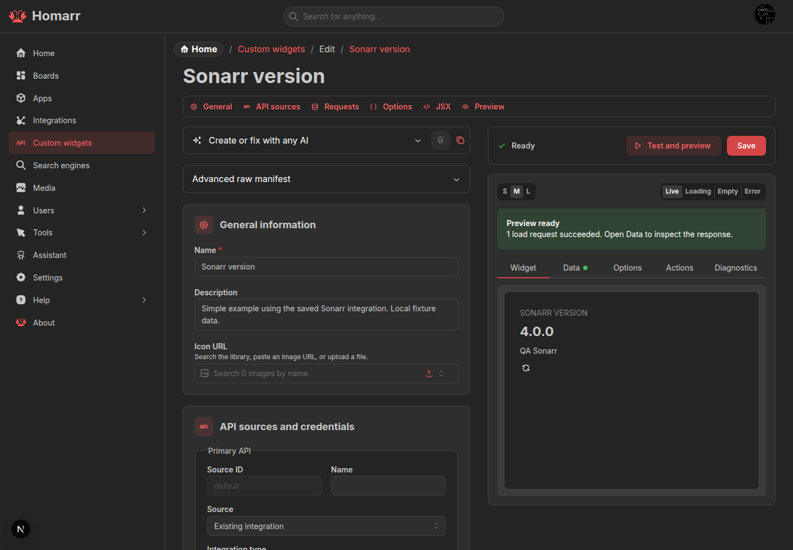
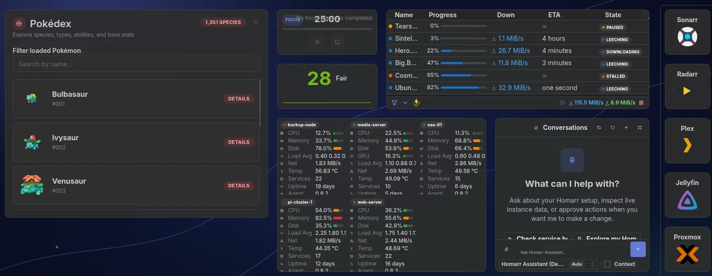
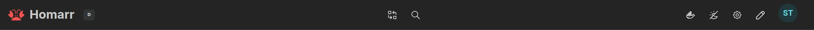
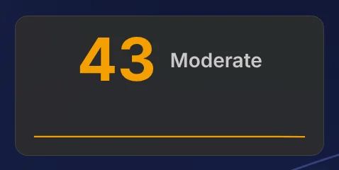
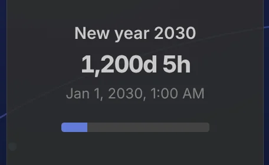

---
authors:
  - ajnart
tags: [homarr, update, version, assistant, custom widgets, dashboards, docker]
description: Homarr 2.0 introduces Custom Widgets and Workshop, rebuilt board editing, Assistant tooling, responsive layouts, onboarding, and more.
image: ./img/homarr-v2-recap.webp
draft: false
---

# Homarr 2.0.0 - Workshop, Custom Widgets and a rebuilt board

First, thank you.

Many of you used the v2 demo when it was still rough, found bugs and came back to test the next build. Others translated Homarr, answered questions, contributed code or simply kept using it. We would not be shipping this without you.

We are also planning a small batch of **free, limited-edition Homarr swag** for Workshop contributors and a few randomly picked community members. It is not for sale and it is not for profit. No Homarr merch empire, sorry.

If you're thinking, “I ain't reading all dat,” don't worry—we made a video for your short attention span. No Subway Surfers gameplay, though.

<figure style={{ margin: "1.5rem 0" }}>
  <video
    controls
    playsInline
    preload="metadata"
    poster={require("./img/homarr-v2-overview.webp").default}
    width={1920}
    height={1080}
    style={{ width: "100%", height: "auto", borderRadius: "0.5rem" }}
    aria-label="Homarr 2.0 feature overview."
  >
    <source src={require("./video/homarr-v2-overview.mp4").default} type="video/mp4" />
  </video>
  <figcaption>Homarr 2.0 in under two minutes.</figcaption>
</figure>

Homarr 2.0 builds on the dashboard you already use. Here is what changed.

<!-- truncate -->

SQLite and PostgreSQL users can update their Homarr image as usual; database migrations run automatically at startup. **MySQL users must convert before upgrading**, as explained below. Workshop uses the production service by default, with no preview URL configuration required.

## Database support in v2

Homarr v2 drops MySQL support and keeps SQLite (the default) and PostgreSQL. Supporting fewer database engines lets us focus migration testing on those two. Existing MySQL installations have a standalone conversion script to move their data to SQLite before upgrading.

Using MySQL? How to migrate

1. Update to the latest stable v1 release, then back up your MySQL database, appdata, and encryption key.
2. Stop Homarr and run the MySQL-to-SQLite converter. It checks the copied data and leaves MySQL unchanged.
3. Start v2 with the converted database, your existing appdata, and the **same `SECRET_ENCRYPTION_KEY`**.

The converter is verified against the v1.77.1 schema and rejects unknown schemas. See the [migration guide](/docs/advanced/mysql-to-sqlite) for commands, supported inputs, and rollback instructions.

## Custom Widgets v2 and Workshop

### Build almost any widget

**This is the big one.** We think it is the most important Homarr update we have made.

Custom Widgets v2 lets you build widgets from JSX, API requests, actions and typed settings. Write one yourself or describe it to Assistant, then test it in the workbench. We think this is enough to make almost any dashboard widget—even that oddly specific component only three people need. Those three people no longer have to wait for us.

This was partly inspired by [Google's upcoming Create My Widget feature](https://blog.google/products-and-platforms/platforms/android/gemini-intelligence/): describe a widget in normal language and let AI make it. Coding knowledge is optional. Knowing what the API does still helps; AI has not fixed bad documentation. Yet.

A `homarr-custom-widget-v2` definition can use several fixed-origin API sources. Credentials are encrypted separately and stay out of exports and Workshop submissions. Actions support `GET`, `POST`, `PUT`, `PATCH` and `DELETE`; requests have host checks, timeouts, size limits, permissions and rate limits.

### Share widgets and Custom CSS

**Workshop is the other half.** Publish and install Custom Widgets, then update, vote on, comment on and report submissions. Workshop is not only for widgets: you can share your **Custom CSS** there too. Deployment URLs and credentials stay on your Homarr instance.

:::warning Workshop is moderated

AI makes widgets easy to produce. It does not make the first thing it coughs up worth publishing. **Do not dump untested slop into Workshop.** Test it, add a useful screenshot and explain its setup. Workshop is moderated.

:::

### Docusaurus + PocketBase for the docs and Workshop

Our docs and Workshop now share a Docusaurus + PocketBase deployment. Docusaurus compiles the website into static HTML, CSS and JavaScript at build time. A Go service built on PocketBase serves those files and provides the Workshop backend for accounts, submissions, votes, comments and moderation.

The production image packages both together under the same origin. Node.js is used to build the website, but is not needed to serve it in production. Workshop's persistent data lives separately in `/pb_data`, so replacing the image does not replace community content. This is the website and Workshop architecture; your self-hosted Homarr dashboard remains a separate application.

### The ultimate Homarr update

We have called this the **"ultimate Homarr update"**. Not because work stops, but because every new service or widget idea no longer needs a full Homarr release; the community can build and share it instead.

## Board editing, rebuilt

### Drag and drop

We threw out the old drag-and-drop system and rebuilt it on [`dnd-kit`](https://dndkit.com/). Moves and eight-direction resizes are transactional: Homarr previews the result, checks collisions and only saves a valid layout. Bad moves roll back instead of wrecking the board. In short: less fighting with your own dashboard.

<figure style={{ margin: "1.5rem 0" }}>
  <video
    controls
    muted
    playsInline
    preload="none"
    poster={require("./img/drag-and-resize-poster.webp").default}
    width={1770}
    height={706}
    style={{ width: "100%", height: "auto", borderRadius: "0.5rem" }}
    aria-label="Move and resize a tile with the new drag-and-drop system."
  >
    <source src={require("./video/drag-and-resize.mp4").default} type="video/mp4" />
    <track kind="captions" src="/media/homarr-2.0/drag-and-resize.vtt" srcLang="en" label="English" />
  </video>
  <figcaption>Move and resize a tile with the new drag-and-drop system.</figcaption>
</figure>

### Goodbye Groups and sections, bonjour Containers

Groups and dynamic sections did nearly the same job, so **Containers replace both**. They hold apps, widgets and other Containers. Move a Container with its contents, or collapse it when you need the space.

<figure style={{ margin: "1.5rem 0" }}>
  <video
    controls
    muted
    playsInline
    preload="none"
    poster={require("./img/containers-poster.webp").default}
    width={1770}
    height={716}
    style={{ width: "100%", height: "auto", borderRadius: "0.5rem" }}
    aria-label="Move, collapse and reopen a Container without rearranging its contents."
  >
    <source src={require("./video/containers.mp4").default} type="video/mp4" />
    <track kind="captions" src="/media/homarr-2.0/containers.vtt" srcLang="en" label="English" />
  </video>
  <figcaption>Move, collapse and reopen a Container without rearranging its contents.</figcaption>
</figure>

Hold <kbd>Ctrl</kbd> or <kbd>Command</kbd> while clicking to select several items, then use **Move to** to put them in a Container.

<figure style={{ margin: "1.5rem 0" }}>
  <video
    controls
    muted
    playsInline
    preload="none"
    poster={require("./img/multi-select-poster.webp").default}
    width={1770}
    height={716}
    style={{ width: "100%", height: "auto", borderRadius: "0.5rem" }}
    aria-label="Command-click two apps, then move them into the same Container."
  >
    <source src={require("./video/multi-select.mp4").default} type="video/mp4" />
    <track kind="captions" src="/media/homarr-2.0/multi-select.vtt" srcLang="en" label="English" />
  </video>
  <figcaption>Command-click two apps, then move them into the same Container.</figcaption>
</figure>

### One board, several layouts

Boards also have Base and Mobile layouts, plus optional breakpoints. **Reset from Base** creates a Mobile starting point without duplicating the board.

### Fixed sidebars

Keep app shortcuts or widgets in a sidebar while the main board scrolls. Enable a sidebar and choose its width in board settings.

<figure style={{ margin: "1.5rem 0" }}>
  <video
    controls
    muted
    playsInline
    preload="none"
    poster={require("./img/sidebar-settings-poster.webp").default}
    width={1600}
    height={700}
    style={{ width: "100%", height: "auto", borderRadius: "0.5rem" }}
    aria-label="Enable the right sidebar and set its width."
  >
    <source src={require("./video/sidebar-settings.mp4").default} type="video/mp4" />
    <track kind="captions" src="/media/homarr-2.0/sidebar-settings.vtt" srcLang="en" label="English" />
  </video>
  <figcaption>Enable the right sidebar and set its width.</figcaption>
</figure>

<figure style={{ margin: "1.5rem 0" }}>
  <video
    controls
    muted
    playsInline
    preload="none"
    poster={require("./img/fixed-sidebar-poster.webp").default}
    width={1580}
    height={640}
    style={{ width: "100%", height: "auto", borderRadius: "0.5rem" }}
    aria-label="The board scrolls; the app shortcuts stay in place."
  >
    <source src={require("./video/fixed-sidebar.mp4").default} type="video/mp4" />
    <track kind="captions" src="/media/homarr-2.0/fixed-sidebar.vtt" srcLang="en" label="English" />
  </video>
  <figcaption>The board scrolls; the app shortcuts stay in place.</figcaption>
</figure>

## Homarr Assistant

### Work with live Homarr data

Assistant reads live Homarr data and has tools for boards, apps, integrations, widgets, Docker and supported services. It can answer questions, make approved changes and build Custom Widgets. It follows your permissions: reads can run automatically, while changes require approval by default.

Open it with <kbd>Shift</kbd> + <kbd>A</kbd>. <kbd>Cmd</kbd>/<kbd>Ctrl</kbd> + <kbd>/</kbd> searches it.

### The Homarr provider

:::note

Assistant ships with a **"Homarr provider"**. It is free, will never offer paid plans, and is paid for by [Ajnart](https://github.com/ajnart) using the ad revenue from this website.

It only uses zero-data-retention (ZDR) providers. [The provider is open source](https://github.com/homarr-labs/homarr/blob/release/v2/apps/workshop/homarr_provider.go), and neither prompts nor responses are logged. We are not selling your data. Pinky promise.

:::

### External assistants through MCP

External assistants can use the same permission-checked tools through `/api/mcp`, with an API key or OAuth 2.1 with PKCE.

:::tip We made Homarr the front door to your homelab

Configure a supported service once. Our most powerful MCP tool, `integration_request`, lets your agent test API
endpoints beyond Homarr's native features, then expose their data or actions through Custom Widgets.
See [Beyond native widgets](/docs/management/integrations#beyond-native-widgets).

:::

## The rest (there is a lot)

### Brand-new onboarding

A six-stage setup studio handles the first admin, core settings, Docker discovery, apps, integrations and the first board.

### Board switcher

Boards now live in a searchable gallery with keyboard navigation. Open it from the header or press <kbd>Shift</kbd> + <kbd>C</kbd>.

<figure style={{ margin: "1.5rem 0" }}>
  <video
    controls
    muted
    playsInline
    preload="none"
    poster={require("./img/board-switcher-poster.webp").default}
    width={1920}
    height={778}
    style={{ width: "100%", height: "auto", borderRadius: "0.5rem" }}
    aria-label="Open the switcher, filter by name and press Enter to open a board."
  >
    <source src={require("./video/board-switcher.mp4").default} type="video/mp4" />
    <track kind="captions" src="/media/homarr-2.0/board-switcher.vtt" srcLang="en" label="English" />
  </video>
  <figcaption>Open the switcher, filter by name and press Enter to open a board.</figcaption>
</figure>

### Command menu and keybinds

<kbd>Cmd</kbd>/<kbd>Ctrl</kbd> + <kbd>K</kbd> finds resources, pages, settings, users, groups and commands. More
keybinds cover Assistant, editing, selection and advanced widget views.

### Customizable header

Add direct links to boards and shortcuts to features such as search, Docker and settings. Put them on the left, center or right, and change their order.

Arrange it in the Header studio

### Instance branding

Change the name, logo, favicon, colors, corner styles and login page. Global CSS applies instance-wide; board CSS can override it. Only give that power to admins you trust. CSS remains CSS.

### Widgets

Add content without leaving the board. Settings have live previews. Weather and Clock were redesigned; Air Quality, Countdown and Timer are new.

<figure style={{ margin: "1.5rem 0" }}>
  <video
    controls
    muted
    playsInline
    preload="none"
    poster={require("./img/timer-poster.webp").default}
    width={950}
    height={500}
    style={{ width: "100%", height: "auto", borderRadius: "0.5rem" }}
    aria-label="Start, pause and reset Timer without leaving the board."
  >
    <source src={require("./video/timer.mp4").default} type="video/mp4" />
    <track kind="captions" src="/media/homarr-2.0/timer.vtt" srcLang="en" label="English" />
  </video>
  <figcaption>Start, pause and reset Timer without leaving the board.</figcaption>
</figure>

Supported widgets also have **advanced views**. Hover over a widget and hold <kbd>Shift</kbd> for **one second** to open one.

<figure style={{ margin: "1.5rem 0" }}>
  <video
    controls
    muted
    playsInline
    preload="none"
    poster={require("./img/advanced-widget-poster.webp").default}
    width={864}
    height={600}
    style={{ width: "100%", height: "auto", borderRadius: "0.5rem" }}
    aria-label="Hold Shift for one second over Downloads to open its advanced view."
  >
    <source src={require("./video/advanced-widget.mp4").default} type="video/mp4" />
    <track kind="captions" src="/media/homarr-2.0/advanced-widget.vtt" srcLang="en" label="English" />
  </video>
  <figcaption>Hold Shift for one second over Downloads to open its advanced view.</figcaption>
</figure>

### Statistics and 31 new integrations

The new [Statistics widget](/docs/widgets/stats) combines fields from different services in one grid: Sonarr shows beside Paperless-ngx documents, Navidrome songs or Homebox inventory. Choose cards, compact rows or tables grouped by integration. Click a metric for related fields, or open **Advanced view** from the context menu to see every available field from the selected sources.

Add your services in **Management → Integrations**, then select them and their metrics in Statistics settings. Labels, order and abbreviated values are configurable; the widget's local view controls let you try a different arrangement without changing the shared board. The demo board includes mocked cards, rows and tables.

This release adds:

- **Media and libraries:** Autobrr, FileFlows, Jackett, Jellystat, Komga, Maintainerr, RomM, Stash, Tube Archivist, Unmanic, xTeVe and Your Spotify.
- **Monitoring and networking:** Caddy, Changedetection.io, Frigate, Gatus, Healthchecks, NetAlertX, Netdata, Prometheus, Scrutiny and Syncthing Relay.
- **Collections and home:** Homebox, Karakeep, Linkwarden, Mealie, Miniflux, Plant-it, Spoolman, Tandoor and Trilium.

The [integration and metric reference](/docs/widgets/stats#new-service-integrations-in-v2) links to each setup guide. Jackett also joins the Indexer Manager widget. Existing supported integrations reuse their Homarr clients.

Statistics keeps saved snapshots until you refresh them. Multiple metrics from one source share retrieval, and dashboard loads read cached data instead of refetching every service. **Right-click → Refresh** retrieves new source data and shows the oldest saved snapshot's age; unsuccessful refreshes keep the previous values. These are on-demand snapshots, not live monitoring.

### Docker and Podman

`DOCKER_ENDPOINTS` supports several hosts. Assisted setup and container labels can create apps, integrations, Containers, widgets and health checks.

Homepage-compatible labels work too.

### Permissions

Groups use a new Viewer, Editor and Admin matrix. The API, Assistant and MCP follow the same rules. LDAP can create users on first sign-in; OIDC can link verified accounts and synchronize groups.

### Performance

Board startup work runs in parallel, heavy screens load when opened, and identical integration requests share work instead of doing it twice.

## Deploy on Hostinger

[Hostinger now offers a one-click Docker deployment of Homarr](https://www.hostinger.com/applications/homarr) on its VPS plans. They maintain the deployment template, and you manage the resulting VPS and Homarr instance. Our new [Hostinger installation guide](/docs/getting-started/installation/hostinger) walks through deployment and first setup.

We deploy the Homarr Workshop and the compiled Docusaurus docs on the VPS provided by Hostinger. Thank you for hosting this part of Homarr's infrastructure. We have an affiliate partnership as well: purchases through a referral link may support Homarr. For now, the links above go directly to their Homarr application page.

## Compatibility notes

- Legacy Custom JSX definitions enter a migration state. Homarr keeps encrypted credentials and an archived copy until the v2 definition validates.
- Mobile layouts place rail content in the main flow instead of displaying rails.
- Assistant and MCP do not bypass permissions.

## Links

- Try the [live demo](https://demo.homarr.dev/).
- See [installation and update instructions](/docs/getting-started/installation/docker).
- Browse [Workshop](https://homarr.dev/workshop).
- Read the guides for [Boards](/docs/management/boards), [Custom Widgets](/docs/management/custom-widgets), [Assistant](/docs/management/assistant), [MCP](/docs/management/mcp) and [Docker labels](/docs/integrations/docker-labels).
