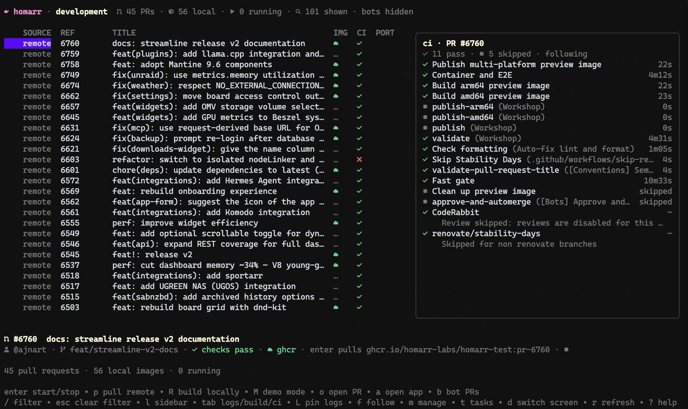

# Command line interface

The Homarr image includes a recovery CLI for operations that cannot be completed in the web interface. It is not an
application API; use the [API](/docs/management/api) or [MCP endpoint](/docs/management/mcp) for automation.

Back up the database and stop Homarr before running a command that changes data.

## Run the recovery CLI

Open a shell in the container, then pass a command to `homarr`:

```sh
docker exec -it <container-id> /bin/bash
homarr <command>
```

In QNAP Container Station, open the Homarr container's **Execute** action and select `/bin/bash`.

See the pages in this section for available commands.

## Build a local branch harness

The repository's host-side CLI can build the current checkout and run it as a named Docker harness:



```sh
pnpm cli harness setup feature-board
```

This creates `homarr:feature-board`, starts it with persistent demo data, and prints the assigned URL. Query the port
again with:

```sh
pnpm cli harness port feature-board
```

Pass environment overrides with repeated `--env` options:

```sh
pnpm cli harness setup feature-board \
  --env WORKSHOP_WEB_URL=https://example.test \
  --env FEATURE_FLAG=true
```

Related commands are `harness build <name>`, `harness run <name>`, and `harness stop <name>`.
