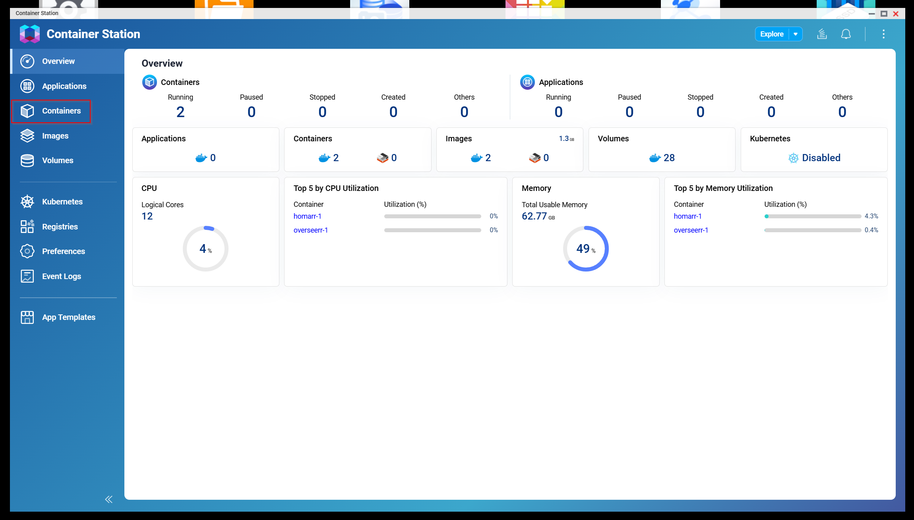
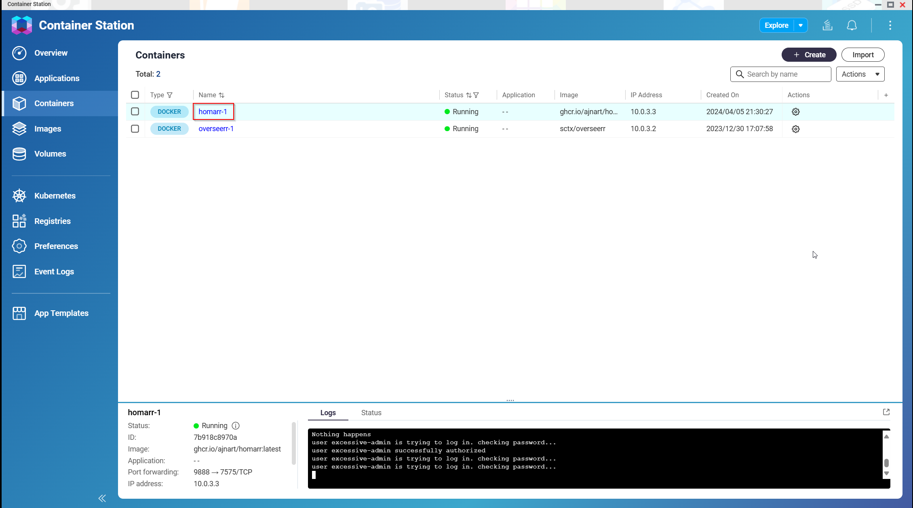
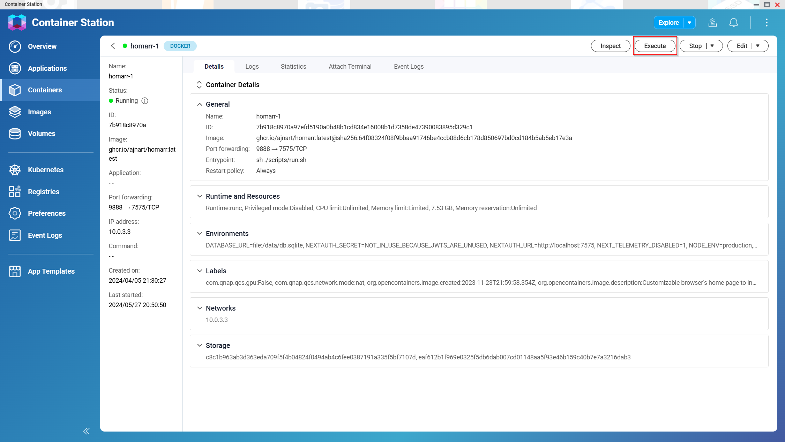

# Command line interface

The Homarr image ships with a built-in recovery tool. This can be useful, if you do not have access to Homarr or if something is not working.
Please note that the CLI is an _emergency tool_, not an API tool.

:::caution

Using the recovery CLi tool can cause problems when requests are being sent to Homarr while the tool is running. \
You should also create a backup of the database, in case you break something.

:::

## Execute CLI with Docker

1. Execute `docker ps | grep homarr` on the root system with Docker to find the container ID of your Homarr container.
2. Run `docker exec -it <container-id> /bin/bash homarr <your-command-goes-here>`. \
   Replace `<container-id>` with your container ID from step 1. \
   Replace `<your-command-goes-here>` with the command you want to execute (see sub-pages).

## Execute CLI with QNAP

1. Open Container Station in the QNAP Web Interface 
2. Select Containers in the menu bar on the left 
3. Select your Homarr Container 
4. Click "Execute" in the top right of the Window. 
5. Select /bin/bash and click Execute 
6. Run the Homarr command and press enter (eg. homarr reset-owner-password) 

## Build a local branch harness

The host-side operations CLI can build the current checkout and run it as a named, browser-ready Docker harness. This is separate from the recovery CLI described above and does not open the interactive developer TUI.

```sh
pnpm cli harness setup feature-board
```

The command builds `homarr:feature-board`, starts a container with a persistent data volume, enables demo mode, and keeps demo mutations writable (`DEMO_READ_ONLY=false`). Docker assigns a free host port by default; use the URL printed by the command or query it later:

The demo board includes every widget kind. Integration-backed widgets use the bundled mock integration; media widgets use public stock assets.

```sh
pnpm cli harness port feature-board
```

Pass environment overrides by repeating `--env`:

```sh
pnpm cli harness setup feature-board \
  --env WORKSHOP_WEB_URL=https://example.test \
  --env FEATURE_FLAG=true
```

Other commands are `harness build <name>`, `harness run <name>`, and `harness stop <name>`. Use the returned URL with a browser automation harness for feature validation; do not assume the host port is `7575`.
