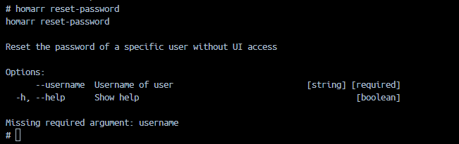

# Password Recovery

:::info

This guide requires that you understand [how to access the CLI](../).

:::

Using this command, you can forcefully reset the password of a user.
It will be set to a random value and the hash for the user will be updated.
All sessions for that user will be terminated and the user must re-login.

Using the ``--username`` parameter, you can specify who you want to reset the password for.
Executing the command will create a new random password, update the database and display the new password.
All sessions for this user will be terminated and they must re-login.

