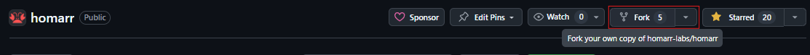
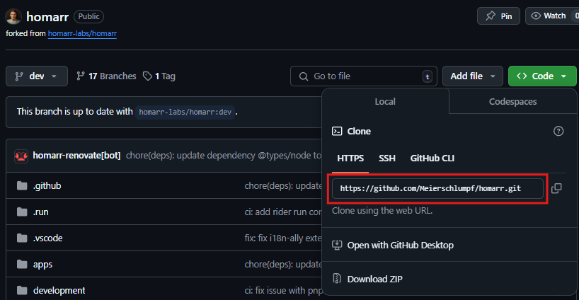

## Setting up your development environment

This guide will help you set up your development environment to start contributing to homarr.

### Prerequisites

- **Node.js 24.18 or newer**: You can download it from the [official website](https://nodejs.org/).
- **Corepack**: Run `corepack enable` so the repository selects its pinned pnpm version.
- **Git**: You can download it from the [official website](https://git-scm.com/).
- **Docker or Docker Desktop**: Required for the Redis service and the developer Docker CLI.
- **Go 1.25+**: Required only for the developer Docker CLI. You can download it from the [official website](https://go.dev/).
- **GitHub CLI**: Required only for pull-request image features. Install it from the [official website](https://cli.github.com/), then authenticate with `gh auth login`.

### Setting up the project

1. Fork the repository by clicking on the "Fork" button on the top right corner of the repository page.

2. Clone the repository to your local machine with `git clone`. You can find the url to use by clicking on the "Code" button on the top right corner of your forks repository page.

3. Change directory to the project folder with `cd homarr`.

4. Install the dependencies with `pnpm install`.

5. Create `.env` from `.env.example`. In a POSIX shell, run `cp .env.example .env`; in PowerShell, run `Copy-Item .env.example .env`. Set `DB_URL` to an absolute path for your SQLite file.

6. Start Redis in the background with `pnpm docker:dev:up` if your development workflow needs it.

7. Create or update the database with `pnpm db:migration:sqlite:run`. This also seeds the default data. To run the seed explicitly later, use `pnpm db:seed`.

8. Start the development server with `pnpm dev` and wait for a message that says `✓ Ready in 10.7s`

9. Open your browser and navigate to [http://localhost:3000](http://localhost:3000). (Loading the page might take up to 2 minutes the first time)

### Useful npm scripts

#### During development

- `pnpm dev`: Start the Next.js development server.
- `pnpm dev:benchmark`: Run the local authenticated-board benchmark. Set `DEV_BENCHMARK_BOARD_URL` and
  `DEV_BENCHMARK_STORAGE_STATE`; readiness-only measurements require the explicit `--smoke` flag and are not
  suitable for performance claims.
- `pnpm dev:cli -- dev`: Browse and run local images and remote pull-request images.
- `pnpm dev:cli -- build <name>`: Build the current checkout as `homarr:<name>`.
- `pnpm dev:cli -- build --pr <number>`: Build a pull request locally from a temporary checkout.
- `pnpm dev:cli -- rebuild <name>`: Rebuild a local image from its recorded checkout or pull request.
- `pnpm dev:cli:install`: Optionally install the developer CLI as a `homarr` binary.
- `pnpm cli`: Run cli commands.
- `pnpm db:migration:sqlite:run`: Run the migrations to create or update the sqlite db file.
- `pnpm db:seed`: Explicitly seed the default database data.
- `pnpm docker:dev:up`: Start the Redis development service in the background.
- `pnpm db:migration:sqlite:generate`: Generate a new migration file for the sqlite db. Also works with `mysql`.
- `pnpm db:studio`: Open a visual studio for the database.
- `pnpm package:new`: Create a new package in the monorepo.

#### Checking code quality

- `pnpm lint`: Run the linter to check for code quality issues.
- `pnpm format:fix`: Run the formatter to fix code style issues.
- `pnpm test`: Run the tests. You can also use `pnpm test:ui` to get a UI for the tests.
- `pnpm typecheck`: Run the typescript type checker.

#### Building the project

- `pnpm build`: Build the project for production.
- `pnpm dev:cli -- build <name>`: Build a `homarr:<name>` image and record its checkout for later rebuilds.
- `docker build -t homarr .`: Build a docker image for the project.
- `docker run -p 7575:7575 -e SECRET_ENCRYPTION_KEY='your_64_character_hex_string' homarr:<name>`: Run the created docker image.
