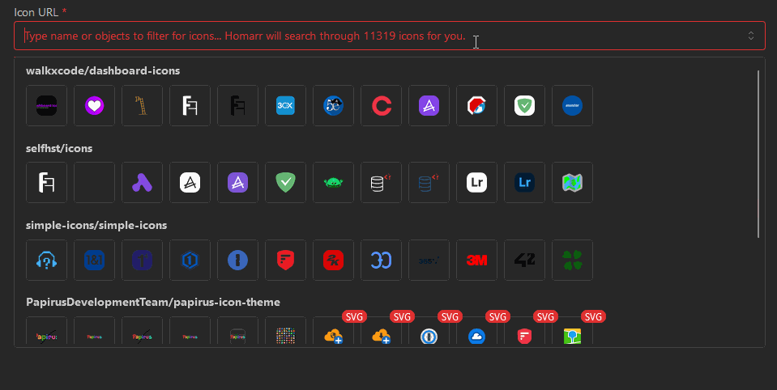

## Icon picker

Icons in Homarr are automatically requested from multiple sources:

- [Dashboard Icons](https://dashboardicons.com/) - Our recommended source with more than 1,888 curated, high-quality icons
- [selfh.st icons](https://github.com/selfhst/icons)
- [Simple icons](https://github.com/simple-icons/simple-icons)
- [Tabler icons](https://tabler-icons.io/)
- [Papirus icons](https://github.com/PapirusDevelopmentTeam/papirus-icon-theme)
- [Homelab Svg assets](https://github.com/loganmarchione/homelab-svg-assets)
- **Local icons**: automatically fetched from the [medias feature](/docs/management/media/)

Using these icon sources, Homarr provides a total collection of over 11,000 icons at your fingertips.
The image picker searches this collection after a short typing delay. When a name is available, such as an app or search engine name, the picker uses it as the initial search. Results show your locally uploaded images first, followed by SVG icons and then other image formats.

### Finding Missing Icons

If you can't find the icon you're looking for in Homarr's built-in picker, we strongly recommend checking [Dashboard Icons](https://dashboardicons.com/). It offers a modern, user-friendly interface and a curated collection of high-quality icons specifically designed for dashboards and app directories.

Icons that are high quality and printable ([SVG](https://wikipedia.org/wiki/Scalable_Vector_Graphics)) are marked with a red badge "SVG" at the top right.

You can clear the selected image with the clear button or the usual keyboard shortcut for deleting a line (Command+Backspace on macOS or Control+Backspace on other platforms). Clearing the field does not restore the previous image.

### Using external icons

If you don't find the icon you're looking for on Dashboard Icons or wish to use a different source, you can simply enter a URL that points to an icon.
Direct HTTP(S) image URLs are used as entered instead of being searched in the built-in repositories. The picker previews the image and shows whether it loaded successfully. It is important that the URL directly points to the file without any advertisements or elements around it.

### Uploading a local image

Users with media upload permission can select **Upload image** next to the field. After the upload finishes, the new local image is selected immediately and is available at the top of future searches.
