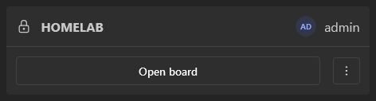
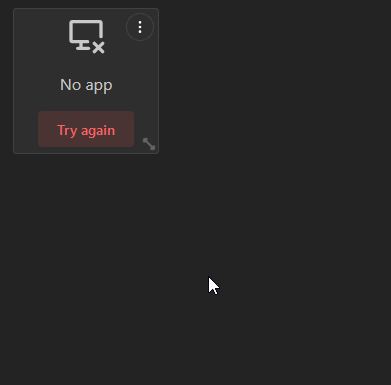
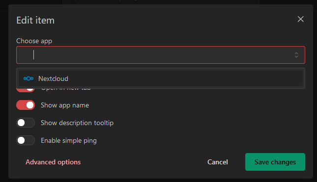
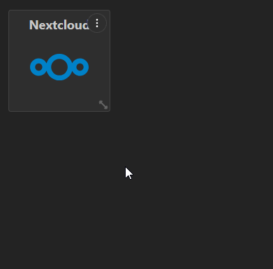
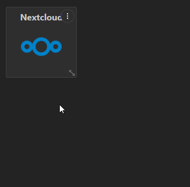
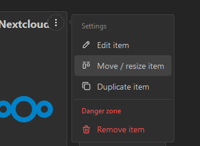
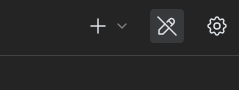
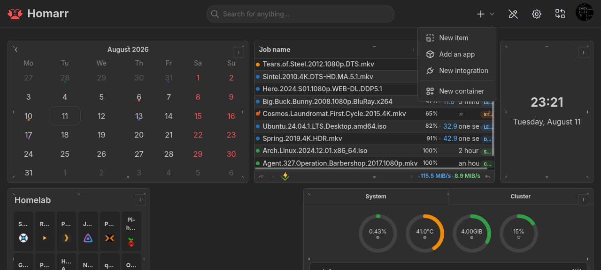

import manageBoardHeaderEditMode from "./img/manage-board-header-edit-mode.png";
import manageBoardHeaderAddItem from "./img/manage-board-header-add-item-menu.png";
import manageBoardHeaderChooseItem from "./img/manage-board-header-choose-item.png";
import manageBoardNoApp from "./img/manage-board-no-app.png";

:::tip

Read our [glossary](/docs/getting-started/glossary) if you are new to Homarr.

:::

Congratulations on installing Homarr. Now it's time to get yourself familiar with the concepts of Homarr and how to use it.

## Onboarding

Onboarding appears the first time Homarr starts. Its goal is to create a useful responsive board, not merely an
administrator account. The setup uses one guided studio, so you can keep the safe defaults and finish quickly or review
every detected service before anything is added to the board.

:::note

If you see this screen repeatedly after restarting the Homarr container, your Docker mounting paths may be missing,
incorrect or read-only. Read [our installation instructions](/docs/getting-started/installation/docker) again to fix this issue.

:::

### Restore or start fresh

SQLite installations can restore a complete Homarr database backup from the welcome screen. This restores current
boards, people, apps, integrations, and settings. The pre-1.0 ZIP importer is no longer included.

For a new installation, Homarr first creates either a credentials administrator or an administrator group matching your
LDAP/OIDC provider. The browser that starts setup claims the first-run session; refreshes are safe, while another browser
cannot change credentials or integrations during that setup.

### Setup studio

The studio keeps related choices together:

1. **Essentials** sets the default language, color scheme, analytics preference, and the usual host, IP address, domain, or reverse-proxy path used by your services. URL suggestions can use separate ports, subdomains, or one path per service.
2. **Discover** checks the actual database, Docker-compatible sockets, Kubernetes configuration, Workshop, and Assistant capabilities. Unavailable sources never block manual setup.
3. **Connect** combines explicit `homarr.*` or Homepage Docker labels with image matching. Select several integrations and apps at once, review every URL, and use the service-specific link to open its API-key settings when one is available. If a container has no published port or URL label, add its HTTP or HTTPS address before importing it.
4. **Board** previews the Base layout, colors, widget radius, sidebars, selected apps, and widgets inferred from integrations or Docker labels. Choose 8 columns for a focused board, 10 for a balanced board, 12 for a wide board, or use the slider for a custom width up to 24 columns. Homarr still creates and reflows the protected Mobile layout automatically. A fast setup adds the integration-free Clock, Weather, and Bookmarks starter widgets.
5. **Extend** explains and optionally configures Homarr Assistant, the community Workshop, and the separate Homarr MCP endpoint.
6. **Review** tests the selected connections, then saves integrations, apps, widgets, settings, and the exact first board together. If any part fails, the database changes are rolled back and your form stays available to correct.

Docker discovery reports each configured host separately. Results from reachable hosts remain selectable if another socket
is unavailable, which is useful for remote Docker, rootless Docker, Synology, and mixed deployments. On Kubernetes or
bare-metal installations without a Docker socket, enter services manually and use the same integration catalog.

After setup, **Open my board** takes you directly to the configured board. The in-product tour then introduces edit mode,
responsive layouts, widgets, and search without delaying completion.

## Creating another board

In Homarr, you organize your apps and widgets on boards.
Boards use fixed-size tiles so the same widget keeps the same proportions on every screen.
Drag, resize, and section controls are available in edit mode.
Onboarding already created the first board. To create another one, navigate to `Manage` > `Boards` > `New board`:

A board must always have a name and can either be public or private.
Public boards are also accessible for users, that are not logged in ([see access control for boards](/docs/management/boards/#access-control)).

Congratulations - you've just created your first board. You can see boards, that you have access to, on this page:

## Add your first app to Homarr

To add links to your dashboard, you must first add them as an "app".
Navigate to this page to add an app:

Next, click on the `New app` button. You'll need to provide a name and an icon to create an app.
The name must be at least one character long but you can provide any image URL for the icon.
Homarr ships with over 11K icons - so you can just search by entering a search text instead.

After you created the app, you'll see in on the apps page:

## Arrange and organize your board

Let's add your freshly created app, from the previous step, to the board.
To do this, edit your previously created board by clicking on the big `Open board` button:

Here you have the following options in the header:

- **Search**: Here you can search for data. You can search for integrations, boards, actions, sites and much more. Some actions may be context dependent (eg. will only show when certain widgets are on your page)
- **Edit mode**: Clicking this button will toggle the edit mode. In this mode you can edit the contents of your board.
- **Settings**: Clicking this button will redirect you to a settings page where you can adjust the board settings (page title, colors, ...).
- **Profile**: This avatar will be visible on every page. Clicking it will show a menu with actions.

When entering the edit mode, you'll get some additional buttons to work with:

- **Add item**: Click this button to add new elements to your page.
- **Exit edit mode**: Click this button to save your changes and exit edit mode.

Outside edit mode, right-click a widget for its live status, refresh, settings, quick options, and supported actions.
Hold `Shift` while hovering a widget that supports advanced view to expand it in place while the rest of the board
stays visible but dimmed. Release `Shift` to close it. You can also focus that widget and press `Shift` + `Enter` to
keep its advanced view open until you close it. Widgets without a distinct advanced experience adapt in place.

To continue, click the option "New Item":

Next, you can choose what item you'd like to add.
We will discuss the other options in the following sections - for now choose "App" to continue.

As soon as you chose the app, the modal will close and you'll get the following item on your board:

This is expected, because you haven't told Homarr what app it should show in this item.
To configure this, click on the small 3 dots at the top of the item in the edit mode and choose "Edit item" in the menu.

In the modal you can edit the app that you want to display:

As soon as you save your changes, the tile on the board will refresh and display your app.
Use the resize handle at the bottom right to resize the tile.
Press and hold the handle, move the pointer, and release it when the tile has the size you want.

To move a tile in edit mode, press and hold its content, move it to the desired position, and release it.
Widget content is disabled while editing so its controls do not intercept the drag; use the tile's settings button for edit actions.
The tile snaps to the grid. Equally-sized tiles swap when one is dropped into the other's slot, while other neighboring tiles move out of the way automatically.

Every `1 × 1` tile has a logical content size of `200 × 200` pixels.
Larger tiles use multiples of that fixed unit, with a consistent gap between cells.
Homarr scales the complete board uniformly, like zooming a page.
It stops shrinking at 75% and lets you scroll horizontally instead of making text and controls too small.
It does not squeeze or reflow the content of individual widgets, so a widget keeps the same design and proportions across screen sizes.

:::note

Viewing a board initially uses the lightweight, non-interactive layout.
For users with edit access, Homarr prepares drag-and-drop and resize controls in the background after the board becomes interactive.
If you enter edit mode before that finishes, the existing board stays visible until the editor is ready.

:::

:::tip

We recommend you to experiment for a few minutes, before you start building your actual dashboard.
This helps you to explore the capabilities of Homarr before you build your board in a suboptimal way.

:::

Keyboard users can focus a tile, press Enter or Space, then use arrow keys to move and Shift plus arrow keys to resize.
Press Escape to stop.
For precise numeric controls or touch input, choose **Move / resize item** from the tile's edit menu.
The dialog can also move the tile to another section or fixed sidebar:

Be sure to save your changes by exiting edit mode!

## Adding your first integration

Now it's time to integrate some basic data into your board.
To do this, we first need to create an integration.
An integration is a connection between Homarr and a third party application - usually something that you run and deploy yourself.

Navigate to `Manage` > `Integrations` (for example via your user menu).
As an example, we are going to use the public demo instance of **Dash.** - a popular application to monitor CPU / hardware usage.
Choose the **Dash.** integration from the list of available integrations:

Next, choose a name (or leave it at default), enter `https://dash.mauz.dev/` as the URL in the form and click on `Test connection and create`.
Pressing the save button will perform a test request to the integration, to confirm that the networking setup is working as expected.
Sometimes invalid configurations, firewalls and other mistakes can lead to connectivity problems - [follow this guide here](/docs/management/integrations/#troubleshooting-connection) if you experience issues.

If connection was successful, you will be redirect back to the list of integrations.
Now let's embed it to your board (see next section).

:::note

Some integrations may require additional configuration, such as a username, password or API tokens.
Depending on your networking setup and applications, the connection from Homarr might also get blocked by firewalls,
the target application or your router.

:::

## Embed integration data using widgets

Let's add your integration, that you have configured in the section above, as a widget to your board.
First, navigate back to your board that you want to add it to.
Next, enter edit mode again and add another item to your board:

Instead of choosing an app, let's choose `System Health Monitoring` this time.
Click on "Add to board":

Resize the item slightly and then edit it using the three dots menu at the top:

Next, choose your newly created Dash. integration in the integrations dropdown:

:::note

Some widgets may support multiple integrations at the same time.
If they do not support multiple integrations, you will be unable to select more than one.

:::

Confirm your changes by pressing save.
Editing a widget will trigger a data update and data will soon appear:

As with every change, don't forget to save your changes using the exit edit mode button:

## Organizing items with Containers

Containers are resizable areas for apps, widgets, and nested Containers.
The same Container works on the main canvas, inside a fixed rail, or inside another Container.
Each Container can configure:

- Its label and whether that label is visible.
- Allow or disable collapsing.
- Show or hide **Open all in new tabs**.
- Change its border color and custom CSS classes.

Open the add-content menu and choose **New Container**.
In edit mode, move and resize it like any other item, then drag items into or out of it.
Nested content stays within the Container's bounds.
While resizing, the solid outline follows the pointer continuously and the dashed grid preview shows the size that will be saved on release.

### Collapsing and opening apps

Users can collapse an eligible Container like an accordion in view mode without changing its saved expanded size.
The full-width header becomes the compact expansion bar, so the half-row state has no empty pill-shaped spacer.
Expanding it restores its bounds and makes room for its contents.
If **Open all in new tabs** is enabled, the Container menu can open every app link it contains.

### Fixed rails

Open the board's **Layout** settings to enable the left or right rail for each responsive layout.
Choose one, two, or three columns with the slider and use the preview to check the remaining canvas width.
The rail reserves those columns from the dashboard, so Homarr moves canvas items into the next available positions.
Rail content stays visible while the page scrolls and remains editable.
Each responsive layout keeps its own rail widths, item positions, and item sizes.

## Guided tours

After completing the onboarding, Homarr provides interactive guided tours to help you discover key features.

### Management tour

When you first visit the management area (`/manage`), Homarr walks you through the main pages: boards, apps, integrations, and users (admin only).
Each page highlights the list view and the create action so you know where to find and add things.

### Board tour

When you first open a board, a tour highlights the board header elements: search, edit mode, settings, board switcher, and user menu.

### Tour controls

- Press **Enter** (or click **Next**) to advance through tour steps
- Tours auto-start on first visit and do not repeat once completed
- Tours are skipped on mobile screens (below `sm` breakpoint)
- You can **reset tours** from the user settings page under **Manage > Users > [Your user] > General**

## Next steps

You're done with the basic setup 🔥. Now it's time to organize and customize even more.
We highly recommend you to experiment with different options, styles and configurations.
See these curated pages for your next steps:

- Create new apps using the [apps management](/docs/management/apps/)
- Customize your board or add more boards using the [boards management](/docs/management/boards/)
- Integrate software that you use using the [integrations management](/docs/management/integrations/)
- Choose from our beautiful and interactive [widgets](/docs/category/widgets)
- See [all supported integrations](/docs/category/integrations)
- Integrate with Homarr with your own application using [the API](/docs/management/api/)

:::danger

The Homarr Team will never ask for your credentials. Do not send people your credentials, as they manage the access to your applications and can cause harm to your device if they are abused.

:::
