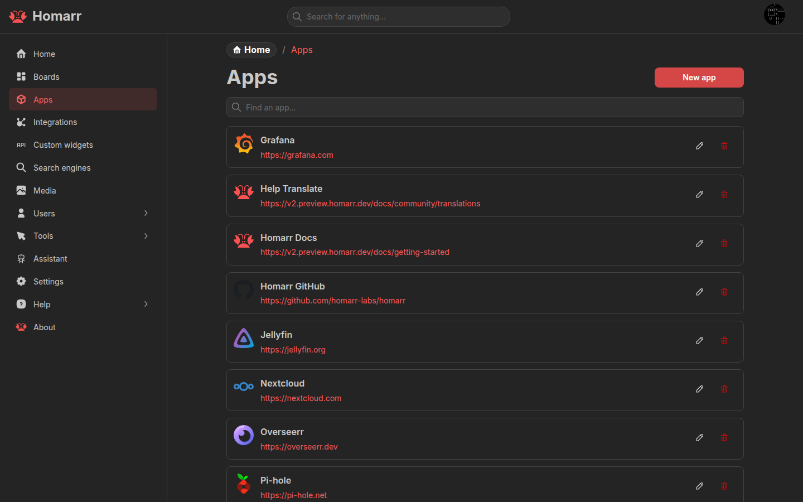
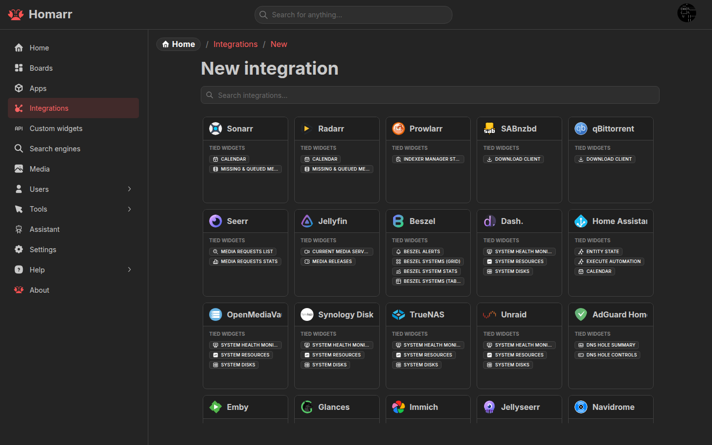
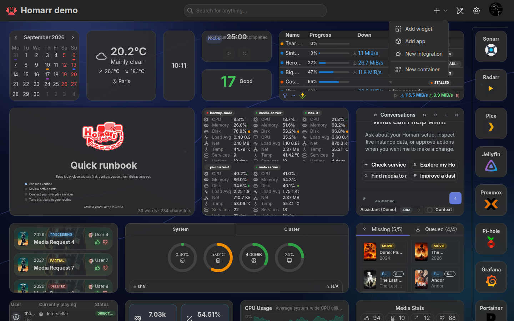
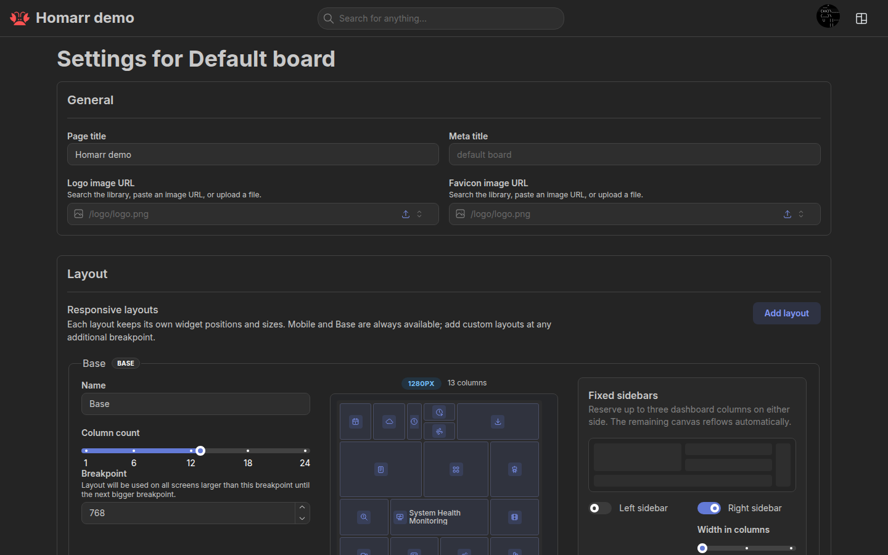
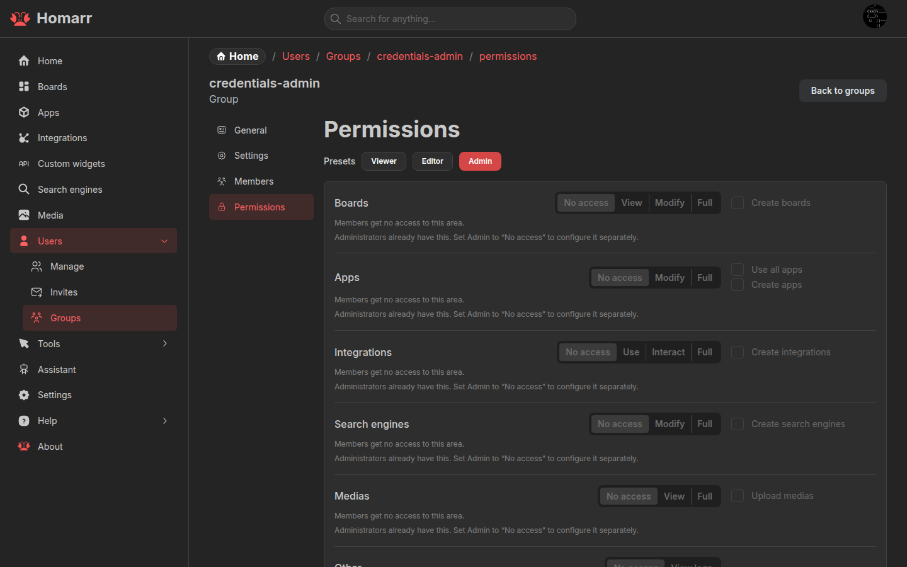

On first launch, onboarding creates the administrator, connects optional services, and builds the first board. A
compatible SQLite backup can also be restored from the welcome screen.

If onboarding returns after a restart, check that `/appdata` is writable and persisted. See the
[Docker installation guide](/docs/getting-started/installation/docker).

## Core concepts

### Boards

A **board** is a dashboard page containing apps, widgets, and Containers. Boards can be public or restricted to users
and groups. Each user can choose a home board.

See [Boards](/docs/management/boards) for responsive layouts, access control, appearance, and home-board settings.

### Apps

An **app** is a saved shortcut: a name, URL, icon, and optional status check. Add an App tile or a Bookmarks widget to
show apps on a board.

See [Apps](/docs/management/apps) or [Icons](/docs/advanced/icons).

### Integrations

An **integration** is a server-side connection from Homarr to a supported service such as Sonarr, Home Assistant, or
Docker. Integrations provide data and actions to widgets. They can also be linked to apps.

See [Managing integrations](/docs/management/integrations) and the
[integration catalog](/docs/category/integrations).

### Widgets

A **widget** is a board tile. Some widgets work on their own; others require one or more integrations. Configuration,
supported integrations, and non-obvious limitations are documented on each widget page.

See the [widget catalog](/docs/category/widgets).

### Containers and rails

A **Container** groups board items and can be nested. A **rail** reserves a fixed area at the left or right of a
responsive layout. Both are configured in board edit mode.

See [Boards](/docs/management/boards#containers-and-rails).

### Users, groups, and permissions

Users inherit permissions and default boards from their groups. Resource-specific access can further restrict boards
and integrations.

See [Users and groups](/docs/management/users) and [single sign-on](/docs/advanced/single-sign-on).

## Explore further

- [Server settings](/docs/management/settings)
- [Assistant](/docs/management/assistant)
- [Custom Widgets](/docs/management/custom-widgets)
- [Community Workshop](/docs/workshop)
- [API](/docs/management/api) and [MCP](/docs/management/mcp)
- [Keyboard shortcuts](/docs/advanced/keyboard-shortcuts)

See the [glossary](/docs/getting-started/glossary) for a compact list of Homarr terms.
