import imageStartFromScratchStepServerSettings from "./img/onboarding-from-scratch-step-server-settings.png";
import imageStartFromScratchStepAdminUser from "./img/onboarding-from-scratch-step-admin-user.png";
import imageStartFromScratchStepExternalAdminGroup from "./img/onboarding-from-scratch-step-external-admin-group.png";
import imageStartFromScratchStepFinish from "./img/onboarding-from-scratch-step-finish.png";
import manageBoardNoApp from "./img/manage-board-no-app.png";
import currentKeyboardTileEditing from "../management/boards/img/keyboard-tile-editing.png";
import boardDesktopCurrent from "./img/onboarding-board-desktop-current.png";
import boardEditModeCurrent from "./img/onboarding-board-edit-mode-current.png";
import addContentMenuCurrent from "./img/onboarding-add-content-menu-current.png";
import chooseItemCurrent from "./img/onboarding-choose-item-current.png";
import editItemCurrent from "./img/onboarding-edit-item-current.png";
import boardsHomeMobileMenu from "./img/onboarding-boards-home-mobile-menu.png";
import moveResizeMenuCurrent from "./img/onboarding-move-resize-menu-current.png";
import currentBoardMobileView from "./img/onboarding-board-mobile-current.png";
import manageExportOldHomarr from "./img/old-homarr-export-data.png";
import manageImportOldHomarrDropzone from "./img/old-homarr-import-dropzone.png";
import manageImportOldHomarrChooseData from "./img/old-homarr-import-choose-imported-data.png";
import manageImportDecryptionToken from "./img/old-homarr-import-decryption-token.png";

:::tip

Read our [glossary](/docs/getting-started/glossary) if you are new to Homarr.

:::

Congratulations on installing Homarr. Now it's time to get yourself familiar with the concepts of Homarr and how to use it.

## Onboarding

The onboarding will show the first time you start Homarr.
This process will help you with your first steps and adding some initial data, such as the administrator account.

:::note

If you see this screen repeatedly after you restart the Homarr container, your Docker mounting paths may be missing,
incorrect or read-only. Read [our installation instructions](/docs/getting-started/installation/docker) again to fix this issue.

:::

You can either import a previous dashboard using the ZIP archive or start from scratch:

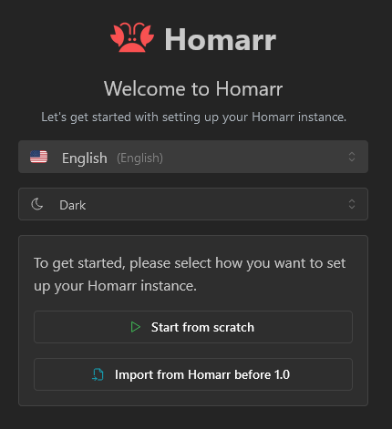

You may refresh anytime and continue from a different device - the onboarding is saved immediately on the server for your convenience.

### Starting from scratch

Depending on your auth provider configuration you will either first see the admin user creation form or the external group creation form.
If the credentials provider was selected, you'll be prompted to create an admin user for Homarr.
This user cannot be deleted and has full control over Homarr and all of its boards.
You must choose a username and password (both can later be changed).
We enforce strict password requirements when you enter your password to protect your instance if you accidentally
expose it to the internet.

If you selected external providers (such as LDAP or OIDC), you'll be prompted to create an admin group.
This group will be used to synchronize users from your provider to Homarr.
When a user logs in through the provider, any of their groups that match groups in Homarr will be assigned to the user.
The name of the group must match exactly the name of the group in the provider.

Next, you can configure some basic settings for Homarr. We recommend to leave all settings at default for most users.
Here you can also disable analytics. Please note that our analytics are completely anonymous and fully compliant with GDPR and PECR.

### Setting up integrations

After configuring server settings, the onboarding guides you through setting up your integrations.

#### Docker service discovery

If Docker is available (socket mounted), Homarr automatically detects running containers and matches them to known integration types.
Matching integrations are pre-selected in the integration list, saving you from manually picking each one.

#### URL templating

You can define a base URL template to auto-fill integration URLs in bulk.
Two modes are supported:

- **Subdomain mode** - e.g. `{app}.example.com` where `{app}` is replaced with the integration name
- **Port mode** - e.g. `192.168.1.1:{port}` where `{port}` is replaced with the integration's default port

#### API key helper links

For integrations that require API keys (such as Sonarr, Radarr, SABnzbd, or Seerr), a helper link opens the relevant settings page in the target application so you can quickly copy your key.

#### Creating apps from Docker containers

You can optionally auto-create bookmark apps for all discovered Docker containers, making them immediately available on your board.

:::note

Release providers and Search.ch are configured directly in their widgets instead of the integrations page.

:::

After this step, you finished the onboarding.
The onboarding can no longer be started again.
From here you can click on one of the provided links to continue your journey.
We recommend you to continue with the section [creating your first board on this page](#creating-your-first-board).

### Importing a ZIP from version before 1.0.0

This is recommended when you used Homarr before and want to re-import your data.
It is important that you first migrate correctly using [the list of breaking changes for 1.0](/blog/2024/09/23/version-1.0).

**How to export and import data**

1. Navigate to your old Homarr, open your management pages, open the tools submenu and open `Migrate to 1.0`.
2. Check the contents that you want to export. We recommend you to export all data.
3. Click on the export data button
4. Save the downloaded ZIP file on your device. If you selected "integrations" or "users", you also get an encryption / decryption key.
   Copy it and keep it safe; you need it later in the import flow.
5. Go to your new Homarr 1.0 or later instance and start the onboarding. Choose `Import from Homarr before 1.0`.
6. Drag and drop your previously downloaded ZIP archive into the file upload:  
7. Next, choose the data that you want to import and how to import it. Old Homarr screen sizes are imported as responsive layouts on the same board: the narrowest becomes **Mobile**, the widest becomes **Base**, and layouts between them become custom layouts. Homarr normalizes duplicate breakpoints automatically, so you can review the imported board in Board Settings and adjust the layouts there. 
   For example, legacy `sm`, `md`, and `lg` layouts at `0px`, `800px`, and `1400px` become Mobile, a custom layout, and Base. The imported board keeps each layout's positions, names, and column counts where possible so you can review the result before saving. If a board has one saved layout, Homarr keeps it as Base and generates Mobile from it; a board without saved layouts receives Mobile at `0px` with 3 columns and Base at `768px` with 10 columns.
8. If you previously exported integrations or users, you will be asked to decrypt the data safely using your obtained encryption token. Paste into the modal and confirm your action. 
9. Next, you can [follow the same setup as when starting from scratch](#starting-from-scratch). After you completed the onboarding, all of your data will be migrated and available.

## Creating your first board

In Homarr, you organize your apps and widgets on boards.
Boards use fixed-size tiles so the same widget keeps the same proportions on every screen.
Drag, resize, and section controls are available in edit mode.
Let's create your first board by navigating here: `Manage` > `Boards` > `New board`:
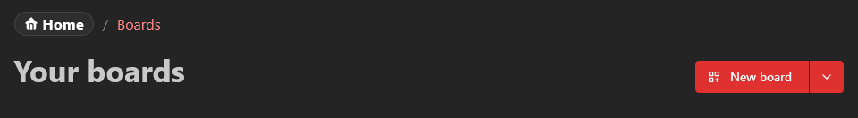

A board must always have a name and can either be public or private.
Public boards are also accessible for users, that are not logged in ([see access control for boards](/docs/management/boards/#access-control)).

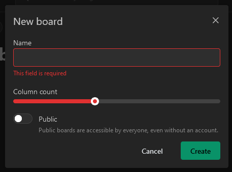

Congratulations - you've just created your first board. You can see the boards you have access to on this page:

<figure>
  
  <figcaption>The Boards page selects the board opened from Home separately for desktop and mobile.</figcaption>
</figure>

The board marked **Home** is the board opened from the desktop Home route. **Set as your mobile board** selects which board
opens on phones. This is separate from the **Mobile** layout: the home-board setting chooses a board, while **Mobile** and
**Base** are responsive layouts inside that board. A phone can therefore open a different home board and still use that
board's Mobile layout.

New boards start with **Mobile** and **Base** responsive layouts automatically, so you can edit the board for phones and
desktops without creating extra layouts first. Mobile starts at `0px` with 3 columns and Base at `768px` with 10 columns.
Each layout keeps its own tile positions and sizes.

## Add your first app to Homarr

To add links to your dashboard, you must first add them as an "app".
Navigate to this page to add an app:

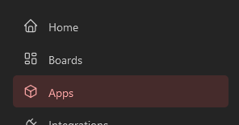

Next, click on the `New app` button. You'll need to provide a name and an icon to create an app.
The name must be at least one character long but you can provide any image URL for the icon.
Homarr ships with over 11K icons - so you can just search by entering a search text instead.

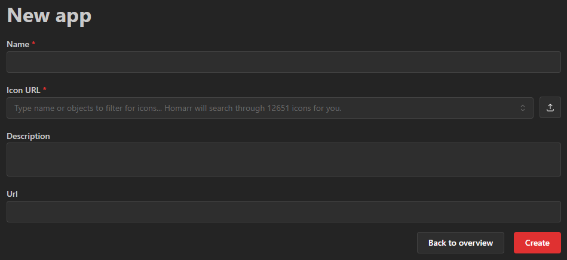

After you created the app, you'll see in on the apps page:

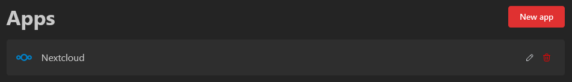

## Arrange and organize your board

Let's add your freshly created app, from the previous step, to the board.
To do this, edit your previously created board by clicking on the big `Open board` button:

<figure>
  
  <figcaption>Open a board to view its dashboard, then enter edit mode to arrange its content.</figcaption>
</figure>

Here you have the following options in the header:

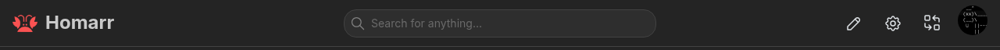

- **Search**: Here you can search for data. You can search for integrations, boards, actions, sites and much more. Some actions may be context dependent (eg. will only show when certain widgets are on your page)
- **Edit board**: Clicking this button will toggle edit mode. In this mode you can edit the contents of your board.
- **Settings**: Clicking this button will redirect you to a settings page where you can adjust the board settings (page title, colors, ...).
- **Board switcher**: Use this button to open another board that you can access.
- **Profile**: This avatar will be visible on every page. Clicking it will show a menu with actions.

When entering the edit mode, you'll get some additional buttons to work with:

<figure>
  
  <figcaption>The current editor keeps the board visible while its editing controls are available.</figcaption>
</figure>

- **Add board content**: Click this button to create a new item, app, integration, or Container.
- **Save board**: Click this button to save your changes and leave edit mode. If you leave with unsaved changes, Homarr asks whether to discard them.

Outside edit mode, right-click a widget for its live status, refresh, settings, quick options, and supported actions.
Hold `Shift` while hovering a widget that supports advanced view to expand it in place while the rest of the board
stays visible but dimmed. Release `Shift` to close it. You can also focus that widget and press `Shift` + `Enter` to
keep its advanced view open until you close it. Widgets without a distinct advanced experience adapt in place.

To continue, click **New item** in the add-content menu. New content is placed at the first available position on the main
canvas; it is not inserted at a clicked empty cell or directly into a rail or Container:

<figure>
  
  <figcaption>The add-content menu provides the four supported ways to place new content on the board.</figcaption>
</figure>

Next, you can choose what item you'd like to add.
We will discuss the other options in the following sections - for now choose "App" to continue.

<figure>
  
  <figcaption>Choose the App item from the current picker to add an app tile.</figcaption>
</figure>

As soon as you chose the app, the modal will close and you'll get the following item on your board:

This is expected, because you haven't told Homarr what app it should show in this item.
To configure this, click on the small 3 dots at the top of the item in the edit mode and choose "Edit item" in the menu.

<figure>
  
  <figcaption>The tile menu contains the item editor and the separate move-and-resize tools.</figcaption>
</figure>

In the modal you can edit the app that you want to display:

<figure>
  
  <figcaption>Use the Edit item modal to choose the app and configure how its tile is displayed.</figcaption>
</figure>

As soon as you save your changes, the tile on the board will refresh and display your app.
Resize from any visible edge or corner handle. For a Container, activate its top-left grip before using its resize handles.
Press and hold a handle, move the pointer, and release it when the tile has the size you want.

To move a tile in edit mode, press and hold its inert content area, move it to the desired position, and release it.
Widget content is disabled while editing so its controls do not intercept the drag; use the tile's settings button for edit actions.
The tile snaps to the grid. A single compatible collision may swap the two items when both resulting placements fit;
otherwise the collision chain reflows neighboring tiles automatically.

Every `1 × 1` tile has a logical content size of `200 × 200` pixels.
Larger tiles use multiples of that fixed unit, with a consistent gap between cells.
Homarr scales the complete board uniformly, like zooming a page.
The complete canvas always fits the available width without horizontal board scrolling. Below 100%, Homarr preserves the
widget's readable typography and control density instead of shrinking each widget independently.
It does not squeeze or reflow the content of individual widgets, so a widget keeps the same design and proportions across screen sizes.

On a narrow screen, Homarr uses the **Mobile layout** for the selected board and stacks the board content vertically while
preserving each widget's fixed logical proportions:

<figure>
  
  <figcaption>
    At phone width, the selected board uses its Mobile layout and fits the complete canvas to the viewport.
  </figcaption>
</figure>

:::note

Viewing a board initially uses the lightweight, non-interactive layout.
For users with edit access, Homarr prepares drag-and-drop and resize controls in the background after the board becomes interactive.
If you enter edit mode before that finishes, the existing board stays visible until the editor is ready.

:::

:::tip

We recommend you to experiment for a few minutes, before you start building your actual dashboard.
This helps you to explore the capabilities of Homarr before you build your board in a suboptimal way.

:::

Keyboard users can focus a tile, press Enter or Space, then use arrow keys to move and Shift plus arrow keys to resize
within its current canvas, rail, or Container. Press Escape to stop keyboard editing. Touch dragging starts after a short
hold of about `200 ms`; resize handles accept direct touch input. During a pointer or touch move or resize, press Escape
to cancel and restore the previous layout. For cross-grid moves or precise numeric controls, choose **Move / resize item**
from the tile's edit menu.
Keyboard commands at a grid boundary or minimum tile size are ignored and announced; they do not move or shrink the tile.

Open **Move / resize item** from the tile menu to move the tile to another section or rail and enter precise numeric
coordinates and dimensions. After making changes, click **Save board** to persist them and leave edit mode.

## Adding your first integration

Now it's time to integrate some basic data into your board.
To do this, we first need to create an integration.
An integration is a connection between Homarr and a third party application - usually something that you run and deploy yourself.

Navigate to `Manage` > `Integrations` (for example via your user menu).
As an example, we are going to use the public demo instance of **Dash.** - a popular application to monitor CPU / hardware usage.
Choose the **Dash.** integration from the list of available integrations:

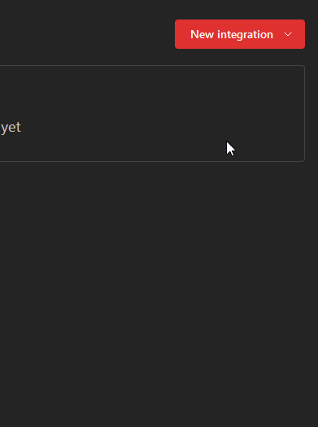

Next, choose a name (or leave it at default), enter `https://dash.mauz.dev/` as the URL in the form and click on `Test connection and create`.
Pressing the save button will perform a test request to the integration, to confirm that the networking setup is working as expected.
Sometimes invalid configurations, firewalls and other mistakes can lead to connectivity problems - [follow this guide here](/docs/management/integrations/#troubleshooting-connection) if you experience issues.

If connection was successful, you will be redirect back to the list of integrations.
Now let's embed it to your board (see next section).

:::note

Some integrations may require additional configuration, such as a username, password or API tokens.
Depending on your networking setup and applications, the connection from Homarr might also get blocked by firewalls,
the target application or your router.

:::

## Embed integration data using widgets

Let's add your integration, that you have configured in the section above, as a widget to your board.
First, navigate back to your board that you want to add it to.
Next, enter edit mode again and add another item to your board:

<figure>
  
  <figcaption>Use the same add-content menu to place an integration widget on the board.</figcaption>
</figure>

Instead of choosing an app, let's choose `System Health Monitoring` this time.
Click on "Add to board":

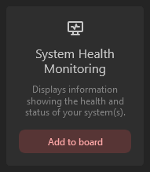

Resize the item slightly and then edit it using the three dots menu at the top:

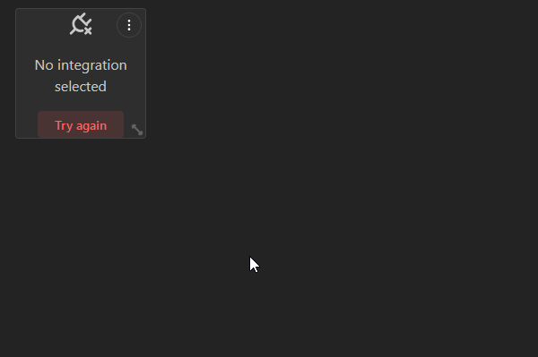

Next, choose your newly created Dash. integration in the integrations dropdown:

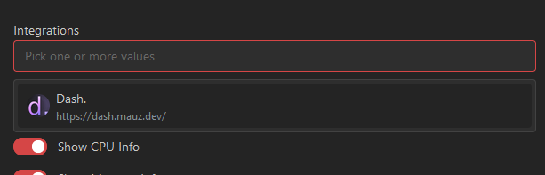

:::note

Some widgets may support multiple integrations at the same time.
If they do not support multiple integrations, you will be unable to select more than one.

:::

Confirm your changes by pressing save.
Editing a widget will trigger a data update and data will soon appear:

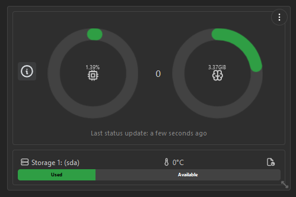

As with every change, click **Save board** to persist your board changes and leave edit mode.

## Organizing items with Containers

Containers are resizable areas for apps, widgets, and nested Containers.
The same Container works on the main canvas, inside a fixed rail, or inside another Container.
Each Container can configure:

- Its label and whether that label is visible.
- Allow or disable collapsing.
- Show or hide **Open all in new tabs**.
- Change its border color and custom CSS classes.

Open the add-content menu and choose **New container**.
In edit mode, move and resize it like any other item, then drag items into or out of it.
Nested content stays within the Container's bounds.
While resizing, the solid outline follows the pointer continuously and the dashed grid preview shows the size that will be saved on release.

### Collapsing and opening apps

Users can collapse an eligible Container like an accordion in view mode without changing its saved expanded size.
The full-width header becomes the compact expansion bar, so the half-row state has no empty pill-shaped spacer.
Expanding it restores its bounds and makes room for its contents.
If **Open all in new tabs** is enabled, the Container menu can open every app link it contains.

### Fixed rails

Open the board's **Layout** settings to enable the left or right rail for each responsive layout.
Choose one, two, or three columns with the slider and use the preview to check the remaining canvas width.
The rail reserves those columns from the dashboard, so Homarr moves canvas items into the next available positions.
Rail content stays visible while the page scrolls and remains editable.
Each responsive layout keeps its own rail widths, item positions, and item sizes.

## Guided tours

After completing the onboarding, Homarr provides interactive guided tours to help you discover key features.

### Management tour

When you first visit the management area (`/manage`), Homarr walks you through the main pages: boards, apps, integrations, and users (admin only).
Each page highlights the list view and the create action so you know where to find and add things.

### Board tour

When you first open a board, a tour highlights the board header elements: search, edit mode, settings, board switcher, and user menu.

### Tour controls

- Press **Enter** (or click **Next**) to advance through tour steps
- Tours auto-start on first visit and do not repeat once completed
- Tours are skipped on mobile screens (below `sm` breakpoint)
- You can **reset tours** from the user settings page under **Manage > Users > [Your user] > General**

## Next steps

You're done with the basic setup 🔥. Now it's time to organize and customize even more.
We highly recommend you to experiment with different options, styles and configurations.
See these curated pages for your next steps:

- Create new apps using the [apps management](/docs/management/apps/)
- Customize your board or add more boards using the [boards management](/docs/management/boards/)
- Integrate software that you use using the [integrations management](/docs/management/integrations/)
- Choose from our beautiful and interactive [widgets](/docs/category/widgets)
- See [all supported integrations](/docs/category/integrations)
- Integrate with Homarr with your own application using [the API](/docs/management/api/)

:::danger

The Homarr Team will never ask for your credentials. Do not send people your credentials, as they manage the access to your applications and can cause harm to your device if they are abused.

:::
