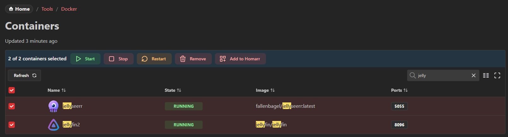
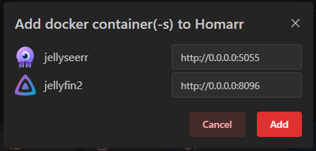
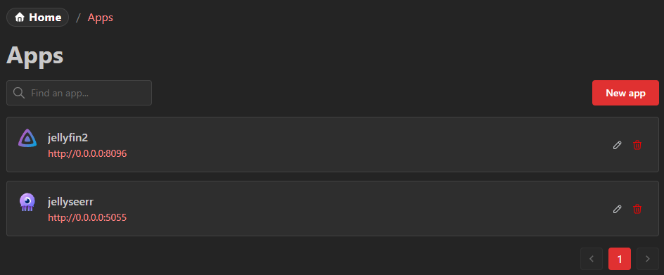

import { IntegrationHeader } from "@site/src/components/integrations/header";
import { IntegrationCapabilites } from "@site/src/components/integrations/widgets";
import { IntegrationSecrets } from "@site/src/components/integrations/secrets";
import { IconBrandDocker, IconTool } from "@tabler/icons-react";
import { dockerIntegration } from ".";
import { dockerContainersWidget } from "@site/docs/widgets/docker-containers";

<IntegrationHeader integration={dockerIntegration} categories={["Containers"]} />

### Widgets & Capabilities

<IntegrationCapabilites
  items={[
    {
      widget: dockerContainersWidget,
      note: "This widget can only be used with administrator privileges",
    },
  ]}
/>

## Enabling the Docker integration

This integration must first be enabled.
If you directly run on the host system and you have docker installed, it will be enabled by default.
Otherwise, you'll need to mount the [docker socket](https://docs.docker.com/engine/security/protect-access/) to the Homarr container,
so Homarr can interact with the Docker service.

In Docker Compose, you can simply add this line:

```yaml {10}
#---------------------------------------------------------------------#
#     Homarr - A simple, yet powerful dashboard for your server.      #
#---------------------------------------------------------------------#
services:
  homarr:
    container_name: homarr
    image: ghcr.io/homarr-labs/homarr:latest
    restart: unless-stopped
    volumes:
      - /var/run/docker.sock:/var/run/docker.sock # <--- add this line here!
      - ./homarr/appdata:/appdata
    environment:
      - SECRET_ENCRYPTION_KEY=your_64_character_hex_string # <--- can be generated with `openssl rand -hex 32`
    ports:
      - "7575:7575"
```

With docker run, add this parameter: `-v /var/run/docker.sock:/var/run/docker.sock`.
In Windows, you'll need to adjust the slashes: `-v //var/run/docker.sock:/var/run/docker.sock`

### Using Podman

On Linux, Homarr can connect to Podman's [Docker-compatible API](https://docs.podman.io/en/latest/markdown/podman-system-service.1.html).
The Podman API socket must be running and mounted into the Homarr container.
The socket grants full access to Podman, including arbitrary code execution as the user running the API, so only mount it into trusted containers.

For rootless Podman, enable the socket for the user that runs Homarr:

```bash
systemctl --user enable --now podman.socket
```

The rootless socket is located at `$XDG_RUNTIME_DIR/podman/podman.sock` (usually `/run/user/<uid>/podman/podman.sock`).
You can confirm the path with:

```bash
podman info --format '{{.Host.RemoteSocket.Path}}'
```

Mount that socket into the Homarr container and point `DOCKER_SOCKET_PATHS` to its path **inside** the container:

```yaml
services:
  homarr:
    container_name: homarr
    image: ghcr.io/homarr-labs/homarr:latest
    restart: unless-stopped
    volumes:
      - ${XDG_RUNTIME_DIR}/podman/podman.sock:/var/run/podman.sock
      - ./homarr/appdata:/appdata
    environment:
      SECRET_ENCRYPTION_KEY: your_64_character_hex_string
      DOCKER_SOCKET_PATHS: /var/run/podman.sock
    ports:
      - "7575:7575"
```

Start Homarr with `podman compose up -d`.
Run the compose project as the same user that owns the rootless Podman socket so `$XDG_RUNTIME_DIR` resolves to the correct path.
To keep the user socket available after logout and across reboots, enable lingering with `loginctl enable-linger <user>`.

For rootful Podman, enable the system socket with `sudo systemctl enable --now podman.socket`.
Its default path is `/run/podman/podman.sock`; mount that path instead and start Homarr with `sudo podman compose up -d`.

:::note SELinux
On systems with SELinux enabled, Podman's documentation recommends disabling label separation for a container that accesses the API socket.
Add the following to the Homarr service:

```yaml
security_opt:
  - label=disable
```

:::

You can connect Homarr to multiple Docker-compatible sockets by mounting each socket and listing their in-container paths, separated by commas:

```yaml
services:
  homarr:
    image: ghcr.io/homarr-labs/homarr:latest
    volumes:
      - /var/run/docker.sock:/var/run/docker.sock
      - ${XDG_RUNTIME_DIR}/podman/podman.sock:/var/run/podman.sock
    environment:
      DOCKER_SOCKET_PATHS: /var/run/docker.sock,/var/run/podman.sock
```

For named endpoints, transport security, or least-privilege actions, prefer `DOCKER_ENDPOINTS`. It is a JSON array where every endpoint declares its identity, transport, and capabilities:

```yaml
services:
  homarr:
    volumes:
      - /var/run/docker.sock:/var/run/docker.sock
      - ./docker-ca.pem:/run/secrets/docker-ca.pem:ro
    environment:
      DOCKER_ENDPOINTS: >-
        [
          {
            "id": "local",
            "name": "Local Docker",
            "kind": "docker",
            "transport": { "type": "socket", "path": "/var/run/docker.sock" },
            "capabilities": ["inventory", "logs", "lifecycle", "remove"]
          },
          {
            "id": "remote-read-only",
            "name": "Production inventory",
            "kind": "docker",
            "transport": {
              "type": "tls",
              "host": "docker.example.com",
              "port": 2376,
              "caPath": "/run/secrets/docker-ca.pem"
            },
            "capabilities": ["inventory", "logs"]
          }
        ]
```

The stable `id` keeps containers from different endpoints distinct. `name` is shown in the interface, and `kind` can be `docker` or `podman`. Every endpoint must include the `inventory` capability; optionally add `logs`, `lifecycle`, and `remove`. Homarr hides or disables actions the endpoint does not allow and also enforces the same capabilities on the server.

Supported transports are:

- `socket`: an absolute in-container `path`
- `tls`: `host`, `port`, and an absolute `caPath`; add both `certPath` and `keyPath` for mutual TLS
- `tcp`: `host`, `port`, and the explicit acknowledgement `allowInsecure: true`

:::warning[Plaintext TCP]
Plaintext Docker TCP can grant unauthenticated control of the Docker host. Prefer a local socket, a least-privilege socket proxy, or TLS. The structured configuration refuses TCP unless `allowInsecure` is explicitly set to `true`.
:::

When `DOCKER_ENDPOINTS` is set, it takes precedence over the legacy `DOCKER_SOCKET_PATHS`, `DOCKER_HOSTNAMES`, and `DOCKER_PORTS` variables.

### Managing your Docker containers within Homarr

Homarr allows you to interact with Docker containers running on your system.
The **Service setup** section compares the visible containers with your existing Homarr apps and integrations. It keeps every service distinct by Docker endpoint and container ID, including multiple containers that use the same integration type.

Homarr can show a service as:

- **Ready to connect** when its image or name matches a supported integration
- **New service** when it can be added as an app but no integration is recognized
- **Already represented** or **Linked** when an app or integration already matches
- **Address changed** when a service appears to match an integration but its reachable address has changed

Suggested addresses are ranked and explain where they came from. A published address or Docker endpoint host is normally usable from a browser; a container-name address is server-only and requires Homarr to share the container network. Wildcard addresses such as `0.0.0.0` are never offered as browser destinations. You can edit every suggestion before continuing.

:::info[Review before changing]
Service discovery is read-only. Homarr never creates or changes an app or integration automatically; use the action on an individual suggestion to review and confirm its setup.
:::

Use the inbox filters to focus on services that need attention or those already represented in Homarr. Refresh runs discovery again. Dismissed suggestions are stored in the current browser using their endpoint-qualified service identity and can be restored from the same panel. If multiple existing items could match, Homarr marks the result as ambiguous and does not choose one automatically.

The health badges are an evidence-based projection across Docker, integration configuration, app representation, and persisted widget links. Authentication, API request success, and widget query execution are labeled **Not observed** because Homarr does not currently retain trustworthy last-run results for these layers. Use the suggested integration test or board action to diagnose them live; **Not observed** is never presented as healthy.

If one Docker endpoint is unavailable, Homarr reports that endpoint while continuing to show services from healthy endpoints. An unavailable endpoint is not treated as an empty Docker installation.

Each container row has an action menu with the following options:

- **View logs** - opens a dedicated logs page with a live terminal
- **Start** - start a stopped container
- **Stop** - stop a running container
- **Restart** - restart a container
- **Remove** - remove a container
- **Add to Homarr** - create a bookmark app from the container

You can also search and filter containers by **container** or **image** name:



#### Viewing container logs

You can view the real-time logs of any container by selecting **View logs** from the row action menu.
This opens a dedicated page with an xterm.js terminal that streams the container's log output.

#### CPU and Memory columns

The Docker management table supports optional **CPU usage** and **Memory usage** columns.
These columns are hidden by default and can be toggled on from the table column visibility settings.

#### Add apps from containers

Homarr also lets you add apps from containers. You can simply select all containers you want to add an app for and then click the `Add to Homarr` button.
This will open a dialog where you can specify the web addresses for all of them:



Once you've changed the web addresses, click the `Add` button to add the apps to Homarr.
They are then available in the app list and can be used as normally added apps.



### Container labels

`homarr.hide` excludes a container from the Docker Containers widget, tools page, and onboarding discovery whenever the
label is present.

During first-run onboarding, Homarr can also discover apps, integrations, groups, and compatible widgets from
`homarr.*` labels, with Homepage labels as a fallback. See the complete [Docker label reference](/docs/integrations/docker-labels).

### Security

Mounting docker sockets can be risky, as they permit full control over your docker service.
As an example, a thread actor could abuse Homarr use the socket to start, stop or delete containers on your system.

Therefore we recommend the usage of a socket proxy, which can prohibit certain actions.
A few examples include:

- https://github.com/linuxserver/docker-socket-proxy
- https://github.com/Tecnativa/docker-socket-proxy

See documentation of the respective proxies on how to configure them.
Homarr may behave in unexpected ways when you use proxies.

#### Permissions

Homarr needs the following permissions from the Docker API:

- Containers/Start
- Containers/Stop
- Containers/Restart
- Containers/Remove

For socket proxies, you will need these permissions:

- `CONTAINERS=1`
- `POST=1`

**Caution:** `POST` access is security critical as it provides extensive capabilities to modify your docker environment. Please leave it disabled if you're concerned about this.

As a workaround, you can use [LSIO's socket proxy](https://github.com/linuxserver/docker-socket-proxy) and set the following:

- ALLOW_START=1
- ALLOW_STOP=1
- ALLOW_RESTARTS=1

These will work even with `POST=0`.

You lose the ability to remove containers, but start, stop and restarts should work just fine.

#### Connecting to Docker via Socket Proxies

To connect to Docker via a socket proxy, you'll need to add these two environment variables in the compose file:

- `DOCKER_HOSTNAMES=<name of the socket proxy container>`
- `DOCKER_PORTS=<socket proxy port, usually 2375>`

Refer: https://homarr.dev/docs/advanced/environment-variables/

You will also need to add Homarr to the network of your socket proxy. You can do it like this:

1. Add the network to your compose file (with appropriate changes):

```yaml
networks:
  socket-proxy:
    name: socket-proxy # <--- change this to the name of the network as set up by the socket proxy
    external: true
```

2. Add the network to the homarr service in the compose file:

```yaml
networks:
  - socket-proxy
```

3. Finally, if it is present, remove the default docker socket connection under `volumes` in the homarr service.
