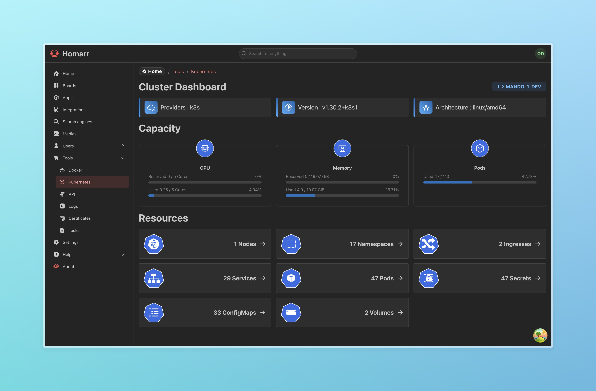

import { IntegrationHeader } from "@site/src/components/integrations/header";
import { IntegrationCapabilites } from "@site/src/components/integrations/widgets";
import { IntegrationSecrets } from "@site/src/components/integrations/secrets";
import { IconBrandDocker, IconTool } from "@tabler/icons-react";
import { kubernetesIntegration } from ".";

<IntegrationHeader integration={kubernetesIntegration} categories={["Containers"]} />

Homarr provides a user-friendly Kubernetes dashboard that offers an overview of your cluster’s resources in a clear and structured interface. It allows users to view key Kubernetes objects, including `Pods`, `Services`, `Ingresses`, `Nodes`, `ConfigMaps`, `Secrets`, `Namespaces`, and `Volumes`, as well as basic metrics when the Kubernetes Metrics Server is enabled.

Docker service discovery does not convert Kubernetes resources into Homarr apps or integrations. Kubernetes remains a separate, read-only operational view, so a cluster resource is never changed or linked automatically.

:::warning[Read only]
This integration is read-only, meaning Homarr does not modify or manage cluster resources but serves as an informational tool to enhance visibility into your Kubernetes environment.
:::



### Prerequisites

Before deploying Homarr in Kubernetes, ensure the following prerequisites are met:

- Kubernetes (Version >= 1.24.0)
- Metrics Server ([install from here](https://github.com/kubernetes-sigs/metrics-server)) is optional. Without it, Homarr still shows cluster inventory, node status, and reserved capacity, and identifies live CPU and memory usage as unavailable.
- RBAC Enabled (Required for Homarr Helm chart)

### Configuring RBAC in Helm Chart

To enable RBAC for Homarr, configure the Helm chart values file as follows:

```yaml
rbac:
  enabled: true
```

:::tip[What Does rbac.enabled Do?]
Enabling RBAC in the Helm chart creates the necessary Kubernetes Role-Based Access Control (RBAC) resources to allow Homarr to view various Kubernetes objects. These include:

- Service Account: A dedicated service account for Homarr.
- Role & RoleBinding: Grants permissions within a specific namespace to list, watch, and get pods, services, secrets, configmaps, and more.
- ClusterRole & ClusterRoleBinding: Extends the same permissions cluster-wide for additional flexibility.
  :::

### Multiple Kubernetes contexts

When Homarr runs outside a cluster, set `KUBECONFIG` explicitly so Homarr loads the contexts from the referenced kubeconfig file or files. Mount the kubeconfig read-only and set the standard `KUBECONFIG` environment variable to its path inside the Homarr container:

```yaml
services:
  homarr:
    volumes:
      - ./kubeconfig:/app/config/kubeconfig:ro
    environment:
      KUBECONFIG: /app/config/kubeconfig
```

The Kubernetes management pages include a context selector. The selected context is stored in the page URL, so each React Query cache entry and every API request remains context-specific. Resources with the same namespace and name in two contexts therefore remain separate.

Context status is checked independently. If one context is unavailable, the selector still lists healthy contexts. A context is shown as **Metrics unavailable** when its Kubernetes API is reachable but Metrics Server is not; inventory remains available without live CPU and memory usage.

When Homarr runs inside Kubernetes without `KUBECONFIG`, it keeps using the in-cluster service account as the single default context.

### Homarr Dashboard Overview

Once deployed, Homarr provides a dashboard displaying Kubernetes metrics and resource information. The main page includes:

- Pods: Lists running and pending pods.
- Services: Shows available services and their configurations.
- Ingresses: Displays ingress rules and associated routes.
- Nodes: Provides an overview of cluster nodes and their status.
- ConfigMaps & Secrets: Lists configuration data and secrets used within the cluster.
- Namespaces: Displays all available namespaces in the cluster.
- Volumes: Shows persistent and ephemeral storage resources.
