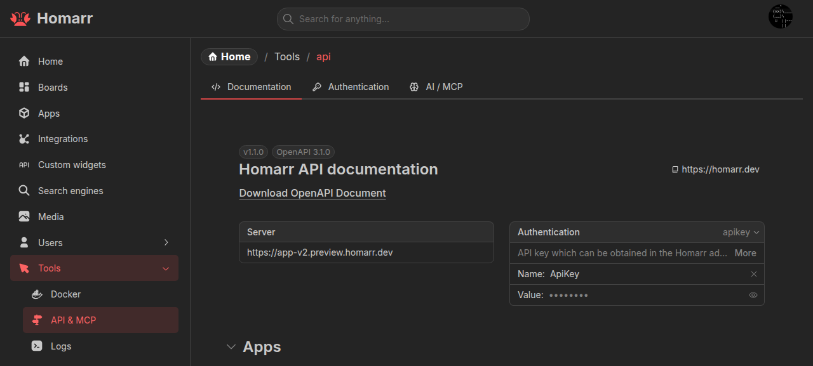

Homarr exposes OpenAPI and tRPC endpoints for automation. Open the generated specification under
**Management → Tools → API** or use the [interactive API reference](/api-reference).



## Authentication

Create an API key from the **Authentication** tab. Its value has the form `<id>.<token>` and is shown once.

Send it in the `ApiKey` header:

```sh
curl -H 'ApiKey: <id>.<token>' https://homarr.example.com/api/health/live
```

The same header authenticates tRPC requests under `/api/trpc`. Without a key, browser requests can use the Homarr
session cookie.

API keys do not expire automatically and act as the user that created them. Every request uses that user's group and
resource permissions.

## Permission behavior

Unauthorized operations return `FORBIDDEN`. List endpoints filter records on the server when resource-specific access
applies.

App catalog endpoints such as `app.all`, `app.getPaginated`, and `app.search` require **Modify all apps** because they
include internal URLs. Use `app.selectable` for the reduced board-picker fields.

Integration list and search endpoints return only integrations the key owner can access. Check each integration's
`hasUseAccess` and `hasInteractAccess` fields before reading data or invoking actions.

## Board automation

The API can create, duplicate, rename, delete, and configure boards; manage board content; and set desktop or mobile home
boards.

Each board has exactly one Mobile and one Base layout. Mobile uses breakpoint `0`; all breakpoints are unique. Custom
layouts can use any other breakpoint, and Homarr selects the highest breakpoint that fits the viewport. Preserve layout
roles and use the canonical layouts returned by save operations, including generated IDs.

Creating or changing an integration-backed widget requires use access to each newly selected integration.

## Docker targets

Docker actions identify both the configured endpoint and the container:

```json
{
  "targets": [{ "endpointId": "local", "id": "container-id" }]
}
```

Read both values from `docker.getContainers` immediately before calling `docker.startAll`, `stopAll`, `restartAll`, or
`removeAll`. The endpoint ID prevents collisions between Docker or Podman hosts.

`docker.getContainers` accepts optional `endpointIds`. Omit it or pass an empty array for every configured endpoint.

## Partial upstream failures

Queries that combine several integrations can return healthy data alongside failure metadata. The exact response shape
depends on the endpoint; inspect the generated schema instead of assuming a common `error` field. When every selected
integration fails, the query returns an error.

## Custom Widget resources

Authenticated administrators can retrieve the current Custom Widget authoring prompt, schema, component catalog, skill,
and focused references under `/api/custom-widgets/`.

Use [Custom Widget agent authoring](../custom-widgets/agent-authoring) for the lifecycle and
[MCP](../mcp) when the client supports Model Context Protocol.
