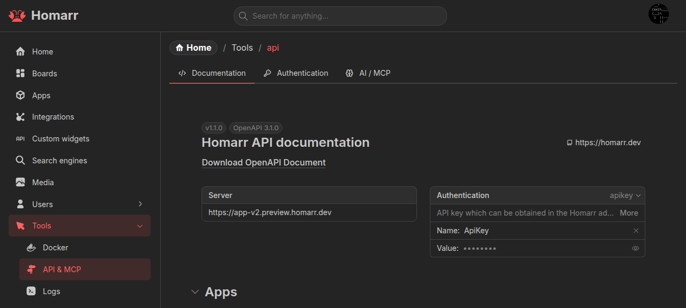

Use the generated specification under **Management → Tools → API** or the [interactive API reference](/api-reference).
This page covers contracts that are not obvious from those schemas.
The in-app reference loads its schema from `/api/openapi?format=scalar` on your Homarr instance. `/api/openapi` provides the raw JSON specification.



## Authentication and browser access

API keys are shown once as `<id>.<token>`. Send one in the `ApiKey` header; it acts as its creator and does not expire.
tRPC accepts the same header. Same-origin browser requests can use the Homarr session cookie.

Cross-origin browser requests require `ApiKey`; they do not use session cookies. Reverse proxies must forward `OPTIONS`
and preserve CORS headers. An HTTPS API reference cannot call an HTTP-only instance because browsers block mixed content.

## Endpoint constraints

- General pagination and shared search are capped at 100 records.
- `POST /api/invites` and `invite.createInvite` accept `expirationDate` as a timezone-qualified ISO 8601 string.
- `GET /api/health/live` is unauthenticated and returns `200` when all dependencies are healthy, `500` otherwise.

`widget.immich.getAlbumPreview` returns at most one image from a selected album. Its input includes `albumId` and
`randomizePhotos`; it uses the same saved-integration access rules as `widget.immich.getAlbum`. Use `getAlbum` for the
complete album image list.

## Permissions and results

Requests use the API key owner's permissions. Unauthorized operations return `FORBIDDEN`; resource-aware lists are
filtered on the server.

`app.all`, `app.getPaginated`, and `app.search` require **Modify all apps** because they include internal URLs. Use
`app.selectable` for reduced picker data. Integration lists include only accessible integrations; check `hasUseAccess`
and `hasInteractAccess` before reading data or invoking actions.

Multi-integration queries can return partial data with endpoint-specific failure metadata.

## Board automation

Boards have Base and Mobile layouts; Mobile uses breakpoint `0`. Additional breakpoints must be unique.
A layout can reserve sidebar columns, leaving the remaining columns for the main canvas. Container sections form
nested grids whose contents must fit their width.

Item placement shorthand applies to every layout, clamping width to the available columns. Use `layouts` to set
individual placements. Omit coordinates for automatic placement; specify coordinates to require a free position.
Partial item and section updates retain omitted fields. Integration-backed widgets require use access to newly selected
integrations; configuring Custom Widget placements requires administrator access.

Board import generates fresh content IDs. `onConflict: "skip"` keeps an existing board; `"replace"` exchanges its content
in one transaction while retaining its ID, home-board references and permissions. The default `"fail"` returns `409`.
Board creation/import names allow letters, digits, hyphens and underscores; full configuration import also accepts
legacy names. Permission updates replace the corresponding user or group access list.

## Root CA automation

Administrators can inspect a named CA with `GET /api/certificates/{fileName}` (`certificates.getCertificate`) or
create it with `POST /api/certificates/root` (`certificates.ensureRootCertificate`), using JSON `{ fileName, certificate }`.
Names are limited to 128 characters, start with a letter or digit, contain only letters, digits, dots, underscores and
hyphens, and end in `.crt` or `.pem`. Supply one currently valid self-signed PEM root CA, at most 64 KiB, without a chain
or private key.

Inspection returns public metadata or `null` when absent. Creation returns `{ created, certificate }`; identical PEM
bytes return `created: false`, while different existing bytes or unsafe file paths return `CONFLICT` without replacement.
`sha256` hashes the exact UTF-8 PEM bytes, including whitespace; `fingerprint256` identifies the DER certificate.
Dates are ISO 8601. Certificate contents are never returned. Expired stored roots remain inspectable. Trust applies to
subsequent integration requests without a restart; it does not bypass hostname verification.

## Docker targets

Docker actions require `{ endpointId, id }` targets from `docker.getContainers`; `endpointId` distinguishes hosts.
Omit `endpointIds` or pass an empty array to query every configured endpoint.

### Obtaining the first API key without the web interface

Creating an API key normally requires signing in once. For fully automated setups the
[command line interface](../../advanced/command-line/) can do both steps instead:

```bash
# Only needed when no credentials admin exists yet
docker exec -it <container-id> homarr recreate-admin -u admin

# Prints "<id>.<token>" once, store it somewhere safe
docker exec -it <container-id> homarr api-keys create -u admin
```

See [API keys](../../advanced/command-line/api-keys/) for the other available commands.

## Custom Widget resources

Administrators can retrieve the Custom Widget authoring prompt, schema, component catalog, skill, and references under
`/api/custom-widgets/`. See [agent authoring](/docs/management/custom-widgets/agent-authoring) for the workflow.

## Call any integration API endpoint

`POST /api/integrations/request` is available as tRPC `integration.request` and MCP `integration_request`. Homarr uses
the saved integration credentials; callers do not supply them. The `path` stays within the saved integration URL, and
redirects are rejected. See the generated schema for selectors, permissions, and request limits.

Even `GET` can change upstream state. Homarr `200` can contain an upstream failure; inspect `ok`, `status`, and `data`.
Requests are not retried, so check upstream state after a timeout before retrying a write.

The iCalendar feed integration stores a calendar URL rather than arbitrary HTTP API credentials. TrueNAS uses a WebSocket
API. Neither works with `integration_request` or Custom Widget integration sources. qBittorrent generic requests require
a saved API key and qBittorrent 5.2.0 or newer. UniFi generic requests require the controller's HTTPS URL and actual port.

## REST and tRPC scope

REST covers dashboard composition, access, configuration transfer, resource provisioning and preferences.
Use tRPC for integration-specific widget queries/actions, Docker and Kubernetes controls, uploads, and other
advanced operations. Both transports accept the same `ApiKey` header and enforce the same user permissions.

The generated reference documents the supported REST surface. For tRPC, use Homarr's exported `AppRouter` type
and the procedure names used by the application; these remain coupled to your Homarr version.

## Partial preference updates

Read preferences with `GET /api/users/preferences`, then update only the values you want to change with
`PATCH /api/users/preferences`. For example, `{ "colorScheme": "light" }` changes only the color scheme;
`{ "headerPreferences": { "visible": false } }` changes only header visibility. Omit `userId` to target yourself;
another user requires administrator permission.

Omitted fields stay unchanged. `null` clears home-board and search-engine references. Header fields and zones merge;
each supplied zone array replaces that zone and must retain unique items and account access. All validation completes
before one write. Older preference routes remain available in the reference's compatibility section.

Server settings follow the same partial-update pattern: `PATCH /api/settings` with
`{ "settingsKey": "board", "value": { "enableStatusByDefault": false } }` changes only that setting.
Nested branding flags merge with their existing values.

## Full configuration

Configuration export/import covers server settings, apps, integrations, search engines, groups and their permissions,
and boards with group access. IDs are preserved because widget options can reference them. Entities match by ID first,
then by group name, board name or search-engine trigger. `onConflict` accepts `fail`, `skip` or `replace`; settings always
merge. Replacement retains board IDs and their user permissions. Analytics installation identifiers stay local to the
receiving instance. Unknown setting groups/fields and invalid references are rejected before writes.

This document excludes users, memberships, per-user board permissions, integration secret values, Custom Widget
definitions, uploaded media and widget secrets. Transfer definitions and media separately. Integration secrets can be
supplied on import as `secrets: [{ kind: "apiKey", value: "..." }]`. Replacing board content removes its widget secrets.

## Backup and restore

`GET /api/backup/export` downloads the SQLite database as a zip; `POST /api/backup/import` restores one.
Both accept the `ApiKey` header. These binary endpoints are available only with SQLite and are separate from the JSON
OpenAPI interface. Use them for a complete database copy including users, definitions, media and secrets.

```bash
curl -H 'ApiKey: <id>.<token>' -o homarr-backup.zip http://localhost:7575/api/backup/export
```
