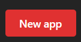
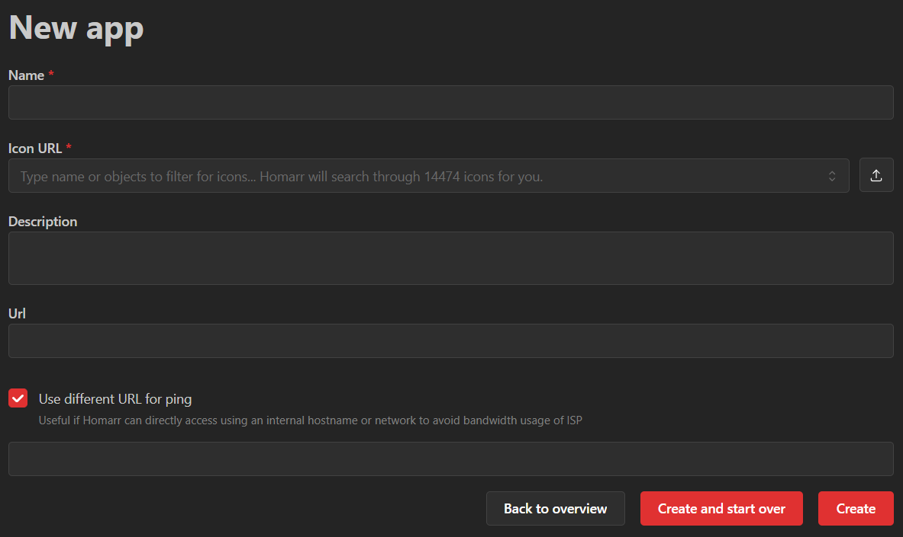
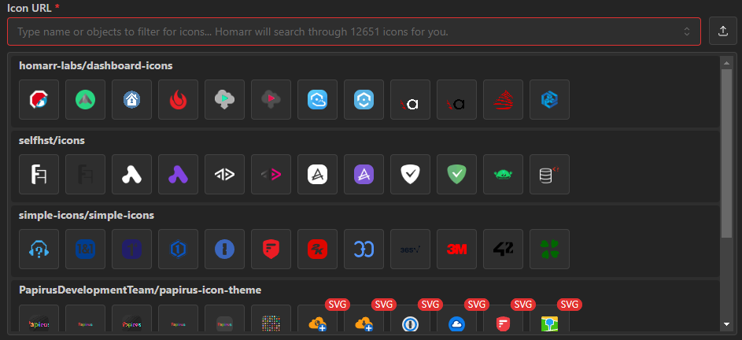

Apps are the building blocks of your Homarr board.
Most of the time they are a simple link to a website, but used on your board they also support a simple ping to check if your service is up.
Apps are used in the bookmark and app widget.

## Create an app

To create an app you can click on the button on the top right of the apps management page:

Next, you'll need to fill out the required fields to configure the app:

### Name

The name must be at least one character long and can be chosen freely.

### Icon URL

This is the URL to the icon that will be displayed on the app widget.
You can paste a direct HTTP(S) URL to an image, search the included icon repositories by name, or upload a local file through the upload button. The app name is pre-filled as the initial library search when no image is selected. Local images appear first, followed by SVG icons and other formats. Direct image URLs are previewed, used as entered, and are not searched in the icon repositories.

### Description

An optional description that can be shown as tooltip on the app widget.

### URL

The URL to the website you want to link to. Clicking on the app widget or bookmark will open this URL.

You can also use custom URI schemes such as `vscode://file/path`, `microsoft-edge:https://example.com`, or `myapp://open` to link to local applications or third-party programs. We trust that you know what you are doing — only `javascript:` URIs are blocked for security reasons.

### Ping URL

When you want to use another url for the simple status check you can set it here.
This will allow you to set a different URL for the ping than the URL that is opened when clicking on the app widget.
It's useful when you want to ping the service internally for example with a custom ip but open the website externally.
Note that the ping URL only accepts `http://` and `https://` URLs — custom URI schemes are not supported for pings.

## List of apps

On the apps management page you find all apps that exist in your Homarr instance. Search by name or URL, open an app
directly, or use its row actions to edit and delete it. A filtered search can be cleared without leaving the page.

### Accessing the page

The `/manage/apps` page is reachable when you can manage all apps (`app-modify-all`) or create apps (`app-create`):

- **Manage all (`app-modify-all`)**: the full list of apps is shown and searchable, and each row can be edited.
- **Create only (`app-create`)**: the page shows an empty "create an app" state instead of the list, so the names and
  URLs of existing apps are never disclosed. The create action is still available.
- **Neither**: the page is not reachable and returns a not-found page.

Creating an app requires `app-create`, editing requires `app-modify-all`, and deleting requires `app-full-all`;
board permissions are not required.
