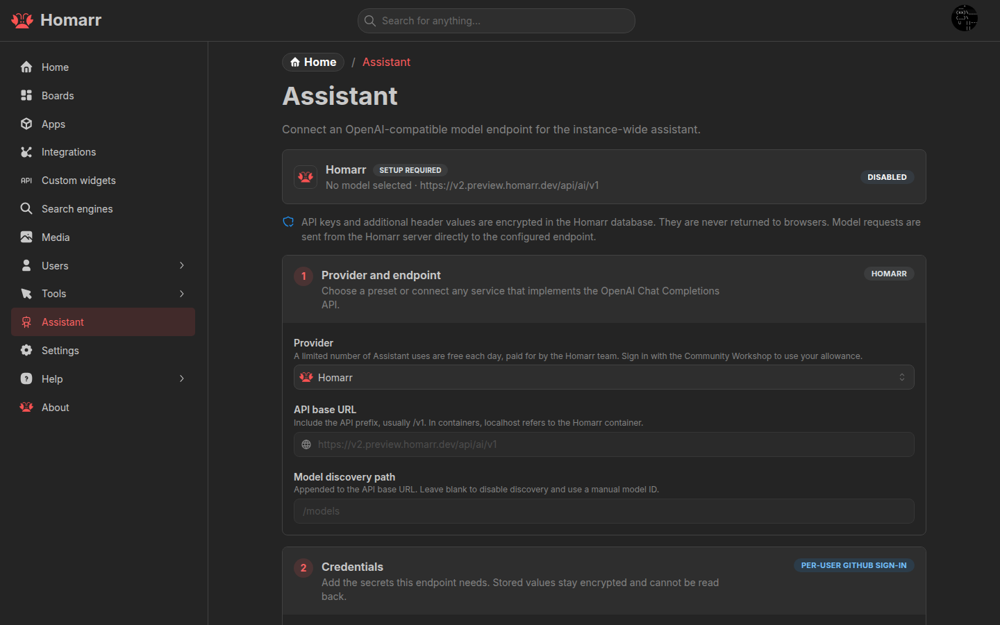

# Assistant

Assistant answers questions and operates Homarr through the signed-in user's permissions. Read-only tools can run
automatically; changes require approval by default.

## Configuration

Under **Management → Assistant**, select a provider, configure its API URL and key when required, select a model, and
enable Assistant.

Provider presets cover common APIs. **Custom endpoint** accepts an OpenAI-compatible Chat Completions API. For a model
server outside the Homarr container, use a hostname that the container can resolve instead of `localhost`.

The [Homarr provider](../workshop/homarr-provider) is available through the Community Workshop without an administrator
API key and has a daily request allowance.

## Access

Open Assistant from the user menu, with `Shift+A`, from search with `Cmd/Ctrl+/`, or through the
[Assistant widget](../widgets/assistant).

Assistant can work with boards, apps, integrations, widgets, Custom Widgets, and supported connected services. Mention
Homarr resources with `@`; the model loads additional live context only when needed.

Conversations are stored per user and can be searched, renamed, exported, or deleted.

## Permissions and data

- Every tool call uses the current user's Homarr permissions.
- Automatic approvals apply only to the current conversation and reset when switching conversations.
- Provider keys and custom headers are encrypted and are not returned to the browser.
- Prompts, attachments, tool definitions, and tool results are sent to the selected model provider.

See [MCP](./mcp) to connect an external AI client and
[Custom Widget agent authoring](./custom-widgets/agent-authoring) for widget generation.

## Troubleshooting

- **No models found:** check the API URL, discovery path, and API key, or enter a model ID manually.
- **Assistant is unavailable:** enable it and save the configuration.
- **Tool calls stop:** use a model that supports streaming and tool calls.
- **Local endpoint is unreachable:** check container DNS, routing, and the model server's listen address.
