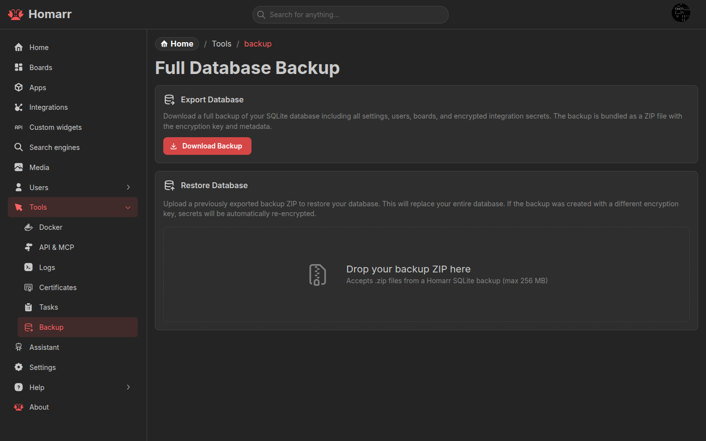

---
tags:
  - Backup
  - SQLite
  - Management
  - Data
---

# Backup and restore

Administrators using SQLite can export and restore the complete Homarr database under
**Management → Tools → Backup**. MySQL and PostgreSQL installations must use their database-native backup tools.

## Export

The ZIP contains:

| File            | Contents                                                    |
| --------------- | ----------------------------------------------------------- |
| `db.sqlite`     | Apps, integrations, boards, users, settings, and other data |
| `metadata.json` | Homarr version, backup timestamp, and encryption metadata   |

Export requires typing `I understand`. Store the ZIP as sensitive data: it contains the database and the material
needed to restore encrypted integration credentials.

## Restore

Select a Homarr backup ZIP. The browser previews entity counts, board names, and required database migrations before
the archive is uploaded.

Restoring replaces the current SQLite database and cannot be undone. It also invalidates the current database session.
After a successful management restore, Homarr waits for the restarted server and sends the administrator to sign in
again. The first-run onboarding restore keeps its existing board destination.

A backup can be restored on another Homarr instance. When its `SECRET_ENCRYPTION_KEY` differs, Homarr re-encrypts stored
integration secrets for the target instance. Version metadata is used to apply compatible migrations.

The same restore flow is available during first-run onboarding, before the target database contains user data.

## Custom widget packages

Database backups include installed v2 definitions and trusted v3 source, compiled artifacts, current and previous
activation metadata, local connections, placement bindings, guest grants, and managed widget storage/history.
Restoring an encrypted backup re-encrypts widget credentials with the destination instance's key alongside native
integration credentials. Compiled artifacts can be materialized again from the restored database without Workshop.

Keep `SECRET_ENCRYPTION_KEY` with database backups made using MySQL or PostgreSQL administration tools. The built-in
ZIP export/restore remains specific to SQLite. A package export is portable distribution material and deliberately
excludes local connections, credentials, stored values, and collected history; it is not a complete instance backup.

Files created directly by trusted Node code, external databases, remote-runner state, and changes already made to
other applications are outside Homarr's managed widget storage. Include those resources in your own backup process.
