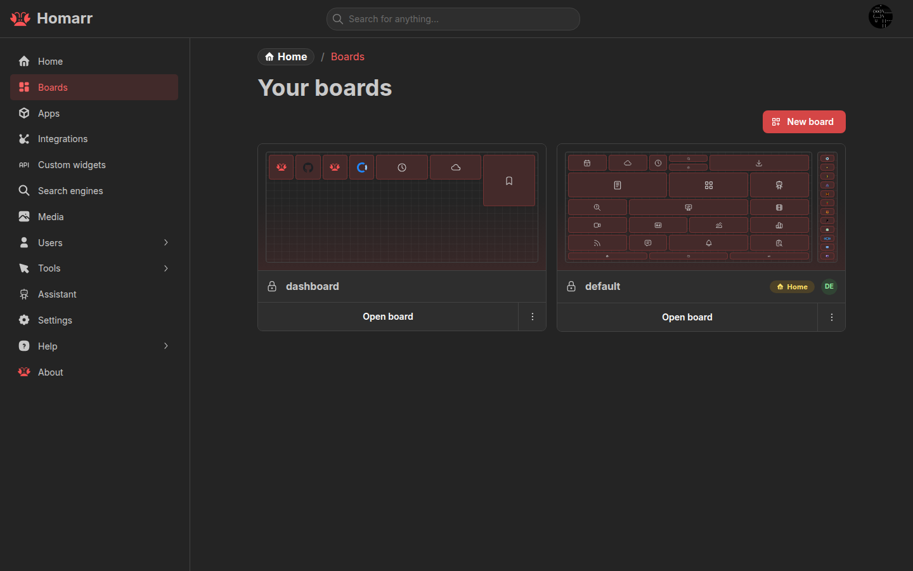

import { BoardLayoutsDiagram } from "@site/src/components/pages/core-concepts/technical-diagrams";

A **board** is a dashboard page containing apps, widgets, and Containers. Its name is unique and forms the board URL.
Boards can be public or restricted to users and groups.

Create, duplicate, open, and delete boards under **Management → Boards**. Press `Shift+C` from a board to open the
board switcher.

## Responsive layouts

<BoardLayoutsDiagram />

Mobile and Base are protected layouts. New boards use three Mobile columns; Base uses the column count selected at
creation. Additional layouts use unique breakpoints. Homarr selects the layout with the highest breakpoint that fits
the current viewport.

Tiles use fixed `200 × 200` logical-pixel cells with a `24px` gap. Homarr scales the complete layout to the available
width instead of changing each widget's proportions. **Reset from Base** regenerates a Mobile or custom layout from the
current Base layout.

### Containers and rails

A **Container** groups apps, widgets, and nested Containers. It can have a label, collapse control, app-opening action,
border color, and CSS classes.

A **rail** reserves one to three columns at the left or right of a non-Mobile layout. Rails stay fixed while the page
scrolls and store their contents separately for each layout.

## Edit a board

Enter edit mode from the board header to add, move, resize, configure, or remove content. Save the board to persist the
layout.

- Drag from an item's inactive content area; Containers use their grip.
- Hold `Ctrl` on Windows/Linux or `Cmd` on macOS to select several items.
- Use **Move / resize item** for another canvas, rail, Container, or exact coordinates.
- Keyboard users can focus a tile, press Enter or Space, then move with arrow keys or resize with Shift + arrow keys.
- Press Escape during a pointer or touch interaction to restore the item to its previous position.

The add-content menu can create an app, integration, widget, or Container without leaving the board.

## Board settings

Board settings cover:

- **General:** page title, browser title, logo, and favicon.
- **Layout:** responsive layouts, breakpoints, columns, and rails.
- **Background:** image, attachment, size, and repeat behavior.
- **Appearance:** colors, opacity, icon color, and item radius.
- **Custom CSS:** styles applied only to the current board.
- **Behaviour:** app status and widget context-menu behavior.

See [Styling](/docs/advanced/styling) for board and global CSS.

Outside edit mode, widgets may expose an advanced view and a context menu for status, refresh, quick options, settings,
and actions. Available controls depend on the widget and the user's board and integration permissions.

## Access control

Public boards are readable without signing in. Private boards require user, group, or global access.

| Board access | View | Edit content and settings | Access control, rename, delete |
| ------------ | ---- | ------------------------- | ------------------------------ |
| View         | Yes  | No                        | No                             |
| Modify       | Yes  | Yes                       | No                             |
| Full         | Yes  | Yes                       | Yes                            |

Inherited access comes from group permissions. Resource-specific access can be granted from the board's access-control
section.

Renaming a board changes its URL without a redirect. Deleting a board is permanent.

## Home boards

A **home board** opens at `/` and `/boards`. Desktop and mobile home boards are separate from the responsive layouts
inside a board.

Defaults can be set for a user, group, or the whole server. User settings take priority, followed by matching groups,
the `Everyone` group, and server defaults. Server-wide fallback boards must be public.

See [Users and groups](../users) and [Server settings](../settings#boards).
