import iconColorImage from "./img/icon-color.png";
import itemRadiusImage from "./img/item-radius.png";
import layoutSettingsImage from "./img/layout-settings.png";
import layoutSettingsCustomRailsImage from "./img/layout-settings-custom-rails.png";
import boardViewModeImage from "./img/board-view-mode.png";
import boardEditModeImage from "./img/board-edit-mode.png";
import keyboardTileEditingImage from "./img/keyboard-tile-editing.png";

Each dashboard is called a "board".
You can create as many boards as you want.
Boards can be restricted to user groups.
A user may also have a "home board" which they will see at the root path (e.g. my-homarr.com or my-homarr.com/boards).
Other boards can be viewed by direct links (e.g. my-homarr.com/boards/smart-home) or via the management pages.
The management page includes a compact structural preview of each board's Base layout so you can recognize it before
opening it. Containers include their visible widgets and app icons instead of appearing empty.

Names of boards must be unique because this will be used in the URL to load the desired board.

Press `Shift+C`, or select **Switch board** from the user menu, to open the board switcher. It shows structural
previews of every board you can access, with your current board at the end. Home-board markers and creator avatars
match the board management view. Use the search field at the top, or simply start typing, to filter by name. Use the
arrow keys to move through the results and press `Enter` to open the selected board.

## Create a new board

When creating a board, the availability of the board name will be checked for you.

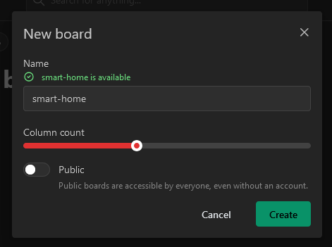

### Name

The name must not include any special characters and must be at least one character long.
Underscores and hyphen-minus are allowed.

### Column count

The column count defines how many fixed-width cells are available in each row.
One cell contains a `200 × 200` logical-pixel tile.
Homarr scales the whole board uniformly instead of changing widget proportions, and always fits it to the available width without horizontal scrolling.
The main canvas and enabled rails stay at least one viewport tall, and the canvas grows automatically while you drag or resize items near its lower edge.

### Public

This will enable public access for everyone - regardless of whether they are logged in or not.
This can be really useful if you want to have public boards in your company or for family and friends.
Modifications for public boards must be allowed explicitly using user groups and their permissions.

## Board settings

You navigate to the board settings by clicking on these three dots:

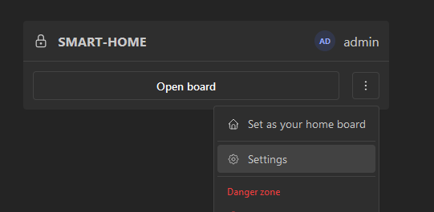

Alternatively, you can also navigate from the board page itself using the cog icon at the top right:

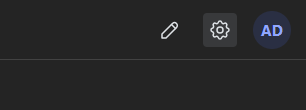

All board settings are edited on a single page. Click the **Save changes** button in the save bar at the bottom to apply them, or **Discard** to restore the last saved values. The save bar only appears when you have unsaved changes. Access control and the Danger zone are independent sections and are applied immediately.

### General

#### Page title

This is the title that will be visible at the top left in the navigation bar:

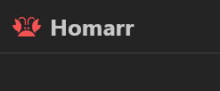

This field is optional and Homarr will fall back to "Homarr" if nothing is set.

#### Meta title

This is the secondary title of the page that is not directly visible in the page itself.
Browser will use it to set the title of tabs:

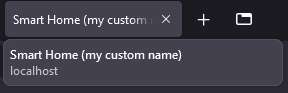

Homarr will fall back to the board name and a suffix if nothing is set.

#### Logo image URL

This is the URL that is used for the image at the top left.
Homarr will fall back to the Homarr logo if nothing is set.

#### Favicon image URL

This is the URL that is used for the favicon in the tab title.
Homarr will fall back to the Homarr logo if nothing is set.

### Layout

In this section you can configure the different responsive layouts. Homarr selects the layout with the highest breakpoint that is not wider than the current screen, then scales its complete fixed-size canvas uniformly.

The layout cards show the representative geometry used for planning. This current example also shows a custom layout
with both fixed rails enabled; the rails reserve columns and the remaining canvas reflows automatically.

Every board has two protected layouts. Creating a board adds **Mobile** at `0px` with three columns and **Base** at
`768px` with the column count you choose. Both layouts can be edited, but neither can be removed.

Every `1 × 1` tile has a `200 × 200` logical-pixel content area.
The `24` logical-pixel gap between tiles is separate from that size.
A `2 × 1` tile therefore contains two fixed cell widths plus the gap between them.
Widgets see their logical size, while the board's visual scale makes the complete layout larger or smaller.
When fitting below 100%, Homarr keeps widget typography and control density at their normal readable size.
On larger canvases, the complete board grows together like browser zoom.
The complete canvas always fits the available width and never adds horizontal board scrolling.

- **Mobile** starts at `0px` and uses three columns on new boards.
- **Base** is the widest layout and starts at `768px` on new boards.

Mobile and Base can be renamed and their column counts can be changed, but they cannot be removed. Mobile has no fixed
rails; rail configuration is available only on Base and custom layouts. You can add removable custom layouts between
their breakpoints.

Each layout stores independent positions and sizes. Moving or resizing a widget while editing Mobile does not move it in
Base or any custom layout. New custom layouts start from Base's current column count and rail widths; Homarr chooses a
free breakpoint between Mobile and Base, and you can then change the breakpoint, columns, and rails.

Older or incomplete boards are repaired automatically. A board with no layouts receives Mobile at `0px` with three
columns and Base at `768px` with ten columns. A board with one layout keeps it as Base and receives a generated Mobile
layout. With multiple layouts, the narrowest becomes Mobile, the widest becomes Base, and intermediate layouts remain
custom. Duplicate or out-of-order breakpoints are normalized without discarding saved positions.

Use **Reset from Base** on Mobile or a custom layout to replace all of its positions and sizes with a newly generated version of Base. The layout's name, breakpoint, and column count are kept.

The canvas is at least one window tall, even when it is empty.
Its left and right edges are hard drag boundaries, while its bottom edge extends automatically as a tile is dragged or resized downward.
Nested Containers keep their own resizable bounds.
New items use their widget's default size and new Containers use a useful `4 × 3` size when space allows.

#### Name

The name of the layout can be chosen freely. It is only used for management and is not displayed on the board.

#### Column count

The total number of columns in the layout. Changing it projects the saved positions and sizes into the new grid width without overlap.

#### Fixed rails

Each responsive layout can enable a fixed left rail, a fixed right rail, or both.
Set a rail width to zero to disable it for that layout.
Choose a width from one to three columns with the three-step slider.
The preview shows how much space remains for the main canvas.

Rail columns are reserved from the layout's total column count.
For example, a 12-column layout with a two-column left rail leaves ten columns for the canvas.
The combined rail widths cannot consume the final main-canvas column.
Enabling or widening a rail reflows canvas items into the remaining columns.
Disabling a rail moves its contents back into the next available canvas positions.

Rails fill the available window height and remain fixed while the page scrolls. They do not grow or scroll independently.
Apps, widgets, and Containers inside them still use the same fixed `200 × 200` cells and can be rearranged in edit mode, where each rail shows its name and boundary.

#### Breakpoint

The minimum screen width where the layout is used; a layout is eligible at its breakpoint and above. Mobile is fixed at
`0px`. Custom breakpoints must be unique and sit between Mobile and Base. Base must remain the highest breakpoint.
When the initial viewport is not available, Homarr uses its remembered viewport information, client hints, or User-Agent
fallback to select a layout.

#### View and edit modes

View mode renders a static board without executing the drag-and-drop editor.
After the board is interactive, Homarr prepares the editor in the background for users who can modify it.
Entering edit mode keeps the static board visible until that preparation finishes, then enables collision-aware movement and resizing.
Collapsed Containers are expanded while editing so their contents and controls are reachable.

Widget content is inert in edit mode, so dragging from the inert widget area moves the tile instead of activating the widget;
settings and other controls remain usable in the compact header above the tile.
A single compatible collision can swap two items when both resulting placements fit, including different-sized or lateral moves.
For other collisions, or when a tile grows into occupied space, nearby tiles are compacted out of the way and collision chains reflow.
The visible corner controls provide a 44-pixel resize target, and edge controls appear on hover for horizontal or vertical resizing.
Resize handles stop at the tile's minimum allowed size while the pointer is still moving.
Use the pencil button in the board header to enter edit mode; click it again to save. If you leave the page with unsaved
changes, Homarr asks whether to discard them. If the editor cannot load, the board remains in view mode.

While edit mode is active, **Add board content** opens a menu for adding a widget, app, integration, or Container. The
available actions respect the current user's permissions. Widget setup offers the main canvas, enabled rails, and existing
Containers as destinations before the widget is created, so the common flow does not require a second move step.

Hold `Ctrl` on Windows or Linux, or `⌘` on macOS, while clicking board items to select several at once. The selection
toolbar can move the complete selection to another canvas, rail, or Container, delete it with an undo option, or clear the
selection. A short tip appears after entering edit mode as a reminder of the modifier key. A move is applied only when every
selected item fits in the destination.

The widget editor also lists its selected integrations. Users with full access can choose **Edit connection** to test,
diagnose, and repair an integration without leaving the board. A successful repair refreshes the affected widget; the
saved integration changes apply everywhere that connection is used.

Pointer users can drag from the inert widget area; interactive controls are excluded. Containers use the grab button at their top-left corner.
Widgets can be resized from any edge or corner handle. Activate a Container's chrome with its top-left grip before using
its resize handles.
On a touch screen, press and hold a tile for about `200 ms` before moving it; a quick tap does not start a drag. Resize
handles support direct touch input.
Keyboard users can focus a tile, press Enter or Space to start editing, use the arrow keys to move it, and use Shift plus the arrow keys to resize it.
Press Enter, Space, or Escape to stop keyboard editing.
Keyboard moves and resizes apply immediately within the current canvas, rail, or Container; they cannot move an item
between grids. Use pointer drag or **Move / resize item** for that.
Escape stops keyboard editing without undoing those changes.
During a pointer or touch interaction, Escape cancels the move or resize and restores the layout from before that interaction.
Invalid, outside, or otherwise forbidden drops are cancelled in the same way.
The **Move / resize item** action in the edit menu remains available for precise numeric input.

#### Preview

Layout Settings shows a lightweight structural preview for every layout, including saved spans, Containers, widget labels, and app icons.
It uses a representative viewport width to project the saved geometry; it does not execute widget queries or represent every
pixel of the screen range where the layout is active.

Choose **Edit layout** to open the real board editor at that representative width on desktop. Save returns to Layout Settings. Cancel discards the local changes. On phones and tablets, the normal board editor continues to use the layout selected by the device width.

### Containers and rails

Containers can hold apps, widgets, and nested Containers.
The same Container model works on the main canvas, inside a fixed rail, or inside another Container.
Move and resize Containers directly in edit mode; nested content stays within the Container's local bounds.
Resize outlines follow the pointer continuously while a dashed preview marks the grid size that will be applied on release.
Each responsive layout stores its own Container position and size.

Each Container can configure:

- Its label and whether that label is visible.
- Whether users can collapse and expand it like an accordion.
- Whether its menu shows **Open all in new tabs** for the app links it contains.
- Its border color and custom CSS classes.

Collapsing a Container reduces its full-width header to a half-row expansion bar and compacts the surrounding layout without losing its expanded size.
Expanding it smoothly restores those bounds and moves following items out of the way without reloading the widgets inside it.

### Background

#### Background image URL

Homarr can display a background image behind apps and widgets.
This URL can be used to define what image should be shown.

#### Background image attachment

This defines whether the background should move when the user scrolls.

#### Background image size

This defines whether the background should cover the entire page (and possibly be cropped) or never be cropped but may not cover the entire page.

#### Background image repeat

This defines whether the background should be repeated if it cannot cover the entire page.
This option can be useful if you have patterns that can be repeated easily (e.g. patterns):

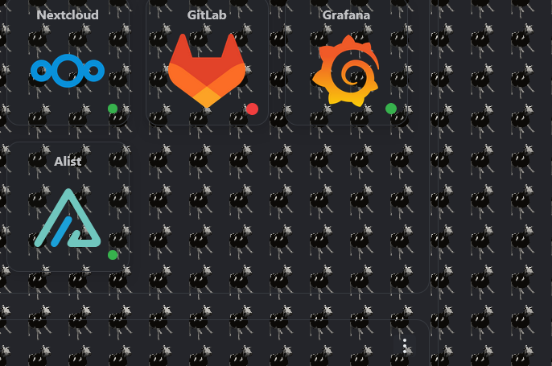

### Appearance

#### Primary color

Color that can be chosen freely to give accents to active elements.

#### Secondary color

Color that can be chosen freely to give accents.

#### Opacity

Opacity of the colors.

#### Icon color

Change the color of your bookmark / app icons.

#### Item radius

Change the radius of your items and Containers.

### Custom CSS

This is the field where you can enter custom CSS.
The styling will only be applied on the respective board page.

When Homarr Assistant is enabled, users with modify permission can also ask it to edit the board's General, Background,
Appearance, Custom CSS, and app-status settings. The assistant reads the current stylesheet first and presents an
editable review form before requesting approval to save the change. It does not edit responsive layouts, access control,
or Danger zone actions.

[See this guide on how to work with custom CSS](/docs/advanced/styling/).

### Behaviour

#### Disable app status

This will disable the status check for apps.

#### Work directly from the board

Widgets expose their routine controls without requiring edit mode:

- Hold `Shift` while hovering a widget that supports advanced view to expand it in place while the other widgets
  remain visible but dimmed. Release `Shift` to close it. Hold `Shift` plus `Ctrl` on Windows/Linux or `Cmd` on macOS to
  keep the view open until you close it. On touch devices, open it from the widget menu. Other widgets adapt in place
  instead.
- When signed in, outside edit mode, and with **Enable right click on widgets** enabled, right-click a widget to inspect
  its live query status, refresh its data, change quick options, open settings, or run supported actions. App tiles do
  not use this widget menu, and available controls follow your board and integration permissions.

The widget context menu follows the **Enable right click on widgets** preference in your user settings. On touch devices,
use the widget menu where your browser exposes it.

### Access control

With the access control, you can permit a single user or a group to your board.
The users and groups can have one of these three levels of access:

| **Permission Level** | View board | Edit mode | Settings | Danger zone (eg. delete) |
| -------------------- | ---------- | --------- | -------- | ------------------------ |
| View board           | X          |           |          |                          |
| Modify board         | X          | X         | X        |                          |
| Full access          | X          | X         | X        | X                        |

The permission level can only be changed after adding the user / group:

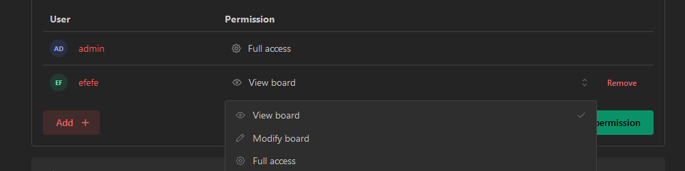

If the board is private and the user is not added in any of the three tabs, they cannot access the board.
They also do not see the board on the start page nor do they have access to any links for the board.

Groups that have high permissions (e.g. administrator or all board permissions) will be shown as "inherited".
They are permitted implicitly due to their permissions.

After editing permissions, the save button below the table must be pressed.
Otherwise, all changes will be discarded.

### Danger zone

#### Rename

Renaming a board will break all existing links to it permanently with no redirect.

#### Board visibility

By default, boards will be private. This means only authenticated users that are authorized have access.
Making a board public will expose it to everyone - including unauthenticated users.

#### Delete

This will permanently delete the board.
This action is irreversible and cannot be undone.

## Delete boards

The deletion of boards is permanent and cannot be undone.
There are two ways to delete a board:

- Navigate to the settings of your board, open the "Danger zone" section and click on the "delete this board" button.
- Navigate to the list of boards in the management pages, click the three dots and click on "delete permanently".

Both actions will execute the same deletion process.

## Duplicate boards

:::note
Duplicating a board will not copy the users and groups that have access to the board
nor the integrations the user does not have access to.
:::

Duplicating a board will create a new board with the same settings, all responsive layouts, and independent positions as the original board.
Duplicating a board that contains Custom Widgets also requires an administrator.
You can duplicate a board by clicking on the three dots in the list of boards and selecting "Duplicate board".

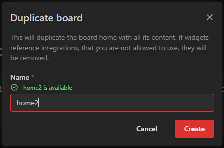

## Setting boards as your home board

The home board is the dashboard, that will be shown at the root path of Homarr or if no board name was passed in the URL.
All the following paths will lead to the home board:

- `my-homarr.com`
- `my-homarr.com/boards`

Your home board will have a special small badge at the top right in the list of boards:

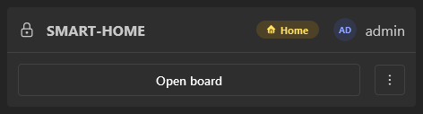

### For yourself

To set the home board yourself, the easiest option is to set it directly in the list of boards:

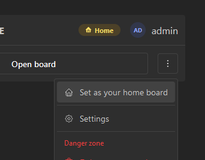

Alternatively, you can also define it via your user profile:

1. Click on your user profile at the top right
2. Click on `Your preferences`
3. Change the home board in the `home board` dropdown and click on `Save`.

### For other users

1. Navigate to the users: `Management` > `Users` > `Manage`
2. Click on the username of the user that you want to adjust
3. Select the desired home board via the dropdown and click on `Save` \
   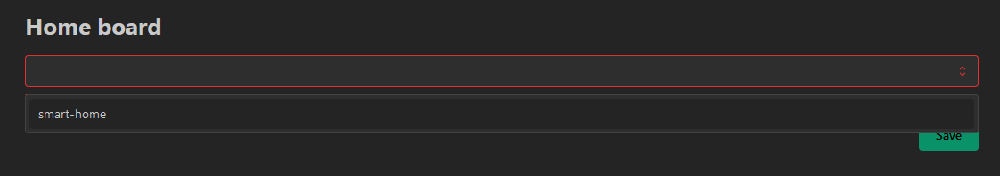

### For user groups

1. Navigate to the user groups: `Management` > `Users` > `Groups` > `Manage`
2. Go to tab `Settings`
3. Select the desired home board via the dropdown and click on `Save` \
   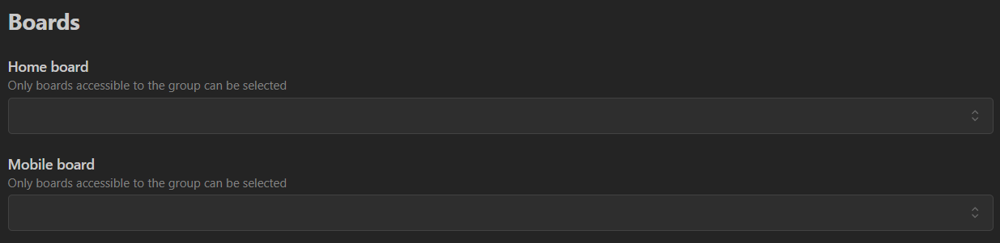

### For whole server

You can also set a global home board that will be used for all users that have not set a home board themselves.
It will also be used for anonymous users.

1. Navigate to the settings: `Management` > `Settings` > `Boards`
2. Select the desired home board via the dropdown and click on `Save` \
   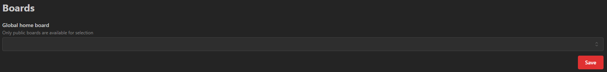

:::note
For the global home board you can only select boards that are public.
:::

### Mobile home board

The mobile home board controls which board opens for devices that Homarr detects as mobile from the User-Agent header.
This is separate from a board's **Mobile layout**, which controls the layout selected inside that board.
You can set a mobile home board for yourself in your user preferences, for a user or group through management, or for the
whole server with **Global mobile board** under `Management` > `Settings` > `Boards`.

For signed-in users, Homarr checks the user's mobile home board, then the user's desktop home board, then the mobile and
desktop defaults for the lowest-position matching group, followed by the mobile and desktop defaults for the `Everyone`
group, and finally the server-wide mobile and desktop defaults. Anonymous visitors use the server-wide mobile default and
then the server-wide desktop default. Server-wide fallback boards must be public. See the
[global board defaults](/docs/management/settings#boards) for the complete precedence and the required public-board rule.
