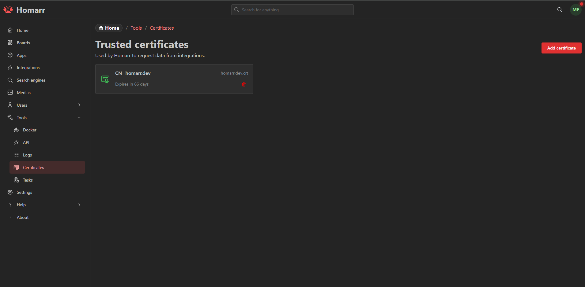
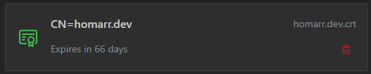

---
tags:
  - Administration
  - Self signed
  - Certificates
  - Integration
---

# Certificates

On this page you can manage your trusted certificates.
For example if you use a self signed certificate for one of the integrations you want to connect, you can add it here.

Below you can see a screenshot of the certificates page.
The items show the subject, filename and when it expires.
The color of the icon indicates how long it is valid.

| Color     | Meaning                     |
| --------- | --------------------------- |
| 🟩 Green  | Valid for more than 30 days |
| 🟨 Yellow | Valid for less than 30 days |
| 🟧 Orange | Valid for less than a week  |
| 🟥 Red    | Valid for less than a day   |

## Opening the certificates page

Navigate to `Management` > `Tools` > `Certificates`.

## Add a certificate

To add a certificate click on the "Add certificate" button. The upload form expands directly on the certificates page.

Then select the certificate file you want to add and click the "Add" button. You can cancel to collapse the form without
leaving the page.

## Delete a certificate

To delete a certificate you can click on the trash icon in the certificate card.

The first click arms the action and the second click confirms the deletion in place; no confirmation dialog is opened.

## Managing it through file system

The certificates are stored in the `/appdata/trusted-certificates` directory which is mounted through `/appdata`.
This means you can automate the update of the certificates by simply replacing or adding a new file in the directory.

## Obtaining certificates

Every integration has its own way of obtaining certificates.
Generally it is recommended to search for the documentation of the integration you are using.
Most of the time you can find the certificate in the file system of the integration.
Below you can find instructions for some of the integrations.

### Pi-hole (v6)

Since version 6 of Pi-hole, the web interface can be accessed through HTTPS.
The certificate can be found in the path `/etc/pihole/tls_ca.crt`. To add the certificate, this file needs to be copied and uploaded to Homarr.
You can find more details regarding SSL / TLS for Pi-hole [here](https://docs.pi-hole.net/api/tls/).
