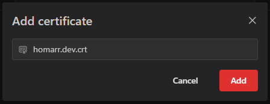

---
tags:
  - Administration
  - Self signed
  - Certificates
  - Integration
---

# Certificates
On this page you can manage your trusted certificates. 
For example if you use a self signed certificate for one of the integrations you want to connect, you can add it here.

Below you can see a screenshot of the certificates page. 
The items show the subject, filename and when it expires. 
The color of the icon indicates how long it is valid.

| Color | Meaning |
| --- | --- |
| 🟩 Green | Valid for more than 30 days |
| 🟨 Yellow | Valid for less than 30 days |
| 🟧 Orange | Valid for less than a week |
| 🟥 Red | Valid for less than a day |

## Opening the certificates page
Navigate to ``Management`` > ``Tools`` > ``Certificates``.

## Add a certificate
To add a certificate click on the "Add certificate" button.

Then select the certificate file you want to add.

And click the "Add" button.

## Delete a certificate

To delete a certificate you can click on the trash icon in the certificate card.

Then confirm the deletion.

## Managing it through file system

The certificates are stored in the `/appdata/trusted-certificates` directory which is mounted through `/appdata`.
This means you can automate the update of the certificates by simply replacing or adding a new file in the directory.

## Obtaining certificates
Every integration has its own way of obtaining certificates.
Generally it is recommended to search for the documentation of the integration you are using.
Most of the time you can find the certificate in the file system of the integration.
The certificate file needs to be uploaded to Homarr. To first get the file on your computer you can either:
- use `scp user@host:/path/to/file ./certificate.pem`
- use `cat /path/to/file` to print the certificate. Then recreate the file on your machine.

Below you can find instructions for some of the integrations.

### Pi-hole (v6)
Since version 6 of Pi-hole, the web interface can be accessed through HTTPS.
The certificate can be found in the path `/etc/pihole/tls_ca.crt`.
You can find more details regarding SSL / TLS for Pi-hole [here](https://docs.pi-hole.net/api/tls/).

### Proxmox
By default, Proxmox VE uses a node certificate signed by the cluster. You only need to configure Homarr with the certificate of a single node.
The certificate can be found in any node on the path `/etc/pve/pve-root-ca.pem`.
You can learn more about certificate management in Proxmox [here](https://pve.proxmox.com/wiki/Certificate_Management).
