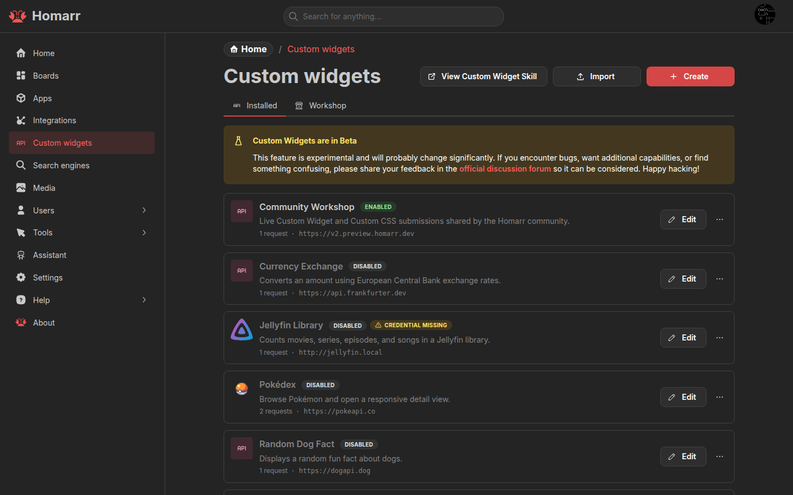

# Custom Widgets

:::warning Experimental feature

Custom Widgets may change during the v2 release cycle. Share feedback in the
[Custom Widgets discussion](https://github.com/homarr-labs/homarr/discussions/categories/custom-widgets).

:::

A **Custom Widget** is a validated `homarr-custom-widget-v2` definition containing:

- one or more API sources;
- named queries and actions;
- optional widget settings;
- a safe JSX template.

Homarr executes requests on the server and renders the template in a restricted runtime. Source credentials are
encrypted separately and are not included in exports, prompts, browser data, or Workshop submissions.

## Manage Custom Widgets

Administrators can create, import, duplicate, enable, export, publish, and delete definitions under
**Management → Custom Widgets**. Adding or configuring one on a board also requires permission to modify that board.

Once placed, normal board permissions control rendering and requests. Queries can run for anonymous viewers on public
boards; actions require authentication and the permission declared by the request.

## Authoring

- [Create a Custom Widget](./authoring) in the workbench or from a copied AI prompt.
- [Use the safe JSX runtime](./custom-jsx) for data bindings, temporary inputs, and components.
- [Browse the component reference](./component-reference).
- [Configure requests and security](./requests-and-security).
- [Connect an agent](./agent-authoring) through MCP and the Homarr skill.
- [Troubleshoot a definition](./troubleshooting).

The workbench validates the same schema used by imports, Workshop, HTTP authoring resources, and MCP. Test every query
and simulate relevant actions before saving. Live preview actions are opt-in because they can change the source service.

## Import and Workshop

Use **Import from Workshop** while adding board content or import a v2 JSON definition directly. Review the source,
requested permissions, API hosts, and actions before installation, then configure deployment-specific URLs and
credentials in Homarr.

Legacy definitions show **Migration required**. The migration prompt excludes credentials and the old display template;
describe the visible behavior separately, import the returned v2 definition, and verify it before removing the archived
version.

Back up the database and `SECRET_ENCRYPTION_KEY` before upgrading or rolling back. Multi-replica installations must use
the same Redis service so cached responses invalidate consistently.
