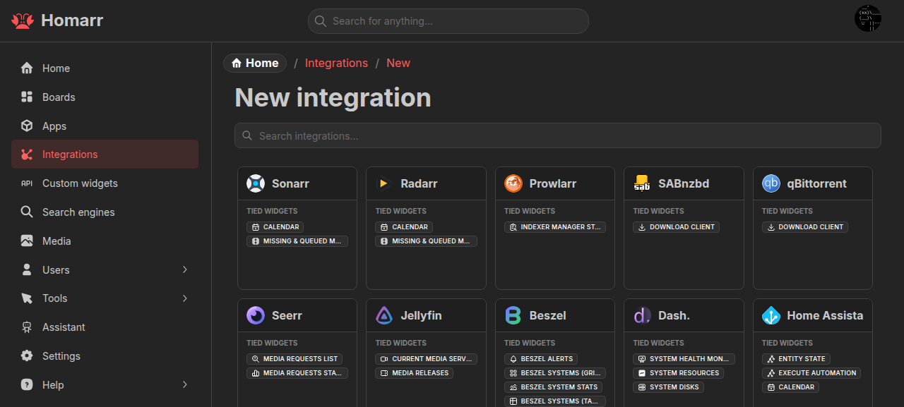

---
tags:
  - Integrations
  - Data sources
  - Connections
---

# Integrations

An **integration** is a server-side connection from Homarr to a supported service. Integrations provide data and
actions to widgets and can be linked to apps.

See the [integration catalog](/docs/category/integrations) for service-specific URLs, credentials, and supported
widgets.

## Configuration

Create and manage integrations under **Management → Integrations**. Select a service, provide its base URL and required
credentials, then test the connection. Homarr does not save a new integration until the test succeeds.

Use a URL reachable from the Homarr server or container. Unless an integration page says otherwise, provide the service
root rather than a settings or API subpage.

Credentials are encrypted and used only by the server. Linking an app is optional; it provides the browser-facing URL
used by widgets that open the service.

Integrations can also be created while adding content to a board. Editing a connection from a widget updates that
integration everywhere it is used.

## Permissions

| Level    | Allows                                                   |
| -------- | -------------------------------------------------------- |
| Use      | Select the integration and read its data                 |
| Interact | Run supported actions, such as pausing a download        |
| Full     | Change the URL, credentials, permissions, and linked app |

Global integration permissions apply to every integration. Resource access can instead be granted to specific users
or groups. Lists are filtered on the server and only include connections the current user can manage.

## Connection problems

If a connection test fails:

1. Check the integration page for the required base URL and credentials.
2. Test name resolution and HTTP access from the Homarr container or pod, not only from the host or browser.
3. Check Homarr and upstream-service logs, then any reverse proxy, firewall, VLAN, VPN, or DNS between them.
4. For a self-signed certificate, add the expected certificate under [Certificates](../certificates).

Do not disable upstream security controls as a general troubleshooting step.
