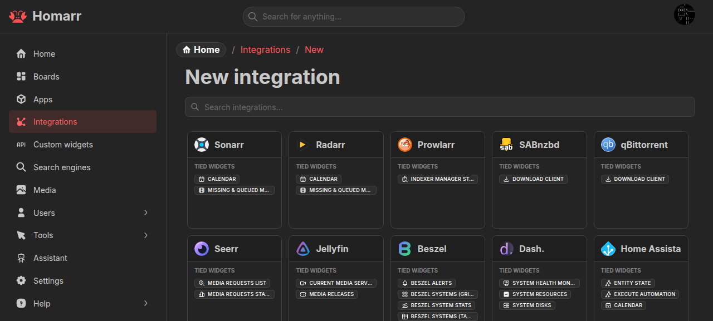
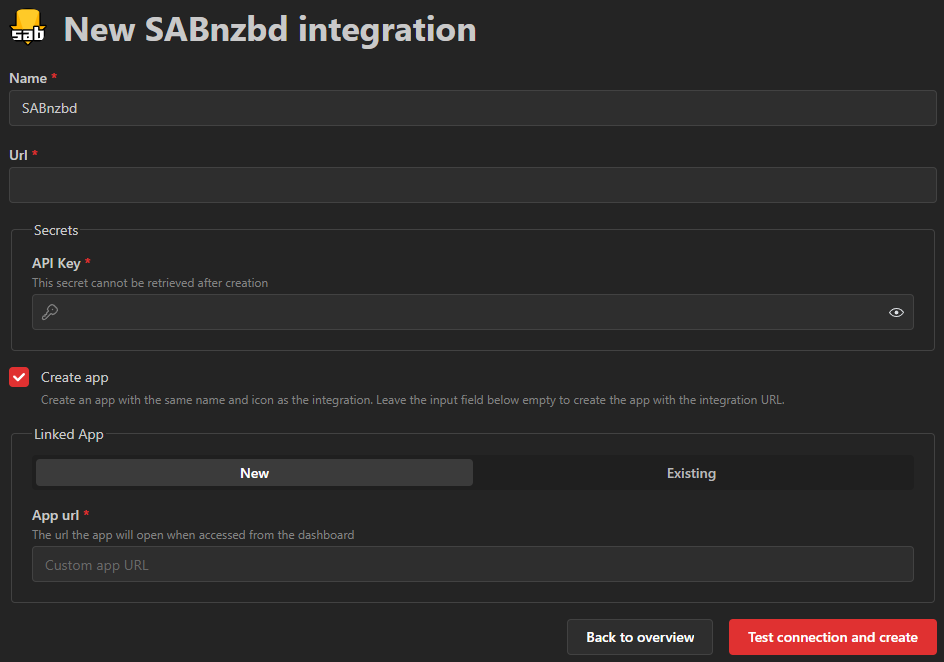
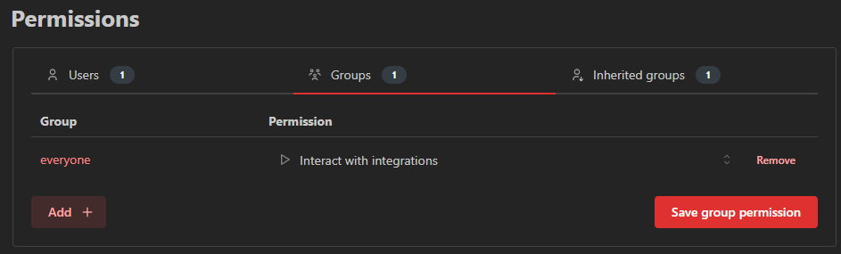

---
tags:
  - Integrations
  - Data sources
  - Connections
---

import { IntegrationRoutesDiagram } from "@site/src/components/pages/core-concepts/technical-diagrams";

# Integrations

An **integration** is a server-side connection from Homarr to a supported service. Integrations provide data and
actions to widgets and can be linked to apps.



See the [integration catalog](/docs/integrations) for service-specific URLs, credentials, and supported
widgets.

## Beyond native widgets

<Alert type="tip" title="Homarr is the front door to your homelab">

Configure a supported service once, then use its API through MCP and bring its data or actions onto your dashboard
with Custom Widgets—even when Homarr has no native feature for it.

</Alert>

Have your agent consult the service’s API docs and test the endpoint through [`integration_request`](../mcp#authenticated-integration-requests),
Homarr's most powerful MCP tool. Then bind the same saved integration to a
[Custom Widget source](../custom-widgets/requests-and-security#existing-integrations) to display its data or run actions.
Both reuse saved credentials and require **full integration access**. The iCalendar feed integration and TrueNAS's WebSocket
API cannot be used through these generic HTTP requests.

## Browser and server routes

<IntegrationRoutesDiagram />

## Configuration

Create and manage integrations under **Management → Integrations**. Select a service, provide its base URL and required
credentials, then test the connection. Homarr does not save a new integration until the test succeeds.

Use a URL reachable from the Homarr server or container. Unless an integration page says otherwise, provide the service
root rather than a settings or API subpage.

Credentials are encrypted and used only by the server. Linking an app is optional; it provides the browser-facing URL
used by widgets that open the service.



Integrations can also be created while adding content to a board. Editing a connection from a widget updates that
integration everywhere it is used.

## Permissions

| Level    | Allows                                                       |
| -------- | ------------------------------------------------------------ |
| Use      | Select the integration and read its data                     |
| Interact | Run supported actions, such as pausing a download            |
| Full     | Change integration settings and call arbitrary API endpoints |



Global integration permissions apply to every integration. Resource access can instead be granted to specific users
or groups. Lists are filtered on the server and only include connections the current user can manage.

## Connection problems

### Docker service URLs

Use the service name and **container port** when Homarr and the service share a user-defined Docker network.
For example, Sonarr with `ports: ["6767:8989"]` is reachable from Homarr at `http://sonarr:8989`.
Use `http://sonarr:6767` only if Sonarr actually listens on `6767` inside its container.
The browser-facing app URL can use the published host port or reverse proxy.
See [Docker Compose networking](https://docs.docker.com/compose/how-tos/networking/).

Homarr uses native name resolution by default. Leave `ENABLE_DNS_CACHING` unset or set it to `false`:
the optional cache can retain an old IP after a container is recreated and can override `extra_hosts` entries.
If an outbound proxy is configured, exclude local service names with `NO_PROXY`, for example `sonarr,radarr,jellyfin`.

To check Docker DNS independently of Homarr, replace `homarr` with your container name:

```sh
docker exec homarr node -e 'require("node:dns").lookup("sonarr", { all: true }, (error, addresses) => console.log(error?.code ?? addresses))'
```

`ENOTFOUND` here indicates a container resolver or network problem. Check both services' network membership and
Docker's embedded DNS; changing a Next.js setting cannot repair that resolver.

### Other connection failures

If a connection test fails:

1. Check the integration page for the required base URL and credentials.
2. Test name resolution and HTTP access from the Homarr container or pod, not only from the host or browser.
3. Check Homarr and upstream-service logs, then any reverse proxy, firewall, VLAN, VPN, or DNS between them.
4. For a self-signed certificate, add the expected certificate under [Certificates](/docs/management/certificates).

Do not disable upstream security controls as a general troubleshooting step.
