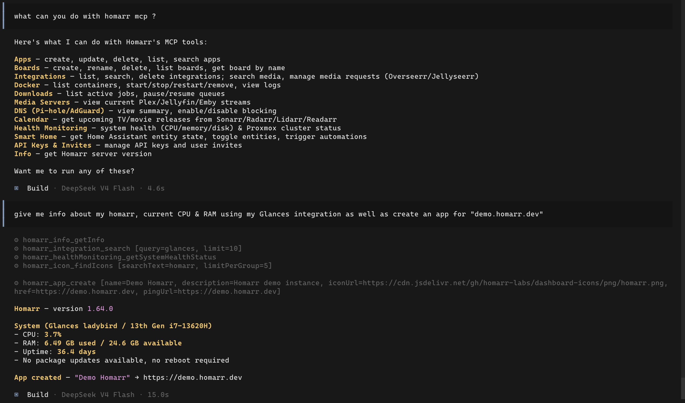

---
tags:
  - MCP
  - API
  - AI
  - Automation
---

# Model Context Protocol (MCP)

Homarr exposes a [Model Context Protocol](https://modelcontextprotocol.io) server at `/api/mcp/mcp`, enabling AI assistants like Claude, Cursor, VS Code Copilot, and Claude Code to interact with your Homarr instance using natural language.

With MCP, you can ask your AI assistant to manage apps, integrations, users, boards, Docker containers, media servers, DNS settings, and more - all through Homarr's existing tRPC API, now exposed as 50+ AI-callable tools.

## Getting Started

The MCP endpoint lives under the **API** page at `Management` → `Tools` → `API` → **MCP** tab.



### 1. Create an API Key

Navigate to the **Authentication** tab in the API page and create an API key. API keys follow the format `<id>.<token>`.
You can also create one directly from the MCP tab if you don't have any keys yet.

### 2. Choose a Transport

| Transport           | Best For                                                     | Requirements                   |
| ------------------- | ------------------------------------------------------------ | ------------------------------ |
| **Streamable HTTP** | Cursor, Claude Desktop, VS Code Copilot, Claude Code         | Direct HTTP access to Homarr   |
| **STDIO**           | Firewall-restricted environments, offline-compatible clients | `npx` and `mcp-remote` package |

**Streamable HTTP** is recommended for most setups. It works with all major AI clients.

### 3. Configure Your Client

Add the following to your client's MCP configuration file:

**Streamable HTTP** (recommended):

```json
{
  "mcpServers": {
    "homarr": {
      "url": "https://your-homarr-instance.com/api/mcp/mcp",
      "headers": {
        "ApiKey": "<your-api-key>"
      }
    }
  }
}
```

Where to place this config:

| Client          | Config File                                     |
| --------------- | ----------------------------------------------- |
| Cursor          | `.cursor/mcp.json`                              |
| Claude Desktop  | `claude_desktop_config.json`                    |
| Claude Code     | `.claude/mcp.json` (or `claude mcp add homarr`) |
| VS Code Copilot | `.vscode/mcp.json`                              |

:::warning

Replace `<your-api-key>` with your actual API key. Never commit API keys to version control.

:::

**STDIO** (alternative):

```json
{
  "mcpServers": {
    "homarr": {
      "command": "npx",
      "args": [
        "-y",
        "mcp-remote",
        "https://your-homarr-instance.com/api/mcp/mcp",
        "--header",
        "ApiKey:<your-api-key>"
      ]
    }
  }
}
```

This option tunnels MCP communication through STDIO using the `mcp-remote` package. Useful when the AI client cannot make HTTP requests directly.

## Authentication

MCP supports two authentication methods:

| Method               | Description                                           | Best For                                                         |
| -------------------- | ----------------------------------------------------- | ---------------------------------------------------------------- |
| **API Key**          | Include `ApiKey: <id>.<token>` header in all requests | Scripts, CI/CD, direct client configs                            |
| **OAuth 2.1 + PKCE** | Full OAuth flow with dynamic client registration      | MCP clients with OAuth support (e.g. `opencode mcp auth homarr`) |

API key authentication is simpler and recommended for most setups. The API key inherits the permissions of the user who created it. Tools that require higher privileges will return permission errors if the key lacks access.

## Testing the Connection

Verify your MCP endpoint is working:

```bash
curl -s -X POST \
  -H "Content-Type: application/json" \
  -H "Accept: application/json, text/event-stream" \
  -H "ApiKey: <your-api-key>" \
  -d '{"jsonrpc":"2.0","method":"initialize","params":{"protocolVersion":"2025-03-26","capabilities":{},"clientInfo":{"name":"test","version":"1.0"}},"id":1}' \
  https://your-homarr-instance.com/api/mcp/mcp
```

A successful response includes the server capabilities and available tools. Use `tools/list` to see all available tools:

```bash
curl -s -X POST \
  -H "Content-Type: application/json" \
  -H "Accept: application/json, text/event-stream" \
  -H "ApiKey: <your-api-key>" \
  -d '{"jsonrpc":"2.0","method":"tools/list","id":1}' \
  https://your-homarr-instance.com/api/mcp/mcp
```

## Available Tools

Homarr exposes 50+ tools organized by namespace. Each tool is either a **query** (GET, read-only) or **mutation** (POST, write action).

| Namespace          | Example Tools                                            | Type       |
| ------------------ | -------------------------------------------------------- | ---------- |
| `app`              | List all apps, get app by ID, create/update/delete app   | GET + POST |
| `apiKeys`          | List API keys                                            | GET        |
| `beszel`           | Systems status, alerts, historical system metrics        | GET        |
| `board`            | List boards, get board by ID, create/update/delete board | GET + POST |
| `docker`           | List containers, inspect container, start/stop/restart   | GET + POST |
| `icon`             | Search icons                                             | GET        |
| `info`             | Server health, version info                              | GET        |
| `integration`      | List integrations, test connection, delete integration   | GET + POST |
| `invite`           | List invitations, delete invite                          | GET + POST |
| `calendar`         | Calendar events from media servers                       | GET        |
| `dnsHole`          | DNS hole summary, toggle blocking                        | GET + POST |
| `downloads`        | Active downloads, pause/resume/delete                    | GET + POST |
| `healthMonitoring` | Resource usage stats                                     | GET        |
| `mediaRequests`    | Approve/decline media requests                           | GET + POST |
| `mediaServer`      | Media server sessions and stats                          | GET        |
| `smartHome`        | Execute automations, device states                       | GET + POST |

The tools table on the MCP tab is dynamically generated - it always reflects the latest available procedures from your Homarr instance.

## Security

- API keys are required for authentication - unauthenticated requests are rejected
- Tools inherit the permissions of the API key's owner
- OAuth endpoints are rate-limited to prevent abuse
- Tool execution errors are contained - a failing tool call does not crash the MCP server
- All communication uses HTTPS (configure HTTP → HTTPS redirects on your reverse proxy)

## Use Cases

- **"Show me all apps on my Homarr dashboard"** - AI lists all apps with their names and URLs
- **"Restart the Plex Docker container"** - AI finds and restarts the container via Docker integration
- **"What's downloading right now?"** - AI fetches active download status across all download integrations
- **"Create a new app pointing to my Grafana instance"** - AI creates an app with the correct icon and URL
- **"How many users are on my Homarr instance?"** - AI lists all users (admin only)
- **"Toggle Pi-hole blocking for 5 minutes"** - AI interacts with DNS controls
- **"How are my servers doing?"** - AI fetches Beszel system stats including CPU, memory, disk, and alerts
