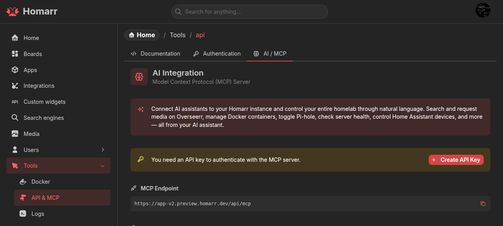

---
tags:
  - MCP
  - API
  - AI
  - Automation
---

# Model Context Protocol (MCP)

Homarr exposes a stateless [Model Context Protocol](https://modelcontextprotocol.io) server at `/api/mcp`. It maps the
current Homarr API to tools for compatible AI clients.



The endpoint implements MCP `2026-07-28` and accepts 2025 Streamable HTTP clients through a compatibility path. The old
`/api/mcp/mcp` route remains as an alias; use `/api/mcp` for new clients.

## Configure a client

Create an API key under **Management → Tools → API → Authentication**, then add the endpoint and header to the client's
MCP configuration:

```json
{
  "mcpServers": {
    "homarr": {
      "url": "https://homarr.example.com/api/mcp",
      "headers": {
        "ApiKey": "<id>.<token>"
      }
    }
  }
}
```

Clients without Streamable HTTP support can use `mcp-remote` over STDIO:

```json
{
  "mcpServers": {
    "homarr": {
      "command": "npx",
      "args": ["-y", "mcp-remote", "https://homarr.example.com/api/mcp", "--header", "ApiKey:<id>.<token>"]
    }
  }
}
```

The **AI / MCP** tab on Homarr's API page shows the current endpoint, configuration, and generated tool catalog.

## Authentication and permissions

MCP supports API keys and OAuth 2.1 with PKCE. API keys are simpler for direct client configuration; OAuth is available
for clients that support dynamic authorization.

Tools use the permissions of the API key owner or authorized user. Creating a key does not grant additional access.
Custom Widget and Workshop authoring tools, prompts, and resources are visible only to administrators.

Use HTTPS when the endpoint crosses an untrusted network.

## Verify the endpoint

The 2025 compatibility path accepts a compact `tools/list` request:

```sh
curl -X POST \
  -H 'Content-Type: application/json' \
  -H 'Accept: application/json, text/event-stream' \
  -H 'ApiKey: <id>.<token>' \
  -d '{"jsonrpc":"2.0","method":"tools/list","id":1}' \
  https://homarr.example.com/api/mcp
```

The removed HTTP+SSE `/sse` and `/message` transports return `410 Gone`.

## Tools and resources

The generated catalog includes available board, app, integration, Docker, Kubernetes, media, DNS, download, and other
Homarr procedures. Queries are read-only; mutations change state. The exact catalog depends on the release and current
user permissions, so inspect `tools/list` or the table in Homarr instead of relying on a static list.

For Custom Widgets, install the official skill and follow the preview-and-evidence workflow described in
[Connect an agent](./custom-widgets/agent-authoring). Secret values are configured in Homarr and are never returned
through MCP.

The built-in [Assistant](./assistant) uses the same tool catalog with the current Homarr session and asks for approval
before mutations by default.
