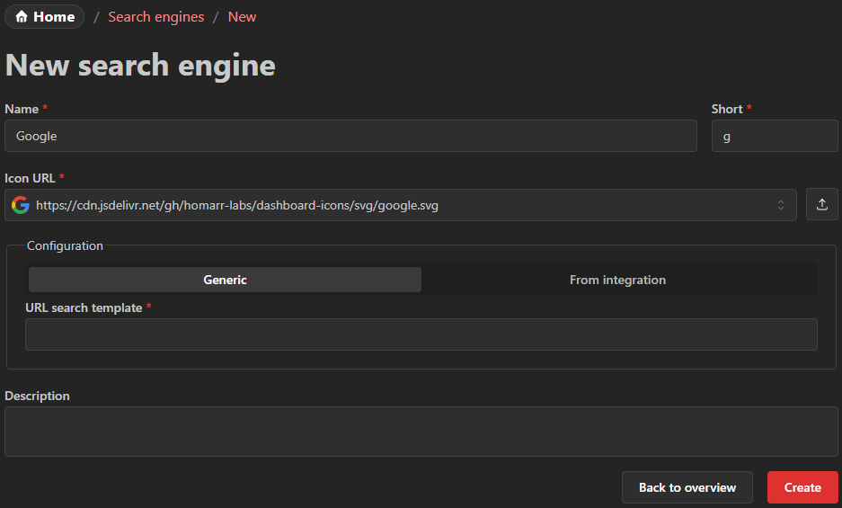

---
tags:
  - Search engines
  - Google
  - Search
---

import { jellyseerrIntegration } from '@site/docs/integrations/jellyseerr';
import { WidgetIntegrations } from '@site/src/components/widgets/integrations';
import { overseerrIntegration } from '@site/docs/integrations/overseerr';

# Search Engines
Using the search engines, terms can be quickly searched simply by opening the search bar at the top or using the keyboard shortcut `CTRL + K`.

You can add any search engine that has a search URL that accepts a search term as a parameter.
Additionally some integrations have a built-in search functionality, for more information see below.

## Create search engine
To create a custom search engine, you can click the button at the top of the page.

### Name
The name can be chosen freely. It will be displayed in the search box popover.

### Short
Prefix that is used to choose the search engine in the popover using the keyboard.
It is recommended that this value is kept short (for example ``g`` for Google and ``e`` for Ecosia).

### Configuration

In the configuration section you can select between two options.

#### Search template
The template must be a valid URL that incldues the ``%s`` placeholder.
Homarr will replace the ``%s`` with the term that the user entered.

##### Examples
- Google: ``https://www.google.com/search?q=%s``
- Ecosia: ``https://www.ecosia.org/search?q=%s``
- DuckDuckGo: ``https://duckduckgo.com/?q=%s``
- Bing: ``https://www.bing.com/search?q=%s``
- YouTube: ``https://www.youtube.com/results?search_query=%s``

#### Integration

The following integrations support a search functionality and can be selected here:

<WidgetIntegrations items={[{
  integration: jellyseerrIntegration,
  note: "Search for movies and TV shows in Jellyseerr and request them."
}, {
  integration: overseerrIntegration,
  note: "Search for movies and TV shows in Overseerr and request them."
}]} />