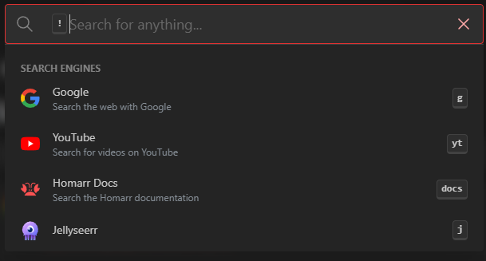
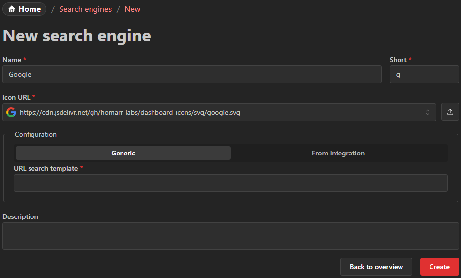

---
tags:
  - Search engines
  - Google
  - Search
---

# Search Engines
Using the search engines, terms can be quickly searched simply by opening the search bar at the top or using the keyboard shortcut `CTRL + K`.

You can add any search engine that has a search URL that accepts a search term as a parameter.

## Create search engine
To create a custom search engine, you can click the button at the top of the page.

### Name
The name can be chosen freely. It will be displayed in the search box popover.

### Short
Prefix that is used to choose the search engine in the popover using the keyboard.
It is recommended that this value is kept short (for example ``g`` for Google and ``e`` for Ecosia).

### Configuration

In the configuration section you can select between two options.

#### Search template
The template must be a valid URL that incldues the ``%s`` placeholder.
Homarr will replace the ``%s`` with the term that the user entered.

##### Examples
- Google: ``https://www.google.com/search?q=%s``
- Ecosia: ``https://www.ecosia.org/search?q=%s``
- DuckDuckGo: ``https://duckduckgo.com/?q=%s``
- Bing: ``https://www.bing.com/search?q=%s``
- YouTube: ``https://www.youtube.com/results?search_query=%s``

## Media request search

Jellyseerr, Overseerr, and Seerr integrations have a dedicated **Spotlight mode** for searching and requesting media.
This mode does not require creating a search engine entry — it is available automatically when you have a compatible integration configured.

You can access it from:
- The **Modes list** in Spotlight (opened with `CTRL + K`)
- The **search button** on the media request list and stats widgets

### Availability indicators

Search results display colored status badges showing the media's current state in your integration:
- **Available** — fully available in your media library
- **Partial** — some content (e.g. seasons) is available
- **Processing** — currently being downloaded or processed
- **Requested** — requested but not yet available

### Requesting TV show seasons

For partially available TV shows, you can request additional seasons.
The request modal shows which seasons are already requested (marked with a status badge and not selectable), so you can select only the missing seasons.
