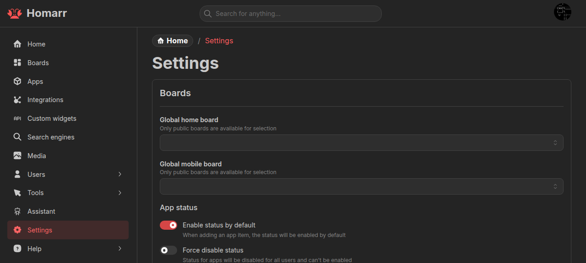
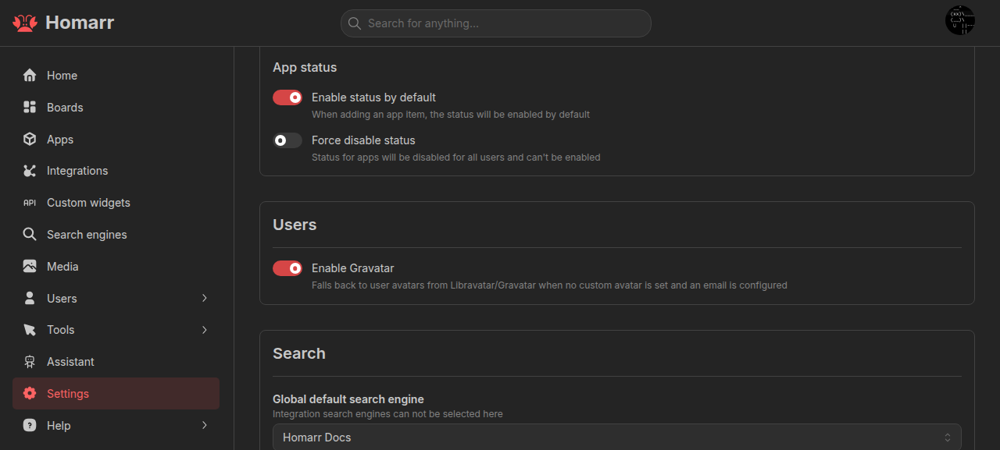
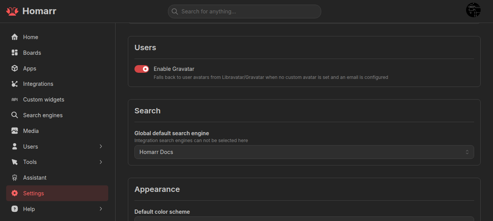
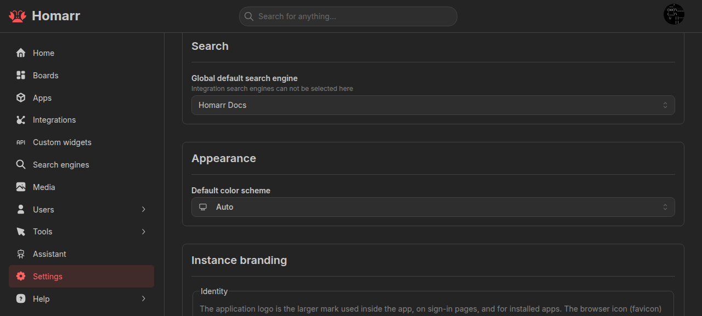
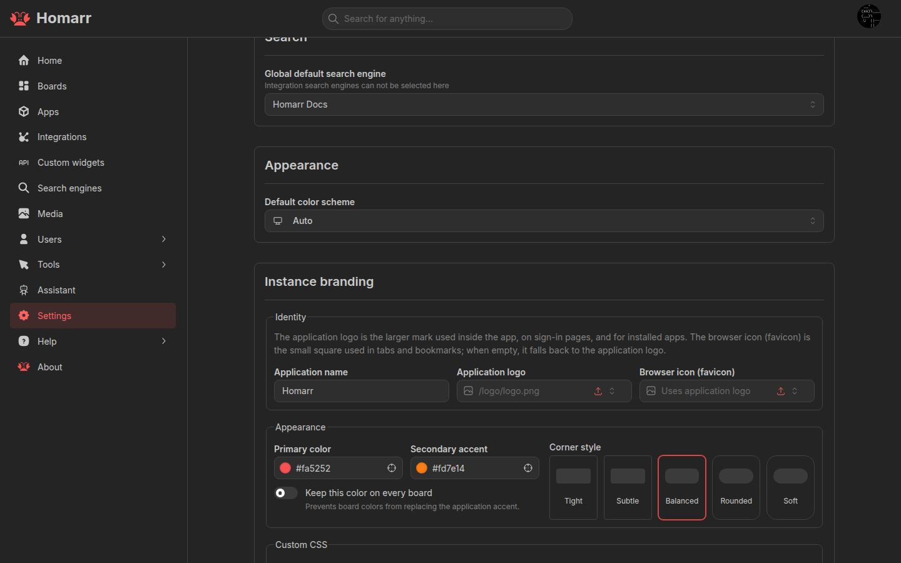
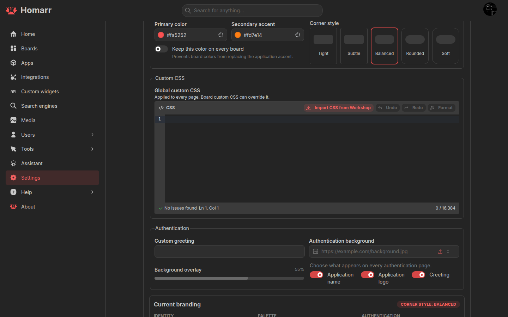
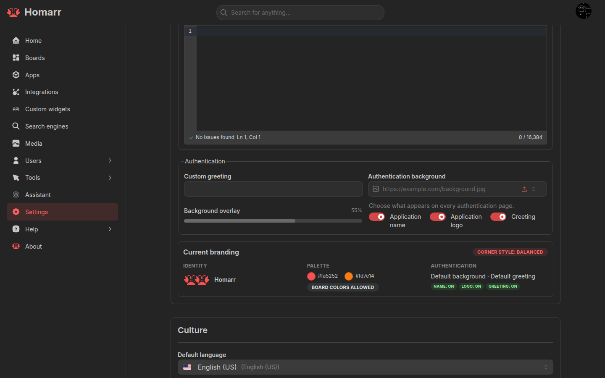
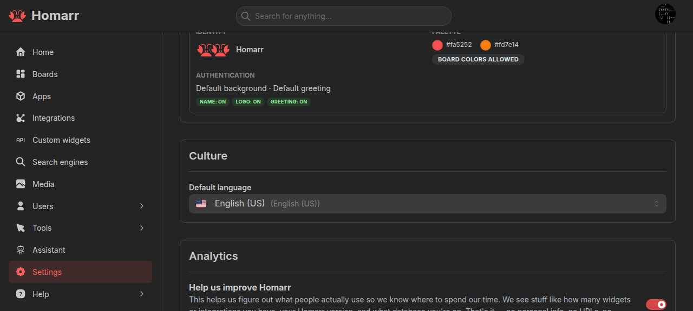
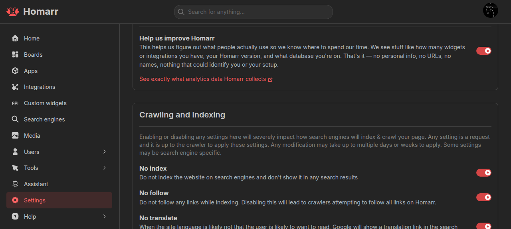
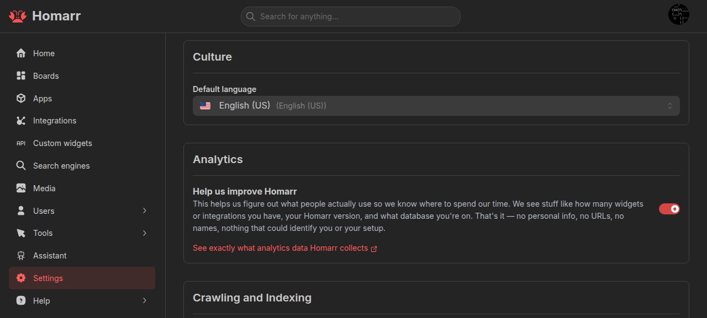

---
tags:
  - Settings
  - SEO
  - Analytics
  - Security
  - Server
  - Administration
---

# Settings

Settings apply to the entire Homarr instance. The save bar appears after a change; use **Save changes** to apply it or
**Discard** to revert it. Some changes require a full page reload.

## Boards

**Global home board** is the fallback for users without a personal home board and for anonymous users. **Global mobile
board** overrides it on mobile devices. Both must be public.

**Enable status by default** sets the initial status-check state for new app items. **Force disable status** turns app
status off instance-wide.

## Users

**Enable Gravatar** uses Libravatar or Gravatar when a user has an email address but no custom avatar.

## Search

**Global default search engine** is the instance fallback. Integration-backed search engines are configured per user,
not here.

## Appearance

**Default color scheme** is the fallback for users without a personal color-scheme preference.

## Instance branding

Branding is stored server-side and applies across the instance after saving.

### Identity and appearance

Set the application name, logo, browser icon, primary and secondary colors, and corner style. **Keep this color on every
board** prevents board colors from replacing the application accent. The browser icon falls back to the application
logo when empty.

Images accept HTTP(S) URLs or app-relative paths.

### Global custom CSS

**Global custom CSS** applies to every page. Write CSS directly or import a theme from the Workshop. Board custom CSS
loads later and can override it.

See [Styling](/docs/advanced/styling) for selectors, theme variables, and board-level CSS.

### Authentication pages

Set a greeting, background image, background overlay, and whether the application name, logo, and greeting appear on
authentication pages.

## Culture

**Default language** is the fallback for users without a personal language preference.

## Crawling and indexing

These options set crawler directives:

- **No index** asks crawlers not to index the instance.
- **No follow** asks crawlers not to follow links.
- **No translate** asks supported services not to offer translated search results.
- **No site links search box** asks Google not to add a search box to the result.

Crawlers can ignore these requests.

## Analytics

When **Help us improve Homarr** is enabled, Homarr sends analytics to its PostHog server at `https://hog.homarr.dev`.
It sends on the first eligible startup, then no more than once every seven days; restarting Homarr does not create another report.

The report contains the Homarr version, database and platform details, enabled authentication providers, default
language, and aggregate counts of configured resources. Widget counts come from items placed on boards. It also reports
how many boards contain each widget or linked integration type, and broad board-size and layout distributions. Zero-valued
counts are omitted.

Homarr does not send widget option contents, board profiles, names, URLs, usernames, email addresses, credentials,
integration secrets, API keys, logs, or error messages. It does not load PostHog in your browser or log API actions.
The same random installation ID is reused for each report; no user or session IDs are sent.

Disable the setting and reload the page to stop analytics. `NO_EXTERNAL_CONNECTION=true` blocks analytics together with
all other external requests. See [Environment variables](/docs/advanced/environment-variables).

