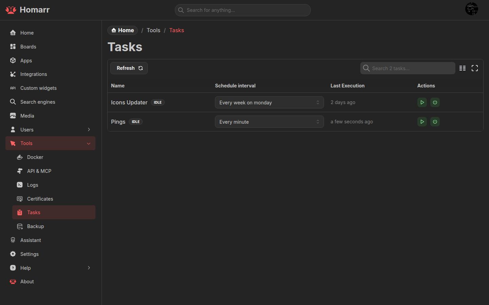

---
tags:
  - Background
  - Jobs
  - Tasks
---

# Tasks

The tasks page controls scheduled background jobs used by integrations and widgets. It is available to administrators
under **Management → Tools → Tasks**.

Each task exposes:

- its current status and schedule;
- a cron-based schedule interval;
- a manual run action;
- an enable or disable action.

Disabling a task stops scheduled runs but does not prevent a manual run.
