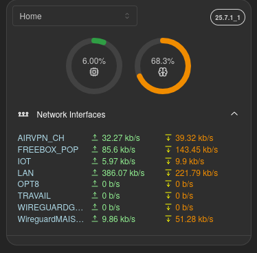

import { WidgetInteractionGuide } from "@site/src/components/widgets/interactions";

import { WidgetHeader } from "@site/src/components/widgets/header";
import { AddingWidget } from "@site/src/components/widgets/adding";
import { WidgetIntegrations } from "@site/src/components/widgets/integrations";
import Tabs from "@theme/Tabs";
import TabItem from "@theme/TabItem";
import { firewallWidget } from ".";
import { opnsenseIntegration } from "../../integrations/opnsense";

<WidgetHeader widget={firewallWidget} categories={["Firewall"]} />

Compact mode keeps the configured firewall summary and interface section visible without dropping interfaces based on widget height.

### Screenshots

### Supported Integrations

<WidgetIntegrations
  items={[
    {
      integration: opnsenseIntegration,
    },
  ]}
/>

<WidgetInteractionGuide />

### Adding the widget

<AddingWidget />
