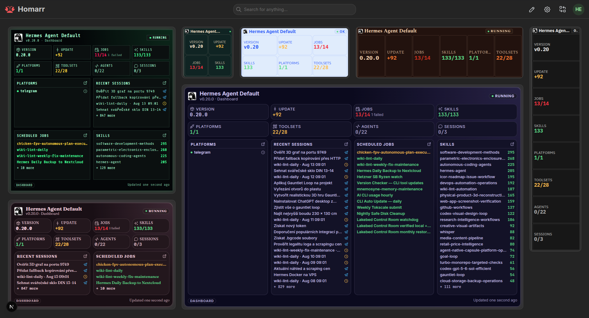

import { WidgetHeader } from "@site/src/components/widgets/header";
import { AddingWidget } from "@site/src/components/widgets/adding";
import { WidgetConfig } from "@site/src/components/widgets/configuration";
import { WidgetIntegrations } from "@site/src/components/widgets/integrations";
import { hermesAgentWidget } from ".";
import { hermesAgentIntegration } from "@site/docs/integrations/hermes-agent";

<WidgetHeader widget={hermesAgentWidget} categories={["AI", "Automation", "System monitoring"]} />

The Hermes Agent widget shows gateway status, version and updates, automation health, connected platforms, agent profiles, and session activity. Larger tiles add recent sessions, scheduled jobs, platforms, and skills.

### Screenshots

The layout adapts automatically from W1×H1 through W6×H4. Lists use `+ N more` instead of an inner scrollbar, and an external integration URL enables links to the matching Hermes dashboard sections.

### Supported Integrations

<WidgetIntegrations items={[{ integration: hermesAgentIntegration }]} />

### Adding the widget

<AddingWidget />

### Configuration

<WidgetConfig configuration={hermesAgentWidget.configuration} />

**Agents** compares active agents with all available profiles. **Sessions** compares active sessions with sessions used in the last 24 hours; a `+` marks a lower-bound count.

:::note Permissions
Session, job, platform, and skill details require permission to use the integration. Other viewers receive aggregate status and counts only. Sensitive prompts, messages, identifiers, and usage data are not returned to the browser.
:::
