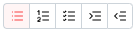

import { AddingWidget } from '@site/src/components/widgets/adding';
import { WidgetConfig } from '@site/src/components/widgets/configuration';
import { WidgetHeader } from '@site/src/components/widgets/header';
import { notebookWidget } from '.';

<WidgetHeader
  widget={notebookWidget}
  categories={['Notes']}
/>

The notebook widget focuses on usability and is designed to be as simple as possible to bring a familiar editing experience to regular users. 
It is based on Tiptap.dev and supports most of its features.

### Screenshots

import editOff from './img/normal.png';
import editOn from './img/edit.png';

  
  

### Adding the widget

<AddingWidget />

### Configuration
<WidgetConfig configuration={notebookWidget.configuration} />

### Editing
When the permissions of the user allows it, you can enter the editing of the text by clicking the following button in the top right.

You can then decide to save your changes or cancel them to exit editing, using the buttons placed in the same location.

### Notebook toolbar functions
The notebook offers a variaty of functions to edit the text and more.

#### Common text formatting
| Function               | Description                                                         |
| ---------------------- | ------------------------------------------------------------------- |
| Bold                   | Makes the selected text bold                                        |
| Italic                 | Tilts the selected text                                             |
| Strikethrough          | Puts a bar through the selected text                                |
| Color text             | Changes the color of the text                                       |
| Colored highlight text | Highlights the text with a chosen color                             |
| Code                   | Elevates the text to a box                                          |
| Clear formatting       | Erases any of the preceding function's effects on the selected text |

#### Heading
Choose a heading size for the line, making the text bigger. Working like titles and sub-titles.

#### Text Alignement
Select the alignement on the line. Left, center or right.

#### Misc functions
##### Blockquote
Puts the current line in a quoting block.

##### Horizontal line
Adds a line that goes from the far right to the far left as a separator.

#### Lists
##### Bullet lists
Simple list with a dot preceding each element.

##### Ordered lists
List with numbers preceding each element.

##### Check lists
List with a checkbox on each element.

##### Indentation changes

When you are currently in a list of any sort, the last 2 buttons will appear and will allow you to change the indentation of the current list item.

#### Insert functions
##### Link controls
The first buttons is to insert a link, or edit an existing link. The link will be applied on the selected text.

Pasting a link directly into the text will automatically put the link anchor on it too.

The second button will remove the link while leaving the text intact.

This is the modal for the link, The little button in the textbox can be clicked to make the link open in a new tab.

##### Image controls

##### Source
You can use a normal link to an image or you can also use locally stored images.

##### Width
The aspect ratio will always be respected, so only the width field is necessary.
You can provide a value in a plain number or you can also use percents to have your image size dynamically change on different screens.

#### Table
This last control allows you to add a table, for which you can determine the number of columns and row before inserting it.

Clicking that button while in a table will delete it.

##### Table controls

While in a table, further controls will appear to help edit the table.

The first one will color the background of the selected cells.

The second will merge selected cells.

All the following ones are for editing the wize of the table:

- Add column on the right
- Add column on the left
- Delete Column
- Add row on top
- Add row below
- Delete Row