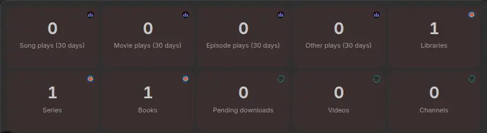
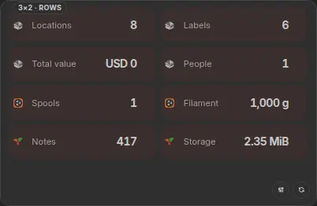
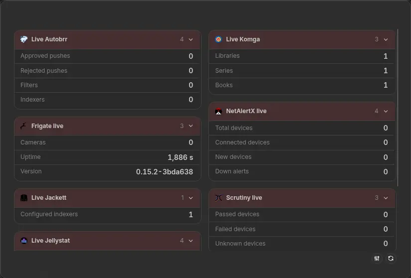

import { WidgetHeader } from "@site/src/components/widgets/header";
import { statsWidget } from ".";

<WidgetHeader widget={statsWidget} categories={["Statistics"]} />

Sonarr shows, Paperless-ngx documents, Navidrome songs: pick metrics from your configured integrations and combine them in one widget.

## Layouts

Use **cards** for prominent values, **rows** for a compact overview, or **tables** to group metrics by integration. Labels, order and number formatting are configurable.

The widget toolbar lets you try layout changes locally; they reset on reload. Use widget settings to save changes for everyone.

## See more

Click a metric to reveal its full value and related fields. **Right-click → Advanced view** shows all available metrics from your selected integrations, including those you haven't added to the widget.

## Refresh

These are saved snapshots, not live readings. **Right-click → Refresh** fetches new data; the menu shows the age of the oldest snapshot. Failed refreshes keep the previous values.

Opening a board reuses saved data. Multiple metrics from the same integration share retrieval. Snapshots have no time-based expiry, but clearing the cache or changing integration credentials can remove them.

## New service integrations in v2

These 31 integrations work with Statistics, alongside existing providers such as Sonarr, Radarr, Paperless-ngx and Navidrome. The metric picker shows what's available for each source.

Integration setup guides and available metrics

| Integration                                              | Available statistics                                                    |
| -------------------------------------------------------- | ----------------------------------------------------------------------- |
| [Caddy](/docs/integrations/caddy)                        | Upstreams, active requests, failed requests                             |
| [Changedetection.io](/docs/integrations/changedetection) | Unviewed changed watches, total watched pages                           |
| [FileFlows](/docs/integrations/fileflows)                | Queued, processing, processed, processing time                          |
| [Gatus](/docs/integrations/gatus)                        | Up, down, unknown, total                                                |
| [Healthchecks](/docs/integrations/healthchecks)          | Up, down, grace, new checks                                             |
| [Homebox](/docs/integrations/homebox)                    | Items, locations, labels, warranty items, value, users                  |
| [Karakeep](/docs/integrations/karakeep)                  | Bookmarks, favorites, archived, highlights, lists, tags                 |
| [Linkwarden](/docs/integrations/linkwarden)              | Links, collections, tags                                                |
| [Maintainerr](/docs/integrations/maintainerr)            | Handled items/episodes/movies, reclaimable storage                      |
| [Mealie](/docs/integrations/mealie)                      | Recipes, users, categories, tags                                        |
| [Miniflux](/docs/integrations/miniflux)                  | Read and unread entries                                                 |
| [Netdata](/docs/integrations/netdata)                    | Warning and critical alarms                                             |
| [Plant-it](/docs/integrations/plantit)                   | Plants, species, photos, events                                         |
| [Prometheus](/docs/integrations/prometheus)              | Targets, up, down                                                       |
| [RomM](/docs/integrations/romm)                          | Platforms, ROMs, saves, states, screenshots, file size                  |
| [Spoolman](/docs/integrations/spoolman)                  | Active spools, remaining weight                                         |
| [Stash](/docs/integrations/stash)                        | Scenes/size/duration, images/size, galleries, performers, studios, tags |
| [Syncthing Relay](/docs/integrations/syncthing-relay)    | Sessions, connections, bytes proxied                                    |
| [Tandoor](/docs/integrations/tandoor)                    | Users, recipes, keywords                                                |
| [Trilium](/docs/integrations/trilium)                    | Version, active notes, database size                                    |
| [Unmanic](/docs/integrations/unmanic)                    | Active/total workers, pending records                                   |
| [xTeVe](/docs/integrations/xteve)                        | All streams, active streams, XEPG streams                               |
| [Your Spotify](/docs/integrations/your-spotify)          | Songs listened, listening time, distinct artists                        |
| [Autobrr](/docs/integrations/autobrr)                    | Approved/rejected pushes, filters, indexers                             |
| [Jellystat](/docs/integrations/jellystat)                | 30-day plays by media type                                              |
| [Scrutiny](/docs/integrations/scrutiny)                  | Passed, failed, unknown devices                                         |
| [Tube Archivist](/docs/integrations/tubearchivist)       | Pending downloads, videos, channels, playlists                          |
| [Frigate](/docs/integrations/frigate)                    | Cameras, uptime, version                                                |
| [Komga](/docs/integrations/komga)                        | Libraries, series, books                                                |
| [NetAlertX](/docs/integrations/netalertx)                | Total, connected, new, down alerts                                      |
| [Jackett](/docs/integrations/jackett)                    | Configured indexers; existing indexer widget                            |

