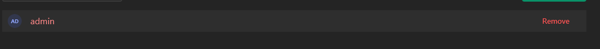
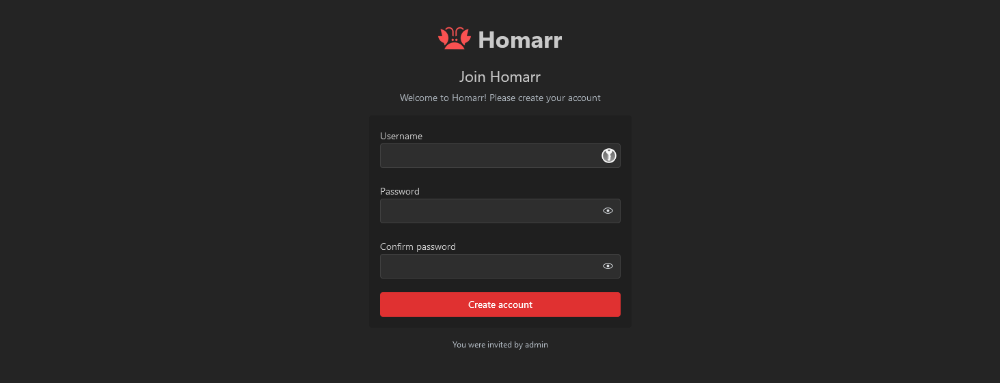

# Users

Each person accessing Homarr is a user. Using the users management you can configure who has access to certain resources.
A user may have multiple sessions on different devices and can log in from multiple locations at the same time.
A user can be assigned to multiple groups.

:::tip

Homarr supports [single sign on for easier and seamless authentication](/docs/advanced/single-sign-on) (e.g. Authelia).

:::

## Manage users
### Creating new users
To create new users, you must navigate to ``Mangement`` > ``Users`` > ``Manage`` and click on the create button to create a new one: \

You'll be guided through the process using a wizard: \

The username and Email must be unique. A username is required.
When creating a password, you must meet the password requirements: \

After you completed all steps, you can start over to create another user or choose to go back to the list: \

## Editing a user
A user can be edited on the ``Mangement`` > ``Users`` > ``Manage`` page when you click on the username.
Here you'll have access to two tabs: **General** and **Security**.

### General tab
#### Username
This is the unique username that identifies this user. It can be changed to anything but must be at least 3 characters long with a limit of 255 characters.
This name will be used for the credential's login. It is also used to auto-generate profile pictures if no picture was uploaded.

#### E-Mail
This is the unique email of the user. As of 1.0, it is not used for any notifications and only for organizational purposes.
This field is optional.

#### Language
This is the currently selected language of the user.
Changing the language will change all text & the right to left (RTL) feature in some languages.
By default, Homarr will choose English as the default language. Here you can override the language for this specific user.
The user may choose a different language by themselves afterward.

#### Home board
Optional field for the board that is loaded by default if no board was specified in the URL.
Only boards that the user has permission to are being shown.

#### Search

Options to configure default search engine of user and whether to open search results in a new tab.

#### First day of the week

Choose the first day of the week for the user. This will affect the calendar widget.

#### Accessibility

Option to show icons for status check instead of colored dots.

#### Delete
This action will permanently delete the user from the database, including any preferences they set.
If the user created boards, they wil **not** be deleted.
This action is **irreversible** and cannot be undone. All data is permanently lost.

### Security tab

#### Change password
Here the password for this user can be changed.
It must also meet the password requirements of Homarr.
The password is stored as an encrypted value with a salt in the database - this means the value cannot be read out from the database afterward.
You must take care of sending the new password to the user.
This functionality can also be useful to lock out a bad actor without tampering with any data (except the password hash).
For security reasons, you must confirm the password a second time.

## Groups
Using groups, you can manage the permissions of users.
Members can be directly assigned to groups.

A user will have the permissions of all groups they are a member of. 
Some permissions include other permissions, for example the "Full board access" permission includes all board permissions.

By default, a group called "credentials-admin" will be generated where the first user will be placed.
However, you can create as many groups as you'd like.

### Creating a group
Click on the button ``New group`` to create a new one.
Homarr will prompt you for a group name.

### Managing a group
#### General tab
##### Name
Name for the group that can be chosen freely.

##### Transfer ownership
Every group has an owner. Using this button, the ownership can be transferred to a different user.
Group ownership is only organizational.

##### Delete
Deletes the group permanently. This change is irreversible.

#### Settings tab
In this tab, you can configure some settings for the group. Those settings will be prioritized by the order of the groups on the groups list page

##### Priorization
The higher a group in the list, the higher the priority. This means that if a user is in multiple groups, the permissions of the group with the highest priority will be used.
It will always fallback to the everyone group if no other group permissions are set.

##### Boards
Configure board settings for a group. User specific settings will override group settings.

###### Home board
The board that is loaded by default if no board was specified in the URL.

###### Mobile board
The board that is loaded by default on mobile devices.

#### Members tab
In this tab, you can assign users to the group. With the button at the top right, a new member can be added to the group:

Members can be removed from the group using the remove button at the end:

#### Permissions tab
In this tab, you manage what permissions the members of this group will have.
Currently, the following permissions are available:

- Boards
  - **Create boards**: Allow members to create boards
  - **View all boards**: Allow members to view all boards
  - **Modify all boards**: Allow members to modify all boards (Does not include access control and danger zone)
  - **Full board access**: Allow members to view, modify, and delete all boards (Including access control and danger zone)
- Integrations
  - **Create integrations**: Allow members to create integrations
  - **Use all integrations**: Allows members to add any integrations to their boards
  - **Interact with any integration**: Allow members to interact with any integration
  - **Full integration access**: Allow members to manage, use and interact with any integration
- **Administrator**: Members with this permission have full access to all features and settings

When you changed permissions, you must confirm your changes by clicking the banner at the bottom:

#### Special groups
Currently one special group exists. This group is `everyone`. It automatically adds every user that is known to Homarr to its members. Neither its name nor its members can be changed.

## Invites
Invites are an easy-to-use system to allow users to onboard themselves.
It is useful in companies or large-scale homelabs where many users must be onboarded at the same time.
You should trust the end user that they enter their data truthfully as the administrator will not confirm the entered data after the user has completed the onboarding.

This feature can only be used when credentials authentication is enabled.
An invitation link can be used indefinitely.

### Creating an invitation
Click on the button:

Next, define the expiration time for this invitation. They will expire after some time and will no longer be valid.
It must be at least 1 hour in the future and at max 6 months in the future.
The default is 4 hours in the future.

Next, click ``Create`` and you'll get a confirmation with an ID, Token and a link that can be copied:

Both ID and Token are also in the URL. Ensure that you copy either ID & Token or the URL - it will never be shown again.
Clicking the ``Copy & close`` button will copy the URL to your clipboard.

### Self-onboarding
Clicking the invitation link will bring up a form with fields for the username and password:

At the bottom of the page, the user who created the invitation can be seen.

### Deleting an invitation
If an invitation needs to be deleted before or after the expiry, the delete button at the end of the table can be used:

The link will become invalid.
If the invitation expires, the link will also expire.
