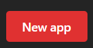

Apps are the building blocks of your Homarr board. 
Most of the time they are a simple link to a website, but used on your board they also support a simple ping to check if your service is up. 
Apps are used in the bookmark and app widget.

## Create an app

To create an app you can click on the button on the top right of the apps management page:

Next, you'll need to fill out the required fields to configure the app:

### Name

The name must be at least one character long and can be chosen freely.

### Icon URL

This is the URL to the icon that will be displayed on the app widget. 
It can be a url to an image in the internet, one from the included icon repositories or a local file uploaded through the upload button.

### Description

An optional description that can be shown as tooltip on the app widget.

### URL

The URL to the website you want to link to. Clicking on the app widget or bookmark will open this URL.

### Ping URL

When you want to use another url for the simple status check you can set it here. 
This will allow you to set a different URL for the ping than the URL that is opened when clicking on the app widget.
It's useful when you want to ping the service internally for example with a custom ip but open the website externally.

## List of apps

On the apps management page you find all apps that exist in your Homarr instance. You can edit and delete them.

