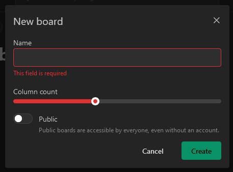
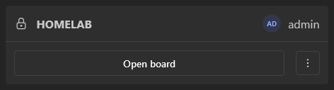
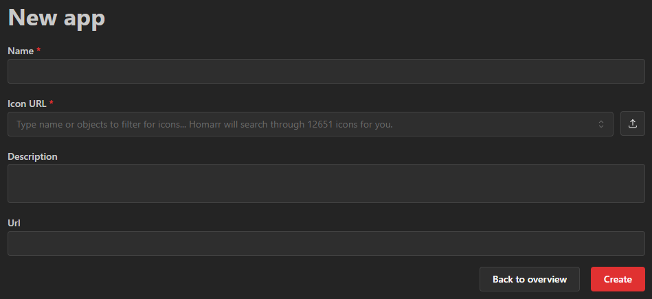

import imageStartFromScratchStepServerSettings from "./img/onboarding-from-scratch-step-server-settings.png";
import imageStartFromScratchStepAdminUser from "./img/onboarding-from-scratch-step-admin-user.png";
import imageStartFromScratchStepExternalAdminGroup from "./img/onboarding-from-scratch-step-external-admin-group.png";
import imageStartFromScratchStepFinish from "./img/onboarding-from-scratch-step-finish.png";
import manageBoardHeaderEditMode from "./img/manage-board-header-edit-mode.png";
import manageBoardHeaderAddItem from "./img/manage-board-header-add-item-menu.png";
import manageBoardHeaderChooseItem from "./img/manage-board-header-choose-item.png";
import manageBoardNoApp from "./img/manage-board-no-app.png";
import manageExportOldHomarr from "./img/old-homarr-export-data.png";
import manageImportOldHomarrDropzone from "./img/old-homarr-import-dropzone.png";
import manageImportOldHomarrChooseData from "./img/old-homarr-import-choose-imported-data.png";
import manageImportDecryptionToken from "./img/old-homarr-import-decryption-token.png";

:::tip

Read our [glossary](./glossary) if you are new to Homarr.

:::

Congratulations on installing Homarr. Now it's time to get yourself familiar with the concepts of Homarr and how to use it.

## Onboarding
The onboard will show the first time you start Homarr.
This process will help you with your first steps and adding some initial data, such as the administrator account.

:::note

If you see this screen repeatitly after you restarted the Homarr container, your Docker mounting paths may be missing,
incorrect or read-only. Read [our installation instructions](/docs/getting-started/installation/docker) again to fix this issue.

:::

You can either import a previous dashboard using the ZIP archive or start from scratch:

You may refresh anytime and continue from a different device - the onboarding is saved immediately on the server for your convenience.

### Starting from scratch
Depending on your auth provider configuration you will either first see the admin user creation form or the external group creation form.
If credentials provider was selected, you'll be prompted to create an admin user for Homarr.
This user cannot be deleted and has full control over Homarr and all of it's boards.
You must choose an username and password (both can later be changed).
We enforce strict password requirements, when you enter your password, to protect your instance if you accidentially
expose it to the Internet.

If you selected external providers (such as LDAP or OIDC), you'll be prompted to create an admin group.
This group will be used to synchronize users from your provider to Homarr. 
When a user is logged in through the provider the groups of him that match groups with any in Homarr will be added to the user.
The name of the group has to match exactly the name of the group in the provider.

Next, you can configure some basic settings for Homarr. We recommend to leave all settings at default for most users.
Here you can also disable analytics. Please note that our analytics are completly anonymous and is fully compliant with GDPR and PECR.

After this step, you finished the onboarding.
The onboarding can no longer be started again.
From here you can click on one of the provided links to continue your journey.
We recommend you to continue with the section [creating your first board on this page](#creating-your-first-board).

### Importing a ZIP from version before 1.0.0
This is recommended when you used Homarr before and want to re-import your data.
It is important that you first migrate correctly using [the list of breaking changes for 1.0](/blog/2024/09/23/version-1.0).

**How to export and import data**
1. Navigate to your old Homarr, open your management pages, open the tools submenu and open ``Migrate to 1.0``.
2. Check the contents that you want to export. We recommend you to export all data.
3. Click on the export data button
4. Save the ZIP file, that is being downloaded, on your device. If you selected "integrations" or "users", you also get an encryption / decryption key.
Copy it and do not loose it!
5. Go to your new >1.0.0 Homarr instance and start the onboarding. Choose ``Import from Homarr before 1.0``
6. Drag and drop your previously downloaded ZIP archive into the file upload:  
7. Next, choose the data that you want to import and how to import it. Since screen sizes were removed in 1.0, we create a new board for every screen size by default. We recommend you to only keep the best layout and adjust it later in 1.0.0 - but you can also import all of them and pick later. 
8. If you previously exported integrations or users, you will be asked to decrypt the data safely using your obtained encryption token. Paste into the modal and confirm your action. 
9. Next, you can [follow the same setup as when starting from scratch](#starting-from-scratch). After you completed the onboarding, all of your data will be migrated and available.

## Creating your first board
In Homarr, you organize your apps and widgets on boards.
Boards can be organized using the interactive drag and drop.
Let's create your first board by navigating here: ``Manage`` > ``Boards`` > ``New board``:

A board must always have a name and can either be public or private.
Public boards are also accessible for users, that are not logged in ([see access control for boards](/docs/management/boards/#access-control)).

Congratulations - you've just created your first board. You can see boards, that you have access to, on this page:

## Add your first app to Homarr
To add links to your dashboard, you must first add them as an "app".
Navigate to this page to add an app:

Next, click on the ``New app`` button. You'll need to provide a name and an icon to create an app.
The name must be at least one character long but you can provide any image URL for the icon.
Homarr ships with over 11K icons - so you can just search by entering a search text instead.

After you created the app, you'll see in on the apps page:

## Arrange and organize your board
Let's add your freshly created app, from the previous step, to the board.
To do this, edit your previously created board by clicking on the big ``Open board`` button:

Here you have the following options in the header:

- **Search**: Here you can search for data. You can search for integrations, boards, actions, sites and much more. Some actions may be context dependent (eg. will only show when certain widgets are on your page)
- **Edit mode**: Clicking this button will toggle the edit mode. In this mode you can edit the contents of your board.
- **Settings**: Clicking this button will redirect you to a settings page where you can adjust the board settings (page title, colors, ...).
- **Profile**: This avatar will be visible on every page. Clicking it will show a menu with actions.

When entering the edit mode, you'll get some additional buttons to work with:

- **Add item**: Click this button to add new elements to your page.
- **Exit edit mode**: Click this btuton to save your changes and exit edit mode.

To continue, click the option "New Item":

Next, you can choose what item you'd like to add.
We will discuss the other options in the following sections - for now choose "App" to continue.

As soon as you chose the app, the modal will close and you'll get the following item on your board:

This is expected, because you haven't told Homarr what app it should show in this item.
To configure this, click on the small 3 dots at the top of the item in the edit mode and choose "Edit item" in the menu.

In the modal you can edit the app that you want to display:

As soon as you save your changes, the tile on the board will refresh and display your app.
Using the small bidirectional arrow at the bottom right you can resize the element.
Start pressing with your mouse button down, move your mouse to resize and release your finger as soon your you're happy with the size.

To move your item to a different position on the board, simply hold the mouse button anywhere on the item and move with the mouse to the desired position.
As soon as you release your finger, the item will snap in place in the grid.

:::note

You cannot move items freely on the vertical axis.
We always align all items to the top of the page to simply organization.
To move items to the bottom, you must add more items or resize items.

:::

:::tip

We recommend you to experiment for a few minutes, before you start building your actual dashboard.
This helps you to explore the capabilities of Homarr before you build your board in a suboptimal way.

:::

Users on touch or mobile devices may not be able to drag and drop or move items.
They can use the "Move / resize item" option in the edit menu of items instead:

Be sure to save your changes by exiting edit mode!

## Adding your first integration
Now it's time to integrate some basic data into your board.
To do this, we first need to create an integration.
An integration is a connection between Homarr and a third party application - usually something that you run and deploy yourself.

Navigate to ``Manage`` > ``Integrations`` (for example via your user menu).
As an example, we are going to use the public demo instance of **Dash.** - a popular application to monitor CPU / hardware usage.
Choose the **Dash.** integration from the list of available integrations:

Next, choose a name (or leave it at default), enter ``https://dash.mauz.dev/`` as the URL in the form and click on ``Test connection and create``.
Pressing the save button will perform a test request to the integration, to confirm that the networking setup is working as expected.
Sometimes invalid configurations, firewalls and other mistakes can lead to connectivity problems - [follow this guide here](/docs/management/integrations/#troubleshooting-connection) if you experience issues.

If connection was successful, you will be redirect back to the list of integrations.
Now let's embed it to your board (see next section).

:::note

Some integrations may require additional configuration, such as a username, password or API tokens.
Depending on your networking setup and applications, the connection from Homarr might also get blocked by firewalls,
the target application or your router.

:::

## Embed integration data using widgets
Let's add your integration, that you have configured in the section above, as a widget to your board.
First, navigate back to your board that you want to add it to.
Next, enter edit mode again and add another item to your board:

Instead of choosing an app, let's choose ``System Health Monitoring`` this time.
Click on "Add to board":

Resize the item slightly and then edit it using the three dots menu at the top:

Next, choose your newly created Dash. integration in the integrations dropdown:

:::note

Some widgets may support multiple integrations at the same time.
If they do not support multiple integrations, you will be unable to select more than one.

:::

Confirm your changes by pressing save.
Editing a widget will trigger a data update and data will soon appear:

As with every change, don't forget to save your changes using the exit edit mode button:

## Grouping your items
As the last step, let's organize your freshly created items using two different options.
You can choose either or both of them on your boards.

### Using dynamic sections
Dynamic sections are a simple, resizable visual group to group items.

After adding a dynamic section, you can simply drag and drop items into the section:

### Using categories
Categories are more advanced and complicated than dynamic sections.
To create a category, open the add item modal and choose "new category":

Every category must have a name. After you click "Add category", you will get a new item on your board:

You can drag and drop items in to this category in the edit mode.
Categories will have a big space before and after them in the edit mode to
enable you to drag and drop items outside the category.
You can also collapse or open categories in edit mode to facilitate your editing process.

:::note

A current limitation of categories is, that they will always have a width of 100%.
You cannot reduce their horizontal width.

:::

## Next steps
You're done with the basic setup 🔥. Now it's time to organize and customize even more.
We highly recommend you to experiment with different options, styles and configurations.
See these curated pages for your next steps:
- Create new apps using the [apps management](../management/apps/)
- Customize your board or add more boards using the [boards management](../management/boards/)
- Integrate software that you use using the [integrations management](../management/integrations)
- Choose from our beautiful and interactive [widgets](/docs/category/widgets)
- See [all supported integrations](/docs/category/integrations)
- Integrate with Homarr with your own application using [the API](../management/api/)

:::danger

The Homarr Team will never ask for your credentials. Do not send people your credentials, as they manage the access to your applications and can cause harm to your device if they are abused.

:::
