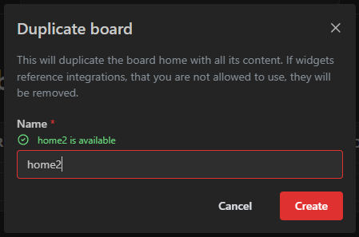
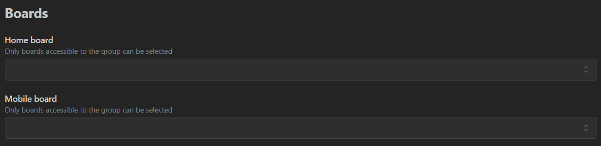

import iconColorImage from './img/icon-color.png'
import itemRadiusImage from './img/item-radius.png'
import layoutLargeImage from './img/layout-large.png'
import layoutMediumImage from './img/layout-medium.png'
import layoutSmallImage from './img/layout-small.png'

Each dashboard is called a "board".
You can create as many boards as you want.
Boards can be restricted to user groups.
A user may also have a "home board" which they will see at the root path (e.g. my-homarr.com or my-homarr.com/board).
Other boards can be viewed by direct links (e.g. my-homarr.com/board/smart-home) or via the management pages.

Names of boards must be unique because this will be used in the URL to load the desired board.

## Create a new board
When creating a board, the availability of the board name will be checked for you.

### Name
The name must not include any special characters and must be at least one character long.
Underscores and hyphen-minus are allowed.

### Column count
Homarr has a complex drag and drop system that can be used from the browser.
The column count defines how many horizontal columns are available to drag and drop elements to.

### Public
This will enable public access for everyone - regardless of whether they are logged in or not.
This can be really useful if you want to have public boards in your company or for family and fiends.
Modifications for public boards must be allowed explicitly using user groups and their permissions.

## Board settings
You navigate to the board settings by clicking on these three dots:

Alternatively, you can also navigate from the board page itself using the cog icon at the top right:

### General
#### Page title
This is the title that will be visible at the top left in the navigation bar:

This field is optional and Homarr will fall back to "Homarr" if nothing is set.

#### Meta title
This is the secondary title of the page that is not directly visible in the page itself.
Browser will use it to set the title of tabs:

Homarr will fall back to the board name and a suffix if nothing is set.

#### Logo image URL
This is the URL that is used for the image at the top left.
Homarr will fall back to the Homarr logo if nothing is set.

#### Favicon image URL
This is the URL that is used for the favicon in the tab title.
Homarr will fall back to the Homarr logo if nothing is set.

### Layout

In this section you can configure the different responsive layouts. Depending on your screens width the layout will change.

On each element the position and size of items can be changed seperately.
When adding a new layout the position and sizes will automatically be generated depending on the column count.
When adding a new item / dynamic section that will always be 1x1 on each layout and placed on the first available position.

#### Name

The name of the layout can be choosen freely. It is only used for the management and will not be visible on the board.

#### Column count

Amount of columns for this layout. Defines how many items can be placed in a row. When changed it will automatically adjust the position and size of the items.

#### Breakpoint

Minimum width of the screen where the layout will be used. 
Once the minmum of the next layout is reached the layout will change.

#### Preview

### Background
#### Background image URL
Homarr can display a background image behind apps and widgets.
This URL can be used to define what image should be shown.

#### Background image attachment
This defines whether the background should move when the user scrolls.

#### Background image size
This defines whether the background should cover the entire page (and possibly be cropped) or never be cropped but may not cover the entire page.

#### Background image repeat
This defines whether the background should be repeated if it cannot cover the entire page.
This option can be useful if you have patterns that can be repeated easily (e.g. patterns):

### Appearance
#### Primary color
Color that can be chosen freely to give accents to active elements.
#### Secondary color
Color that can be chosen freely to give accents.
#### Opacity
Opacity of the colors.
#### Icon color
Change the color of your bookmark / app icons.

#### Item radius
Change the radius of your items / categories.

### Custom CSS
This is the field where you can enter custom CSS.
The styling will only be applied on the respective board page.

[See this guide on how to work with custom CSS](/docs/next/advanced/styling/).

### Behaviour

#### Disable app status
This will disable the status check for apps.

### Access control
With the access control, you can permit a single user or a group to your board.
The users and groups can have one of these three levels of access:

| **Permission Level** | View board | Edit mode | Settings | Danger zone (eg. delete) |
|----------------------|------------|-----------|----------|--------------------------|
| View board           | X          |           |          |                          |
| Modify board         | X          | X         | X        |                          |
| Full access          | X          | X         | X        | X                        |

The permission level can only be changed after adding the user / group:

If the board is private and the user is not added in any of the three tabs, they cannot access the board.
They also do not see the board on the start page nor do they have access to any links for the board.

Groups that have high permissions (e.g. administrator or all board permissions) will be shown as "inherited".
They are permitted implicitly due to their permissions.

After editing permissions, the save button below the table must be pressed.
Otherwise, all changes will be discarded.

### Danger zone
#### Rename
Renaming a board will break all existing links to it permanently with no redirect.

#### Board visibility
By default, boards will be private. This means only authenticated users that are authorized have access.
Making a board public will expose it to everyone - including unauthenticated users.

#### Delete
This will permanently delete the board.
This action is irreversible and cannot be undone.

## Delete boards
The deletion of boards is permanent and cannot be undone.
There are two ways to delete a board:

- Navigate to the settings of your board, open the "Danger zone" dropdown and click on the "delete this board" button.
- Navigate to the list of boards in the management pages, click the three dots and click on "delete permanently".

Both actions will execute the same deletion process.

## Duplicate boards

:::note
Duplicating a board will not copy the users and groups that have access to the board 
nor the integrations the user does not have access to.
:::

Duplicating a board will create a new board with the same settings and layout as the original board.
You can duplicate a board by clicking on the three dots in the list of boards and selecting "Duplicate board".

## Setting boards as your home board
The home board is the dashboard, that will be shown at the root path of Homarr or if no board name was passed in the URL.
All the following paths will lead to the home board:
- ``my-homarr.com``
- ``my-homarr.com/boards``

Your home board will have a special small badge at the top right in the list of boards:

### For yourself
To set the home board yourself, the easiest option is to set it directly in the list of boards:

Alternatively, you can also define it via your user profile:
1. Click on your user profile at the top right
2. Click on ``Your preferences``
3. Change the home board in the ``home board`` dropdown and click on ``Save``.

### For other users

1. Navigate to the users: ``Management`` > ``Users`` > ``Manage``
2. Click on the username of the user that you want to adjust
3. Select the desired home board via the dropdown and click on ``Save`` \

### For user groups

1. Navigate to the user groups: ``Management`` > ``Users`` > ``Groups`` > ``Manage``
2. Go to tab ``Settings``
3. Select the desired home board via the dropdown and click on ``Save`` \

### For whole server

You can also set a global home board that will be used for all users that have not set a home board themselves.
It will also be used for anonymous users.

1. Navigate to the settings: ``Management`` > ``Settings`` > ``Boards``
2. Select the desired home board via the dropdown and click on ``Save`` \

:::note
For the global home board you can only select boards that are public.
:::

### Mobile home board

Same as the home board, you can also set a mobile home board.
It will be used for devices that are detected as mobile devices. (Using User-Agent header)