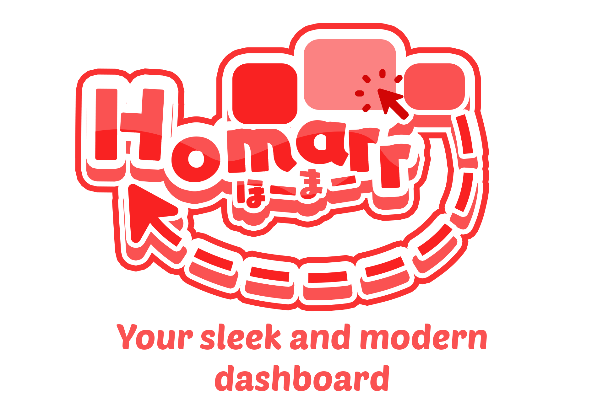
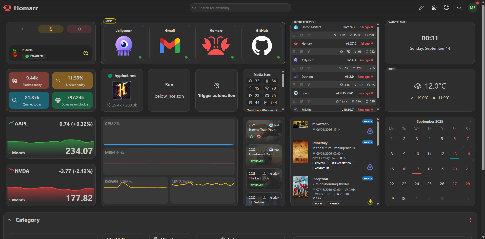

  

**A modern, self-hosted dashboard for your homelab with seamless integrations**

[Installation](#-installation) • [Documentation](https://homarr.dev) • [Discord](https://discord.com/invite/aCsmEV5RgA) • [Translations](https://crowdin.com/project/homarr_labs)

---

  

## 

Homarr is a powerful, customizable dashboard that brings all your self-hosted services together in one beautiful interface. Built with modern technologies and designed for ease of use.

- **🖌️ Highly Customizable** - Extensive drag-and-drop grid system for complete layout control
- **🔗 Seamless Integrations** - Connect with your favorite self-hosted applications effortlessly
- **⚡ Fast App Management** - Intuitive interface with no YAML configuration required
- **👥 Advanced User Management** - Comprehensive user management with permissions and groups
- **🔐 Enterprise Authentication** - Single sign-on support via OIDC and LDAP
- **🔒 Secure by Default** - Industry-standard encryption using BCrypt and AES-256-CBC
- **⚡ Real-time Updates** - Live widget updates powered by WebSockets, tRPC, and Redis
- **🔍 Powerful Search** - Fast built-in search across thousands of data points and integrations
- **🎨 Extensive Icon Library** - Icon picker with over 11,000 icons to choose from
- **🖥️ Universal Compatibility** - Runs on any major hardware (x86, ARM, Raspberry Pi) and OS (Windows, Linux, TrueNAS, Unraid)
- **☸️ Kubernetes Ready** - Full Helm chart support for efficient scaling and high reliability

---

Homarr integrates with a wide range of popular self-hosted applications and services:

<!-- AUTO_GENERATE_INTEGRATION_LIST_START -->

<table>
<tbody>
<tr><td align="center">
<a href="https://homarr.dev/docs/integrations/adguard-home" target="_blank" rel="noreferrer noopener">
  
     
  
AdGuard Home

</a>
</td>
<td align="center">
<a href="https://homarr.dev/docs/integrations/aria2" target="_blank" rel="noreferrer noopener">
  
     
  
Aria2

</a>
</td>
<td align="center">
<a href="https://homarr.dev/docs/integrations/codeberg" target="_blank" rel="noreferrer noopener">
  
     
  
Codeberg

</a>
</td>
<td align="center">
<a href="https://homarr.dev/docs/integrations/dash-dot" target="_blank" rel="noreferrer noopener">
  
     
  
Dash.

</a>
</td>
<td align="center">
<a href="https://homarr.dev/docs/integrations/deluge" target="_blank" rel="noreferrer noopener">
  
     
  
Deluge

</a>
</td>
<td align="center">
<a href="https://homarr.dev/docs/integrations/docker-hub" target="_blank" rel="noreferrer noopener">
  
     
  
Docker Hub

</a>
</td>
<td align="center">
<a href="https://homarr.dev/docs/integrations/emby" target="_blank" rel="noreferrer noopener">
  
     
  
Emby

</a>
</td></tr>
<tr><td align="center">
<a href="https://homarr.dev/docs/integrations/github" target="_blank" rel="noreferrer noopener">
  
     
  
Github

</a>
</td>
<td align="center">
<a href="https://homarr.dev/docs/integrations/github" target="_blank" rel="noreferrer noopener">
  
     
  
GitHub Container Registry

</a>
</td>
<td align="center">
<a href="https://homarr.dev/docs/integrations/gitlab" target="_blank" rel="noreferrer noopener">
  
     
  
Gitlab

</a>
</td>
<td align="center">
<a href="https://homarr.dev/docs/integrations/home-assistant" target="_blank" rel="noreferrer noopener">
  
     
  
Home Assistant

</a>
</td>
<td align="center">
<a href="https://homarr.dev/docs/integrations/ical" target="_blank" rel="noreferrer noopener">
  
     
  
iCal

</a>
</td>
<td align="center">
<a href="https://homarr.dev/docs/integrations/jellyfin" target="_blank" rel="noreferrer noopener">
  
     
  
Jellyfin

</a>
</td>
<td align="center">
<a href="https://homarr.dev/docs/integrations/jellyseerr" target="_blank" rel="noreferrer noopener">
  
     
  
Jellyseerr

</a>
</td></tr>
<tr><td align="center">
<a href="https://homarr.dev/docs/integrations/lidarr" target="_blank" rel="noreferrer noopener">
  
     
  
Lidarr

</a>
</td>
<td align="center">
<a href="https://homarr.dev/docs/integrations/linux-server-io" target="_blank" rel="noreferrer noopener">
  
     
  
LinuxServer.io

</a>
</td>
<td align="center">
<a href="https://homarr.dev/docs/integrations/nextcloud" target="_blank" rel="noreferrer noopener">
  
     
  
Nextcloud

</a>
</td>
<td align="center">
<a href="https://homarr.dev/docs/integrations/npm" target="_blank" rel="noreferrer noopener">
  
     
  
NPM

</a>
</td>
<td align="center">
<a href="https://homarr.dev/docs/integrations/ntfy" target="_blank" rel="noreferrer noopener">
  
     
  
ntfy

</a>
</td>
<td align="center">
<a href="https://homarr.dev/docs/integrations/nzbget" target="_blank" rel="noreferrer noopener">
  
     
  
NZBGet

</a>
</td>
<td align="center">
<a href="https://homarr.dev/docs/integrations/open-media-vault" target="_blank" rel="noreferrer noopener">
  
     
  
OpenMediaVault

</a>
</td></tr>
<tr><td align="center">
<a href="https://homarr.dev/docs/integrations/opnsense" target="_blank" rel="noreferrer noopener">
  
     
  
OPNsense

</a>
</td>
<td align="center">
<a href="https://homarr.dev/docs/integrations/overseerr" target="_blank" rel="noreferrer noopener">
  
     
  
Overseerr

</a>
</td>
<td align="center">
<a href="https://homarr.dev/docs/integrations/pi-hole" target="_blank" rel="noreferrer noopener">
  
     
  
Pi-hole

</a>
</td>
<td align="center">
<a href="https://homarr.dev/docs/integrations/plex" target="_blank" rel="noreferrer noopener">
  
     
  
Plex

</a>
</td>
<td align="center">
<a href="https://homarr.dev/docs/integrations/prowlarr" target="_blank" rel="noreferrer noopener">
  
     
  
Prowlarr

</a>
</td>
<td align="center">
<a href="https://homarr.dev/docs/integrations/proxmox" target="_blank" rel="noreferrer noopener">
  
     
  
Proxmox

</a>
</td>
<td align="center">
<a href="https://homarr.dev/docs/integrations/q-bittorent" target="_blank" rel="noreferrer noopener">
  
     
  
qBittorrent

</a>
</td></tr>
<tr><td align="center">
<a href="https://homarr.dev/docs/integrations/quay" target="_blank" rel="noreferrer noopener">
  
     
  
Quay

</a>
</td>
<td align="center">
<a href="https://homarr.dev/docs/integrations/radarr" target="_blank" rel="noreferrer noopener">
  
     
  
Radarr

</a>
</td>
<td align="center">
<a href="https://homarr.dev/docs/integrations/readarr" target="_blank" rel="noreferrer noopener">
  
     
  
Readarr

</a>
</td>
<td align="center">
<a href="https://homarr.dev/docs/integrations/sabnzbd" target="_blank" rel="noreferrer noopener">
  
     
  
SABnzbd

</a>
</td>
<td align="center">
<a href="https://homarr.dev/docs/integrations/sonarr" target="_blank" rel="noreferrer noopener">
  
     
  
Sonarr

</a>
</td>
<td align="center">
<a href="https://homarr.dev/docs/integrations/tdarr" target="_blank" rel="noreferrer noopener">
  
     
  
Tdarr

</a>
</td>
<td align="center">
<a href="https://homarr.dev/docs/integrations/transmission" target="_blank" rel="noreferrer noopener">
  
     
  
Transmission

</a>
</td></tr>
<tr><td align="center">
<a href="https://homarr.dev/docs/integrations/truenas" target="_blank" rel="noreferrer noopener">
  
     
  
TrueNAS

</a>
</td>
<td align="center">
<a href="https://homarr.dev/docs/integrations/unifi-controller" target="_blank" rel="noreferrer noopener">
  
     
  
Unifi Controller

</a>
</td>
</tr>
</tbody>
</table>

<!-- AUTO_GENERATE_INTEGRATION_LIST_END -->

---

Homarr can be installed using various methods to suit your infrastructure needs. Choose the installation method that best fits your environment:

- **Docker** - Recommended for most users
- **Docker Compose** - Ideal for multi-container setups
- **Kubernetes** - Full Helm chart support for production deployments
- **Manual Installation** - For custom setups and development

📖 **[View complete installation guide →](https://homarr.dev/docs/category/installation-1/)**

---

## 🤝 Contributing

Homarr is a free and open-source project maintained by volunteers and developers from around the world. We publish under the [Apache License 2.0](LICENSE), which allows commercial usage.

Our team invests countless hours daily in:
- Providing community support
- Developing new features and improvements
- Integrating with third-party services
- Maintaining infrastructure and hosting
- Covering licensing and server costs

Your contributions help ensure the continued development and improvement of Homarr. We appreciate any form of support!

### Ways to Contribute

#### 💰 Financial Contributions

Financial contributions help us cover hosting costs, licensing fees, and infrastructure expenses, enabling us to focus on development and support.

**[Sponsor us on OpenCollective →](https://opencollective.com/homarr)**

#### 🌍 Translations

Help make Homarr accessible to users worldwide by contributing translations. We support multiple languages and welcome new translation contributions.

**[Learn more about translations →](https://homarr.dev/docs/community/translations)**

#### 💻 Code Contributions

We welcome code contributions of all sizes and scopes. Whether it's bug fixes, new features, or improvements, your contributions make Homarr better for everyone.

**Before contributing:**
- Read our [Contribution Guidelines](https://homarr.dev/docs/advanced/development/getting-started)
- Follow our coding standards and best practices
- Ensure your code is well-tested and documented

**[Get started with development →](https://homarr.dev/docs/advanced/development/getting-started)**

---

## 🙏 Sponsors

We're grateful to our sponsors who help make Homarr possible. Their support enables us to continue building and improving the project.

Interested in becoming a sponsor? Contact us at **homarr-labs@proton.me**

---

  <strong>Made with ❤️ by the Homarr community</strong>

