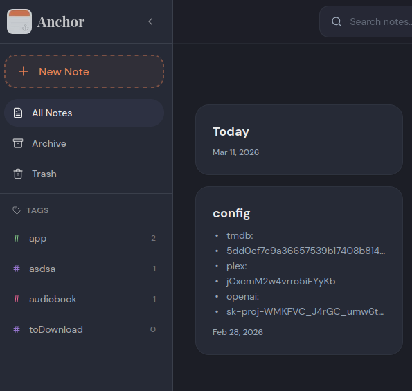
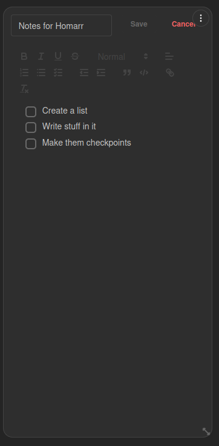

# Anchor

Notes

Anchor is a self-hosted note-taking application. The Anchor integration lets Homarr connect to your Anchor instance so you can display and edit notes directly from your dashboard.

### Widgets & Capabilities

Anchor Note  
Display and edit a selected Anchor note directly in Homarr.

### Adding the integration

You can find the general integration workflow in the [Integrations Management](https://homarr.dev/docs/management/integrations) documentation page.

1. Open `Manage` -> `Integrations` and click `New`.
2. Select `Anchor` from the integration dropdown.
3. Fill the required fields:
   - **Name**: Any display name (for example `Anchor`).
   - **URL**: Base URL where Homarr can reach Anchor (for example `http://localhost:3010`).
   - **Secrets -> API Key**: Your Anchor API key.
4. Click `Test connection and create`.

### Secrets

API Key

| Name | Description |
| --- | --- |
| API Key | API key from Anchor for authentication. |

### Steps to retrieve the credentials

1. Open your Anchor instance.
2. Generate or copy an API key from Anchor settings.
3. Paste that key into the `API Key` secret field in Homarr.

### Example screenshots

