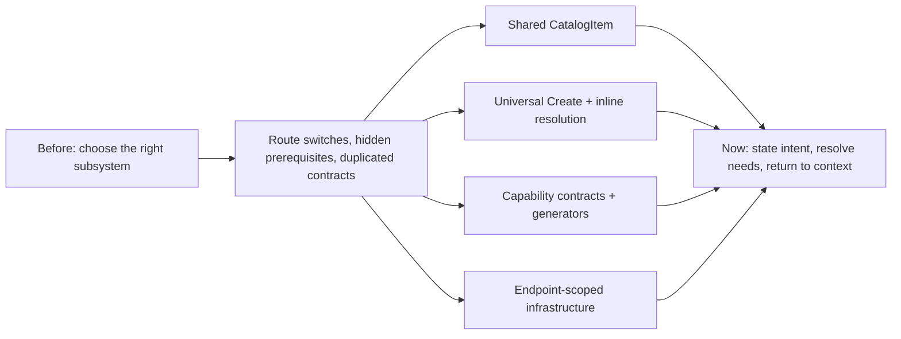
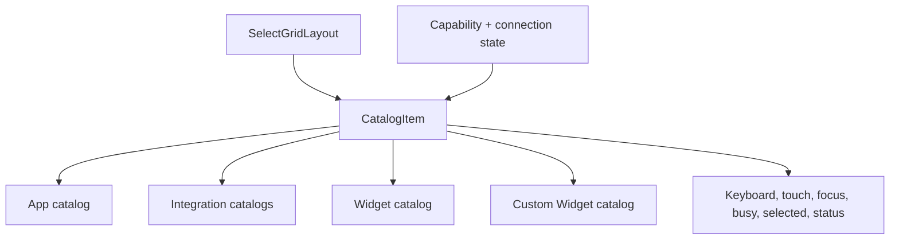
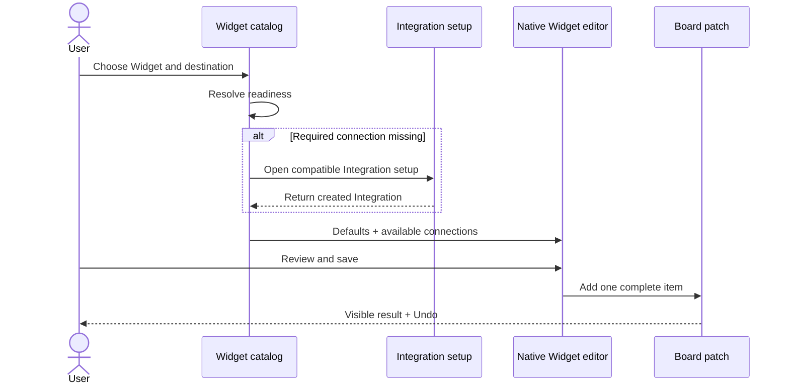
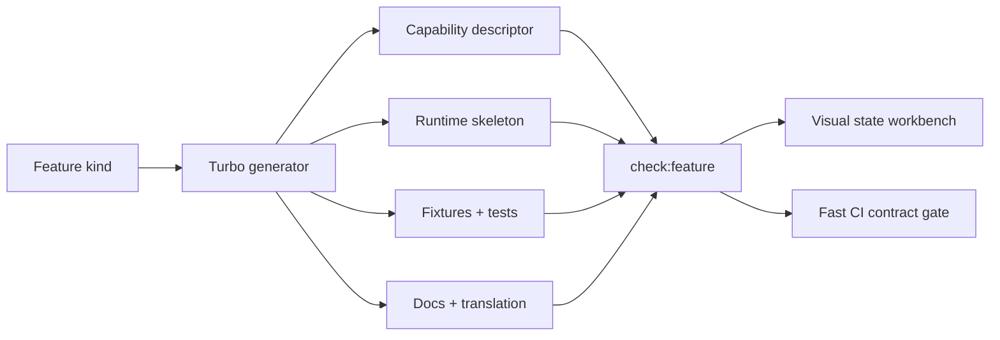
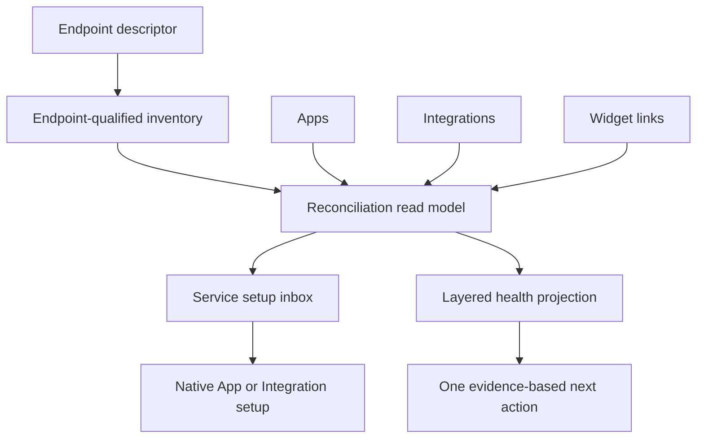
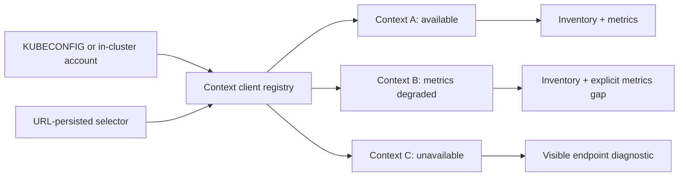
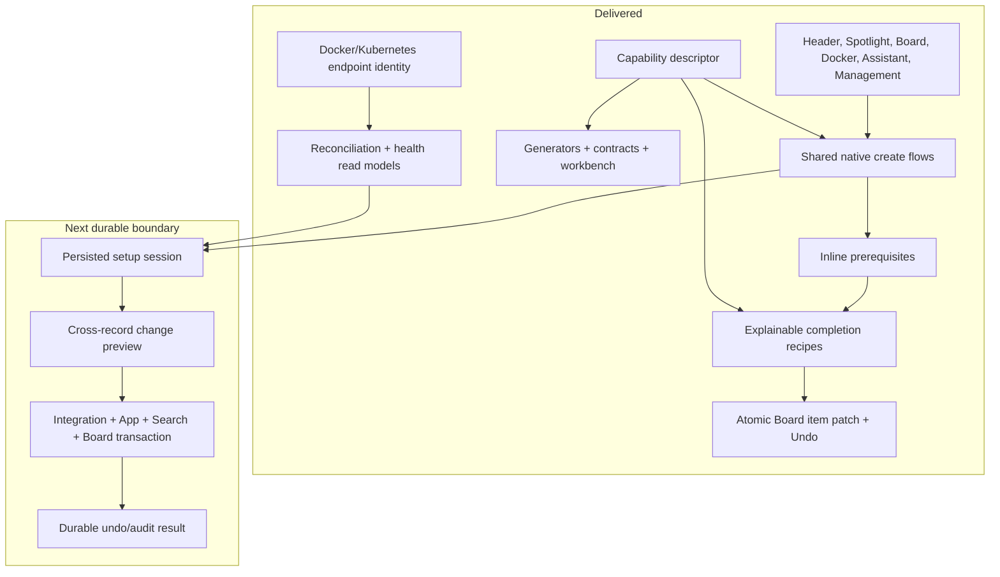

# Release v2 experience implementation report

Implementation date: 2026-08-13

Starting point: live `release/v2` roll-up PR #6545 at `3dd1fd015e3bcb2fe1d01f2ca2e78325c9bd2983`

Reconciled parent: `origin/dev` at `2513e8454`

Working branch: `agent/release-v2-experience`

## TL;DR

Homarr now has one recognizable creation language, in-context prerequisite resolution, useful completion recipes, repeatable contributor tooling, and endpoint-safe infrastructure management; the remaining North Star boundary is a durable cross-record setup transaction rather than another visual redesign.

## 1. Outcome

**In one sentence:** The implementation converges the highest-value release-v2 paths without replacing the UI system or introducing a database-wide Service migration.

The work was delivered as four parallel vertical streams and then reconciled against the current `dev` parent:

1. Shared interaction and transactional board creation.
2. Contextual completion and fewer-click setup flows.
3. Contributor contracts, generators, fixtures, and a visual workbench.
4. Docker and Kubernetes identity, resilience, security, and diagnostics.



## 2. Shared interaction system

**In one sentence:** Apps, integrations, widgets, and custom widgets now behave like members of one accessible catalog rather than visually related but semantically different cards.

The new `CatalogItem` contract supplies:

- Native button semantics and Enter/Space activation.
- Visible focus treatment and arrow/Home/End focus movement.
- Shared selected, disabled, busy, and status semantics.
- Pointer, touch, and keyboard access without hover-only actions.
- Explicit Ready, Needs setup, and No connection required language.

The contract is used by the App, Integration, multi-Integration, Widget, and Custom Widget catalogs. Widget readiness is derived from the canonical compatibility data rather than a decorative border.



## 3. Board creation and placement

**In one sentence:** A Widget is now configured before it exists, then added once with its full options, integrations, advanced settings, destination, and an Undo action.

The Widget flow now:

1. Loads the typed Widget definition.
2. Resolves compatible existing integrations.
3. Resolves a missing required Integration inline when permitted.
4. Keeps General and Advanced settings under one save boundary.
5. Creates one complete board item only after a successful edit.
6. Places it in the chosen main canvas, left rail, right rail, or Container.
7. Offers Undo for ten seconds.

Board creation returns its new identity and Base layout, opens the Board directly in edit mode, and launches the creation surface. Empty Boards expose Add Widget, Add App, and Connect Service actions. A resumable, state-derived checklist follows actual Board content and usable integrations instead of tour-view state.

Desktop Widget editing uses a right-side inspector and mobile uses a bottom sheet while retaining the existing native form renderers.



## 4. Universal Create and contextual completion

**In one sentence:** Header, ordinary Spotlight search, Board actions, empty states, management pages, and Assistant prerequisite recovery now converge on the same native creation flows.

Universal Create ranks permission-aware actions for the current context:

- Add Widget, App, or Container to the current Board.
- Connect a service.
- Create or import a Board.
- Open Workshop.
- Create a Custom Widget.

The same action is visible in the header and ordinary Spotlight results, not only Spotlight command mode. Board actions inject context-specific callbacks, so the global surface can return to the active Board instead of routing away.

When a Widget or Assistant action lacks a required Integration, the user can create a compatible one inline and return to the pending Widget editor with that Integration selected. Integration creation returns the created Integration and linked App details, then opens a completion sheet with up to three capability-derived Widget recipes. Recommendations exclude Widget kinds already present, honor permission/access data, explain why they fit, and can be dismissed per Board and Integration kind.

Setup analytics use the existing opt-in gate but enforce a special anonymous allowlist for `setup:*` events: coarse entry point, intent, outcome, elapsed time, Board-context presence, and inline-resolution ability. Record IDs, URLs, queries, credentials, provider responses, and session user IDs are excluded.

## 5. Canonical feature platform and contributor experience

**In one sentence:** A contributor can now generate a complete feature slice and run one deterministic command that proves the registries, docs, translations, fixtures, tests, and package contracts agree.

`nativeFeatureCapabilities` is the dependency-light descriptor layer in `@homarr/definitions`. It derives forward and reverse Integration/Widget support, optional connections, and Integration limits while retaining existing public APIs during migration.

The repository now includes Turbo generators for:

- Native Integration.
- Widget.
- Paired Integration plus Widget.

Generation is deterministic and fail-fast. It creates implementation skeletons, exports and registry entries, English translations, docs pages and indexes, response fixtures, and focused tests. Existing targets are never overwritten.

The new gates are:

```text
pnpm generate:feature
pnpm check:feature-contracts
pnpm check:feature <kind> --plan
pnpm check:feature <kind>
pnpm test:feature-platform
```

`check:feature` resolves feature ownership, nearby tests, descriptor files, docs, translations, and package boundaries. It runs contracts, focused tests, affected package typechecks, affected-file lint, and affected-file formatting in fail-fast order. Live service, container/E2E, and visual proof are printed as explicit optional gates and are never silently simulated.

The transport-free Integration response contract includes accepted and rejected fixtures. A development-only Feature Workbench renders catalog interaction states and response states at `/manage/tools/feature-workbench` so contributors can inspect semantic, loading, success, and failure behavior without a live third-party service.



## 6. Docker convergence

**In one sentence:** Docker is now deterministic across endpoints, truthful under partial failure, capability-aware, and able to explain how runtime services relate to Homarr records.

Every resource uses `{ endpointId, id }` from inventory through query keys, actions, logs, URLs, and results. Native container IDs are no longer resolved by scanning for the first match across engines.

Bulk lifecycle and removal mutations return a result for every target. Management and Widget surfaces report partial failures instead of treating a resolved request as universal success. Removal uses one shared confirmation contract on both surfaces.

The continuous reconciliation surface:

- Preserves multiple instances of the same Integration kind.
- Keeps healthy endpoints visible when another is unavailable.
- Distinguishes unavailable from empty.
- Classifies new recognized services, App candidates, represented services, linked services, and moved addresses.
- Ranks browser and server URL candidates with an explanation.
- Avoids automatic adoption when matching is ambiguous.
- Supports filters, refresh, local dismissal, and restore.

The Service health projection joins Docker availability, Integration configuration, App representation, and Widget attachment. Authentication, live API request success, and Widget query success are explicitly Not observed until Homarr has trustworthy evidence; absence of evidence is never shown as healthy.



## 7. Secure infrastructure descriptors

**In one sentence:** Docker and Podman endpoints can now declare stable identity, transport security, least-privilege capabilities, and friendly UI metadata without sending infrastructure credentials to the browser.

`DOCKER_ENDPOINTS` accepts a JSON array with:

- Stable ID and friendly name.
- Docker or Podman kind.
- Socket, explicitly insecure TCP, or TLS transport.
- CA trust plus optional paired client certificate and key for mTLS.
- Inventory, logs, lifecycle, and removal capabilities.
- Server-owned admin scope and configuration source.

Paths must be absolute, IDs must be unique, inventory is mandatory, client certificate and key must be supplied together, and plaintext TCP is rejected unless `allowInsecure: true` is explicit. TLS material is read only on the server. UI actions are disabled when a capability is absent, and the API independently enforces the same policy.

Legacy socket and hostname/port variables remain compatible but are ignored when the structured descriptor is present. The Docker and environment-variable documentation now explains precedence and security tradeoffs.

## 8. Kubernetes resilience and multiple contexts

**In one sentence:** Kubernetes inventory remains useful without Metrics Server and every management request is isolated to an explicit, URL-persisted context.

The Kubernetes client registry creates a distinct client per kubeconfig context. All routers require `contextId`; all server and client calls propagate it; React Query cache keys therefore stay context-specific. Resource-tile navigation preserves the context query to avoid a default-cluster flash.

The context selector reports Available, Metrics unavailable, or Unavailable independently. An unreachable context does not hide healthy contexts. An empty kubeconfig `current-context` deterministically falls back to the first configured context. When `KUBECONFIG` is absent in production, the existing in-cluster service-account path remains the default.

Inventory and optional metrics are separated. Cluster and Node pages show counts and resource identity even when Metrics Server is absent, while percentages become unavailable rather than zero or a fatal page error.



## 9. Traceability to the opportunity portfolio

**In one sentence:** Every P0/P1 platform item and every P2 systems/DX item received a behavior-complete implementation slice, while the intentionally deferred boundary is durable multi-record orchestration.

| Opportunity                     | Delivered behavior                                                                        |
| ------------------------------- | ----------------------------------------------------------------------------------------- |
| Truthful Docker results         | Per-target results, partial-failure notifications, retry-ready failed identities          |
| Endpoint-scoped Docker identity | Endpoint ID in inventory, actions, logs, URLs, cache identity, and reconciliation         |
| Accessible catalog              | Shared native-button contract, visible status, focus, keyboard, touch, and busy semantics |
| Inline missing Integration      | Nested compatible setup and return to Widget/Assistant context                            |
| Universal Create                | Header, plain Spotlight, Board context, empty states, and native creation routes          |
| Atomic Widget creation          | Configure first, add one complete item, choose destination, Undo                          |
| Completion recipes              | Capability-derived, access-aware Widget suggestions after Integration creation            |
| Docker reconciliation           | Refreshable inbox, ambiguity protection, URL reasoning, dismiss/restore                   |
| Infrastructure descriptors      | Socket/TCP/TLS/mTLS, stable names, scoped capabilities, server enforcement                |
| Capability platform             | Canonical derived descriptor and parity tests                                             |
| Generators and contracts        | Three generators, CI contract gate, focused feature command                               |
| Service health                  | Evidence-based read projection across runtime/config/App/Widget layers                    |
| Setup guidance                  | Actionable empty states and resumable state-derived checklist                             |
| Protocol simulator              | Transport-free accepted/rejected response fixtures                                        |
| Visual workbench                | Catalog and response-state workbench for development                                      |
| Kubernetes degraded mode        | Optional metrics, multi-context registry, URL selection, independent status               |
| Board recipes                   | Permission-aware recommendations that place exact compatible Widgets                      |

## 10. Current architecture and next attainable boundary

**In one sentence:** The UI and read models now converge, while the next architectural step is to persist a setup-session plan and commit cross-record recipes as one auditable transaction.



No schema-wide Service entity was added. This is deliberate: the current projection proves identity and workflow contracts before committing the project to a migration. Likewise, Docker reconciliation is refreshable and durable at the UI contract level, but no background watcher or automatic mutation was introduced.

## 11. Validation

**In one sentence:** The reconciled implementation passes the repository-wide type and format gates plus focused behavior, contract, system, and generator suites.

Completed locally:

- Frozen-lockfile dependency verification.
- Full Turbo typecheck: 39 successful tasks.
- Full Turbo formatting check: 39 successful tasks.
- Affected-package oxlint with no errors; pre-existing warnings remain warnings.
- 64 focused DOM tests across 17 files.
- 43 focused API tests across Docker, Kubernetes, and anonymous setup analytics.
- 8 focused Board and Integration creation tests.
- 12 Docker descriptor/singleton tests.
- 2 anonymous setup-analytics contract tests.
- 7 feature-platform generator/planner contract tests.
- `check:feature-contracts` passes.
- `check:feature wud --plan` resolves the intended full feature slice.
- Board static-dependency graph guard passes after keeping the Spotlight store behind its lazy boundary.
- `git diff --check` passes.

The broad non-E2E suite was also attempted: 3,258 tests passed and 91 were skipped. It caught one change-related static-graph regression, which was fixed and re-tested. The remaining failures require facilities unavailable in this sandbox: a container runtime for Integration and database migration suites, loopback socket permission for Custom Widget network-policy suites, external HTTP access for Integration documentation checks, and the existing child-process bundle fixture. They do not overlap the focused green suites above.

Environment boundary: the local host runs Node 24.16 while the repository requires Node 24.18 or newer. TypeScript, lint, formatting, and focused tests pass with engine strictness disabled only for command execution. Exact-engine container and hosted CI remain the final release proof. No live Docker daemon, Kubernetes cluster, third-party Integration credentials, or authenticated browser preview was used in this implementation pass.

## 12. Final recommendation

**In one sentence:** Ship these slices behind the existing release-v2 review process, measure task completion and recovery, then build the persisted setup transaction only after the new capability and identity contracts have proven stable.

The experience is now substantially closer to the North Star: users can begin from intent, see readiness, resolve a prerequisite without losing context, place the result where it belongs, and understand failures by layer. Contributors can add features through one generated path and prove the contract locally. Operators get deterministic multi-endpoint behavior and explicit least privilege.

The visual language remains Homarr’s. The implementation improves recognition, continuity, safety, and contribution speed without flattening the interface or making deployment less compact.
